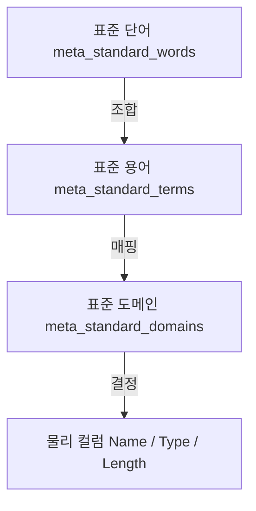

# 표준 데이터 관리 체계 (Standard Data Governance)

본 프로젝트는 **[단어 -> 용어 -> 도메인]**으로 이어지는 계층적 표준화 체계를 따릅니다. 모든 데이터 설계는 DB 내 메타 테이블을 통해 이 관계를 준수해야 합니다.

## 1. 계층적 표준화 구조


## 2. 설계 프로세스 (강제 사항)

### Step 1. 표준 단어 조회 및 용어 구성
- `word_name`을 조회하여 `eng_abbr`을 확인합니다.
- 복합어의 경우 표준 단어들을 순서대로 결합합니다.

### Step 2. 표준 용어 및 도메인 확인
- 구성된 용어를 `meta_standard_terms`에서 조회합니다.
- 해당 용어의 설명(Description)이나 관련 메타데이터를 통해 **어떤 도메인 그룹에 속하는지** 판단합니다.

### Step 3. 도메인 기반 물리 타입 적용
- `meta_standard_domains`에서 해당 도메인(`domain_name`)을 조회합니다.
- 정의된 `data_type`과 `data_length`를 **100% 동일하게** 컬럼에 적용합니다.

## 3. 통합 조회 쿼리 예시
에이전트는 설계를 위해 다음과 같은 통합 조회를 수행할 수 있습니다.

```sql
-- 예: '사용자명'에 대한 표준과 도메인 조회
SELECT 
    t.term_name, 
    t.eng_abbr AS column_name,
    d.domain_name,
    d.data_type,
    d.data_length
FROM meta_standard_terms t
JOIN meta_standard_domains d ON t.term_name LIKE '%' || d.domain_name || '%'
WHERE t.term_name = '사용자명';
```

## 4. 도메인 준수 원칙
- **예외 불허**: 도메인에 정의된 길이보다 길거나 짧은 타입을 임의로 사용할 수 없습니다.
- **도메인 확장**: 새로운 성격의 데이터가 필요한 경우, 임의로 타입을 지정하지 말고 사용자에게 **새로운 도메인 등록**을 요청해야 합니다.

## 5. 프로젝트 확장 도메인

| Flyway | 도메인 | 물리 타입 | 적용 용어 | 근거 |
|---|---|---|---|---|
| `V2_49`~`V2_58` | `일련번호N19` | `BIGINT` | `ADBK_SN`, `ADBK_MBR_SN`, `HLP_SN`, `ITNT_SRVC_SN`, `ONLN_MNL_SN`, `POPUP_SN`, `CONTS_SN`, `DEPT_TASK_BOX_SN`, `BNR_SN`, `DEPT_TASK_SN`, `DIARY_SN` | 사용자 승인 BIGINT 자동 내부키 전환. PostgreSQL 양수 BIGINT 일련번호의 최대 자릿수 19를 명시한다. `HLP_SN`, `CONTS_SN`, `BNR_SN`은 이번 PK 현대화 예외 승인에 따라 공공사전 `N22/NUMERIC` 매핑에서 프로젝트 내부키 도메인으로 재매핑한다. 나머지 신규 `_SN`은 승인 표준 단어 조합의 프로젝트 확장 용어다. |
