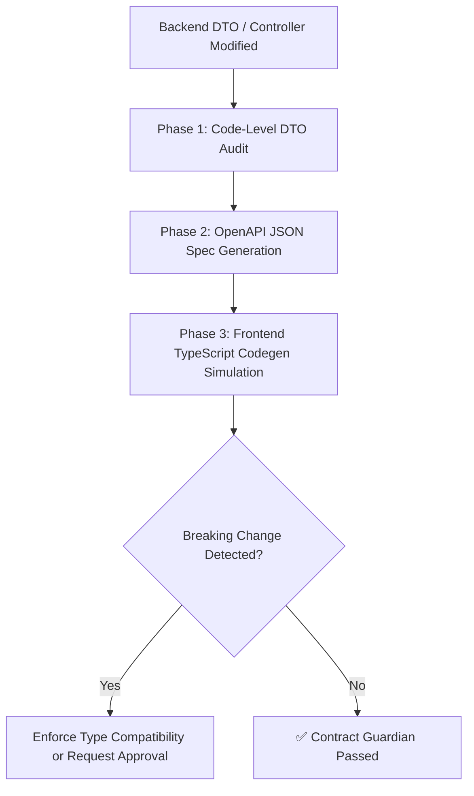

# API Contract Guardian Skill (Antigravity Native)

**Use this skill when:** Modifying any backend Spring Boot REST Controller, editing Java Data Transfer Objects (DTOs), or making structural changes to the database that ripple up to the API response layer.

---

## 1. The Core Objective: "Shift-Left" Contract Testing

In the eGov-Enterprise architecture, the backend (`api-server`) and frontend (`frontend`) are decoupled but bound by the OpenAPI specification. The worst class of bugs occurs when backend changes silently break frontend TypeScript types or parsing logic.

The **API Contract Guardian** prevents these silent breakages by running a "Zero-Day" contract audit before code is considered complete.

---

## 2. Guardian Workflow

When any backend API surface area is touched, execute the following protocol:



### Phase 1: Code-Level DTO Audit
* Analyze the Java DTO fields modified.
* Compare against the `meta_standard_words` physical schema (via `deep-context-mapper` synergy).
* Identify if fields were renamed, types were changed (e.g., `String` to `Integer`), or if non-nullable fields became nullable.

### Phase 2: Codegen Validation (`npm run codegen:ts`)
If structural API changes are made:
* Run the OpenAPI generation step. (e.g., compile backend to update the swagger JSON).
* Execute the frontend script:
  ```powershell
  # Navigate to frontend and execute code generation
  cd frontend
  npm run codegen:ts
  ```
* Capture any compilation errors or TypeScript definition mismatches (`generated-api.d.ts`).

### Phase 3: Breaking Change Analysis (The Guardian Check)
Evaluate the frontend impact:
* 🚨 **Breaking Changes**: A field was removed, renamed, or changed to an incompatible type. If this happens, you MUST either:
  1. Fix the frontend components importing that type immediately.
  2. Revert the backend change to maintain backward compatibility (e.g., `@Deprecated` the old field, add the new field).
* ✅ **Non-Breaking Changes**: A new optional field was added.

---

## 3. Synergy with eGov Constitutions

This skill strictly enforces **Article 4 of the Backend API Constitution** (Unified Response Structure):
* All API responses must wrap data in the standard `{ status, message, data }` envelop.
* If a Controller is detected returning a raw String or Entity instead of the `ApiResponse<T>` wrapper, the Guardian must reject the code and automatically refactor it.

---

## 4. Output: Contract Audit Report

When a breaking change is detected or a major API refactor is completed, output this block:

```markdown
### 🛡️ [API CONTRACT GUARDIAN REPORT] ###
- **Target Endpoint**: `GET /api/v1/resource`
- **Backend Change**: `statusYn` (String) -> `statusFlag` (Boolean)
- **Frontend Impact Assessment**: 🚨 BREAKING CHANGE
  - `generated-api.d.ts` will invalidate `useResource.ts` line 45.
- **Guardian Action Taken**:
  - Re-mapped the Java DTO to preserve `statusYn` as @Deprecated while introducing `statusFlag` to guarantee zero-downtime frontend deployment.
##########################################
```

---
*Verified: 2026-05-18 (Designed for Antigravity Zero-Breakage Pipeline)*
