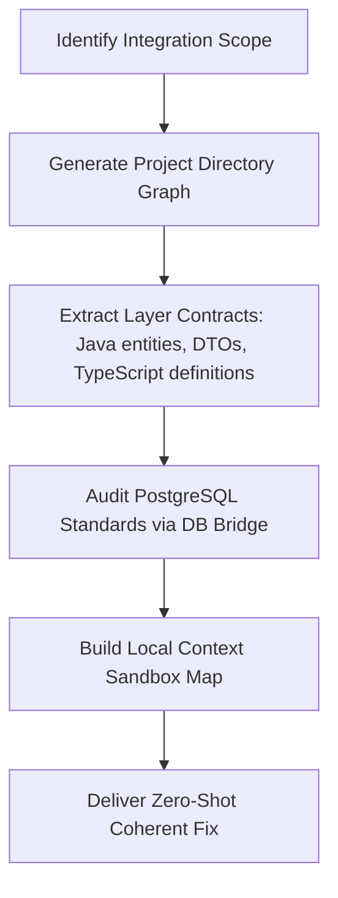

# Deep Context Mapper Skill (Antigravity Native)

**Use this skill when:** Initiating large refactoring tasks, performing database migrations (OCI PostgreSQL), creating new endpoints spanning multi-module layers (api-server, business-suite, foundation), or auditing TypeScript/Java type synchronization.

---

## 1. The Power of Large Context

Traditional models are forced to look at the codebase through a keyhole due to context limits (~10k-30k tokens). Antigravity features a massive **1M+ token context window**, which allows mapping the entire codebase topology directly into the working memory.

```
[Traditional Keyhole Search] -> High risk of duplicating code, missing abstractions, or breaking patterns.
[Deep Context Mapping]        -> Full system topology loaded. Absolute consistency across Java DTOs, PostgreSQL, and Next.js.
```

---

## 2. Dynamic Mapping Workflow

When a complex L2-level task is requested, execute the following mapping sequences:



### Phase 1: Structure Extraction
Map out the module boundary relationships to understand data flows.
* **foundation module**: Shared utilities, basic audit objects, configurations.
* **business-suite module**: PostgreSQL entities, JPA repositories, core business transactional services.
* **api-server module**: REST Controllers, Spring Security filter chain, OpenAPI spec exposure.
* **frontend module**: Next.js Server Components, API proxy layers, Playwright E2E suites.

### Phase 2: DB Standard Word Governance (SSOT)
Use the OCI PostgreSQL Local Bridge (`node .agent/scripts/db-bridge.js`) to load metadata tables (`meta_standard_words`, `meta_standard_domains`, `meta_standard_terms`).
* Ensure physical column definitions (e.g., `SRVY_RSPDNT_ID`) strictly follow abbreviation standards in memory before writing Java JPA entity mappings or Liquibase/flyway migration SQL.

### Phase 3: Contract Synchronization Auditing
Audit boundaries between Frontend and Backend:
```
Java DTO Class -> Spring Controller (OpenAPI spec JSON) -> npm run codegen:ts -> generated-api.d.ts -> React Client Component
```
Verify that modifying any field in the Spring JPA entity triggers contract updates across the entire pipeline.

---

## 3. Sandbox Context Map Template

When mapping complex module topologies, write a concise structural sandbox index inside `.gemini/tasks/` or the task report:

```markdown
### 🗺️ [DEEP CONTEXT SANDBOX MAP] ###
- **Target Subsystems**: [e.g., LoginPolicy, BBS, Community]
- **Topology Chain**:
  - `Database Table`: `COMTN_LOGIN_POLICY` (OCI PostgreSQL standard terms verified)
  - `Backend Entity`: `LoginPolicy.java` (Line range / column mappings)
  - `Backend Controller`: `LoginPolicyApiController.java` (REST entrypoint)
  - `Frontend Client Hook`: `useLoginPolicy.ts` (TypeScript types matching generated-api.d.ts)
- **Type Compatibility Check**:
  - [x] Java entity mappings match physical table columns exactly.
  - [x] TypeScript generated fields have 100% property compliance.
- **Architectural Rules Applied**:
  - Backend API Constitution (18 Articles) -> Article 6 (Unified response structure) applied.
  - Database Standard Constitution (10 Articles) -> Article 2 (Standard abbreviations only) applied.
#####################################
```

---

## 4. Key Performance Benefits

* **Zero Duplication (YAGNI)**: Avoids creating a custom sorting utility because deep context search reveals that `foundation/utils/SortUtils.java` already has a verified, highly performant implementation.
* **Perfect Mappings**: Prevents JPA runtime persistence errors (`USE_YN` mapping mismatch to `CHAR(1)` flag columns) by cross-referencing PostgreSQL type metadata in real-time.

---
*Verified: 2026-05-18 (Optimized for Antigravity Large Context Processing)*
