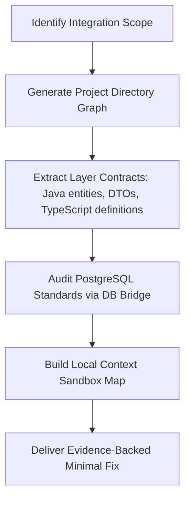

# Deep Context Mapper Skill

**Use this skill when:** Initiating a large refactor, performing a database migration, creating an endpoint that spans several modules, or auditing TypeScript/Java contract synchronization.

---

## 1. Evidence-Bounded Context

Map only the consumers and contracts that can affect the requested change. A large context window is not evidence that the entire repository was loaded or understood; current files, manifests, schema metadata, and executable checks remain authoritative.

```
[Unbounded search]       -> Noise, stale assumptions, and unjustified completeness claims.
[Evidence-bounded map]  -> Relevant consumers, contracts, exceptions, and validation paths are explicit.
```

---

## 2. Dynamic Mapping Workflow

When a complex L2-level task is requested, execute the following mapping sequences:



### Phase 1: Structure Extraction
Map out the module boundary relationships to understand data flows.
* **foundation module**: Shared kernel, ports, audit primitives, and cross-cutting utilities.
* **business-core module**: Reusable administration/domain core.
* **business-app module**: Project-specific entities, repositories, providers, and services.
* **api-server module**: REST controllers, security configuration, and OpenAPI exposure.
* **migration-tool module**: Optional offline legacy-data migration CLI.
* **frontend module**: Next.js Server Components, proxy/API clients, and Playwright E2E suites.

### Phase 2: DB Standard Word Governance (SSOT)
Use the read-only DB bridge (`node .agent/scripts/db-bridge.js`) to query `information_schema` and the metadata tables (`meta_standard_words`, `meta_standard_domains`, `meta_standard_terms`) when the task depends on a live database.
* Confirm lowercase physical names and types from live evidence before writing JPA mappings or Flyway SQL. Do not substitute H2 or remembered schema details for that evidence.

### Phase 3: Contract Synchronization Auditing
Audit boundaries between Frontend and Backend:
```
Java DTO -> Spring Controller/OpenAPI -> api-docs.json -> pnpm codegen:file + codegen:zod -> generated types/schemas -> frontend consumer
```
Verify that modifying any field in the Spring JPA entity triggers contract updates across the entire pipeline.

---

## 3. Sandbox Context Map Template

When mapping complex module topologies, keep the concise structural sandbox index in the current task response or PR evidence. Do not create a repository session journal; promote only durable, source-backed facts through the shared-memory rules in `AGENTS.md`.

```markdown
### 🗺️ [DEEP CONTEXT SANDBOX MAP] ###
- **Target Subsystems**: [e.g., LoginPolicy, BBS, Community]
- **Topology Chain**:
  - `Database Table`: `<live-verified lowercase table>` (metadata source and query recorded)
  - `Backend Entity/DTO`: `<path and relevant symbols>`
  - `Backend Controller`: `<REST entrypoint>`
  - `Frontend Consumer`: `<RSC/client path and generated contract>`
- **Type Compatibility Check**:
  - [ ] Java entity mappings match verified physical columns and types.
  - [ ] Generated frontend fields match the current API artifact.
- **Architectural Rules Applied**:
  - `AGENTS.md` Evidence guardrails and the relevant named constitution sections were checked.
#####################################
```

---

## 4. Key Performance Benefits

* **Focused reuse**: Consumer search can reveal an existing abstraction before a duplicate is introduced.
* **Schema accuracy**: Live metadata comparison catches JPA/DDL name and type mismatches that compile-only checks cannot detect.

---
