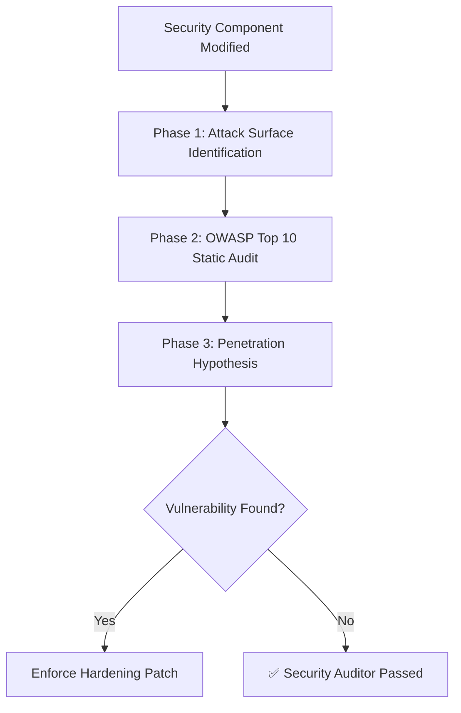

# OWASP Security Auditor Skill (Antigravity Native)

**Use this skill when:** Modifying authentication logic (JWT, cookies, OAuth), authorization rules (Spring Security `@PreAuthorize`, Filter Chains), Next.js Middleware routing protections, or executing direct SQL/JPA queries that handle user input.

---

## 1. Core Objective: Agentic Red-Teaming

In the eGov-Enterprise architecture, security is paramount. The **OWASP Security Auditor** forces the agent to adopt a "Red Team" attacker mindset before finalizing any code that touches the security perimeter.

Instead of just checking if the code compiles or tests pass, this skill evaluates: *How could a malicious actor exploit this change?*

---

## 2. Auditor Workflow & Checklists

When security-critical code is modified, you MUST pause and run through this audit pipeline before reporting the task as complete.



### Phase 1: Attack Surface Identification
Identify which layer is exposed:
* **Frontend (Next.js)**: Middleware routing, `AuthContext.tsx`, localStorage vs HttpOnly Cookies, Cross-Site Scripting (XSS) vectors in raw HTML rendering.
* **Backend (Spring Boot)**: `SecurityConfig.java`, JWT filter validation, Role-Based Access Control (RBAC), Object-Level Authorization (BOLA/IDOR).
* **Database**: JPA parameter binding (preventing SQL Injection).

### Phase 2: OWASP Top 10 Static Audit (eGov Specifics)
Verify the following exact constraints are met:
1. **Broken Authentication**: Are JWTs stored in `HttpOnly`, `Secure`, `SameSite=Strict` cookies? (Never in `localStorage`).
2. **BOLA (Broken Object Level Authorization)**: If an API fetches data by ID (e.g., `GET /api/users/5`), does the backend verify that the currently authenticated user *owns* ID 5?
3. **Security Misconfiguration**: Are CORS headers excessively permissive? (e.g., `AllowedOrigins = "*"` is strictly forbidden in production).
4. **Injection**: Are all JPA queries using parameter binding? (e.g., avoid String concatenation in JPQL/SQL).

### Phase 3: Penetration Hypothesis (Red Team Check)
Think like an attacker. Write a 1-sentence hypothesis on how to bypass the current code.
* *Example: "If I strip the Bearer prefix and send a malformed JWT signature, does the filter throw a 500 error (leaking stacktrace) or a clean 401?"*

---

## 3. Output: Security Audit Report

When a security module is touched, force the output of this report block to prove the audit was performed:

```markdown
### 🛡️ [OWASP SECURITY AUDITOR REPORT] ###
- **Target Surface**: `Next.js Middleware (Auth Routing)`
- **Penetration Hypothesis**: An attacker could bypass the middleware by appending query parameters that trick the `startsWith` matcher.
- **OWASP Violations Found**: 🚨 `Broken Access Control` (The regex matcher was too broad).
- **Hardening Action Taken**:
  - Rewrote the middleware matcher to use exact exact path matching and enforced `HttpOnly` flag on the newly created session cookie.
##########################################
```

---
*Verified: 2026-05-18 (Designed for Antigravity Zero-Trust Pipeline)*
