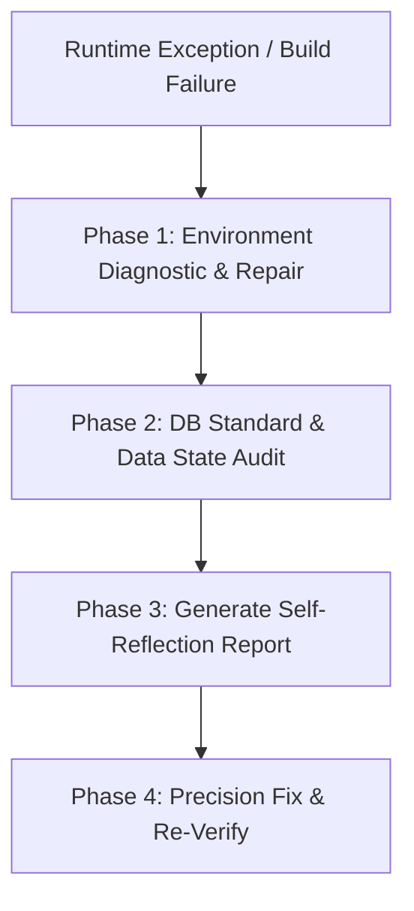

# Resilience Debugger Skill (Antigravity Native & Ralph Loop 2.0 Enabled)

**Use this skill when:** Encountering any build failure, runtime exception (Spring Boot JVM / Next.js Node), port collisions, PostgreSQL persistence exceptions, or Playwright E2E test failures.

---

## 1. Zero-Downtime Resilience Philosophy

Do not just trace code statically. When an exception occurs, the **Resilience Debugger** actively inspects and repairs the runtime environment (Self-Healing) while proving the root cause. 

```
[Traditional Debugging] -> Read stacktrace -> Guess fix -> Re-run (Repeat blindly).
[Resilience Debugging]  -> Auto-detect runtime lock/port -> DB Schema Audit -> Self-Reflection Report -> Precision Fix & Re-Verify.
```

---

## 2. The 4-Phase Self-Healing Loop

Always match this sequence to the **Ralph Loop 2.0 Self-Reflective Debug Protocol** in `GEMINI.md` §8.



### Phase 1: Environment Diagnostic & Repair (Self-Healing)
* **Port Lock Auditing**: Check for zombie background processes holding backend (`8080`) or frontend (`3001`) ports.
* **Command Action**: Proactively query and kill lock processes using PowerShell.
  ```powershell
  # Locate and terminate zombie node/java processes on dev ports
  Get-Process -Id (Get-NetTCPConnection -LocalPort 3001 -ErrorAction SilentlyContinue).OwningProcess | Stop-Process -Force
  ```

### Phase 2: DB Standard & Data State Audit
If a runtime error relates to JPA persistence, Liquibase execution, or table relationships:
* Query OCI PostgreSQL via Local Bridge (`node .agent/scripts/db-bridge.js`) to capture the actual physical schema.
* Audit character sets, data types (e.g. `CHAR(1)` vs `VARCHAR(20)`), and column constraints. Never assume standard definitions in codebase match database physical reality without checking.

### Phase 3: Self-Reflection Report Generation
Before writing a single line of correction, output the mandatory `[SELF-REFLECTION REPORT]` block in the response window:

```markdown
### 🔍 [SELF-REFLECTION REPORT] ###
- **False Assumption**: What assumption did I make previously that has been disproven?
- **Root Cause**: The physical/logical root of the runtime/build error, backed by system evidence.
- **Hypothesis & Repair Path**: The minimal, most resilient code patch to resolve the issue permanently.
- **Side-Effect Check**: How will this change affect API schemas, E2E tests, and Database standards?
#################################
```

### Phase 4: Precision Fix & Re-Verify
* Apply the minimal patch.
* Trigger targeted test execution (e.g. running specific Playwright E2E workers, Gradle test coverage, or TS compilation check).
* Confirm that the build has returned to a completely clean baseline.

---

## 3. Playwright E2E Diagnostics (Specialized Rule)

If Playwright E2E tests fail under worker execution:
* Do not keep re-running the test suite. 
* Dispatch the `browser_subagent` to navigate to the exact failure state or read browser console logs and Playwright debug reports to locate UI elements.
* Ensure all database states are rolled back using local sandbox cleanup policies.

---
*Verified: 2026-05-18 (Ralph Loop 2.0 & DB Bridge Fully Integrated)*
