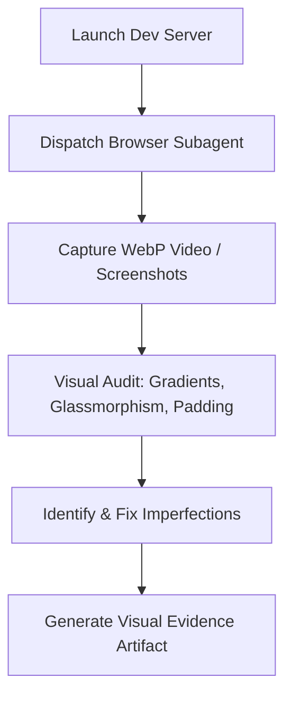

# Visual Auditor Skill (Antigravity Native)

**Use this skill when:** Building or refactoring web pages, verifying frontend UI components, testing responsive layouts, or validating that the application meets the **Rich Aesthetics** principle.

---

## 1. Core Objectives

Verify that the application's user interface is visually stunning, responsive, and aligns with the modern premium design conventions. Do not rely solely on DOM assertions; instead, audit the real rendered layout visually.



---

## 2. Real-Time Verification Flow

### Phase 1: Environment Readiness
Ensure the local dev server is running on the correct port (e.g., `3001` for Next.js frontend). If port collisions are detected, resolve them immediately using PowerShell before starting the auditor.

### Phase 2: Dispatching the Browser Subagent
Use the `browser_subagent` tool with a highly descriptive task targeting the visual layout.
* **RecordingName**: Must be all lowercase with underscores (e.g., `login_visual_audit`).
* **Task**: Direct the subagent to take screenshots at specific responsive breakpoints (Desktop 1440px, Tablet 768px, Mobile 375px) and interact with elements to record hover animations.

```typescript
// Conceptual example of Antigravity Browser Subagent Dispatch
browser_subagent({
  TaskName: "Auditing Login Page UI",
  Task: "Navigate to http://localhost:3001/login. Verify page load. Hover over primary login button to trigger micro-animations. Click inputs to verify focus rings. Capture full page screenshots.",
  TaskSummary: "Checking visual alignment, premium gradients, and micro-animations on login page.",
  RecordingName: "login_page_visual_verification"
});
```

### Phase 3: Visual Inspection Checklist
Once the subagent returns the media files (WebP recordings and screenshots) in the artifacts directory, evaluate them against the **3 Core Visual Pillars**:

#### 1. Premium Typography & Hierarchy
* No fallback system fonts (Arial, Times New Roman) unless explicitly requested. Must use premium typography (Inter, Outfit, Roboto).
* Proper scale contrast: Headings (`h1`, `h2`) must be bold, clean, and distinct from body copy.

#### 2. Vibrant Palette & Gradients
* Avoid generic primary colors (e.g., solid `#FF0000`, `#0000FF`).
* Leverage smooth, tailored gradients (e.g., HSL tailoring, futuristic dark mode highlights, subtle glassmorphism borders).

#### 3. Micro-Animations & Responsiveness
* Verify all hover states have smooth transitions (e.g., `transition: all 0.3s cubic-bezier(0.4, 0, 0.2, 1)`).
* Look for alignment regressions under mobile layouts (375px). Elements must not overflow horizontal boundaries.

---

## 3. Visual Audit Report Template

After completing the audit, generate a markdown report under `.gemini/tasks/` or the artifacts directory using the following structured template:

```markdown
### 🎨 [VISUAL AUDIT REPORT] - [Page Name/URL] ###
- **Target URL**: `http://localhost:3001/...`
- **Audit Screen Recording**: `artifacts/recording_name.webp`
- **Visual Compliance Assessment**:
  - [ ] **Gradients & Accents**: Standard met? (Describe color palette and highlights)
  - [ ] **Glassmorphism / Border effects**: Premium borders verified?
  - [ ] **Micro-animations**: Hover states and focus rings smooth?
  - [ ] **Responsive parity**: Desktop vs Mobile layouts clean?
- **Identified Imperfections**:
  1. [Symptom / Element CSS] -> [Visual mismatch/regression]
- **Correction Action**:
  - [Provide CSS diff or component code fixes implemented]
################################################
```

---

## 4. Common Anti-Patterns to Avoid

* ❌ **Relying solely on "PASS" test runner logs**: A Playwright test might pass even if the primary login button is misaligned or has raw black-on-white fallback borders.
* ❌ **Missing hover transitions**: Interactive UI elements that change state instantly feel cheap and break the premium aesthetic.
* ❌ **Using placeholder images**: If custom imagery is required, utilize the `generate_image` tool to render working graphic demonstrations.

---
*Verified: 2026-05-18 (Optimized for Antigravity Native Engine)*
