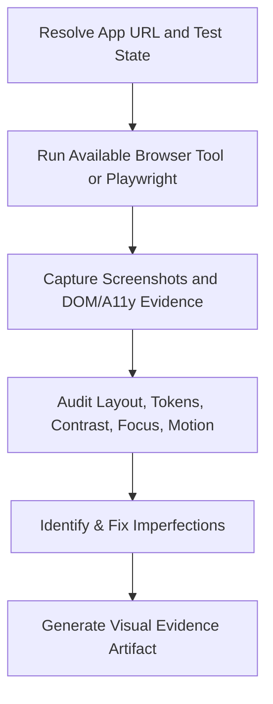

# Visual Auditor Skill

**Use this skill when:** Building or refactoring web pages, verifying frontend UI components, testing responsive layouts, or auditing the project design system and accessibility requirements.

---

## 1. Core Objectives

Verify that the rendered interface is usable, responsive, accessible, and consistent with the repository's frontend constitution and design tokens. DOM assertions and screenshots complement one another; neither alone proves full correctness.



---

## 2. Real-Time Verification Flow

### Phase 1: Environment Readiness
Resolve the app URL and startup command from current project configuration. Do not kill unrelated processes or assume a port; inspect ownership and use the repository's normal startup path.

### Phase 2: Dispatching the Browser Subagent
Use an available browser-capable tool or the repository's Playwright setup. Capture representative desktop, tablet, and mobile widths; test keyboard focus, zoom/reflow, light/dark themes, reduced motion, and relevant interaction states.

```typescript
// Conceptual Playwright-style flow; use the repository's actual fixtures and base URL.
await page.goto('/login');
await page.setViewportSize({ width: 375, height: 812 });
await page.keyboard.press('Tab');
await expect(page).toHaveScreenshot('login-mobile.png');
```

### Phase 3: Visual Inspection Checklist
Evaluate the rendered evidence against these core constraints:

#### 1. Typography & Information Hierarchy
* Use the project's declared font and semantic typography tokens; do not introduce a new font family by preference.
* Headings, landmarks, labels, and reading order must communicate the intended hierarchy.

#### 2. Tokens, Contrast & Themes
* Use semantic color/spacing tokens and preserve existing product identity.
* Verify text, controls, focus indicators, and status colors in light and dark themes; decorative gradients or glass effects are optional, not a requirement.

#### 3. Motion, Interaction & Responsiveness
* Verify keyboard-visible focus and interaction feedback without requiring `transition: all`; reduced-motion mode must disable nonessential motion according to the frontend constitution.
* Check narrow and wide layouts for clipping, horizontal overflow, obscured controls, and touch-target regressions.

---

## 3. Visual Audit Report Template

After completing the audit, return the report in the current task/PR evidence or an ignored test-artifact directory. Do not create a repository session journal; promote only durable, source-backed facts through the shared-memory rules in `AGENTS.md`.

```markdown
### 🎨 [VISUAL AUDIT REPORT] - [Page Name/URL] ###
- **Target URL**: `http://localhost:3001/...`
- **Audit Screen Recording**: `artifacts/recording_name.webp`
- **Visual Compliance Assessment**:
  - [ ] **Tokens & hierarchy**: Existing design system and semantic structure preserved?
  - [ ] **Contrast & focus**: Theme contrast and keyboard-visible focus verified?
  - [ ] **Motion**: Interaction feedback and reduced-motion behavior verified?
  - [ ] **Responsive parity**: Desktop vs Mobile layouts clean?
- **Identified Imperfections**:
  1. [Symptom / Element CSS] -> [Visual mismatch/regression]
- **Correction Action**:
  - [Provide CSS diff or component code fixes implemented]
################################################
```

---

## 4. Common Anti-Patterns to Avoid

* ❌ **Relying solely on "PASS" test runner logs**: A Playwright test might pass even if the primary login button is misaligned or has raw black-on-white fallback borders.
* ❌ **Mouse-only review**: Hover screenshots do not prove keyboard, touch, or screen-reader usability.
* ❌ **Preference-driven redesign**: Do not add gradients, glassmorphism, animation, fonts, or imagery unless the task and existing design system support them.

---
