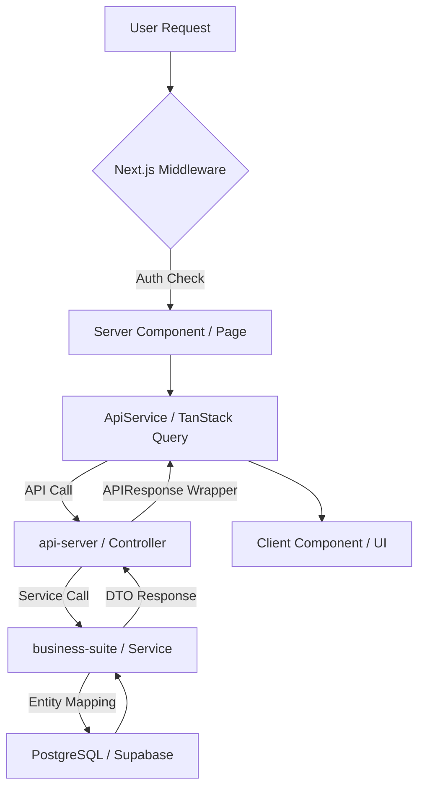

# GEMINI.md - eGov Enterprise Project Rule Set

본 파일은 **eGov Enterprise** 프로젝트의 전역 개발 규칙을 정의한다.
에이전트는 모든 작업 수행 시 이 규칙을 최우선으로 참고하며, 글로벌 룰셋(`user_global`)의 기본 원칙을 이 프로젝트의 구체적인 맥락에 맞게 적용한다.

---

## 0. 에이전트 행동 규율 (Agent Behavioral Discipline) - [CRITICAL]

에이전트는 모든 사용자 요청 수신 시 다음의 **탐색-등급판정-계획-실행** 루틴을 반드시 준수한다.

1.  **Discovery First (`using-superpowers`)**: 모든 응답(단순 질문 포함) 및 탐색 전, 반드시 `using-superpowers` 스킬을 호출하여 현재 태스크에 적용 가능한 최적의 워크플로우/스킬을 식별한다.
2.  **Task Grading (SOP Mandatory)**: 모든 작업 시작 전, `docs/03-guides/orchestration-protocol.md`의 기준에 따라 **태스크 등급(L0/L1/L2)을 판정**하고 `TASK PROPOSAL` 블록을 최우선으로 출력한다.
    - **L0 (Fast-Track)**: 사용자 승인 없이 즉시 구현 및 사후 보고.
    - **L1/L2 (Standard/Strict)**: 반드시 사용자의 명시적 승인(Approved)을 득한 후 진행.
3.  **Constitutional Compliance (Guardian Mode)**: 에이전트는 본 프로젝트의 **3대 헌법(DB, Backend, Frontend)** 및 **에이전트 감사 프로토콜**의 수호자이다. 모든 작업 전 반드시 `.agent/knowledge/` 내의 헌법 자산을 조회하여 표준 준수 여부를 검증한다.
4.  **Context-Aware Analysis & Review**: 지시를 받자마자 코드를 수정하지 않고, `brainstorming`으로 요구사항을 분석한 뒤 **반드시 `gstack-review` 스킬을 가동**하여 CEO, EM, Paranoid Engineer의 관점에서 설계를 **콤팩트하게(1줄 요약)** 검증한다.
5.  **Strict Orchestration**: 판정된 등급과 승인된 계획에 따라 `orchestration-protocol.md` 파이프라인을 가동하여 작업을 완수한다.

---

## 1. 프로젝트 개요 (Project Overview)

- **이름**: eGov Enterprise (차세대 기업용 표준 프레임워크 기반 서비스)
- **주요 목표**: 전자정부 표준 프레임워크(eGovFrame)를 최신 기술 스택(Java 21, Spring Boot 3.4.3, Next.js 16.2.4)으로 현대화하여 기업용 엔터프라이즈 환경에 최적화된 아키텍처 제공.
- **아키텍처 흐름**:

## 2. 기술 스택 (Technology Stack)

### Backend
- **Core**: Java 21 / Spring Boot 3.4.3 / eGovFrame 5.0.0
- **Build**: Gradle 9.4.1 (Multi-module: `api-server`, `business-suite`, `foundation`)
- **Database**: OCI PostgreSQL 17 (Port 5432)
- **Rules**: [API 및 백엔드 아키텍처 헌법](file:///.agent/knowledge/backend-api-constitution/artifacts/constitution.md) 준수

### Frontend
- **Framework**: Next.js 16.2.4 (App Router / React 19)
- **Styling**: Tailwind CSS 4.0, Framer Motion
- **Rules**: [프론트엔드 디자인 및 UX 헌법](file:///.agent/knowledge/frontend-ux-constitution/artifacts/constitution.md) 준수

### Data Governance
- **SSOT**: 모든 DB 객체 명명 및 데이터 타입은 [DB 표준화 헌법](file:///.agent/knowledge/db-standard-constitution/artifacts/constitution.md)에 따른 메타 테이블을 진실의 원천으로 삼는다.

## 3. 코드 아키텍처 컨벤션 (Code Architecture Conventions)

본 프로젝트의 모든 코딩 컨벤션은 아래 3대 헌법을 최우위 규범으로 따른다. 상세 조항은 각 헌법 원문을 참조한다.

- **Backend**: [API 및 백엔드 아키텍처 헌법](file:///.agent/knowledge/backend-api-constitution/artifacts/constitution.md) (15조)
- **Frontend**: [프론트엔드 디자인 및 UX 헌법](file:///.agent/knowledge/frontend-ux-constitution/artifacts/constitution.md) (12조)
- **Database**: [DB 표준화 헌법](file:///.agent/knowledge/db-standard-constitution/artifacts/constitution.md) (8조)

## 4. 에이전트 트러블슈팅 매트릭스 (Troubleshooting Gotchas)

- **인증(401) 이슈**: `AuthContext`의 `accessToken`과 브라우저 쿠키 값이 동기화되어 있는지 먼저 확인하라. 
- **타입 에러**: 백엔드 DTO 변경 후에는 반드시 `npm run codegen:ts`를 실행하여 `generated-api.d.ts`를 최신화하라.
- **컴포넌트 렌더링**: Next.js App Router에서 `'use client'` 지시어가 필요한 위치인지(이벤트 훅 사용 여부) 항상 확인하라. 기본은 Server Component다.

## 5. 주요 명령어 (Key Commands)

| 명령 | 경로 | 설명 |
|------|------|------|
| `npm run dev` | Root | 전체 개발 서버 실행 |
| `npm run codegen:ts` | `frontend/` | OpenAPI 명세 기반 TS 타입 생성 |
| `npm run analyze` | `frontend/` | Next.js 번들 사이즈 분석 |
| `pnpm run storybook` | `frontend/` | UI 컴포넌트 격리 개발 환경 |
| `make coverage` | Root | 백엔드 테스트 커버리지 리포트 생성 |
| `npm run e2e` | `frontend/` | E2E 테스트 전체 실행 |

## 6. E2E 테스트 계정 관리 (E2E Credential Management)

- **단일 소스 원칙**: 모든 E2E 테스트 계정 정보는 `frontend/e2e/test-credentials.ts`에서 관리한다.
- **추정 금지**: 테스트 코드나 `auth.setup.ts`에 계정 정보를 하드코딩하지 않으며, 반드시 위 설정 파일을 참조한다.
- **계정 정보**:
    - `admin`: `webmaster` / `1` (기본 관리자)
    - `user`: `TEST1` / `1` (일반 사용자)

## 7. 확장 가이드 참조 (Extended Guides)

아래 문서는 헌법의 원칙을 실무에 적용하는 구체적인 가이드로, 해당 작업 수행 시 반드시 병행 참조한다.

| 가이드 | 경로 | 적용 시점 |
|--------|------|-----------|
| Strict Orchestration Protocol | `docs/03-guides/orchestration-protocol.md` | **모든 작업** (등급 판정, 감사, 검증 통합) |
| 도메인 보안 & 회복탄력성 | `docs/02-architecture/domain-resilience.md` | 고가용성 로직 설계 시 |
| API 설계 및 문서화 가이드 | `docs/03-guides/api-documentation-guide.md` | 신규 API 생성 및 연동 시 |
| DB 표준화 이행 지침 | `.agent/knowledge/db-standard-constitution/artifacts/standard_terms.md` | DB 오브젝트 설계 시 |
| Map-Driven Development | `docs/03-guides/map-driven-development.md` | 대규모 아키텍처 변경 및 지도 기능 개발 시 |
| 문서 관리 정책 | `docs/03-guides/documentation-policy.md` | 새 문서 생성 및 지식 관리 시 |

## 8. Database Interaction Rules (via Local Bridge)

- **실행**: `node .agent/scripts/db-bridge.js "QUERY" [--json]`
- **접속 정보**: `application.yml` 기반 자동 연동 (OCI PostgreSQL 17)
- **보안**: SELECT 위주 수행. INSERT/UPDATE/DELETE는 사용자 승인 필수.

---
*Last Updated: 2026-05-14 (Updated via Antigravity)*

