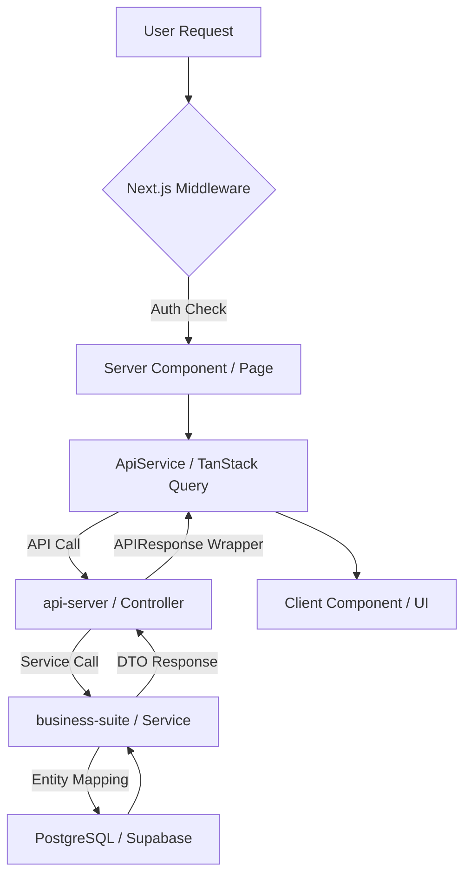

# GEMINI.md - eGov Enterprise Project Rule Set

본 파일은 **eGov Enterprise** 프로젝트의 전역 개발 규칙을 정의한다.
에이전트는 모든 작업 수행 시 이 규칙을 최우선으로 참고하며, 글로벌 룰셋(`user_global`)의 기본 원칙을 이 프로젝트의 구체적인 맥락에 맞게 적용한다.

---

## 0. 에이전트 행동 규율 (Agent Behavioral Discipline) - [CRITICAL]

에이전트는 모든 사용자 요청 수신 시 다음의 **탐색-계획-실행** 루틴을 반드시 준수한다.

1.  **Discovery First (`using-superpowers`)**: 모든 응답(단순 질문 포함) 및 탐색 전, 반드시 `using-superpowers` 스킬을 호출하여 현재 태스크에 적용 가능한 최적의 워크플로우/스킬을 식별한다.
2.  **Context-Aware Analysis & Review**: 지시를 받자마자 코드를 수정하지 않고, `brainstorming`으로 요구사항을 분석한 뒤 **반드시 `gstack-review` 스킬을 가동**하여 CEO, EM, Paranoid Engineer의 관점에서 설계를 **콤팩트하게(1줄 요약)** 검증한다. **검증된 계획은 반드시 사용자의 명시적 승인(Approved)을 받은 후 다음 단계로 진행한다.**
3.  **Caveman Communication**: 모든 답변과 보고는 **`caveman` 스킬 프로토콜**을 엄격히 준수하여 불필요한 토큰 소모를 차단한다.
4.  **Strict Orchestration**: 검증된 계획에 따라 구현 시, 복잡한 작업은 예외 없이 `superpowers-ccg` 워크플로우를 가동하여 모델별 역할을 분담한다.

---

## 0.1. 증거 우선 검증 (Evidence-Based Verification) - [MANDATORY]

에이전트는 모든 구현 작업 완료 시, "성공했습니다"라는 선언 이전에 반드시 객관적인 증거를 제시해야 한다. 증거 없는 완료 보고는 인정되지 않는다.

1.  **필수 증거 (Type of Evidence)**:
    - **UI/Frontend**: 브라우저 스크린샷, Playwright 테스트 로그, 또는 스토리북 렌더링 결과.
    - **Backend/API**: JUnit 테스트 결과 로그, API 응답 데이터 덤프(JSON).
    - **Database**: 쿼리 실행 결과 행(Row) 수, `EXPLAIN ANALYZE` 결과(성능 개선 시), 또는 스키마 변경 확인 로그.
2.  **검증 문서화 (Verification Artifact)**:
    - 복잡도가 높은 작업(리팩토링, 신규 기능 등)의 경우, 반드시 `.gemini/tasks/` 내의 해당 태스크 파일이나 별도의 `VERIFICATION.md`에 검증 로그를 포함해야 한다.
3.  **No Proof, No Completion**:
    - 모든 빌드나 테스트가 통과된 터미널 출력값이 최소 1회 이상 대화 세션에 노출되어야 한다.

---

## 1. 프로젝트 개요 (Project Overview)

- **이름**: eGov Enterprise (차세대 기업용 표준 프레임워크 기반 서비스)
- **주요 목표**: 전자정부 표준 프레임워크(eGovFrame)를 최신 기술 스택(Java 21, Spring Boot 3.4, Next.js 15)으로 현대화하여 기업용 엔터프라이즈 환경에 최적화된 아키텍처 제공.
- **아키텍처 흐름**:

## 2. 기술 스택 (Technology Stack)

### Backend
- **Core**: Java 21 / Spring Boot 3.4.1 / eGovFrame 4.x
- **Build**: Gradle (Multi-module: `api-server`, `business-suite`, `foundation`)
- **Database**: OCI PostgreSQL 17 (Port 5432)
- **Test**: JUnit 5, Mockito, JaCoCo (Target Coverage: 50%+)

### Frontend
- **Framework**: Next.js 15.1.7 (App Router / React 19)
- **Styling**: Tailwind CSS 4, Framer Motion
- **State**: TanStack Query (Server State), React Context (Global UI State)
- **Quality**: Storybook 10, Lighthouse CI, Bundle Analyzer, Playwright (E2E)

## 3. 코드 아키텍처 컨벤션 (Code Architecture Conventions)

### 3.1 Backend: Domain Integrity & Mapping
- **Entity Exposure Forbidden**: JPA Entity 클래스는 절대 컨트롤러 층으로 노출되지 않는다. 반드시 DTO(`Request`/`Response`)를 통해 데이터를 교환한다.
- **Mapping Responsibility**: 데이터 변환은 `business-suite` 모듈의 서비스 레이어에서 수행한다. 가능하면 매퍼 클래스나 생성자를 활용하여 로직을 분리한다.
- **Validation**: API 입력값 검증은 `@Valid`를 활용하여 `GlobalExceptionHandler`에서 자동 처리되도록 한다.

### 3.2 Frontend: State Management Partitioning
- **Server State**: 모든 서버 데이터는 `TanStack Query`를 통해 관리하며, 직접적인 `useEffect` 데이터 패칭을 지양한다.
- **Global UI State**: 테마, 사이드바 상태 등 범용 UI 상태는 `React Context`를 사용한다.
- **URL State**: 검색 필터, 정렬, 페이지네이션 등 SSR과 연동이 필요한 상태는 쿼리 스트링(`useSearchParams`)을 최우선으로 사용한다.
- **Form State**: 모든 폼은 `useAppForm` (react-hook-form + Zod)을 사용하여 격리한다.

### 3.3 프론트엔드 서비스 레이어 패턴
- 모든 서비스는 `ApiService` 추상 클래스를 상속한다.
- **자동 매핑**: `ApiService`의 `get()` 메서드는 프론트의 `page`(0-based)를 백엔드의 `pageIndex`(1-based)로 자동 변환하므로 수동 변환을 금지한다.

## 4. 성능 최적화 정책 (Performance Policy)

- **Heavy UI Components**: `TopologyMap`, `NationalDistributionMap` 등 고중량 시각화 라이브러리를 포함한 컴포넌트는 반드시 `next/dynamic`을 사용하여 `ssr: false` 옵션으로 Lazy Loading 한다.
- **Image/Asset**: 모든 이미지는 `next/image`를 사용하며, LCP 요소에는 `priority` 속성을 부여한다.
- **Bundle Analysis**: 기능 추가 후 `npm run analyze`를 실행하여 특정 패키지가 번들 사이즈에 미치는 영향을 체크한다.

## 5. 보안 및 안전성 원칙 (Security & Guardrails)

- **인증 정보 보호**: `.env` 파일과 설정 파일에 비밀번호를 하드코딩하지 않는다.
- **보안 헤더**: `next.config.ts`의 CSP 설정과 외부 리소스(Google Fonts 등) 연동 시 충돌 여부를 상시 확인한다.
- **OWASP 점검**: 백엔드 빌드 시 `failBuildOnCVSS=7` 설정에 따라 보안 취약점이 발견되면 수정을 우선한다.

## 6. 에이전트 트러블슈팅 매트릭스 (Troubleshooting Gotchas)

- **인증(401) 이슈**: `AuthContext`의 `accessToken`과 브라우저 쿠키 값이 동기화되어 있는지 먼저 확인하라. 
- **타입 에러**: 백엔드 DTO 변경 후에는 반드시 `npm run codegen:ts`를 실행하여 `generated-api.d.ts`를 최신화하라.
- **컴포넌트 렌더링**: Next.js App Router에서 `'use client'` 지시어가 필요한 위치인지(이벤트 훅 사용 여부) 항상 확인하라. 기본은 Server Component다.

## 7. 주요 명령어 (Key Commands)

| 명령 | 경로 | 설명 |
|------|------|------|
| `npm run dev` | Root | 전체 개발 서버 실행 |
| `npm run codegen:ts` | `frontend/` | OpenAPI 명세 기반 TS 타입 생성 |
| `npm run analyze` | `frontend/` | Next.js 번들 사이즈 분석 |
| `pnpm run storybook` | `frontend/` | UI 컴포넌트 격리 개발 환경 |
| `make coverage` | Root | 백엔드 테스트 커버리지 리포트 생성 |
| `npm run e2e` | `frontend/` | E2E 테스트 전체 실행 |

## 8. E2E 테스트 계정 관리 (E2E Credential Management)

- **단일 소스 원칙**: 모든 E2E 테스트 계정 정보는 `frontend/e2e/test-credentials.ts`에서 관리한다.
- **추정 금지**: 테스트 코드나 `auth.setup.ts`에 계정 정보를 하드코딩하지 않으며, 반드시 위 설정 파일을 참조한다.
- **계정 정보**:
    - `admin`: `webmaster` / `1` (기본 관리자)
    - `user`: `TEST1` / `1` (일반 사용자)

## 9. 안티패턴 (하지 말 것)

| 안티패턴 | 올바른 방향 |
|---------|-----------|
| 컨트롤러에서 Entity 반환 | DTO 전문 클래스 생성 및 매핑 |
| 페이지 컴포넌트에 직접 `axios` 호출 | `services/` 레이어의 서비스 클래스 활용 |
| `pageIndex` 직접 계산 | `ApiService`의 자동 매핑 로직에 위임 |
| 복잡한 로직을 Server Component에 인라인 작성 | 별도의 `Service` 또는 `Logic` 파일로 분리 |

## 10. 확장 가이드 참조 (Extended Guides)

아래 문서는 특정 워크플로우에서만 참조한다. 해당 작업을 수행할 때 열어볼 것.

| 가이드 | 경로 | 적용 시점 |
|--------|------|-----------|
| CCG Orchestration | `docs/03-guides/ccg-orchestration.md` | 프론트/백엔드 협업 구현 시 |
| GStack Review | `.agent/skills/gstack-review/SKILL.md` | 계획 수립 및 설계 검증 시 |
| Map-Driven Development | `docs/03-guides/map-driven-development.md` | 대규모 아키텍처 변경 시 |
| 문서 관리 정책 | `docs/03-guides/documentation-policy.md` | 새 문서 생성 시 |
| 도메인 보안 & 회복탄력성 | `docs/02-architecture/domain-resilience.md` | 보안/상태전이/비동기 작업 구현 시 |

## 11. Database Interaction Rules (via Local Bridge)

- **실행**: `node .agent/scripts/db-bridge.js "QUERY" [--json]`
- **접속 정보**: `application.yml` 기반 자동 연동 (OCI PostgreSQL 17)
- **보안**: SELECT 위주 수행. INSERT/UPDATE/DELETE는 사용자 승인 필수.

---
*Last Updated: 2026-05-11 (Updated via Antigravity)*

