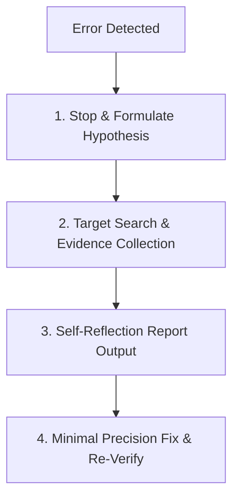

# GEMINI.md - eGov Enterprise Project Rule Set

본 파일은 **eGov Enterprise** 프로젝트의 전역 개발 규칙을 정의한다.
에이전트는 모든 작업 수행 시 이 규칙을 최우선으로 참고하며, 글로벌 룰셋(`user_global`)의 기본 원칙을 이 프로젝트의 구체적인 맥락에 맞게 적용한다.

---

## 0. 에이전트 행동 규율 (Agent Behavioral Discipline) - [CRITICAL]

에이전트는 모든 사용자 요청 수신 시 다음의 **등급판정-계획-실행** 루틴을 반드시 준수한다.

1.  **Task Grading (Inline)**: 모든 작업 시작 전, 아래 등급 기준에 따라 **태스크 등급(L0/L1/L2)을 판정**하고 `TASK PROPOSAL` 블록을 출력한다.
    *(⚠ 인라인 정의와 상충 시 `docs/03-guides/orchestration-protocol.md`가 절대적 최우위 SSOT로 군림한다.)*
    - **L0 (Trivial)**: 코드 변경 없는 단순 조회·탐색·질문 응답. TASK PROPOSAL 1줄 축약 허용, GStack Review 생략 가능. `caveman` 프로토콜로 `[대상] [상태] [증거]` 형식만 보고.
    - **L1 (Standard)**: 단일 모듈 내 코드 변경, 버그 수정, 문서 갱신. TASK PROPOSAL 정식 출력, GStack Review 3줄 이내. Root Cause와 Diff는 생략하지 않는다.
    - **L2 (Critical)**: 다중 모듈 변경, DB 마이그레이션, 아키텍처 변경. 전문 서술형 감사 보고 의무, 보고 밀도 제한 없음.
2.  **Constitutional Compliance (Guardian Mode)**: 에이전트는 본 프로젝트의 **3대 헌법(DB, Backend, Frontend)** 및 **에이전트 감사 프로토콜**의 수호자이다. 코드 변경을 수반하는 작업 전 반드시 `.agent/knowledge/` 내의 헌법 자산을 조회하여 표준 준수 여부를 검증한다. 특히 백엔드 DTO/Controller 수정 시에는 **`api-contract-guardian`** 스킬을, Spring Security/AuthContext 등 보안 영역 수정 시에는 **`owasp-security-auditor`** 스킬을 강제 가동하여 헌법 위반과 Breaking Change를 사전에 차단한다.
3.  **Context-Aware Analysis & Review**: 지시를 받자마자 코드를 수정하지 않고, 요구사항을 분석한 뒤 L1 이상의 작업에서는 **`gstack-review` 스킬을 가동**하여 CEO, EM, Paranoid Engineer의 관점에서 설계를 **콤팩트하게(1줄 요약)** 검증한다. 특히 DB 마이그레이션 시에는 **`zero-downtime-migration-planner`**를 가동해 확장/축소 패턴을 따르고, 다중 모듈 구조 변경 시에는 **`deep-context-mapper`**를 선행 적재하며, 작업 완료 후에는 **`docs-as-code-sync`**를 가동해 문서 부채를 차단한다.
4.  **Skill Discovery (문맥 기반 자율 차용)**: 의무적인 스킬 전수 탐색 스캔은 금지한다. 단, 지시 맥락과 명백히 일치하는 내장 스킬이 감지되면 자율적으로 차용한다. 특히 UI/UX 수정 시에는 **`visual-auditor`**를 기동해 실시간 비주얼 오디팅을 수행하고, 테스트 코드(Unit/E2E)를 작성하거나 수정할 때에는 반드시 **`mutation-testing-auditor`** 스킬을 기동하여 의도적 버그 주입을 통해 테스트의 강건성을 수리적으로 증명한다.
5.  **Self-Reflective Recovery (자가 성찰 오류 복구)**: 빌드, 컴파일, 테스트 실행 중 오류 발생 시, 즉각 코드를 임의 수정하지 않는다. 반드시 §8의 **자가 성찰 디버그 프로토콜(Self-Reflective Debug Protocol)**을 가동하여 근본 원인을 증명한 뒤 수정을 개시한다.

---

## 1. 프로젝트 개요 (Project Overview)

- **이름**: eGov Enterprise (차세대 기업용 표준 프레임워크 기반 서비스)
- **주요 목표**: 전자정부 표준 프레임워크(eGovFrame)를 최신 기술 스택(Java 21, Spring Boot 3.4.1, Next.js 16.2.4)으로 현대화하여 기업용 엔터프라이즈 환경에 최적화된 아키텍처 제공.
- **아키텍처 흐름**: `User → Next.js Middleware(Auth) → Server Component → ApiService → api-server Controller → business-suite Service → PostgreSQL → DTO Response → Client Component`

## 2. 기술 스택 (Technology Stack)

### Backend
- **Core**: Java 21 / Spring Boot 3.4.1 / eGovFrame 5.0.0
- **Build**: Gradle 9.4.1 (Multi-module: `api-server`, `business-suite`, `foundation`)
- **Database**: OCI PostgreSQL 17 (Port 5432)

### Frontend
- **Framework**: Next.js 16.2.4 (App Router / React 19)
- **Styling**: Tailwind CSS 4.0, Framer Motion

### Data Governance
- **SSOT**: 모든 DB 객체 명명 및 데이터 타입은 메타 테이블(`meta_standard_words` 등)을 진실의 원천으로 삼는다.

> 각 레이어의 코딩 규범 및 헌법 원문 링크는 **§3. 코드 아키텍처 컨벤션**을 단일 참조점으로 한다.

## 3. 코드 아키텍처 컨벤션 (Code Architecture Conventions)

본 프로젝트의 모든 코딩 컨벤션은 아래 3대 헌법을 최우위 규범으로 따른다. 상세 조항은 각 헌법 원문을 참조한다.

- **Backend**: [API 및 백엔드 아키텍처 헌법](file:///.agent/knowledge/backend-api-constitution/artifacts/constitution.md) (18조)
- **Frontend**: [프론트엔드 디자인 및 UX 헌법](file:///.agent/knowledge/frontend-ux-constitution/artifacts/constitution.md) (15조)
- **Database**: [DB 표준화 헌법](file:///.agent/knowledge/db-standard-constitution/artifacts/constitution.md) (10조)

> **⚠ 헌법 불가침 원칙**: 위 3대 헌법(`constitution.md`) 파일 및 본 `GEMINI.md` 자체는 **사용자의 명시적 승인 없이 에이전트가 단독으로 수정할 수 없다.** 트러블슈팅 패턴, 작업 기록 등 운영성 지식(`.gemini/tasks/`, `docs/`)의 생성·갱신은 자율적으로 허용한다.

## 4. 에이전트 트러블슈팅 매트릭스 (Troubleshooting Gotchas)

- **인증(401) 이슈**: `AuthContext`의 `accessToken`과 브라우저 쿠키 값이 동기화되어 있는지 먼저 확인하라. 
- **타입 에러**: 백엔드 DTO 변경 후에는 반드시 `npm run codegen:ts`를 실행하여 `generated-api.d.ts`를 최신화하라.
- **컴포넌트 렌더링**: Next.js App Router에서 `'use client'` 지시어가 필요한 위치인지(이벤트 훅 사용 여부) 항상 확인하라. 기본은 Server Component다.

## 5. 주요 명령어 (Key Commands)

| 명령 | 경로 | 설명 |
|------|------|------|
| `npm run dev` | Root | 전체 개발 서버 실행 |
| `npm run codegen:ts` | `frontend/` | OpenAPI 명세 기반 TS 타입 생성 |
| `npm run analyze` | `frontend/` | Next.js 번들 사이즈 분석 |
| `pnpm run storybook` | `frontend/` | UI 컴포넌트 격리 개발 환경 |
| `make coverage` | Root | 백엔드 테스트 커버리지 리포트 생성 |
| `npm run test:e2e` | `frontend/` | E2E 테스트 전체 실행 (상세: `docs/03-guides/e2e-test-guide.md`) |


## 6. 확장 가이드 참조 (Extended Guides)

아래 문서는 헌법의 원칙을 실무에 적용하는 구체적인 가이드로, 해당 작업 수행 시 반드시 병행 참조한다.

| 가이드 | 경로 | 적용 시점 |
|--------|------|-----------|
| 테스트 종합 가이드 (SSOT) | `docs/03-guides/testing-guide.md` | 단위/통합/E2E 테스트 전략 및 Tier 구조 참조 |
| E2E 운영 Runbook | `docs/03-guides/e2e-test-guide.md` | E2E 환경 설정, CI 최적화, 좀비 프로세스 정리 |
| 도메인 보안 & 회복탄력성 | `docs/02-architecture/domain-resilience.md` | 고가용성 로직 설계 시 |
| API 설계 및 문서화 가이드 | `docs/03-guides/api-documentation-guide.md` | 신규 API 생성 및 연동 시 |
| DB 표준화 이행 지침 | `.agent/knowledge/db-standard-constitution/artifacts/standard_terms.md` | DB 오브젝트 설계 시 |

> **문서 관리 규칙**: 새 문서 생성 시 경로는 `01-product/`(기획), `02-architecture/`(설계), `03-guides/`(개발 지침), `04-operations/`(운영), `archived/`(구버전 보관)로 분류하며, 파일명은 반드시 **`kebab-case.md`** 형식을 준수한다. *(단, 글로벌 룰셋의 YYYYMMDD_task_name.md 태스크 기록 양식과의 정합성 및 에이전트 린터 오작동 방지를 위해, 태스크 진행 기록 파일은 **`YYYYMMDD-task-name.md`** 형식의 kebab-case 명명을 전면 허용 및 권장한다.)*

### 6.1. 안티그래비티 독점 고성능 스킬 (Antigravity Native Skills)

| 스킬 | 경로 | 동작 목적 |
|------|------|-----------|
| **Deep Context Mapper** | `.agent/skills/deep-context-mapper/` | 1M+ 토큰 대용량 메모리 기반 다중 모듈 및 PostgreSQL 물리 스키마 위상(Topology) 맵 로딩 |
| **Visual Auditor** | `.agent/skills/visual-auditor/` | `browser_subagent` 네이티브 픽셀 비교 검증 및 실시간 UI/UX 비주얼 regression 오디팅 |
| **Resilience Debugger** | `.agent/skills/resilience-debugger/` | DB Bridge 연동, 좀비 포트 정리 및 Ralph Loop 2.0 자가 성찰/자가 치유(Self-Healing) 실행 |
| **API Contract Guardian** | `.agent/skills/api-contract-guardian/` | DB 제약조건(SSOT) ➔ BE DTO ➔ FE Zod 스키마로 이어지는 **단방향 연쇄 거울 동기화** 및 OpenAPI 타입 명세 일치율 검증으로 Breaking Change 완벽 방어 |
| **OWASP Security Auditor** | `.agent/skills/owasp-security-auditor/` | 인증(JWT), Spring Security 필터, Next.js Middleware 변경 시 Red Team 관점의 가상 침투 및 취약점 검증 |
| **Docs-as-Code Sync** | `.agent/skills/docs-as-code-sync/` | 시스템 아키텍처 및 로직 변경 시 관련 마크다운 문서와 Mermaid 다이어그램 자율 갱신 |
| **Mutation Testing Auditor** | `.agent/skills/mutation-testing-auditor/` | 테스트 작성 시 소스 코드에 의도적 버그를 주입하여 테스트 방어력(Robustness) 검증 — **Mutation Score 85% 이상 강제** (BE 헌법 제16조) *(※ 단, 전체 빌드 대기로 인한 무한 루프 락을 막기 위해, 변경된 소스 영향 범위의 단위 테스트 클래스만 타겟팅하는 **증분식 뮤테이션 검증(Incremental Mutation Strategy)** 방식을 적극 허용 및 권장함)* |
| **Zero-Downtime Planner** | `.agent/skills/zero-downtime-migration-planner/` | DB 스키마 변경 시 Expand-and-Contract 패턴 기반의 무중단 마이그레이션 설계 |

## 7. Database Interaction Rules (via Local Bridge)

- **실행**: `node .agent/scripts/db-bridge.js "QUERY" [--json]`
- **접속 정보**: `application.yml` 기반 자동 연동 (OCI PostgreSQL 17)
- **보안 통제 및 자율성**:
  - 운영/코어 데이터의 DML은 글로벌 §5 파괴적 작업 경계 규정에 따라 사전 승인이 **필수**이다.
  - 단, `test_` 접두사나 테스트 환경(`@ActiveProfiles("test")`)의 명백한 가비지 데이터에 대한 삭제(Cleanup)는 **DB 헌법 제8조 2항의 예외 조항**에 의거하여 기동성 확보를 위해 AI의 자율 수행을 허용한다. 실 운영 데이터는 **절대적 논리삭제(Soft Delete)** 원칙을 따른다.
  - **[면책 특권]** `deep-context-mapper` 등을 통해 메타 데이터(`meta_standard_words` 등)나 물리 스키마를 **단순 조회(SELECT)**하는 행위는 사용자 승인 없이 무제한 자율 실행하여 탐색 기동성을 극대화한다.
  - **[진단 특권]** `resilience-debugger`가 §8 자가 성찰 디버그 프로토콜 수행 중 DB 상태를 진단하기 위한 **SELECT 쿼리** 역시 사용자 승인 없이 자율 실행을 허용한다.

## 8. 자가 성찰 기반 디버그 프로토콜 (Self-Reflective Debug Protocol / Ralph Loop 2.0)

> 본 조항은 글로벌 룰셋 §3(버그 수정 프로세스) 및 §7(Ralph Loop)을 본 프로젝트 맥락으로 오버라이드한다.

### ⚠ [절대 규범] 진입 제한 조건 (Trigger Constraint)
에이전트는 오직 명백한 빌드 실패(BUILD FAILED), 컴파일 에러, 또는 테스트 실패 로그가 **물리적인 증거(실패 로그 및 예외 메시지 등)로 검출 및 증명되었을 때에만** 본 리포트를 강제 출력한다.

* **출력 금지 예외 상황 (Ignore Case)**:
  1. 단순 진행 상황 질의 및 아키텍처 탐색 단계 (L0 등급)
  2. `./gradlew test` 등 빌드/테스트가 **그린 패스(Green Pass)로 성공**한 단계
  3. 사용자의 아키텍처 설계 피드백 및 단순 질문 답변 단계
  위 상황에서는 본 리포트를 절대로 출력하지 않으며, 성찰 리포트 블록 없이 담백한 기술적 답변만 제공한다.

### 0단계: 상태 검증 (State Assertion)
- 에이전트는 성찰 리포트 출력 직전, "지금 맞닥뜨린 빌드/테스트 결과에 실제 실패(Failure)나 오류가 존재하는가?"를 검증한다. 판정 결과가 '아니오'일 경우 즉시 리포트 출력을 완전히 생략하고 일반 응답으로 분기한다.



### 1단계: 멈춤 및 가설 수립 (Hypothesis Formulation)
- 에러 로그를 읽고 즉시 코드를 고치지 않는다.
- "내가 이전에 작성한 코드의 어떤 가정이 잘못되었는가?", "이 에러가 발생할 수밖에 없는 근본 원인(Root Cause) 가설은 무엇인가?"를 먼저 머릿속으로 정립한다.

### 2단계: 표적 조사 및 증거 수집 (Target Investigation)
- `resilience-debugger` 스킬을 사용하여 오류가 발생한 지점의 상하 컴포넌트, DB 데이터 상태, 타입 명세 등을 확인한다. 추정에 의존하지 않고 확실한 데이터/코드 증거를 확보한다.
- **[E2E 교차 검증 의무]** 특히 Playwright E2E 테스트 실패 시, 단순 서버 로그만 보지 말고 브라우저의 결과 아티팩트(DOM 상태, 스크린샷, WebP 비디오)와 JVM 에러 로그를 반드시 교차 검증하여 적중률을 100%로 끌어올린다.

### 3단계: 성찰 리포트 출력 (Report Generation)
수정을 진행하기 전, 반드시 다음 템플릿의 리포트 블록을 출력한다:
```markdown
### 🔍 [SELF-REFLECTION REPORT] ###
- **오판 진단(False Assumption)**: 내가 이전에 맞다고 생각했으나 틀렸던 가정이 무엇인가?
- **근본 원인(Root Cause)**: 수집된 증거에 기반한 진짜 에러의 물리적 원인
- **해결 가설(New Hypothesis)**: 이 문제를 해결하기 위한 가장 콤팩트하고 안전한 대안
- **부작용 검토(Side-Effect Check)**: 이 수정이 타 모듈이나 헌법에 미칠 영향
#################################
```

### 4단계: 초정밀 수정 및 재검증 (Precision Fix & Re-Verify)
- 가설에 따라 최소한의 코드만 수정하고, 빌드/테스트를 재실행하여 검증한다. 동일 에러로 3회 연속 성찰 루프가 실패하면 글로벌 §7.3 에스컬레이션 규정을 적용한다.

---
*Last Updated: 2026-05-30 (Updated via Antigravity — Triggered-only Reflection Mechanism & State Assertion Integrated)*


