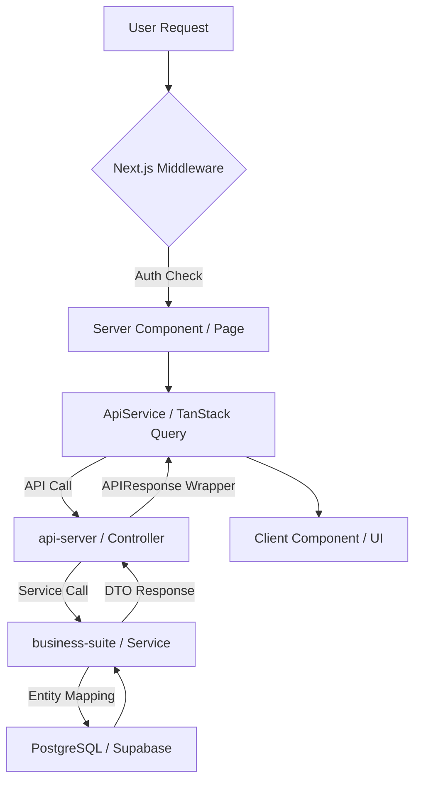

# GEMINI.md - eGov Enterprise Project Rule Set

본 파일은 **eGov Enterprise** 프로젝트의 전역 개발 규칙을 정의한다.
에이전트는 모든 작업 수행 시 이 규칙을 최우선으로 참고하며, 글로벌 룰셋(`user_global`)의 기본 원칙을 이 프로젝트의 구체적인 맥락에 맞게 적용한다.

---

## 1. 프로젝트 개요 (Project Overview)

- **이름**: eGov Enterprise (차세대 기업용 표준 프레임워크 기반 서비스)
- **주요 목표**: 전자정부 표준 프레임워크(eGovFrame)를 최신 기술 스택(Java 21, Spring Boot 3.4, Next.js 15)으로 현대화하여 기업용 엔터프라이즈 환경에 최적화된 아키텍처 제공.
- **아키텍처 흐름**:

## 2. 기술 스택 (Technology Stack)

### Backend
- **Core**: Java 21 / Spring Boot 3.4.1 / eGovFrame 4.x
- **Build**: Gradle (Multi-module: `api-server`, `business-suite`, `foundation`)
- **Database**: OCI PostgreSQL 17 (Port 5432)
- **Test**: JUnit 5, Mockito, JaCoCo (Target Coverage: 50%+)

### Frontend
- **Framework**: Next.js 15.1.7 (App Router / React 19)
- **Styling**: Tailwind CSS 4, Framer Motion
- **State**: TanStack Query (Server State), React Context (Global UI State)
- **Quality**: Storybook 10, Lighthouse CI, Bundle Analyzer, Playwright (E2E)

## 3. 코드 아키텍처 컨벤션 (Code Architecture Conventions)

### 3.1 Backend: Domain Integrity & Mapping
- **Entity Exposure Forbidden**: JPA Entity 클래스는 절대 컨트롤러 층으로 노출되지 않는다. 반드시 DTO(`Request`/`Response`)를 통해 데이터를 교환한다.
- **Mapping Responsibility**: 데이터 변환은 `business-suite` 모듈의 서비스 레이어에서 수행한다. 가능하면 매퍼 클래스나 생성자를 활용하여 로직을 분리한다.
- **Validation**: API 입력값 검증은 `@Valid`를 활용하여 `GlobalExceptionHandler`에서 자동 처리되도록 한다.

### 3.2 Frontend: State Management Partitioning
- **Server State**: 모든 서버 데이터는 `TanStack Query`를 통해 관리하며, 직접적인 `useEffect` 데이터 패칭을 지양한다.
- **Global UI State**: 테마, 사이드바 상태 등 범용 UI 상태는 `React Context`를 사용한다.
- **URL State**: 검색 필터, 정렬, 페이지네이션 등 SSR과 연동이 필요한 상태는 쿼리 스트링(`useSearchParams`)을 최우선으로 사용한다.
- **Form State**: 모든 폼은 `useAppForm` (react-hook-form + Zod)을 사용하여 격리한다.

### 3.3 프론트엔드 서비스 레이어 패턴
- 모든 서비스는 `ApiService` 추상 클래스를 상속한다.
- **자동 매핑**: `ApiService`의 `get()` 메서드는 프론트의 `page`(0-based)를 백엔드의 `pageIndex`(1-based)로 자동 변환하므로 수동 변환을 금지한다.

## 4. 성능 최적화 정책 (Performance Policy)

- **Heavy UI Components**: `TopologyMap`, `NationalDistributionMap` 등 고중량 시각화 라이브러리를 포함한 컴포넌트는 반드시 `next/dynamic`을 사용하여 `ssr: false` 옵션으로 Lazy Loading 한다.
- **Image/Asset**: 모든 이미지는 `next/image`를 사용하며, LCP 요소에는 `priority` 속성을 부여한다.
- **Bundle Analysis**: 기능 추가 후 `npm run analyze`를 실행하여 특정 패키지가 번들 사이즈에 미치는 영향을 체크한다.

## 5. 보안 및 안전성 원칙 (Security & Guardrails)

- **인증 정보 보호**: `.env` 파일과 설정 파일에 비밀번호를 하드코딩하지 않는다.
- **보안 헤더**: `next.config.ts`의 CSP 설정과 외부 리소스(Google Fonts 등) 연동 시 충돌 여부를 상시 확인한다.
- **OWASP 점검**: 백엔드 빌드 시 `failBuildOnCVSS=7` 설정에 따라 보안 취약점이 발견되면 수정을 우선한다.

## 6. 에이전트 트러블슈팅 매트릭스 (Troubleshooting Gotchas)

- **인증(401) 이슈**: `AuthContext`의 `accessToken`과 브라우저 쿠키 값이 동기화되어 있는지 먼저 확인하라. 
- **타입 에러**: 백엔드 DTO 변경 후에는 반드시 `npm run codegen:ts`를 실행하여 `generated-api.d.ts`를 최신화하라.
- **컴포넌트 렌더링**: Next.js App Router에서 `'use client'` 지시어가 필요한 위치인지(이벤트 훅 사용 여부) 항상 확인하라. 기본은 Server Component다.

## 7. 주요 명령어 (Key Commands)

| 명령 | 경로 | 설명 |
|------|------|------|
| `npm run dev` | Root | 전체 개발 서버 실행 |
| `npm run codegen:ts` | `frontend/` | OpenAPI 명세 기반 TS 타입 생성 |
| `npm run analyze` | `frontend/` | Next.js 번들 사이즈 분석 |
| `pnpm run storybook` | `frontend/` | UI 컴포넌트 격리 개발 환경 |
| `make coverage` | Root | 백엔드 테스트 커버리지 리포트 생성 |

## 8. 안티패턴 (하지 말 것)

| 안티패턴 | 올바른 방향 |
|---------|-----------|
| 컨트롤러에서 Entity 반환 | DTO 전문 클래스 생성 및 매핑 |
| 페이지 컴포넌트에 직접 `axios` 호출 | `services/` 레이어의 서비스 클래스 활용 |
| `pageIndex` 직접 계산 | `ApiService`의 자동 매핑 로직에 위임 |
| 복잡한 로직을 Server Component에 인라인 작성 | 별도의 `Service` 또는 `Logic` 파일로 분리 |

## 9. CCG Orchestration (Claude + Claude + Gemini)

본 프로젝트는 **@nst173/superpowers-ccg**를 기반으로 하되, 사용자의 환경에 맞춰 최적화된 협업 체계를 구축하였다.
- **Claude (Antigravity)**: 전체 오케스트레이션 및 **백엔드/시스템/인프라** 구현 담당
- **Gemini (via MCP)**: **프론트엔드/UI/UX/스타일** 구현 전문가

복잡한 작업 시 `.agent/skills/superpowers-ccg`의 스킬을 호출하여 적절한 모델로 작업을 라우팅하고, 풀스택 작업 시 Claude와 Gemini의 **교차 검증(CROSS_VALIDATION)**을 수행한다.

## 10. Map-Driven Development (via Graphify)

복잡한 아키텍처 변경이나 대규모 기능 추가 시 **지식 그래프(Knowledge Graph)**를 활용하여 효율성을 극대화한다.
- **Pre-flight Analysis**: 대형 작업 시작 전 `/graphify`를 실행하여 영향 범위(Blast Radius)를 시각적으로 파악한다.
- **Strategic CP0**: 브레인스토밍 단계에서 그래프를 쿼리하여 숨겨진 의존성과 기술적 부채를 사전에 식별한다.
- **Token Optimization**: 이미 구축된 그래프 인덱스를 활용하여 불필요한 파일 전체 읽기를 지양하고 토큰 소모를 최소화한다.
- **Graph Maintenance**: 대규모 구현 완료 후 `/graphify --update`를 통해 최신 아키텍처 상태를 지도에 반영한다.

---
*Last Updated: 2026-04-25 (Updated via Antigravity)*
