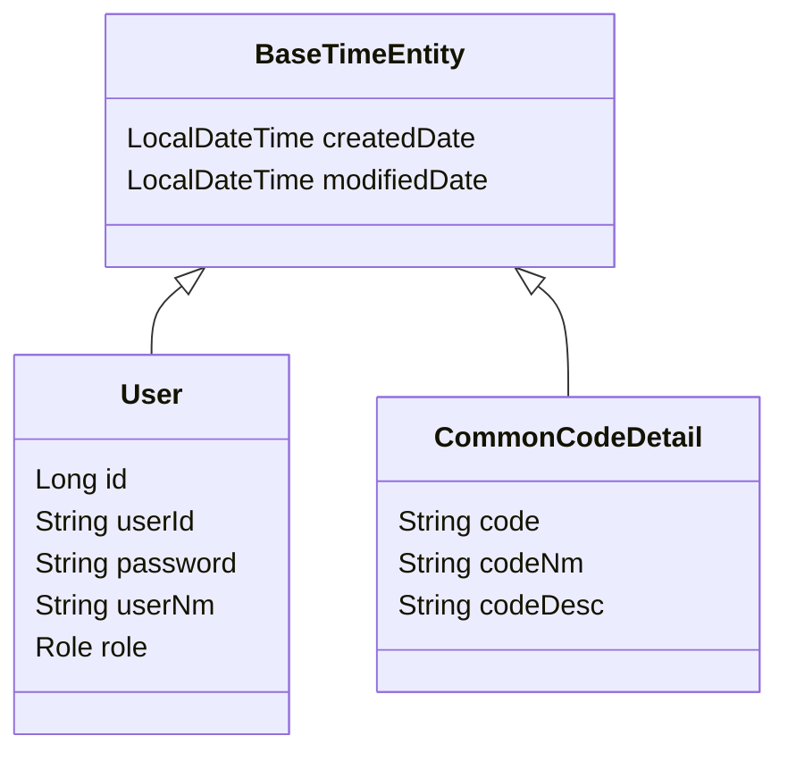

# 전자정부프레임워크 5.0 공통 모듈 구축 - 상세 설계서 (LLD)

## 1. 패키지 상세 설계 (Package Structure)

멀티 모듈 구조에 따른 상세 패키지 명명 규칙 및 계층 구조입니다. 기본 패키지 접두사(prefix)는 `com.company.project`를 사용합니다.

```
com.company.project
├── core           # [common-core]
│   ├── config     # 전역 설정 (Async, WebMvc 등)
│   ├── exception  # 전역 예외 처리 (GlobalExceptionHandler, BusinessException)
│   ├── response   # 공통 응답 포맷 (ApiResponse, ErrorCode)
│   └── util       # 공통 유틸리티 (DateUtil, CryptoUtil)
├── domain         # [common-domain]
│   ├── user       # 사용자 도메인 (Entity, Repository)
│   ├── code       # 공통 코드 도메인 (Entity, Repository)
│   └── file       # 파일 도메인 (Entity, Repository)
├── security       # [common-security]
│   ├── config     # 보안 설정 (SecurityConfig, CorsConfig)
│   ├── jwt        # JWT 처리 (JwtTokenProvider, JwtAuthenticationFilter)
│   └── service    # 사용자 인증 서비스 (CustomUserDetailsService)
└── service        # [common-service]
    ├── user       # 사용자 비즈니스 로직 (UserServiceImpl)
    ├── code       # 공통 코드 비즈니스 로직 (CommonCodeServiceImpl)
    └── auth       # 인증 비즈니스 로직 (AuthServiceImpl)
```

## 2. 데이터베이스 상세 설계 (Database Schema)

기존 전자정부프레임워크 테이블 명명 규칙을 준수하되, JPA 엔티티 매핑을 위해 현대적인 리팩토링을 병행합니다.

### 2.1. 사용자 (Users)
*   **관련 테이블**: `COMTN_EMPTLYR_INFO` (업무사용자정보)
*   **엔티티 명**: `User`

| 필드명 | 타입 | 설명 | 제약사항 |
| :--- | :--- | :--- | :--- |
| `id` | `Long` | 사용자 시퀀스 ID | PK, Auto Inc |
| `userId` | `String` | 로그인 ID | Unique |
| `password` | `String` | 암호화된 비밀번호 | |
| `userNm` | `String` | 사용자명 | |
| `userStatus` | `Enum` | 상태 (ACTIVE, INACTIVE, LOCK) | |
| `role` | `Enum` | 권한 (ROLE_USER, ROLE_ADMIN) | |

### 2.2. 공통 코드 (Common Codes)
*   **관련 테이블**: `COMTCCMMNCODE` (분류코드), `COMTCCMMNDETAILCODE` (상세코드)
*   **엔티티 명**: `CommonCodeGroup`, `CommonCodeDetail`

### 2.3. Entity 클래스 다이어그램 (Class Diagram)


## 3. 핵심 로직 상세 설계 (Core Logic)

### 3.1. 인증/인가 흐름 (Security Flow)
1.  **로그인 요청**: `POST /api/v1/auth/login` (Body: `LoginRequest`)
2.  **인증 서비스 (AuthService)**: `AuthenticationManager.authenticate()` 호출을 통한 DB 검증.
3.  **JWT 생성 (JwtProvider)**: 인증 성공 시 `AccessToken` 및 `RefreshToken` 발급.
4.  **필터 체인 (Filter Chain)**:
    *   `JwtAuthenticationFilter`: 헤더에서 토큰 추출 -> 유효성 검증 -> `SecurityContextHolder`에 `Authentication` 객체 저장.

### 3.2. 공통 응답 처리 (Response Handling)
모든 API 응답은 `ApiResponse` 래퍼 클래스를 사용하여 구조를 통일합니다.

```java
public record ApiResponse<T>(
    boolean success,
    T data,
    ErrorResponse error
) {}
```
*   **성공 시**: `ApiResponse.success(data)` 반환.
*   **실패 시**: `BusinessException` 발생 -> `@RestControllerAdvice`에서 가로채어 `ApiResponse.error(...)` 반환.

## 4. API 명세 예시 (Sample API Specification)

### 4.1. 인증 관련 (Auth)
*   `POST /api/v1/auth/login`: 로그인 및 JWT 발급
*   `POST /api/v1/auth/refresh`: 토큰 갱신
*   `POST /api/v1/auth/logout`: 로그아웃

### 4.2. 회원 관리 (User)
*   `GET /api/v1/users/me`: 내 정보 조회 (SecurityContext 활용)
*   `POST /api/v1/users`: 회원 가입
*   `PUT /api/v1/users/{id}`: 회원 정보 수정

## 5. 구현 시 유의사항 (Implementation Notes)
*   **DTO 변환**: 엔티티의 직접 노출을 지양하고, `Builder` 패턴을 활용하여 DTO로 변환한다.
*   **QueryDSL**: `QClass` 생성 경로는 `build/generated/querydsl`로 설정하여 소스 코드와 형상 관리를 분리한다.
*   **설정 파일**: `application-common.yml` (Core)과 `application-api.yml` (API) 등 모듈별로 설정을 분리하여 관리한다.
