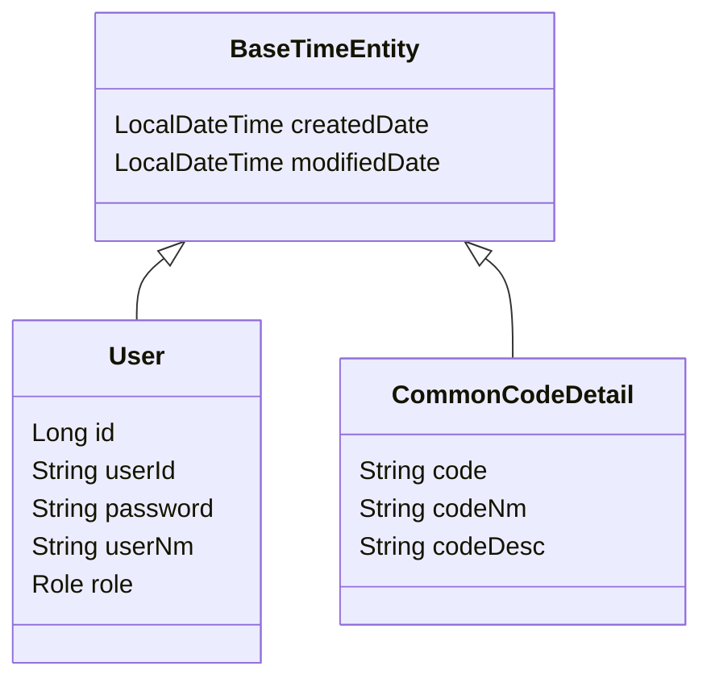

# 전자정부프레임워크 5.0 공통 모듈 구축 - LLD (Low-Level Design)

## 1. 패키지 상세 설계 (Package Structure)

멀티 모듈 구조에 따른 상세 패키지 네이밍 및 계층 구조입니다. 기본 패키지 prefix는 `com.company.project`로 가정합니다.

```
com.company.project
├── core           # [common-core]
│   ├── config     # Global Config (Async, WebMvc)
│   ├── exception  # GlobalExceptionHandler, BusinessException
│   ├── response   # ApiResponse, ErrorCode
│   └── util       # DateUtil, CryptoUtil
├── domain         # [common-domain]
│   ├── user       # User(Entity), UserRepository
│   ├── code       # CommonCode(Entity), CommonCodeRepository
│   └── file       # File(Entity), FileRepository
├── security       # [common-security]
│   ├── config     # SecurityConfig, CorsConfig
│   ├── jwt        # JwtTokenProvider, JwtAuthenticationFilter
│   └── service    # CustomUserDetailsService
└── service        # [common-service]
    ├── user       # UserService(Impl)
    ├── code       # CommonCodeService(Impl)
    └── auth       # AuthService(Impl)
```

## 2. 데이터베이스 상세 설계 (Database Schema)

기존 eGovFrame 테이블 이름을 따르되, JPA Entity 매핑을 위해 설계를 현대화합니다.

### 2.1. 사용자 (Users)
*   **Table**: `COMTN_EMPTLYR_INFO` (그대로 매핑하거나 `USERS`로 간소화 고려)
*   **Entity**: `User`

| Field | Type | Description | Key |
| :--- | :--- | :--- | :--- |
| `id` | `Long` | User Sequence ID | PK, Auto Inc |
| `userId` | `String` | 로그인 ID | Unique |
| `password` | `String` | 암호화된 비밀번호 | |
| `userNm` | `String` | 사용자명 | |
| `userStatus` | `Enum` | 상태 (ACTIVE, INACTIVE, LOCK) | |
| `role` | `Enum` | 권한 (ROLE_USER, ROLE_ADMIN) | |

### 2.2. 공통 코드 (Common Codes)
*   **Table**: `COMTCCMMNCODE` (Master), `COMTCCMMNDETAILCODE` (Detail)
*   **Entity**: `CommonCodeGroup`, `CommonCodeDetail`

### 2.3. Entity 클래스 다이어그램 (Class Diagram)


## 3. 핵심 로직 상세 설계 (Core Logic)

### 3.1. 인증/인가 흐름 (Security Flow)
1.  **Login Request**: `POST /api/v1/auth/login` (Body: `LoginRequest`)
2.  **AuthService**: `AuthenticationManager.authenticate()` 호출 -> DB 검증.
3.  **JwtProvider**: 인증 성공 시 `AccessToken`, `RefreshToken` 생성.
4.  **Filter Chain**:
    *   `JwtAuthenticationFilter`: Header에서 Token 추출 -> 유효성 검증 -> `SecurityContextHolder`에 `Authentication` 객체 저장.

### 3.2. 공통 응답 처리 (Response Handling)
모든 API 응답은 `ApiResponse` 래퍼 클래스로 통일합니다.

```java
public record ApiResponse<T>(
    boolean success,
    T data,
    ErrorResponse error
) {}
```
*   **Success**: `ApiResponse.success(userDto)`
*   **Fail**: `throw new BusinessException(ErrorCode.USER_NOT_FOUND)` -> `@RestControllerAdvice`가 잡아서 `ApiResponse.error(...)` 반환.

## 4. API 명세 (API Specification)

### 4.1. 인증 (Auth)
*   `POST /api/v1/auth/login`: 로그인 (JWT 발급)
*   `POST /api/v1/auth/refresh`: 토큰 갱신
*   `POST /api/v1/auth/logout`: 로그아웃

### 4.2. 회원 관리 (User)
*   `GET /api/v1/users/me`: 내 정보 조회 (SecurityContext 이용)
*   `POST /api/v1/users`: 회원 가입
*   `PUT /api/v1/users/{id}`: 회원 정보 수정

## 5. 구현 시 유의사항 (Implementation Note)
*   **DTO 변환**: Entity Setter 사용을 지양하고, `Builder` 패턴을 사용하여 생성.
*   **QueryDSL**: `QClass` 생성 경로는 `build/generated/querydsl`로 설정하여 소스 코드와 분리.
*   **설정 파일**: `application-common.yml` (Core 모듈)과 `application-api.yml` (API 모듈)을 분리하여 관리.
