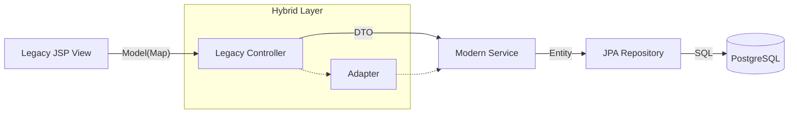

# eGovFrame 5.0 엔터프라이즈 마이그레이션 마스터 플랜

> **최종 수정일**: 2026-01-04
> **목표**: eGovFrame 공통 컴포넌트(`egovframework.com`) 전체를 현대적인 Spring Boot + JPA 아키텍처로 전환하되, 레거시 JSP와의 호환성을 유지합니다.

---

## 1. 개요 (Executive Summary)

본 프로젝트는 레거시 eGovFrame 기반 시스템을 다음과 같이 현대화하는 것을 목표로 합니다:
1.  **아키텍처 현대화**: MyBatis/VO 기반에서 JPA/Entity/Repository 패턴으로 전환.
2.  **모듈 표준화**: 경량(`let`) 모듈 대신 엔터프라이즈(`com`) 전체 공통 모듈로 표준화 및 교체.
3.  **하이브리드 전환**: "백엔드 우선(Backend First)" 전략을 채택하여, 프론트엔드(JSP)는 유지하면서 백엔드 로직을 우선 교체합니다.

> 📘 **상세 가이드**: 개별 모듈의 상세 이관 절차는 [모듈 마이그레이션 표준 가이드](C:/Users/sanle/.gemini/antigravity/brain/f15a5c1f-5304-4178-b610-069ac85c2e0f/MODULE_MIGRATION_GUIDE.md)를 참조하십시오.

---

## 2. 마이그레이션 전략: 도메인 클러스터 (Domain Cluster)

의존성이 높은 모듈들을 묶어서(Cluster) 이관 및 검증하는 전략을 채택합니다.

| 단계 | 클러스터 명 | 포함 모듈 | 상태 |
|---|---|---|---|
| **Phase 1** | **Core Foundation** | 시스템(`sym`), 보안(`sec`), 사용자(`uss`) | ✅ 완료 |
| **Phase 2** | **Collaboration Base** | 게시판(`cop.bbs`) + 파일(`cmm.service`) + 댓글(`cop.cmt`) | 🔄 **진행 중** |
| | **Community Ext** | 커뮤니티(`cop.cmy`) + 동호회(`cop.clb`) | ⬜ 대기 |
| **Phase 3** | **Work Support** | 일정(`cop.smt`) + 약관(`uss.umt`) | ⬜ 대기 |
| | **Customer Help** | 도움말(`uss.olh`) + 설문(`uss.olp`) | ⬜ 대기 |
| **Phase 4** | **Analytics** | 통계(`sts`) + 연계(`ssi`) | ⬜ 대기 |

---

## 3. 기술 전략 (Technical Strategy)

### 3.1. 레이어드 아키텍처 (Layered Architecture)

데이터 흐름은 다음과 같습니다:
`Legacy Controller` → `Adapter` → `Modern Service` → `JPA Repository` → `PostgreSQL`



### 3.2. 표준 디렉토리 구조
```
common-domain/src/main/java/com/company/project/domain/[module]/
├── [Entity].java       # JPA 엔티티 (Setter 미사용, Builder 패턴)
└── [Repository].java   # JpaRepository 인터페이스

common-service/src/main/java/com/company/project/service/[module]/
├── [Service].java      # 서비스 인터페이스
└── [ServiceImpl].java  # 비즈니스 로직 구현체
```

### 3.3. 하이브리드 어댑터 패턴
기존 JSP가 `Map` 또는 `VO` 객체를 기대하는 구조를 유지하기 위해 어댑터 패턴을 사용합니다:
```java
// Controller
@GetMapping("/list.do")
public String list(Model model) {
    List<BoardDto> posts = boardService.findAll();
    // Adapter: DTO -> Legacy Map 구조 변환 (null safe 처리 필수)
    List<Map<String, Object>> legacyList = BoardAdapter.toLegacyList(posts);
    model.addAttribute("resultList", legacyList);
    return "egovframework/com/cop/bbs/EgovNoticeList";
}
```

---

## 4. 검증 체크리스트
각 모듈 이관 시 다음 사항을 반드시 확인해야 합니다:
1.  **DB**: 테이블 존재 여부 (`COMT` 접두어 제거 확인) 및 JPA를 통한 데이터 접근 가능 여부.
2.  **Logic**: 서비스 단위 테스트(Unit Tests) 통과 여부.
3.  **UI**: JSP 페이지가 500 에러 없이 정상 렌더링되는지.
4.  **Flow**: 등록/수정/삭제(CRUD) 작업이 DB에 정상 반영되는지.
