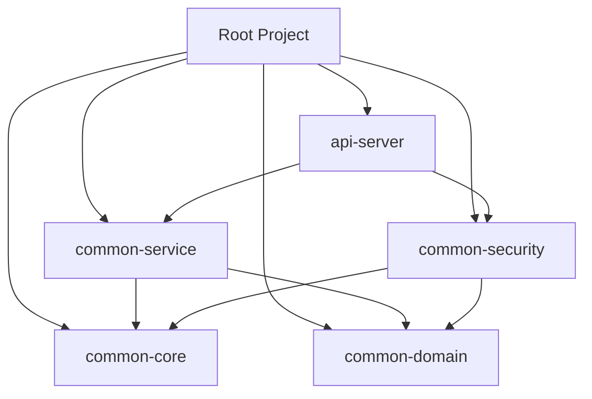

# 전자정부프레임워크 5.0 공통 모듈 구축 - TRD (Technical Requirements Document)

## 1. 기술적 목표 (Technical Goals)
본 문서는 `PRD.MD`에 정의된 요구사항을 달성하기 위한 구체적인 기술 사양과 아키텍처 원칙을 정의합니다.
*   **Monolithic to Modular Monolith**: 단일 구조의 한계를 극복하고 모듈 단위의 재사용성 확보.
*   **MyBatis to JPA**: SQL 중심 개발에서 객체 지향적 데이터 처리로 전환하여 생산성 및 유지보수성 향상.
*   **Stateful to Stateless**: JWT 기반 인증을 통해 MSA 확장성 및 클라이언트 독립성 확보.

## 2. 시스템 아키텍처 (System Architecture)

### 2.1. 멀티 모듈 구조 (Multi-Module Structure)
Gradle(또는 Maven) 기반의 계층형 멀티 모듈 구조를 채택합니다.

| 모듈명 | 역할 및 주요 구성요소 | 의존성 |
| :--- | :--- | :--- |
| **common-core** | 전사 공통 유틸리티, Global ExceptionHandler, BaseResponse, 기본 설정(Date, Log) | None |
| **common-domain** | **JPA Entity**, Repository, Enums, DTO(Domain) | common-core, DB Driver |
| **common-security** | **JWT Provider**, Security Config, Filter Chain, UserDetails | common-domain |
| **common-service** | 핵심 비즈니스 로직(Service Impl), Transaction 관리 | common-domain |
| **api-server** | **Execution Target**. Controller(REST API), Swagger 설정 | common-service, common-security |

## 3. 기술 스택 및 버전 (Tech Stack & Versions)

| 분류 | 기술 및 버전 | 비고 |
| :--- | :--- | :--- |
| **Language** | Java 21 (LTS) | 텍스트 블록, Record 등 최신 문법 활용 |
| **Framework** | **eGovFrame 5.0 (Spring Boot 3.3.x)** | Jakarta EE 9/10 기반 (javax -> jakarta 패키지명 변경 주의) |
| **Build Tool** | Gradle 8.12 (권장) or Maven 3.9.x | 멀티 모듈 구성이 용이한 Gradle 권장 |
| **Database** | PostgreSQL | Docker 환경 권장 |
| **Persistence** | **Spring Data JPA**, QueryDSL 5.0 | 복잡한 동적 쿼리는 QueryDSL 원칙 |
| **Security** | Spring Security 6.x, JWT (jjwt 0.11.x) | Stateless, Method Security 적용 |
| **API Docs** | Springdoc OpenAPI (Swagger 3.0) | Controller 코드 기반 자동 생성 |

## 4. 상세 기술 사양 (Detailed Specifications)

### 4.1. 데이터 액세스 계층 (Data Access Layer)
*   **Entity 규칙**:
    *   모든 테이블은 1:1로 매핑되는 `@Entity` 보유.
    *   `@Id`는 가능한 대리키(Long auto_increment) 사용 권장.
    *   `BaseTimeEntity`(`@MappedSuperclass`)를 상속받아 생성/수정일시 자동 관리 (JPA Auditing).
*   **Repository 규칙**:
    *   단순 CRUD: `JpaRepository` 사용.
    *   조회/동적쿼리: `QuerydslRepositorySupport` 또는 `JPAQueryFactory` 별도 구현.

### 4.2. 비즈니스 및 API 계층 (Business & API Layer)
*   **DTO 사용 의무화**:
    *   Entity는 절대로 Controller 밖으로 리턴하지 않음.
    *   Request/Response DTO를 명확히 분리 (e.g., `UserSaveRequest`, `UserResponse`).
    *   객체 변환은 `MapStruct` 또는 생성자 패턴 사용.
*   **예외 처리 (Error Handling)**:
    *   `@RestControllerAdvice`를 통한 전역 예외 처리.
    *   표준 응답 포맷(`ApiResponse<T>`) 정의하여 성공/실패 구조 통일.

### 4.3. 인증 및 인가 (Authentication & Authorization)
*   **JWT 저장**: Access Token은 Header(`Authorization: Bearer`), Refresh Token은 `HttpOnly Cookie` 또는 Redis 저장 권장.
*   **권한 체계**: Role-Based Access Control (RBAC). URL 패턴 통제보다는 Method Level Security(`@PreAuthorize("hasRole('ADMIN')")`) 권장.

## 5. 마이그레이션 전략 (Migration Strategy)
기존 Legacy(MyBatis) 코드를 점진적으로 전환합니다.

1.  **Phase 1 (Skeleton)**: 멀티 모듈 프로젝트 생성 및 환경 설정 검증.
2.  **Phase 2 (Core Domain)**: 회원(User), 공통코드(Code) 등 핵심 테이블의 JPA Entity/Repository 구축.
3.  **Phase 3 (Auth)**: Spring Security + JWT 도입하여 로그인 API 구현.
4.  **Phase 4 (Expansion)**: 게시판, 파일 등 주변 모듈 순차적 포팅.
