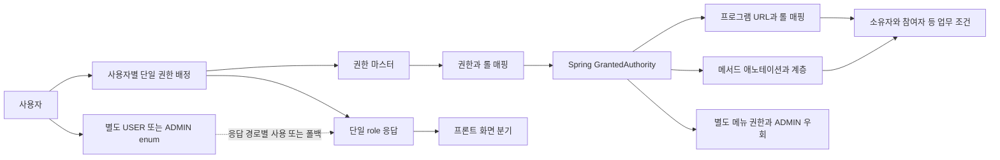
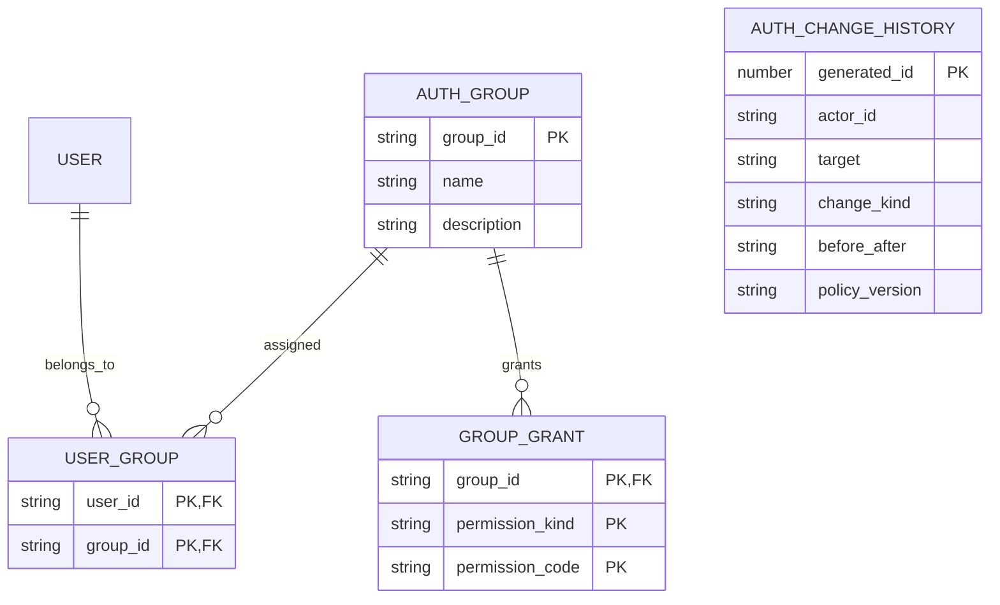
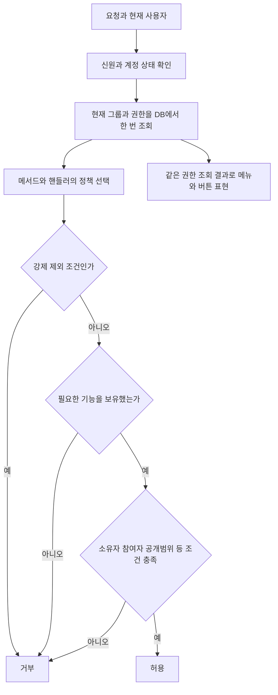

# 권한관리 최소 테이블 전환 설계

상태: **Accepted — ADR-0016에 따라 구현하는 계약. 운영 DB 적용은 별도 전환 절차**

조사일: 2026-09-10. 소스 기준: `23bdc811459dce5c3b3f8d77592b8450a7eafa38`의 현재 워킹트리. OCI는 읽기 전용으로 확인했다. 최초 조사는 전환 전 스냅샷이며, 구현 승인은 [ADR-0016](decisions/ADR-0016-explicit-permissions-and-multiple-groups.md)에 기록했다. 아래 현재 소스 계약과 전환 전 OCI 실측을 구분한다. OCI 전환 완료를 주장하지 않는다.

## 1. 권장 결정과 테이블 수

**사용자 → 복수 권한그룹 → 기능 권한**으로 통합한다. 인가 판단에는 **3개 테이블**, 변경 전후 감사까지 보장하는 권장 운영 구성에는 **4개 테이블**을 사용한다. 기능 정의는 소스가 소유하고, 운영자는 그룹을 만들고 기능을 선택하며 사용자에게 여러 그룹을 배정한다.

| 대상 | 권장 역할 | 최종 처리 |
|---|---|---|
| `tb_authrt_info` | 권한그룹 마스터 | 유지·재편 |
| `tb_authrt_user_map` | 사용자와 그룹의 N:M 배정 | 신규 복합키 `(scrty_dcsn_trgt_id, authrt_cd)`; 구 `tb_user_authrt_map` 복제 후 제거 |
| `tb_authrt_grnt_map` | 그룹에 부여된 기능·메뉴 권한 | 신규 복합키 `(authrt_cd, authrt_type_cd, authrt_grnt_cd)`; 구 `tb_authrt_role_map` 제거 |
| `tb_authrt_chg_hstry` | 누가 무엇을 어떻게 변경했는지 같은 트랜잭션에 기록 | 신규 생성 PK와 불변 delta 이력; 사용자·그룹 삭제 후에도 유지 |
| `tb_role_info` | 현재 롤 메타데이터 | 코드 기능 카탈로그로 대체 후 제거 |
| `tb_role_prgrm_map` | 현재 URL과 롤 연결 | 코드의 HTTP 메서드·핸들러 정책으로 대체 후 제거 |
| `tb_menu_crt_dtl` | 현재 그룹별 메뉴 노출 | 그룹 권한 매핑의 NAVIGATION 유형으로 이관 후 제거 |
| `tb_role_hierarchy` | 현재 SYSTEM→ADMIN→USER 상속 | 실제 실행 경로별 권한을 명시적으로 펼친 후 제거 |
| `tb_menu_info` | 메뉴 트리·노출 상태·화면 경로 | 유지 |
| `tb_prgrm_lst` | 프로그램 관리·메뉴의 선택적 프로그램 참조 | 유지; URL 인가 기능만 분리 |
| `tb_authrt_group_info` | 사용자 분류 그룹 | 유지; 권한그룹과 명칭·화면 설명을 구분 |

**개수의 분모**: 현재 인가 관련 7개를 핵심 3개로 줄이고 감사 1개를 추가한다. 이번 조사 대상 10개 중 비인가 기능 3개까지 포함하면 **10개 → 7개**다. 사용자·조직·토큰·업무 관계·일반 로그 테이블은 별도로 존속한다. 이행 중 구·신 구조가 공존하는 기간에는 테이블 수가 일시적으로 증가한다.

앞선 4개 핵심 테이블 안의 `tb_role_info` 재사용은 가능한 대안이지만 최소 구성의 필수 요소는 아니다. 여기서 권장하는 네 번째 테이블은 **기능 사전이 아닌 변경 이력**이다.

### 비교한 대안

| 안 | 인가 핵심 수 | 동일 트랜잭션 변경 이력 포함 | 장점 | 비용·판정 |
|---|---:|---:|---|---|
| 사용자에 그룹·권한 JSON 저장 | 1~2처럼 보임 | 별도 | 물리 수 감소 | N:M 무결성·검색·동시 수정·회수 복잡성 증가. 제외 |
| 그룹 + 사용자그룹 + 그룹권한, 기능 정의는 소스 | 3 | **4** | 운영 화면·인가 경로 단순화, 기능 정의 중복 제거 | 코드 카탈로그와 저장된 권한 값의 검증 필요. **권장** |
| 위 구성 + DB 기능 카탈로그 | 4 | 5 | 기능 코드 FK, SQL만으로 설명 조회 가능 | 코드·DB 동기화와 배포 호환성 관리 증가. DB 단독 카탈로그 소비자가 필요할 때 선택 |
| 현 구조를 유지하고 화면만 통합 | 7 | 8 | 초기 DB 변경 작음 | URL·메뉴·계층·단일 role의 복수 기준이 남음. 중간 이행 수단 |

[DB 헌법](../../.agent/knowledge/db-standard-constitution/artifacts/constitution.md)은 모든 기능 코드를 별도 테이블/FK로 만들도록 강제하지 않는다. 3개 안은 가능하지만, DB 밖 기능 코드 검증을 없애도 된다는 뜻은 아니다.

## 2. 조사 범위와 증거의 한계

- [소스 전수검색 원장](authorization-source-inventory.json): tracked 텍스트 **2,670개**를 대상으로 테이블 이름·인가 식별자·인증/관리 경로를 검색하여 **542개** 직접 후보를 찾았다. 백엔드·프론트·스키마의 독립 조사에서 토큰 전달·호출부·계약·회귀 파일을 확장한 최종 합집합은 **887개**다. 각 파일의 분류·검색 줄(해당 시)·LF 정규화 SHA-256을 포함한다.
- 최종 분류: 백엔드 production 217, 프론트 소스 170, 테스트/fixture 391, Flyway 이력 42, 설정·도구·리소스 37, 생성물/스냅샷 6, 문서·역사 자료 24. **887은 수정 파일 수가 아니다.** 경로·키워드 후보에는 import·주석·부정 테스트도 포함한다. `review-*` 범주는 독립 조사로 확장한 참조이며 범주별 수는 중복된다.
- 별도 직접 테이블 이름 검색은 **118개** 파일이다. 심볼 경유 사용처까지 포함하는 542개 원장과 모집단이 다르다. 프론트는 별도로 `frontend/src`의 tracked TS/TSX 835개 및 production 후보 519개를 대조했다.
- 핵심 실행 경로는 아래 근거 파일을 직접 읽고 비교했다. 전수 **검색**과 모든 줄의 제어흐름 증명은 구분한다. 동적 코드·외부 소비자까지 정적 검색으로 완전성을 증명하지 않는다.
- [OCI 실측 원장](authorization-db-evidence.json): 컬럼·길이·PK/FK·행 수·메타 표준·롤 연결·메뉴 분포. 사용자 식별값·연결 정보·자격증명은 기록하지 않았다.
- 별도 읽기 트랜잭션으로 조회했으므로 전체 DB의 단일 시점 스냅샷은 아니다. 적용 직전 하나의 일관된 스냅샷으로 다시 비교해야 한다.
- 조회 가능한 비시스템 view/materialized view/function 정의의 테이블명 참조와 대상 테이블의 사용자 trigger 검색은 0건이었다. 동적 SQL·외부 배치·연계 서비스의 부재를 보증하지 않는다.
- 운영 애플리케이션의 실제 profile/env override·요청 로그·부하·활성 외부 클라이언트는 이번에 실측하지 않았다. 아래 인가 동작은 **현재 소스와 DB 조합의 분석**이다.
- 동시에 진행 중인 미추적 `ie-deliverables` 문서는 분석 정본으로 사용하지 않았다. 소스 원장은 문서 작성 전 스냅샷이며 이후 문서·Atlas 변경까지 실시간 추적하는 게이트가 아니다.

재조사는 원장의 `selectionRules`를 사용하여 `git ls-files -z`로 tracked 파일을 열거하고, 같은 확장자·제외 경로에 대해 `rg` 또는 정규식 검색 후 심볼 호출부를 확장한다. 구현 시작 때 신규·수정·삭제 파일을 다시 대조한다. `.env`, 빌드 결과, vendor/skills, 미추적 타 작업 자료는 인가 소스 증거에 포함하지 않는다.

## 3. 전환 전 OCI와 실행 구조 — 조사 스냅샷

### OCI 실측

| 테이블 | 행 수 | 판단에 중요한 사실 |
|---|---:|---|
| `tb_authrt_info` | 4 | ADMIN, SYSTEM, USER, ANONYMOUS |
| `tb_user_authrt_map` | 7 | PK가 `scrty_dcsn_trgt_id` 하나라 사용자별 1개만 가능 |
| `tb_role_info` | 15 | `web-000001`~`web-000012`는 양쪽 매핑 0건; 3개 ROLE 코드는 실제 연결 |
| `tb_authrt_role_map` | 3 | ADMIN/SYSTEM/USER의 자기 코드 매핑; `role_cd` 실제 FK는 없음 |
| `tb_role_prgrm_map` | 34 | 17개 프로그램에 ADMIN/SYSTEM 각각 연결 |
| `tb_role_hierarchy` | 2 | SYSTEM→ADMIN, ADMIN→USER |
| `tb_menu_crt_dtl` | 111 | ADMIN 84, USER 27; SYSTEM 명시 매핑 0 |
| `tb_menu_info` | 84 | 사용·미삭제 메뉴 79; 비활성 메뉴도 이관 대상에 포함 |
| `tb_prgrm_lst` | 18 | 인가 매핑 프로그램 17 외에도 메뉴·프로그램 관리가 사용 |
| `tb_authrt_group_info` | 0 | 사용자 `group_id` 사용도 0이지만 코드 소비자는 존재 |

### 전환 전 흐름

### 전환을 좌우하는 소스 근거

| 발견 | 근거 | 설계 반영 |
|---|---|---|
| 최초 로그인은 단일 authorCode, 후속 JWT 인증은 매핑 롤까지 확장하는 비대칭 | [EgovAuthenticationProvider](../../business-core/src/main/java/nuri/business/security/iam/EgovAuthenticationProvider.java), [JpaUserAuthAdapter](../../business-core/src/main/java/nuri/business/security/iam/JpaUserAuthAdapter.java), [JwtTokenProvider](../../foundation/src/main/java/nuri/foundation/security/jwt/JwtTokenProvider.java) | 요청별 동일한 effective permission 계산기로 통합 |
| JWT 인증도 DB에서 사용자를 재조회하지만 응답·UI에는 단일 role이 존재 | [AuthServiceImpl](../../business-core/src/main/java/nuri/business/service/auth/impl/AuthServiceImpl.java), [authService](../../frontend/src/services/foundation/auth/authService.ts), [proxy](../../frontend/src/proxy.ts) | 토큰 배열만 추가하는 것으로 전환이 끝나지 않음 |
| URL 매니저는 모든 일치 패턴의 롤을 합치며 HTTP method를 구분하지 않음 | [DbUrlAuthorizationManager — 전환 전](https://github.com/lkindo/egov-enterprise/blob/23bdc811459dce5c3b3f8d77592b8450a7eafa38/business-core/src/main/java/nuri/business/security/authorization/DbUrlAuthorizationManager.java) | 광역 `/api/v1/admin/**`에 업무그룹 추가 금지; 실제 핸들러·메서드별 정책으로 대체 |
| API 체인과 웹 체인이 다르고 대체 security config도 존재 | [ApiSecurityConfig](../../api-server/src/main/java/nuri/api/config/ApiSecurityConfig.java), [SecurityConfig](../../business-core/src/main/java/nuri/business/security/config/SecurityConfig.java) | API·웹·별칭·문서·관리 포트·대체 배포 형태를 각각 검증 |
| 메뉴는 직접 authority 코드와 ADMIN 특별 처리를 사용 | [MenuService](../../business-core/src/main/java/nuri/business/service/menu/MenuService.java) | 계층 펼치기 결과를 메뉴에 일괄 적용하면 SYSTEM 노출이 달라짐 |
| 사용자 조회·부서 일괄 배정·레거시 메뉴 SQL이 단일 권한을 가정 | [UserAuthorityRepositoryImpl](../../business-core/src/main/java/nuri/business/domain/auth/UserAuthorityRepositoryImpl.java), [MenuRepositoryImpl](../../business-core/src/main/java/nuri/business/domain/menu/MenuRepositoryImpl.java) | 사용자 페이징과 다중행 서브쿼리를 함께 수정 |
| 개인정보 로그는 ADMIN이면서 SYSTEM이 아닌 경우만 허용 | [PrivacyAdminOnly](../../foundation/src/main/java/nuri/foundation/security/annotation/PrivacyAdminOnly.java) | SYSTEM+다른 그룹 조합에도 강제 제외 유지 |
| 소유자·참여자·개인 파일 예외가 도메인별로 다름 | [인가 정책 정본](../../config/governance/authorization-policies.json), [SecurityUtil](../../business-core/src/main/java/nuri/business/security/util/SecurityUtil.java) | 업무 관계 조건을 단순 관리자 권한으로 치환하지 않음 |
| 일반 감사 로그에는 권한 변경 전후 값이 없음 | [AuditEvent](../../foundation/src/main/java/nuri/foundation/core/event/AuditEvent.java), [WebAuditLogListener](../../business-core/src/main/java/nuri/business/service/log/WebAuditLogListener.java) | 변경 이력을 별도 동일 트랜잭션으로 저장 |

`role_patrn`의 레거시 `.do` 정규식은 현재 DB URL 매니저의 정책 입력이 아니다. 12개 미연결 롤을 새 업무 권한으로 자동 변환하지 않는다. 미사용 데이터라는 사실과 테이블/관리 API를 제거할 수 있다는 결론은 별도로 확인한다.

### 동등성 기준 확정 전에 확인할 기존 쟁점

- [AttachmentSource](../../business-core/src/main/java/nuri/business/service/file/AttachmentSource.java)의 BOARD 공유 술어는 비밀글 여부를 보지만 커뮤니티 회원 조건을 포함하지 않는다. 게시판 본문은 회원 조건도 검사한다. 첨부가 본문 접근 범위와 이미 완전히 일치한다고 가정하지 말고 실제 참조 데이터와 부정 테스트로 확인한다. 이번 조사에서 운영 취약성을 재현한 것은 아니다.
- JWT의 DB 사용자 재조회 자체가 계정 정지·잠금 판정을 보장하지는 않는다. `getAuthentication`은 재조회한 사용자를 인증 객체로 감싸므로 로그인·재요청·refresh·장기 연결의 계정 상태 검사를 함께 대조한다.
- 현재 보호계정 불변식은 `UserService`의 **특정 재귀속 종착 계정 삭제 금지**다. `ROLE_SYSTEM` 보유자 전체의 수정·배정 금지와 다르다. 마지막 관리자 잠금 방지는 이 문서가 추가로 권장하는 정책이며 현행 구현 완료 사실이 아니다.

이 쟁점에서 수정이 필요한 동작을 발견하면 동등성 비교의 ‘승인된 차이’로 별도 기록한다. 의도하지 않은 기존 허용을 무조건 보존하거나 차이를 숨겨 0건으로 만들지 않는다.

## 4. 목표 모델

이 ERD는 개념 관계를 보여 준다. 물리 원본은 [V2_98](../../api-server/src/main/resources/db/migration/V2_98__expand_authorization_grants_and_history.sql)이며 아래 구현 표와 연결된다. 이력은 사용자·그룹 삭제 후에도 남아야 하므로 현재 엔티티 생존에 종속된 cascade 관계로 표현하지 않았다.

### 4.1 권한그룹

- 운영자가 이름·설명과 부여할 기능을 관리한다. 그룹은 하나 이상의 도메인을 묶을 수 있다. 사용자에게 여러 그룹을 동시에 부여한다.
- ADMIN/SYSTEM/USER 코드는 초기 호환 그룹으로 유지한다. 예약 코드의 의미를 바꾸는 이름 변경·삭제·재사용은 제한한다. 표시 이름 변경과 식별 코드 변경을 구분한다. 새 업무그룹의 이름·코드를 Spring `ROLE_ADMIN` 같은 전역 관리자 지위로 해석하지 않는다.
- ANONYMOUS는 로그인 사용자에게 배정하지 않는 예약 공개 주체다. 기존 공개 메뉴 설정과 공개 엔드포인트 정책을 독립적으로 유지한다.
- 그룹 계층은 제공하지 않는다. 공통 구성을 복사해 그룹을 만들 수 있지만 복사는 현재 값의 복제이고 이후 자동 상속은 아니다.
- 그룹 삭제는 배정 사용자가 있으면 거부하고 재배정·회수 후 허용한다. 현행 보호계정 삭제 금지를 유지하고, 마지막 권한관리 가능 계정의 잠금 방지는 추가 불변식으로 구현한다.

### 4.2 사용자와 그룹의 N:M 배정

- 최종 유일성은 `(사용자 고유 ID, 그룹 ID)`다. 기존 loginId 대신 기존 FK 대상인 `esntl_id` 의미를 보존한다.
- 사용자 생성/가입 시 기본 USER 그룹을 명시적으로 배정한다. 배정 조회 실패나 0개 배정을 USER 권한으로 자동 승격하는 폴백은 종료한다. 0개 상태의 세션/자기 계정 관리 허용은 명시 정책으로 남긴다.
- 사용자 목록은 사용자 단위로 페이징하고 `groups[]`를 붙인다. 배정 행 수를 사용자 총건수로 세지 않는다. 레거시 메뉴의 단일값 서브쿼리는 `EXISTS`/`IN` 또는 새 평가기로 바꾼다.
- 부서 일괄 배정은 **추가/회수**를 제공한다. 전체 교체는 사용자별 전체 스냅샷 화면으로 분리하여 대량 교체 실수를 줄인다. 부서 명부와 기존 그룹의 버전을 확인하고 선택 사용자만 변경한다. 현재 부서 일괄 배정은 ‘부서 데이터 범위 권한’이 아니다.
- 소속 부서에 따라 자동으로 그룹이 따라붙는 동적 규칙은 1차에 도입하지 않는다. 일괄 배정 당시 대상 사용자 목록을 확정하고 이동·신규 입사자가 자동 편입되는 것처럼 표시하지 않는다.

### 4.3 그룹 권한과 기능 카탈로그

한 매핑 테이블에 다음 **서로 다른 유형**을 저장한다. 이는 여러 개의 권한관리 화면을 남긴다는 뜻이 아니라 그룹 편집 화면 한 곳에서 다루는 두 종류의 항목이다.

| 유형 | 정의 원천 | 예시 | 사용 |
|---|---|---|---|
| OPERATION | 코드 소유 manifest | `USER_READ`, `USER_CREATE`, `USER_DELETE`, `AUTHRT_ASSIGN`, `PRIVACY_READ` | API·서비스·행동 버튼 |
| NAVIGATION | 기존 `tb_menu_info`에서 파생한 메뉴 카탈로그 | 메뉴 `menu_sn`의 10진 문자열 | 메뉴 노출만 |

`permission_kind`는 논리 필드다. 명확한 유형 구분을 위해 추가 컬럼+복합키를 권장하며, 타입 없는 코드 문자열의 우연한 접두사로 인가 의미를 추론하지 않는다. OPERATION 코드 예시는 기존 `role_cd`의 20자 범위에 들어가도록 설계했지만, 코드값 길이와 물리 용어 승인 절차는 별개다.

- 기능 정의에는 코드·한글명·도메인·행동·허용 가능한 자원 정책·위험 구분을 둔다. CRUD만으로 모든 업무를 표현하지 않고 승인·발송·내보내기·비밀번호 초기화·권한배정을 구분한다.
- `/api/v1/admin/**` 같은 광역 URL은 업무 권한 단위가 아니다. HTTP method와 canonical handler, 모든 alias를 기능에 연결한다. 여러 endpoint가 한 업무 기능을 공유할 수 있다.
- 기존 write 정책 정본은 자원/행동 의미를 유지하며 확장한다. 별도의 상충하는 runtime 정책 파일을 만들지 않고, 기능 선언과 검토된 정책으로 BE 상수·FE 타입·조회용 카탈로그를 생성한다.
- `RoleInfo` JPA 연관과 롤 패턴 CRUD를 종료한다. `/roles`는 이행 종료 후 읽기 전용 기능 카탈로그로 대체한다. 임의 정규식/SpEL/SQL을 운영자가 입력하는 기능은 제공하지 않는다.
- 코드 카탈로그는 DB 테이블이 아니다. NAVIGATION 정의는 메뉴 DB가 원천이며 OPERATION manifest와 결합해 읽기 전용으로 제공한다. 동적 메뉴 편집은 계속 가능하다.
- 모든 저장 API는 종류·코드 존재·길이·중복·그룹 존재를 검사한다. 유효하지 않은 값은 저장 거부, 이미 유입된 미등록 값은 인가 거부+진단한다. 직접 SQL 이관도 동일 validator를 통과해야 한다.
- 기능의 무단 삭제·재사용을 차단한다. 먼저 deprecated→배정 회수/치환→양쪽 버전 소비 종료→정의 삭제 순서를 따른다. 배포 전 저장된 OPERATION 코드와 새 catalog의 차집합이 비어야 한다.
- 신규 기능은 먼저 모든 인스턴스에 인식 가능한 catalog를 배포한 뒤 배정을 개방한다. 롤백 대상도 현재 배정 코드를 이해해야 한다. core와 선택 app의 기능 선언은 기존 모듈 의존 방향을 지키는 기여 방식으로 합성하고, 재사용 pack이 제외한 도메인의 배정은 명시적으로 이관/회수한다.
- 최소안에는 permission FK가 없으므로 DB만으로 모든 권한 코드 무결성을 보장하지 못한다. 애플리케이션 검증·배포 계약을 수용하기 어렵다면 5개 운영 테이블 대안을 선택한다.

### 4.4 동일한 평가 의미

공개·인증만 필요한 기능도 명시 정책을 가진다. 모든 요청에 임의의 관리자 기능을 요구하는 일괄 변경은 하지 않는다. 등록되지 않은 보호 기능은 기본 거부한다. 프론트 검사는 사용자 경험을 위한 표현이며 최종 판단은 서버가 수행한다. 최소 권한·요청별 검증·관계 조건 보존은 [OWASP 인가 가이드](https://cheatsheetseries.owasp.org/cheatsheets/Authorization_Cheat_Sheet.html)의 원칙을 이 프로젝트에 적용한 설계 판단이다.

기능 권한은 여러 그룹의 합집합이지만 **강제 제외 조건은 합집합으로 해제되지 않는다**. `PrivacyAdminOnly`의 SYSTEM 제외, 특정 보호계정 삭제 금지, 개인 참조 파일의 privacy 조건을 별도로 유지한다. `OWNER_OR_ADMIN`의 기존 관리자 우회는 해당 도메인의 명시적인 관리 기능에만 연결한다. 어떤 업무그룹 하나를 받았다고 `SecurityUtil.isAdmin()`이 true가 되게 만들지 않는다.

### 4.5 메뉴와 API의 관계

메뉴를 보여줄 권한과 데이터를 읽을 권한은 현재부터 서로 다르다. 기존 111개 매핑을 잃지 않으려면 NAVIGATION을 그룹 권한 테이블에 함께 담아야 한다. NAVIGATION 보유만으로 OPERATION을 얻지 못한다.

- 전환 시 ADMIN 84건, USER 27건의 노출 관계를 NAVIGATION으로 보존한다. 활성 상태·삭제 필터·트리의 부모 유무·경로 해석을 기존 조회 결과와 비교한다. 실제 조회 결과는 111행 자체가 아니다.
- 기존 ADMIN의 ‘전체 메뉴’ 특별 동작은 초기 호환 정책으로 명시한다. 신규 메뉴 생성 시 호환 ADMIN 그룹의 NAVIGATION 배정을 동일 트랜잭션으로 추가하여 기존의 미래 메뉴 노출 의미도 보존한다. 이 정책의 종료는 별도 변경이다.
- SYSTEM에는 현재 메뉴 계층 확장이 적용되지 않으므로 ADMIN 메뉴를 일괄 복사하지 않는다. 단독 SYSTEM과 ADMIN+SYSTEM 조합을 각각 검증한다.
- 최소한의 표현 개선은 그룹 편집의 한 기능 트리 안에 ‘메뉴 표시’와 ‘조회/등록/수정/삭제/특수행동’을 배치하는 것이다. 메뉴 표시만 있고 필수 조회 권한이 없으면 영향 미리보기에서 경고하고 운영자가 확인한다. 초기 동등성 전환에서 이를 자동 보정해 접근 범위를 바꾸지 않는다.
- 동등성 확인 후 신규 업무그룹에는 기능 선택 시 필요한 메뉴·부모를 함께 선택하는 편집 보조 기능을 제공할 수 있다. API 인가는 그 선택 결과와 관계없이 서버에서 재검사한다.
- NAVIGATION 배정과 메뉴 삭제는 양쪽 모두 같은 메뉴 행을 정해진 ID 순서로 잠근 뒤 존재를 재검증한다. 존재 조회 후 다른 트랜잭션이 메뉴를 삭제하는 경합을 방지하고, bulk도 같은 잠금 규칙을 따른다. 메뉴 삭제 시 배정 정리와 변경 이력을 같은 트랜잭션에 기록한다. 프로그램 삭제의 메뉴 FK/참조 거부는 [ADR-0014](decisions/ADR-0014-deferred-standard-design-alignment.md)를 보존한다.

### 4.6 데이터 범위의 경계

1차 최소안은 현행 owner/participant/self/community/file 관계 조건을 유지한다. ‘A부서 콘텐츠 관리 + B부서 설문 관리’ 같은 신규 범위 지정은 현재 부서 일괄 배정 기능과 다르다.

그 요구까지 추가되면 `(사용자, 그룹, 범위)`의 결합을 보존하는 명시 scope 모델을 확장해야 한다. 권한 집합과 부서 집합을 각각 합친 뒤 곱집합으로 평가하지 않는다. 대상 기관/부서/소유 관계의 실제 FK와 한 사용자·그룹의 복수 범위 요구를 확인하고, 필요하면 범위 매핑 테이블을 추가한다. **임의 범위 기능까지 추가 테이블 없이 완성된다고 약속하지 않는다.**

## 5. 인증·회수·캐시·권한변경 운영

### 요청의 권한 원천

현재 JWT 경로처럼 서버가 DB에서 최신 권한을 조회하는 구조를 유지한다. 최초 전환에서는 인가 결과를 요청 범위에서만 공유하고 사용자별 장기 permission 캐시는 도입하지 않는다. 배정을 기준으로 grant를 LEFT JOIN하여 **기능이 0개인 그룹도 보존**한다. SYSTEM 그룹의 grant가 없어도 그 소속이 사라져 개인정보 제외가 풀리면 안 된다. 사용자·그룹 소속·유효 기능을 구분한 조회 결과로 계산한다. 행 수가 늘면 PK 순서 `(user, group)`, `(group, kind, code)`와 그룹별 사용자 조회용 역방향 인덱스를 실제 실행계획으로 검증한다.

로그인/refresh/`/auth/me`/서버 액션은 같은 계산 결과를 소비한다. JWT의 오래된 단일 `role` claim을 권한 원천으로 사용하지 않는다. 오류 시 이전 권한·기본 USER로 계속 허용하지 않는다.

권한 변경 커밋 이후 시작한 요청은 새 권한을 사용한다. 이미 시작한 트랜잭션을 중간에 소급 취소한다고 주장하지 않는다. 권한 관리 쓰기와 운영자의 사용자 상태 변경은 ADMIN 행 잠금 뒤 현재 DB의 계정 활성 상태와 해당 기능 권한을 다시 검사한다. 개인정보 조회·내보내기는 요청의 최신 DB principal에 기능 권한과 SYSTEM 제외를 적용한다. 업무 전체에 필요한 더 강한 동시성 경계는 별도로 정한다.

### 화면과 장기 연결

- `AuthContext`, `useUser`의 `['user','me']` 캐시, 메뉴 캐시, 프론트 proxy를 모두 갱신한다. `useUser`는 5분 stale time, 서버 메뉴는 authorities 기반 키, FE header/sidebar 메뉴는 사용자·권한 버전이 없는 고정 키를 사용한다. 각각의 갱신·계정 전환 격리를 새 계약으로 바꾼다.
- 로그인 상태 확인 후 `/admin` 진입 여부를 실제 필요한 화면 기능으로 판정한다. 기존 USER 예외 경로·RSC·서버 액션·BFF 경로를 포함한다. proxy가 DB를 직접 읽거나 모든 permission을 쿠키에 넣는 설계는 피하고 서버의 현재 권한 응답을 사용한다.
- 프론트는 권한 변경 응답·403·새 focus 시 현재 사용자/메뉴 데이터를 재조회하고 권한 상실 버튼을 숨긴다. 화면 캐시가 잠시 오래되더라도 API에서 차단해야 한다.
- WebSocket/SSE의 연결 시점 principal만 신뢰하지 않는다. 보호된 메시지/전송 시 현재 권한을 확인하거나 권한 회수 후 세션을 종료하는 경로를 구현한다. 다중 인스턴스에서 회수가 전파되는지 검증한다.
- 로그아웃의 access JWT 폐기와 그룹 권한 회수는 별개다. 현 logout의 refresh 삭제를 즉각적인 access-token 무효화라고 표현하지 않는다. 이 작업에서는 기존 access token이라도 매 요청 새 권한으로 판정하게 한다.
- 이후 성능 때문에 캐시를 추가하려면 다중 인스턴스의 버전 확인·무효화 실패·변경 직후 요청 테스트가 선행되어야 한다. 새 캐시 인프라를 최소안의 숨은 전제로 두지 않는다.

### 권한변경의 원자성

1. 변경자의 `AUTHRT_ASSIGN` 등 구체적인 관리 권한을 검사한다. 현행 보호계정 삭제 금지는 유지하고 예약 그룹 변경·마지막 관리자 잠금 방지는 명시 정책으로 구현한다. 업무 운영 권한만 가진 사용자는 그룹 구성·자기 배정을 바꿀 수 없다. 위임 관리가 필요하면 배정 가능한 기능의 상한을 별도로 설계한다.
   마지막 관리자는 활성·잠금 해제 상태에서 `AUTHRT_READ`·`AUTHRT_GRANT`·`AUTHRT_ASSIGN`을 모두 가진 계정으로 정의한다. 조회 권한이 없으면 저장에 필요한 전체 스냅샷과 최신 버전을 얻지 못하므로 조회 권한 회수도 같은 보호 대상이다.
2. 대상 그룹·사용자와 관련 행을 정해진 순서로 잠그고 요청의 이전 상태 해시/버전을 비교한다. 충돌은 409로 반환한다. 기존 `mdfcn_dt`만으로 다수 자식 매핑 변경 충돌을 잡았다고 가정하지 않는다.
3. 허용된 catalog 값만 저장하고, 그룹/배정/권한 변경 및 변경 이력을 **하나의 DB 트랜잭션**으로 처리한다. 마지막 관리자의 관리권한을 회수하는 경합도 직렬화한다.
4. 이력 기록 실패는 권한 변경을 롤백한다. 응답 성공 뒤 best-effort 이벤트만 남기는 구조로 대체하지 않는다.
5. 커밋 후 표시용 캐시를 갱신한다. bulk 요청에는 대상 확정값과 추가/회수/교체별 변경 건수를 반환한다.

이력의 논리 항목은 생성 PK, 발생 시각, 변경자 고유 ID, 대상 종류/키, 변경 종류, 변경 전후의 그룹·권한 식별자, 사유, 정책 버전, 상관 ID다. 이력 payload에 토큰·비밀번호·이메일·불필요한 개인정보를 복사하지 않는다. JSON을 사용한다면 조회 정책을 저장하는 방식이 아니라 **불변 변경 사건**의 구조화된 전후 값에 한정한다. 삭제·보존·접근 권한은 운영 규칙으로 정하고 기존 일반 로그 보존 작업에 무심코 포함하지 않는다.

## 6. API와 관리 화면 설계

관리 API의 공통 접두사는 `/api/v1/admin/authorization`이다. 실제 DTO와 route는 [AuthorizationApiController](../../api-server/src/main/java/nuri/api/controller/foundation/controller/system/AuthorizationApiController.java) 및 [OpenAPI](../../api-docs.json)에서 생성한다. 버전 없는 기존 쓰기는 오류로 종료하여 새 배정을 덮어쓰지 못하게 한다.

| 업무 | 목표 계약 | 현행 영향 |
|---|---|---|
| 그룹 관리 | `/groups` 및 `/groups/{code}` CRUD | `AuthorApiController`, `AuthorManageService` |
| 기능 목록 | 읽기 전용 `/catalog` | `RoleApiController`/`RoleManageService` CRUD 퇴역 |
| 그룹 권한 | `/groups/{code}` GET, `/groups/{code}/grants` PUT + 이전 상태 버전 | `AuthorRoleApiController`, 메뉴별 배정 API 통합 |
| 사용자 배정 | `/users/{userId}/groups`, GET/PUT, `groups[]`; userId는 esntlId | `UserAuthorityApiController`, 사용자 role 일괄 변경 |
| 부서 일괄 배정 | `/departments` 최소 명부와 `/departments/{departmentId}/memberships` GET/PUT, 선택 사용자 ADD/REMOVE, 버전 확인 | `DeptAuthorityApiController` |
| 현재 사용자 | `groups[]`, `permissions[]`, `authorizationVersion`, 필요 시 설명용 `legacyRole` | login/refresh/me 및 양단 DTO·Zod·OpenAPI |
| 메뉴 | 기존 메뉴 응답 형식 보존, 새 평가 결과로 필터 | `MenuUserApiController`, `MenuService` |
| 변경 이력 | `/history`: 그룹·대상 사용자·변경자·기간 조건의 읽기 전용 조회 | 신규 관리 탭; 감사 권한을 배정 권한과 분리 |

전체 교체 PUT의 선행 GET은 **현재 할당 전체 집합과 버전**을 반환한다. 기능 카탈로그의 검색/페이징과 현재 할당 집합은 별도 데이터로 취급한다. 화면에 보이는 카탈로그 일부만 PUT하면 미조회 권한이 삭제되므로, 조회 실패·중간 페이지 누락·완전 집합을 확보하지 못한 상태에서는 교체 저장을 금지한다. 버전 일치는 동시 수정만 탐지하며 조회 완전성을 대신하지 않는다. 규모 때문에 할당을 페이징해야 한다면 서버가 전체 조회 완료와 원본 집합을 결속한 계약을 추가하거나 추가/회수 API를 사용한다.

관리 화면의 주 흐름은 **그룹별 기능 선택**과 **사용자별 복수 그룹 배정** 두 가지다. 기능 정의·URL 패턴·상속 트리 편집은 노출하지 않는다. 그룹 편집은 도메인별로 메뉴 표시와 행위를 한 표에 모으고, 유효 권한에는 ‘어느 그룹에서 왔는지’를 표시한다. 사용자 분류 그룹은 별도 속성으로 명확하게 이름을 붙인다.

그룹 조합 예: 기본 사용자 + 콘텐츠 운영 + 설문 운영. 이는 세 그룹을 동시에 가진다는 뜻이며 시스템 설정·권한관리·개인정보 로그 권한까지 자동 부여하지 않는다. 초기에는 기존 4개 그룹을 보존하고, 새 업무그룹은 필요한 기능만 선택해 생성한다. 도메인마다 관리자/운영자/조회자를 기계적으로 만들어 그룹 수를 늘리지 않는다.

### 기능 트리의 분해안

다음은 [현재 OpenAPI](../../api-docs.json)의 기능군을 관리 화면에 모으는 제안이다. **행마다 그룹/테이블을 신설하는 안이 아니다.** 운영자가 아래 기능에서 필요한 항목만 선택해 하나의 그룹을 구성한다. 코드 예시는 manifest 설계를 위한 값이며 기존 DB 롤 15개와 1:1 대응하지 않는다.

| 기능군 | 현재 API 태그·업무 | 나눌 행동과 경계 |
|---|---|---|
| 세션·자기 계정 | auth-api-controller, User의 자기 관리 | 로그인·refresh·자기 정보·자기 비밀번호; 공개/인증/본인 증명 정책을 유지 |
| 권한 관리 | Authority Management, Role Management, User-Authority Mapping, Department-Authority Mapping, Authority-Role Mapping | 그룹 편집·기능 배정·사용자 배정·이력 조회를 구분 (`AUTHRT_ASSIGN` 등) |
| 사용자·조직 | User 관리, Department Management, User Group Management, User Absence | 사용자 조회/등록/수정/삭제/정지/비밀번호 초기화, 조직 편집·분류; 개인 부재 관리 별도 |
| 코드·기관 | Common Code, Administrative Code, Institution Code, ExternalHr | 조회·코드 편집·수신/연계 실행을 구분; 외부 인증 계약 유지 |
| 메뉴·프로그램 | MenuAdmin, Menu, ProgramAdmin | 메뉴/프로그램 편집과 일반 메뉴 조회, NAVIGATION 배정을 구분 |
| 게시판·커뮤니티 | Board, BoardMaster, Community, Community User | 글 열람/작성/수정/삭제·게시판 설정·회원 승인·운영; 비밀글/회원 조건 보존 |
| 댓글·만족도 | comment-api-controller, Admin - Comment, Satisfaction | 자기 작성·수정·삭제와 운영자 관리 기능 분리 |
| 도움말 | Help | 읽기·콘텐츠 편집·별칭 경로 정합 |
| 알림·통신 | Notification, Note, Mail, SMS Management | 본인 수신함·읽음/삭제·발송·대량발송/관리 구분; 다른 사람 쪽지 열람 권한은 만들지 않음 |
| 결재 | Approval, Informal Sanction | 기안·수정·회수·승인·반려; 지정 결재자/참여자와 상태 전이를 그룹으로 대체하지 않음 |
| 업무보고 | WorkReport, MemoReport | 보고서 조회·작성·수정·삭제, 수신/작성 관계별 조건 |
| 부서 업무 | DeptJob | 업무함/업무내용 조회·편집과 관리 구분; 부서 scope는 현행과 신규 요구를 구분 |
| 일정·개인 도구 | Schedule, Scrap, AddressBook | 기능별 조회·작성·변경; 각 도메인의 소유/공유 조건 유지 |
| 행사·포상 | Event, RewardManage | 조회·등록·변경·삭제 및 운영자 동작 분리 |
| 설문·투표 | Survey, SurveySubmission, SurveyResponseAdmin, Poll, Template | 참여·제출·설계·개설·응답 조회·결과 내보내기·템플릿 편집을 분리 |
| 배너·팝업·안내 | Banner, Banner User, Popup, Popup User, Internet Service Guidance | 공개 열람과 관리 CRUD 분리 |
| 정책·모니터링 | Policy Management, LoginPolicy, NetworkMonitoring | 설정 조회/변경·로그인 정책·진단 실행; Actuator와 관리 포트 별도 연결 |
| 운영 로그 | LoginLog, SystemLog, WebLog, UserLog | 로그 종류별 조회·내보내기 구분 |
| 개인정보 로그 | PrivacyLog | `PRIVACY_READ`와 내보내기, SYSTEM 제외를 함께 검사 |
| 통계·대시보드 | Statistics, Statistics User, Dashboard | 조회·집계/내보내기, 포함 데이터의 원래 접근 조건 보존 |
| 파일 | File, AttachmentIntegrity | 업로드·열람·다운로드·삭제·재연결·무결성 진단을 분리 |
| 공개 상태·개발용 | System Health, Debug | 헬스 정책·배포 profile 제한 유지; 일반 그룹으로 디버그를 개방하지 않음 |

HTTP GET을 전부 하나의 조회 권한으로 합치거나 POST를 전부 등록으로 자동 변환하지 않는다. export·발송·승인·초기화는 handler와 service 의미를 기준으로 검토한다. 최종 endpoint→permission 명세는 `authorization-policies.json`의 exact 바인딩으로 확정하고 런타임 handler·메서드 인가와 하네스에서 대조한다.

## 7. 변경 대상 원장

정확한 검색 파일 목록은 [소스 원장](authorization-source-inventory.json)에 있다. 아래는 구현 단위와 누락하기 쉬운 소비 경로다. 와일드카드 표기는 해당 패키지의 DTO·repository·테스트도 함께 보라는 뜻이며 일괄 수정 승인은 아니다.

| 단계 | 파일·영역 | 필요한 변경 |
|---|---|---|
| 인증 기반 | `foundation/security/{jwt,service}`, `UserAuthPort`, `CustomUserDetails` | 다중그룹·기능·현재 계정 상태를 전달하는 공통 계약 |
| 인증 구현 | `JpaUserAuthAdapter`, `EgovAuthenticationProvider`, `AuthServiceImpl` | 동일 권한 계산 결과 사용, 단일 authorCode·폴백·응답 수정 |
| 사용자 관리 | `User`, `Role`, `UserService`, `UserDto`, `UserRepository*`, 사용자 API | 가입·등록·편집·일괄 role 변경·삭제·시스템 계정 보호를 함께 전환 |
| 배정 | `domain/auth/UserAuthority*`, `UserAuthorityManageService`, 배정 DTO/API | 복합키, 사용자 단위 페이징, 다중그룹과 원자적 bulk 처리 |
| 그룹·권한 | `Authority*`, `AuthorManageService`, `AuthorityRole*`, `AuthorRoleManageService` | 그룹 CRUD, 유형별 grant, 삭제 제한, 신규 변경 이력 |
| 구 롤 | `RoleInfo*`, `RoleProgramMap*`, `RoleManageService`, `RoleManageDto`, `RoleApiController` | 신규 인가에서 참조 종료 후 CRUD·엔티티 정리 |
| HTTP·메서드 | `ApiSecurityConfig`, 대체 `SecurityConfig`, `DbUrlAuthorizationManager`, `DbRoleHierarchy`, `RoleHierarchyConfig`, 애노테이션 | 단일 기능 평가기로 연결; 경로/메서드/alias별 정책; hierarchy 종료 |
| 업무 정책 | `SecurityUtil` 호출부, owner/participant/credential/manual/query guards | 도메인 관리 기능으로 제한하되 엄격한 자기/소유 조건 유지 |
| 메뉴 | `MenuService`, `MenuRepository*`, `MenuAuthority*`, `MenuWithAuthDto`, 메뉴 생성권한 API | NAVIGATION 이관, 단일 서브쿼리 종료, 캐시 키/무효화 변경 |
| 레거시 표현 | `MenuIntegrationService`, `GlobalMenuAdvice` | 프로그램 URL·메뉴 소비 경로와 실제 적용 대상 확인 |
| 프로그램 | `ProgramService`, `ProgramRepository` | URL 인가 cache evict·role-map 삭제 참조만 종료, 메뉴 참조는 유지 |
| 프론트 인증 | `authService.ts`, `auth-context`, `use-user.ts`, `proxy.ts`, 로그인/refresh/logout/me BFF 및 서버 액션 | 단일 role 제거, allowlist 정규화에 배열 계약 추가, 권한 갱신 |
| 프론트 관리 | `SecurityHubClient`, `SecurityRoleClient`, `SecurityDeptAuthorityClient`, `AuthorForm`, 사용자 관리 화면·서비스 | 두 주 관리 흐름, 복수 선택, 영향 미리보기, 충돌 처리 |
| 프론트 행동 | `administrative-role.ts` 및 게시판·지식허브·알림·업무보고·댓글·만족도·헤더·work-hub 소비자 | 실제 기능 기반 표시; owner 조건과 조합 |
| 프론트 메뉴·프로그램 | `MenuAdminClient`, 메뉴 types/store/hook/sidebar, 프로그램 화면·서비스, 내부경로 resolver | 메뉴·프로그램 자체 기능 보존 및 새 권한 표현 |
| 장기 연결 | WebSocket 인증·인가 구성, 실시간 이벤트/알림 소비자 | 연결 principal의 오래된 권한 회수 |
| 계약 생성 | `api-docs.json`, FE OpenAPI 타입·Zod 생성물, operation-consumer census, route catalog | 소스에서 재생성, 독립 수동 타입과 mock 정합 확인 |
| DB·bootstrap | 새 Flyway, `R__seed_framework.sql`, `R__zz_seed_base_admin.sql`, dev seed, foundation test schema | 구·신 버전 공존, 기본 관리자·USER 배정, 구 테이블 재삽입 방지 |
| 배포·재사용 | `config/reusable-base-profiles.json`, `scripts/generate-reusable-base-db.mjs`, source generator, release 확인 | 구 10테이블 core 목록과 광역 ADMIN URL anchor 검사 대체 |
| 회귀·정적 게이트 | 인가 matrix, `SecurityAuthAnnotationLinterTest`, DB schema/PK/FK/ZDM, 프론트·E2E 계약 | 의미가 바뀐 계약을 부정 테스트와 함께 대체; 기존 예외 확대 금지 |
| 문서·지도 | 보안/재사용 가이드, DB 파생 사전, `menu-census`, `ui-route-capabilities`, Atlas | 구현 완료 뒤 현행 설명을 갱신; Proposed를 현재 사실로 승격하지 않음 |

구현 전 조사 스냅샷은 **371 operations**(GET 174, PUT 54, DELETE 63, POST 71, PATCH 9)이고 당시 write 정책 원장은 **197 endpoint / 72 service guard / 20 manual guard**다. 이 수가 같아야 하는 것은 아니다. GET·다운로드·export·실시간 통신·Actuator·OpenAPI에 없는 MVC 핸들러를 빠뜨리지 않도록 런타임 `RequestMappingHandlerMapping`과 비교한다. 당시 UI route catalog 119개의 role 표기는 UNVERIFIED였으므로 초안 승인 근거로 사용하지 않았다. 현재 페이지 인가는 소스 카탈로그의 정확한 경로·기능 집합으로 판정한다.

## 8. 물리 표준 확인과 이관 계획

### 표준 실측 결과

기존 `authrt_cd`는 varchar(20), 사용자 FK 키는 varchar(20), `authrt_id`는 varchar(30), `role_cd`는 varchar(20)다. 이미 데이터가 있는 길이 차이는 이번 설계에서 임의로 동시에 축소하지 않는다.

메타 사전에서 `AUTHRT_NM` 명V100, `AUTHRT_EXPLN` 내용V4000, `AUTHRT_CRT_YMD` 연월일C8, `AUTHRT_GROUP_NM` 명V100, `AUTHRT_GROUP_EXPLN` 내용V4000, `USE_YN` 여부C1 등을 확인했다. `CRT_DT`/`MDFCN_DT`는 연월일시분초D에 연결된다. 공통 감사 식별자 등 기존 키 일부는 exact 용어 조회에서 나오지 않았으므로 기존 표준 예외·동결 근거를 함께 확인해야 한다.

신규 표준은 [V2_98](../../api-server/src/main/resources/db/migration/V2_98__expand_authorization_grants_and_history.sql)에서 기존 메타와 충돌 여부를 검증한 뒤 등록한다. 그룹·기능 코드 varchar(20), 유형 코드 varchar(12), 이력 ID bigint와 생성 시퀀스, 요청 ID varchar(50), 정책 버전 varchar(64), 항목명 varchar(100), 전후 내용 varchar(4000)을 사용한다. 전후 값은 원문 delta로 저장하여 길이 4000인 설명에 JSON 이스케이프 증가가 생기지 않게 한다.

신규 단일 PK 엔티티인 변경 이력은 JPA 관리 생성으로 설계한다. 배정·grant는 복합키와 FK·유일성의 JPA 미러를 제공한다. 가변 설정은 감사 4컬럼, insert-only 이력은 최소 생성 감사 2컬럼을 갖춘다. 새 클래스에 기존 수동 PK 동결 예외가 자동 승계된다고 가정하지 않는다.

### 단계와 종료 조건

| 순서 | 작업 | 다음 단계 진입 조건 |
|---|---|---|
| 1. 사전 비교 | 승인 소스·기능 카탈로그·실측과 현재 DB를 비교하고 백업한다. | 외부 writer 목록·점검 창·백업 복구 경로 확보 |
| 2. 구 writer 중지 | 앱·배치·관리 도구의 권한 및 메뉴 쓰기를 모두 중지한다. | 새 모델 개방 전 변경 동결 |
| 3. Expand/seed | V2_98 복제 및 V2_99 명시 기능 배정 | 기존 배정/NAV/정책/URL 일치, 길이·FK·감사 검증 |
| 4. 비교·Contract | 전환 증거 digest와 백업 digest를 지정해 수동 SQL 실행 | 구6표 현재값과 snapshot 일치, 외부 의존 없음, 하나의 트랜잭션 성공 |
| 5. 새 앱·프론트 시작 | 시작 배리어가 구6표 부재와 완료 이력을 확인한다. | 인증·회수·메뉴·특수 제외 스모크 검증 |
| 6. 복수 배정 개방 | 버전 확인된 새 API와 그룹 관리 화면을 사용한다. | 구 writer 재기동 금지, 감사·복구 운영 |

실제 절차는 [전환 런북](../04-operations/authorization-cutover-runbook.md)이 정본이다. 기존 PK를 먼저 풀거나 무중단 dual-write를 구현했다고 가정하지 않는다. 기존 스키마를 남긴 상태에서 새 앱이 사용자 삭제·메뉴 쓰기를 하면 구 FK가 방해하므로, 이번 구현은 Contract까지 끝난 뒤 앱을 시작하는 점검 창을 채택했다. 구·신 배정은 이행 중에만 공존하며 새 이름 3개를 추가하고 구6개를 제거한다.

변환은 다음 원칙을 따른다.

- `web-000001`~`web-000012`: 매핑 0이라는 실측을 재확인하고 이관 제외 명세에 남긴다. 행 삭제만으로 롤 API 소비 종료를 대신하지 않는다.
- ROLE_ADMIN/SYSTEM/USER: 자기 롤 3개를 새 기능 3개로 그대로 복제하지 않는다. 현재 HTTP·method hierarchy·도메인 조건에서의 유효 동작을 기능 집합으로 변환한다. SYSTEM의 개인정보 로그 제외와 메뉴 비상속을 별도로 고정한다.
- 사용자7개: 현재 배정을 한 행씩 정확히 복제한다. 기본 USER 배정은 신규 가입·등록에만 적용하며 기존 SYSTEM/다른 그룹 사용자에게 USER를 자동 추가하지 않는다. 여러 출처가 충돌하면 자동 ADMIN/USER 변환으로 덮지 말고 이관 오류로 보고한다.
- 메뉴111개: NAVIGATION 종류로 정확히 변환한다. ADMIN 우회, 비활성 메뉴, 부모 노출 조건을 별도 비교한다.
- 프로그램34개 매핑: 17개 프로그램 URL을 실제 HTTP 메서드·handler 집합으로 확장하여 검토한다. 정규식 문자열을 그대로 permission으로 쓰지 않는다.
- repeatable seed와 재사용 bootstrap을 같은 릴리스에서 전환한다. **이미 적용한 `V2_*` SQL은 수정하지 않는다.** 과거 스키마를 검증하는 테스트는 그 버전의 fixture를 유지하고 최신 스키마 시험을 추가한다.

### 되돌림 경계

Contract 이전에는 새 모델의 업무 쓰기를 개방하지 않으므로 구 구조를 보존한 상태에서 전환을 중단할 수 있다. 비교 단계에서 구·신 평가기를 동시에 운영하는 온라인 shadow 모드는 제공하지 않는다. **실제 복수그룹 배정을 시작한 뒤에는 단일 권한 구버전으로 무손실 롤백할 수 없다.** 그 이후에는 새 스키마를 읽을 수 있는 직전 버전으로 롤백하거나 forward fix한다. 전체 백업 복원은 신규 변경 손실과 서비스 중단을 포함한 별도 복구 절차다. Contract 후에는 이력만으로 모든 구 데이터·관계를 복원할 수 있다고 가정하지 않는다.

## 9. 구현 완료를 판정할 검증

| 영역 | 반드시 통과할 사례 |
|---|---|
| 현재 행동 동등성 | ADMIN/USER/SYSTEM/ANONYMOUS 및 배정 없음, 기존 허용·거부·메뉴 결과 대조 |
| 복수그룹 | A+B 합집합, 한 그룹 회수 후 다른 그룹의 동일 기능 유지, 전체 회수, 중복 배정 거부 |
| 기능 분리 | 조회만 가진 사용자의 수정/삭제/export/권한 배정 거부; NAVIGATION만 가진 사용자 API 거부 |
| 경로 우회 | HTTP method 변경, 일반/관리 alias, `/help`·설문 alias, 직접 URL, OpenAPI 밖 핸들러, URL 인코딩·매처 경계 |
| 자원 조건 | 타인 개인 메모/파일, 참여하지 않은 결재·보고, 비공개 커뮤니티, 엄격한 자기 계정 조건 유지 |
| 강제 제외 | SYSTEM+ADMIN/감사그룹에도 개인정보 로그 거부, grant 0개 SYSTEM 소속 보존; 특정 보호계정 삭제 금지; 마지막 관리자 회수 경쟁 |
| 데이터 접근 | 목록·검색·count·export에도 같은 범위, 부서 권한 교차 확장 없음, 사용자 페이징 중복 없음 |
| 인증·회수 | 이전 JWT로 변경 후 API 호출, refresh/me 일치, FE 두 사용자 상태와 메뉴 갱신, 다중 인스턴스·열린 연결 |
| 장애·동시성 | 권한 조회 장애 기본 거부, 미등록 permission 거부, stale-version 409, 부분 조회/페이지 실패 시 전체 교체 금지와 기존 배정 보존, 변경 이력 실패 시 전체 롤백 |
| 메뉴 | 현재 매핑111건+ADMIN 전체노출 의미, 부모 누락, 비활성/삭제, 신규 메뉴, SYSTEM 단독, 메뉴 삭제 시 grant 정리 |
| DB 이행 | 실제 PostgreSQL 전체 Flyway 경로, 중간버전 구앱 호환, 재실행, orphan/길이/FK/JPA mirror, 기존키/새키 비교 |
| 배포·재사용 | 빈 DB bootstrap, 기존 OCI 유사 데이터 이관, 구 repeatable 재삽입 차단, core pack 생성 및 release |
| 게이트 | 등록 누락·광역 URL 우회·틀린 타입·엄격한 owner 우회·SYSTEM 제외 삭제가 실제 red |

실행 계획: 영향 JUnit과 `compileJava compileTestJava`, FE 영향 테스트·`tsc --noEmit`·lint/build, OpenAPI/타입/Zod 생성 계약, PostgreSQL schema 검증, 실제 로그인 기반 E2E, required CI와 release/reusable-base 검증을 순서대로 수행한다. 새 인가 게이트를 만들면 registry·로컬/CI 경로·부정 테스트를 같은 변경에 연결한다.

위 표는 구현 인수 조건이다. 통과 여부는 해당 커밋의 실행 로그와 required CI로 확인하며, 소스의 테스트 존재만으로 운영 검증을 대신하지 않는다. 최초 조사 단계의 문서 검증 이력은 다음과 같다: 이 설계 단계에서는 문서 링크·공용 메모리 계약 23개, Atlas·문서 Node 계약 24개(문서 계약 중복 포함), 프론트 Atlas 계약 17개를 통과했다. 증거 원장 887개 경로·검색 줄·소스 해시와 DB 증거 구조도 확인했다. 이후 편집된 문서와 Atlas는 작성 전 소스 스냅샷의 해시와 달라질 수 있다.

## 10. 승인된 기본값과 운영 전환에서 확인할 사항

| 항목 | 권장 기본값 | 확정 근거 |
|---|---|---|
| 최종 저장 구조 | 핵심3 + 변경이력1 | 본 설계 검토, 표준 등록 및 신규 물리 모델 |
| 기능 정의 운영 | 소스 변경·리뷰·배포; 운영자는 그룹 배정만 | 코드 카탈로그 무결성·배포 호환 계약 |
| 신규 업무그룹 | 기존4개 보존 후 필요한 업무 묶음만 생성 | 조직 업무분장에 맞춘 실제 기능 선택 |
| 기본 사용자 | 가입 시 명시 USER 배정, 조회 실패/배정 없음 폴백 없음 | 공개·자기 계정 관리 기능의 명시 정책 |
| 메뉴 | NAVIGATION과 OPERATION을 같은 grant 저장소에서 구분 | 현재111건 및 ADMIN/SYSTEM 예외 동등성 |
| 범위 모델 | 현 업무 관계 보존, 신규 기관/부서 범위는 후속 확장 | 범위 요구와 실제 대상 FK |
| 변경 감사 | 동일 트랜잭션 신규 이력 저장 | 표준 메타, 감사 읽기 권한, 보존·복구 정책 |
| 전환 개방 | 모든 구 writer 종료 후 복수그룹 허용 | 실제 배포·외부 소비 종료 증거 |

관련 결정: [코어/앱 경계 ADR-0001](decisions/ADR-0001-core-app-product-boundary.md), [사용자 참조 키](user-reference-key-policy.md), [프로그램·메뉴 FK ADR-0014](decisions/ADR-0014-deferred-standard-design-alignment.md), [무중단 이행](zero-downtime-migration.md). 승인 범위와 물리 이행 결정은 [ADR-0016](decisions/ADR-0016-explicit-permissions-and-multiple-groups.md)에 기록했다. 공용 메모리는 이 결정의 파생 인덱스다.
