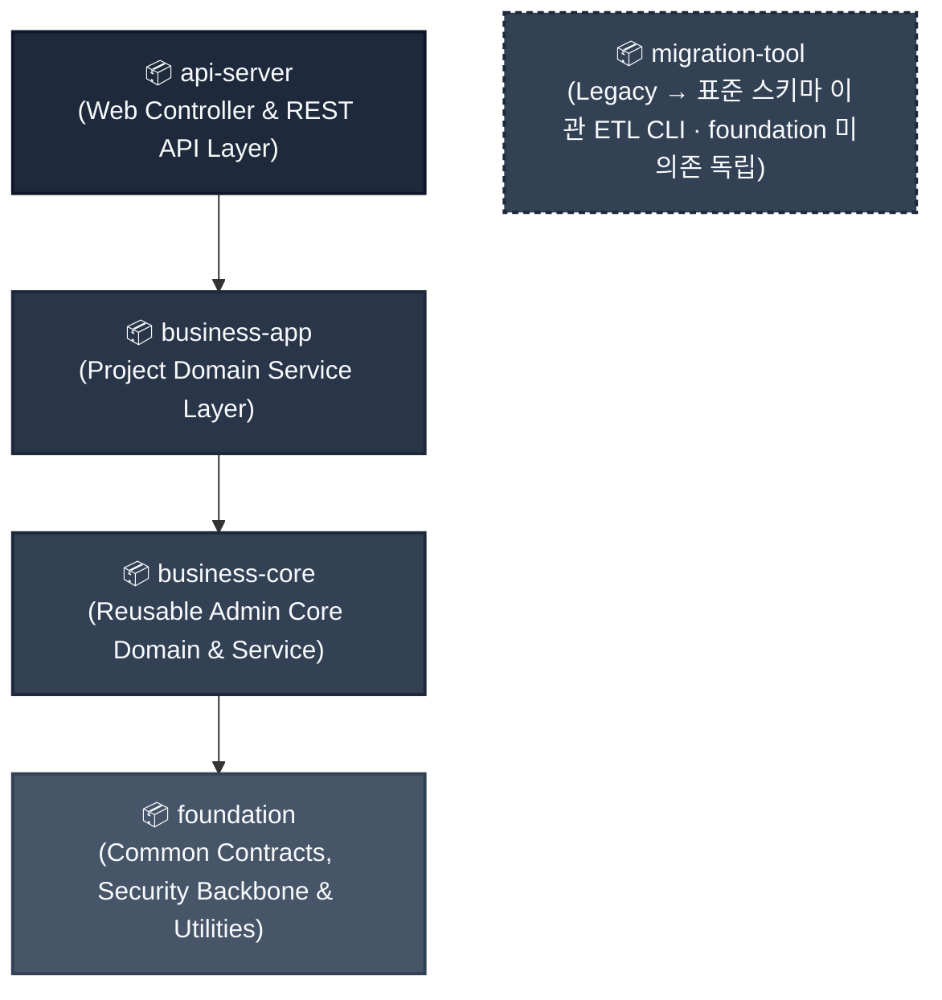
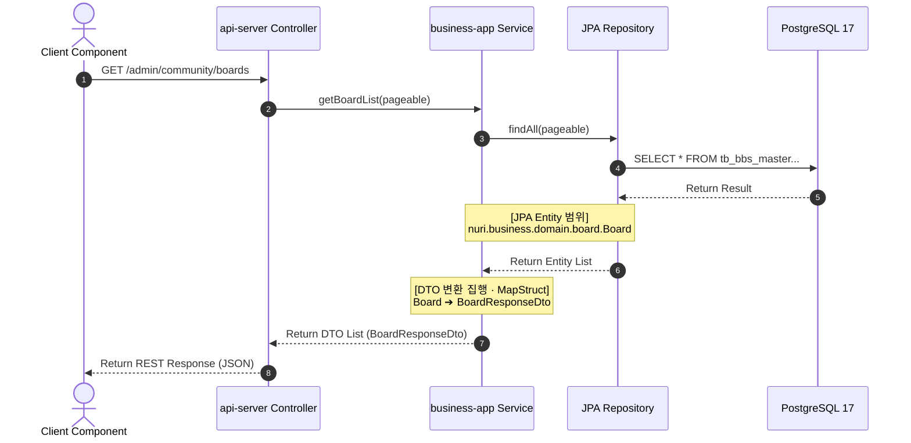

# Backend Architecture Blueprint

이 문서는 **eGov Enterprise v5** 백엔드의 현재 모듈 경계와 구현 관례를 설명하는 아키텍처 지도다. 규범은 [백엔드 API 및 아키텍처 헌법](../../.agent/knowledge/backend-api-constitution/artifacts/constitution.md), 실제 상태는 현재 코드와 빌드 설정이 우선하며 이 문서 자체는 별도의 SSOT가 아니다.

---

## 1. 멀티 모듈 아키텍처 & 단방향 의존성 흐름

eGov Enterprise 백엔드는 현재 wrapper 기준 **Gradle 9.6.1**의 계층형 멀티 모듈 구조(`foundation` ← `business-core` ← `business-app` ← `api-server`)로 격리되어 있으며, 상위 모듈이 하위 모듈을 참조하는 **엄격한 단방향 의존성(Strict Directed Acyclic Graph)**을 준수한다. 레거시 이관 CLI인 `migration-tool`은 이 계층에 의존하지 않는 독립 모듈로 분리되어 있다.



### 1.1 모듈별 격리 경계 및 책임 명세

| 모듈명 | 패키지 루트 | 핵심 책임 (Responsibility) | 허용 의존 모듈 |
|:---|:---|:---|:---|
| **api-server** | `nuri.api` | REST Controller, OpenAPI 명세 생성, 요청 검증, 예외 핸들링 | `business-app`, `business-core`, `foundation` |
| **business-app** | `nuri.business` | 프로젝트 고유 도메인 서비스(board·schedule·notification·informalsanction·memoreport·operation 등) | `business-core` |
| **business-core** | `nuri.business` | 재사용 admin 코어 도메인(user·auth·menu·code·organization·system·survey 등), 보안 유틸(`SecurityUtil`), 테스트 하네스 | `foundation` |
| **foundation** | `nuri.foundation` | 공통 계약(`ApiResponse`·`PageResponse`·`ErrorCode`·`GlobalExceptionHandler`), 글로벌 공통 Entity(`BaseEntity`/`BaseTimeEntity`), 보안 백본(JWT/IAM/filter), `DashboardItemProvider` 포트, auto-configuration | 없음 (독립 모듈) |
| **migration-tool** | `nuri.migration` | 레거시→표준 스키마 이관 ETL CLI(mapping.yml DSL·SourceIntrospector·EtlExecutor·MigrationVerifier) | 없음 (foundation 미의존 독립) |

> [!WARNING]
> **순환 의존성과 역참조 차단**
> `api-server`는 `business-app`/`business-core`의 공개 service·port를 통해 도메인 로직에 접근하고, 공통 계약(`ApiResponse`·`ErrorCode`·`PageResponse`)은 `foundation`에서 취한다. port/interface와 event를 우선하지만 현재 `business-app` 안에는 구체 서비스 주입과 타 도메인 repository 참조가 일부 남아 있다. `DomainIsolationTest`·`ServiceLayerIsolationTest`가 검사하는 정확한 금지 방향과 예외 범위를 넘어 “모든 결합이 인터페이스화됐다”고 주장하지 않는다.

---

## 2. 영속성 데이터 레이어 격리 (Entity 가두기)

백엔드 헌법 제3조에 의거하여, **JPA Entity 객체는 영속성 레이어(`business-core`/`business-app` 내부)에 완전히 갇혀 있어야 하며, API 프레젠테이션 레이어로 직접 흘러가서는 안 된다.**



### 2.1 레이어 간 격리 규칙

1. **JPA Entity 은닉**: 
   - `nuri.business.domain.*` 패키지에 위치한 모든 JPA Entity 클래스는 Controller의 메서드 파라미터나 반환 타입으로 절대 사용할 수 없다.
   - 외부 JSON 계약은 전용 DTO(`BoardRequestDto`, `BoardResponseDto`)를 목표로 한다. 다만 현재 일부 dashboard·menu·health·satisfaction 응답에는 `Map` generic이 남아 있고 file download는 `Resource`를 반환한다. Entity 직접 노출 금지와 “모든 응답이 이미 전용 DTO”라는 주장을 구분하며, 예외는 [활성 gap](../../.agent/memory/known-gaps.md)에서 추적한다.
   - DTO는 불변성과 가독성을 위해 Java **Record** 클래스 사용을 권장한다. [백엔드 헌법 제12조]
2. **DTO 매퍼(Mapper) 적용**:
   - Entity ➔ DTO 변환은 서비스 레이어의 종결 시점(Service Method return 직전)에 수행한다.
   - 엔티티↔DTO 매핑 표준은 **`MapStruct`**(`@Mapper(componentModel = "spring")`)이며, 매퍼 대부분이 컴파일타임 `@Mapper`로 생성된다. 복잡하거나 외부 호출을 수반하는 일부 DTO에 한해 수동 static `from()` 메서드를 점진적으로 보존한다.
3. **도메인 캡슐화 원칙**:
   - 비즈니스 규칙과 상태 전이 로직은 Entity 내부 메서드에 캡슐화하여 도메인 모델의 자율성을 보장한다. Service는 트랜잭션 경계 관리와 흐름 제어에 집중한다. [백엔드 헌법 제5조]
4. **N+1 쿼리 방어**:
   - 일괄 조회 API는 반드시 **Fetch Join** 또는 **DTO Projection**을 사용하여 JPA Lazy Loading에 의한 N+1 쿼리 폭증을 차단한다. [백엔드 헌법 제14조]

---

## 3. PostgreSQL 트랜잭션 전파 및 격리 전략

현재 런타임과 실 PostgreSQL 계약 테스트의 기준은 **PostgreSQL 17**이다. 배포 사업자나 특정 클라우드는 이 아키텍처의 고정 전제가 아니며, 접속 대상은 외부화된 datasource 설정으로 결정한다.

### 3.1 읽기 전용 트랜잭션 디폴트 전술
- 조회 서비스 경계는 `@Transactional(readOnly = true)`를 기본으로 삼아 쓰기 의도가 없음을 명시하고, JPA 공급자의 flush·dirty-checking 최적화가 적용될 수 있게 한다.
- 이 표시는 **읽기 복제본 라우팅을 보장하지 않는다.** 현재 저장소에는 read/write datasource routing 설정이 없으므로 모든 트랜잭션은 구성된 datasource를 사용한다. 복제본 분산이 필요하면 별도 라우팅 구성과 통합 테스트를 먼저 추가해야 한다.

```java
package nuri.business.service;

import org.springframework.stereotype.Service;
import org.springframework.transaction.annotation.Transactional;

@Service
@Transactional(readOnly = true) // 모듈 내 모든 메서드 기본 읽기전용 설정
public class BoardService {

    // 조회는 클래스 레벨의 설정을 그대로 상속받음
    public BoardResponseDto getBoard(String bbsId) {
        ...
    }

    // 쓰기 작업이 일어나는 경우에만 명시적으로 쓰기 전용 트랜잭션 선언
    @Transactional
    public BoardResponseDto createBoard(BoardRequestDto request) {
        ...
    }
}
```

### 3.2 격리 수준 및 쓰기 전용 격리
- 트랜잭션 격리 수준은 PostgreSQL의 디폴트인 `READ_COMMITTED`를 표준으로 한다.
- 낙관적 락(Optimistic Lock)이 필요한 경우, 해당 엔티티에 `@Version` 컬럼을 명시하고 동시 갱신 테스트로 충돌 처리를 검증한다. `BaseEntity`는 감사 필드만 제공하며 `@Version`을 자동 제공하지 않는다.

## 4. 테스트 가능한 아키텍처 (Testable Architecture) & 예외 처리

백엔드 헌법 제16조에 따라, eGov Enterprise 백엔드 코드는 테스트 가능한 경계로 작성하고 커버리지·뮤테이션 테스트를 결함 탐지 신호로 사용한다. 이 지표는 테스트 강도를 보조하지만 시스템 무결성 전체를 증명하지는 않는다.

### 4.1 Mutation Score 강제 및 커버리지
- 단위 테스트 및 통합 테스트 작성 시, 코드의 논리적 허점을 파고드는 **Mutation Testing (의도적 버그 주입)**을 통과해야 한다.
- CI의 `mutation-scope` 매트릭스는 각 스코프에 `STRICT_MUTATION=true`를 주입하여 최소 **Mutation Score 75%**를 하드 게이트한다. 전체 결론은 required check인 `mutation-test`가 집계하므로 어느 한 스코프라도 미달하면 병합이 차단된다. 로컬 PIT는 환경변수 미설정 시 `mutationThreshold=0`의 리포트 전용이다.
- 상세: [PITest 연동](pitest-mutation-testing.md) · 테스트 전략: [testing-guide.md](../03-guides/testing-guide.md)

### 4.2 글로벌 예외 처리 (Global Exception Handling)
- 컨트롤러 내에서 `try-catch` 블록 사용을 지양하고, 대신 `@RestControllerAdvice` 기반의 `GlobalExceptionHandler`에 에러 처리를 위임한다. [백엔드 헌법 제7조]
- 비즈니스·검증 예외는 `GlobalExceptionHandler`가 `ApiResponse.error(...)`로 변환한다. 오류 envelope는 `success`, 실제 HTTP 상태와 맞춘 `status`, `code`, `message`, `data`, `timestamp`를 가지며 검증 실패에는 선택적으로 `errors`가 추가된다.

### 4.3 API 응답 래퍼 표준 (ApiResponse)
- 모든 정상 응답은 전사 공통 래퍼 클래스인 `ApiResponse<T>`를 통해 반환한다. 컨트롤러에서 Entity나 DTO를 직접 반환하지 않고 반드시 `ApiResponse.success(data)` 형태로 감싸야 한다. [백엔드 헌법 제6조]

### 4.4 Validation 연쇄 동기화 (DB ➔ BE ➔ FE)
- DTO의 유효성 검증 규칙(`@Size`, `@NotNull` 등)은 DB 물리 제약조건과 100% 동일하게 연쇄 동기화되어야 한다. [백엔드 헌법 제16조]
- **동기화 파이프라인**: `PostgreSQL 물리 스키마` ➔ `Spring Boot DTO Validation` ➔ `Next.js Zod Schema`

---

## 5. Security Context 및 SecurityUtil 기반 인증 위상

백엔드 헌법 제8조에 의거하여, API 컨트롤러 호출 시 **Spring Security Filter Chain**에 의해 검증된 JWT 토큰은 `ThreadLocal` 기반의 SecurityContextHolder에 적재되며, 모든 비즈니스 인가는 이를 기반으로 재검증된다.
- **Java 21 Virtual Threads 연계**: 비동기 루프나 가상 스레드(`Virtual Threads`) 풀을 자율 기동할 경우 기본 `ThreadLocal`은 컨텍스트가 상속되지 않는다. 비동기 스레드로 SecurityContext를 전파해야 할 시 반드시 Spring Security가 지원하는 `DelegatingSecurityContextExecutorService` 등의 래퍼를 활용해 위임(Context Propagation) 처리해야 한다.

📦 **패키지 경로**: `nuri.business.security.util.SecurityUtil` (business-core)

### 5.1 SecurityUtil을 통한 보안 검증 사용 예시

컨트롤러에서 인가를 넘겨받더라도, 비즈니스 레이어의 안전을 보호하기 위해 서비스 메서드 내부에서 아래와 같이 **이중 권한 재검증(Defence in Depth)**을 상시 기동해야 한다.

```java
package nuri.business.service;

import nuri.business.security.util.SecurityUtil;
import org.springframework.security.access.AccessDeniedException;
import org.springframework.stereotype.Service;
import org.springframework.transaction.annotation.Transactional;

@Service
public class DocumentService {

    @Transactional
    public void deleteDocument(String docId) {
        // 1. 소유권/IDOR 가드는 loginId 축으로 재검증한다.
        //    (간결형: SecurityUtil.assertOwnerOrAdmin(doc.getRegisterId()) 한 줄로 대체 가능)
        String currentLoginId = SecurityUtil.getCurrentLoginId()
            .orElseThrow(() -> new AccessDeniedException("비인증 사용자는 요청을 수행할 수 없습니다."));

        // 2. 관리자 권한 여부 추출
        boolean isAdmin = SecurityUtil.hasRole("ROLE_ADMIN");

        // 3. 비즈니스 이중 검증 집행 (소유주를 registerId=loginId 로 저장한 도메인)
        DocumentEntity doc = repo.findById(docId).orElseThrow();
        if (!doc.getRegisterId().equals(currentLoginId) && !isAdmin) {
            throw new AccessDeniedException("본인의 문서만 삭제할 권한이 있습니다.");
        }
        // ※ 소유주를 esntlId 로 저장하는 도메인(Board.userId 등)에서만 SecurityUtil.getCurrentEsntlId() 를 사용한다.
        //   (SecurityUtil.getCurrentUserId() 는 @Deprecated — esntlId 를 반환하며 IdentityAxisLinterTest 가 프로덕션 호출 0 을 강제)

        repo.delete(doc);
    }
}
```

---

## 6. 외부 연동 및 회복탄력성 (Resilience)

타 기관 연동이나 외부 API 호출 시, 예측 불가능한 지연(Latency)이 우리 시스템 전체의 스레드(Thread) 고갈로 이어지는 것을 방어해야 한다. [백엔드 헌법 제10조]

### 6.1 타임아웃 격리 (Timeout Bulkhead)
- 외부 클라이언트(`RestTemplate`/`WebClient`/`FeignClient`)의 읽기 타임아웃(Read Timeout)은 연동 유형별로 차등 적용한다 — 실시간 OLTP 동기 연동: 최대 3초(Fail-Fast) / 외부 결제·인증 트랜잭션(PG 등): 최대 10초 / 비동기·배치·대용량 파일 연동: 전용 스레드 풀로 격리 후 비즈니스 요건에 맞춰 타임아웃 상향.

### 6.2 재시도 및 서킷 브레이커
- 일시적 네트워크 장애는 멱등성이 확인된 경로에 한해 제한적으로 재시도한다. 현재 Spring Retry 적용은 메일·SMS 비동기 처리 등 개별 경로이며, 서킷 브레이커는 전역 구현이 아니므로 필요한 연동에서 별도 설계·검증한다. 상세 판단 순서는 [domain-resilience.md](domain-resilience.md)를 따른다.

---
*Verified against current module/build structure: 2026-08-19*
*Governed by: Backend API Governance Constitution (18 Articles)*
