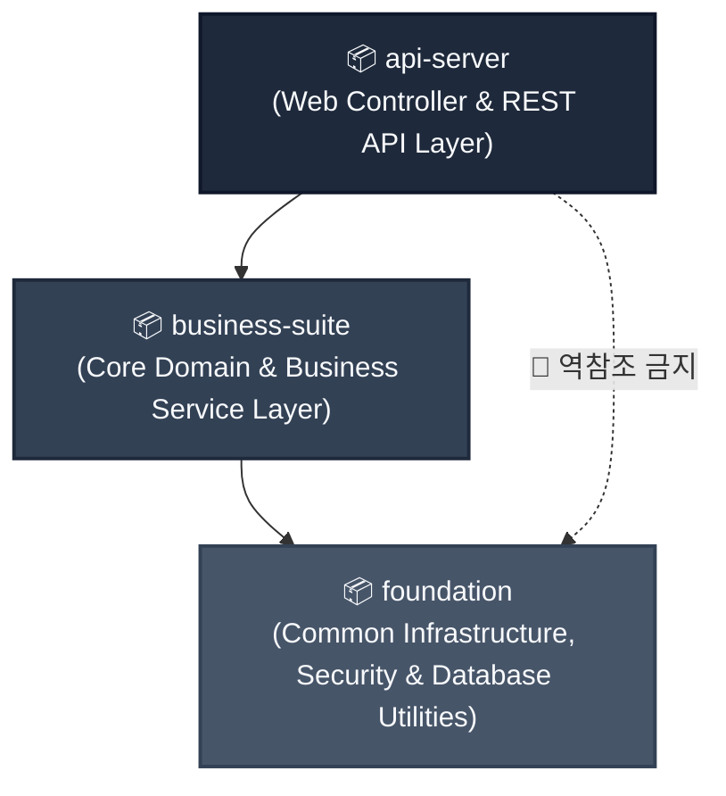
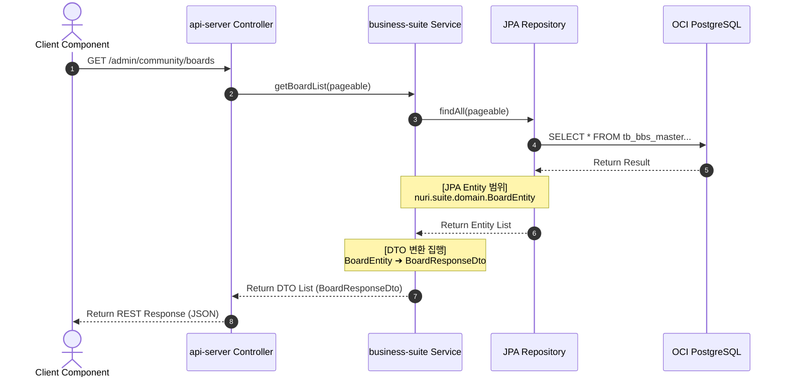

# Backend Architecture Blueprint

본 설계서는 **eGov Enterprise v5** 백엔드 플랫폼의 아키텍처적 무결성을 준수하기 위한 공식 엔지니어링 설계서이다. 본 아키텍처는 **백엔드 API 및 아키텍처 헌법 (18조)**의 규범에 의해 전적으로 통제되며, 에이전트와 인간 개발자 모두에게 단일 참조점(SSOT) 역할을 수행한다.

---

## 1. 멀티 모듈 아키텍처 & 단방향 의존성 흐름

eGov Enterprise 백엔드는 **Gradle 9.4.1** 기반의 고유한 3계층 멀티 모듈 구조로 격리되어 있으며, 상위 모듈이 하위 모듈을 참조하는 **엄격한 단방향 의존성(Strict Directed Acyclic Graph)**을 준수한다.



### 1.1 모듈별 격리 경계 및 책임 명세

| 모듈명 | 패키지 루트 | 핵심 책임 (Responsibility) | 허용 의존 모듈 |
|:---|:---|:---|:---|
| **api-server** | `nuri.server` | REST Controller, OpenAPI 명세 생성, 요청 검증, 예외 핸들링 | `business-suite` |
| **business-suite** | `nuri.suite` | Domain Service, 엔티티 비즈니스 로직, DTO 변환 및 매핑, 데이터 엑세스(Repository) | `foundation` |
| **foundation** | `nuri.foundation` | 공통 유틸리티(Security, ID 발급), 글로벌 공통 Entity(`BaseEntity`), 캐시/로깅 설정 | 없음 (독립 모듈) |

> [!WARNING]
> **순환 의존성 및 역참조 철저 차단**
> `api-server`는 `foundation` 모듈의 내부 구현체를 직접 참조해서는 안 되며, 반드시 `business-suite`가 제공하는 도메인 서비스 인터페이스를 거쳐 연동되어야 한다. 이를 위반할 시 빌드 시점에 차단된다.

---

## 2. 영속성 데이터 레이어 격리 (Entity 가두기)

백엔드 헌법 제3조에 의거하여, **JPA Entity 객체는 영속성 레이어(`business-suite` 내부)에 완전히 갇혀 있어야 하며, API 프레젠테이션 레이어로 직접 흘러가서는 안 된다.**



### 2.1 레이어 간 격리 규칙

1. **JPA Entity 은닉**: 
   - `nuri.suite.domain.*` 패키지에 위치한 모든 JPA Entity 클래스는 Controller의 메서드 파라미터나 반환 타입으로 절대 사용할 수 없다.
   - 프론트엔드로 나가는 모든 데이터와 컨트롤러로 들어오는 모든 요청은 전용 DTO(`BoardRequestDto`, `BoardResponseDto`) 클래스로 100% 매핑하여 처리한다.
   - DTO는 불변성과 가독성을 위해 Java **Record** 클래스 사용을 권장한다. [백엔드 헌법 제12조]
2. **DTO 매퍼(Mapper) 적용**:
   - Entity ➔ DTO 변환은 서비스 레이어의 종결 시점(Service Method return 직전)에 수행한다.
   - 복잡한 매핑 연산 시 가독성을 높이기 위해 `MapStruct` 라이브러리 사용을 적극 권장하며, 수동 매핑 시 static `from()` 메서드를 정의한다.
3. **도메인 캡슐화 원칙**:
   - 비즈니스 규칙과 상태 전이 로직은 Entity 내부 메서드에 캡슐화하여 도메인 모델의 자율성을 보장한다. Service는 트랜잭션 경계 관리와 흐름 제어에 집중한다. [백엔드 헌법 제5조]
4. **N+1 쿼리 방어**:
   - 일괄 조회 API는 반드시 **Fetch Join** 또는 **DTO Projection**을 사용하여 JPA Lazy Loading에 의한 N+1 쿼리 폭증을 차단한다. [백엔드 헌법 제14조]

---

## 3. OCI PostgreSQL 트랜잭션 전파 및 격리 전략

성공적으로 표준화된 **OCI PostgreSQL 17** 데이터베이스와의 트랜잭션 정합성 및 동시성 제어를 위해 아래의 엄격한 트랜잭션 제어 가이드라인을 준수한다.

### 3.1 읽기 전용 트랜잭션 디폴트 전술
- 모든 조회용 서비스 메서드에는 `@Transactional(readOnly = true)` 어노테이션을 의무 적용한다.
- 이는 JPA의 영속성 컨텍스트 플러시(Flush) 모드를 `MANUAL`로 작동시켜 불필요한 더티 체킹(Dirty Checking) 부하를 방지하고 OCI DB 복제(Replica) 노드로 조회를 분산시킬 수 있는 기반이 된다.

```java
package nuri.suite.service;

import org.springframework.stereotype.Service;
import org.springframework.transaction.annotation.Transactional;

@Service
@Transactional(readOnly = true) // 모듈 내 모든 메서드 기본 읽기전용 설정
public class BoardService {

    // 조회는 클래스 레벨의 설정을 그대로 상속받음
    public BoardResponseDto getBoard(String bbsId) {
        ...
    }

    // 쓰기 작업이 일어나는 경우에만 명시적으로 쓰기 전용 트랜잭션 선언
    @Transactional
    public BoardResponseDto createBoard(BoardRequestDto request) {
        ...
    }
}
```

### 3.2 격리 수준 및 쓰기 전용 격리
- 트랜잭션 격리 수준은 PostgreSQL의 디폴트인 `READ_COMMITTED`를 표준으로 한다.
- 낙관적 락(Optimistic Lock)이 필요한 경우, `BaseEntity`에 포함된 `@Version` 컬럼을 활용해 데이터의 정합성을 수리적으로 보장한다.

## 4. 테스트 가능한 아키텍처 (Testable Architecture) & 예외 처리

백엔드 헌법 제16조에 따라, eGov Enterprise 백엔드 코드는 본질적으로 테스트 가능한 형태(Testable)로 작성되어야 하며, 무결성을 수학적으로 증명해야 한다.

### 4.1 Mutation Score 강제 및 커버리지
- 단위 테스트 및 통합 테스트 작성 시, 코드의 논리적 허점을 파고드는 **Mutation Testing (의도적 버그 주입)**을 통과해야 한다.
- 빌드 파이프라인(`parse_jacoco.py`) 통과를 위한 최소 **Mutation Score는 85%**로 강제된다.

### 4.2 글로벌 예외 처리 (Global Exception Handling)
- 컨트롤러 내에서 `try-catch` 블록 사용을 지양하고, 대신 `@RestControllerAdvice` 기반의 `GlobalExceptionHandler`에 에러 처리를 위임한다. [백엔드 헌법 제7조]
- 모든 비즈니스 예외는 프론트엔드와 사전 합의된 표준 에러 포맷(`ErrorResponse` DTO - `code`, `message`, `timestamp` 포함)으로 직렬화되어 반환되어야 한다.

### 4.3 API 응답 래퍼 표준 (ApiResponse)
- 모든 정상 응답은 전사 공통 래퍼 클래스인 `ApiResponse<T>`를 통해 반환한다. 컨트롤러에서 Entity나 DTO를 직접 반환하지 않고 반드시 `ApiResponse.success(data)` 형태로 감싸야 한다. [백엔드 헌법 제6조]

### 4.4 Validation 연쇄 동기화 (DB ➔ BE ➔ FE)
- DTO의 유효성 검증 규칙(`@Size`, `@NotNull` 등)은 DB 물리 제약조건과 100% 동일하게 연쇄 동기화되어야 한다. [백엔드 헌법 제16조]
- **동기화 파이프라인**: `OCI DB (SSOT)` ➔ `Spring Boot DTO Validation` ➔ `Next.js Zod Schema`

---

## 5. Security Context 및 SecurityUtil 기반 인증 위상

백엔드 헌법 제8조에 의거하여, API 컨트롤러 호출 시 **Spring Security Filter Chain**에 의해 검증된 JWT 토큰은 `ThreadLocal` 기반의 SecurityContextHolder에 적재되며, 모든 비즈니스 인가는 이를 기반으로 재검증된다.
- **Java 21 Virtual Threads 연계**: 비동기 루프나 가상 스레드(`Virtual Threads`) 풀을 자율 기동할 경우 기본 `ThreadLocal`은 컨텍스트가 상속되지 않는다. 비동기 스레드로 SecurityContext를 전파해야 할 시 반드시 Spring Security가 지원하는 `DelegatingSecurityContextExecutorService` 등의 래퍼를 활용해 위임(Context Propagation) 처리해야 한다.

📦 **패키지 경로**: `nuri.foundation.security.util.SecurityUtil`

### 5.1 SecurityUtil을 통한 보안 검증 사용 예시

컨트롤러에서 인가를 넘겨받더라도, 비즈니스 레이어의 안전을 보호하기 위해 서비스 메서드 내부에서 아래와 같이 **이중 권한 재검증(Defence in Depth)**을 상시 기동해야 한다.

```java
package nuri.suite.service;

import nuri.foundation.security.util.SecurityUtil;
import org.springframework.security.access.AccessDeniedException;
import org.springframework.stereotype.Service;
import org.springframework.transaction.annotation.Transactional;

@Service
public class DocumentService {

    @Transactional
    public void deleteDocument(String docId) {
        // 1. ThreadLocal Context에서 현재 로그인된 사용자의 ID(Username) 추출
        String currentUserId = SecurityUtil.getCurrentUserId()
            .orElseThrow(() -> new AccessDeniedException("비인증 사용자는 요청을 수행할 수 없습니다."));

        // 2. 관리자 권한 여부 추출
        boolean isAdmin = SecurityUtil.hasRole("ROLE_ADMIN");

        // 3. 비즈니스 이중 검증 집행
        DocumentEntity doc = repo.findById(docId).orElseThrow();
        if (!doc.getRegisterId().equals(currentUserId) && !isAdmin) {
            throw new AccessDeniedException("본인의 문서만 삭제할 권한이 없습니다.");
        }

        repo.delete(doc);
    }
}
```

---

## 6. 외부 연동 및 회복탄력성 (Resilience)

타 기관 연동이나 외부 API 호출 시, 예측 불가능한 지연(Latency)이 우리 시스템 전체의 스레드(Thread) 고갈로 이어지는 것을 방어해야 한다. [백엔드 헌법 제10조]

### 6.1 타임아웃 격리 (Timeout Bulkhead)
- 모든 `RestTemplate`, `WebClient`, 또는 `FeignClient` 설정 시 반드시 **3초 이내의 읽기 타임아웃(Read Timeout)**을 의무 적용한다.

### 6.2 재시도 및 서킷 브레이커
- 일시적 네트워크 장애로 인한 실패는 `@Retryable`을 활용해 방어하며, 장애가 지속될 경우 `Resilience4j` 등의 서킷 브레이커를 통해 외부 호출을 즉시 차단(Fail-Fast)하여 시스템을 보호한다.

---
*Last Updated: 2026-05-19 (Backend Layered Architecture & Security Context Hardening Reference Added)*
*Governed by: Backend API Governance Constitution (18 Articles)*
