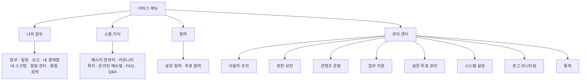

# ADR-0017: 과업 중심 메뉴 재편과 중복 진입점 통합

- 상태: Accepted
- 결정일: 2026-09-11
- 승인 근거: 사용자가 전체 메뉴 이동·추가·병합안을 먼저 요청하고 제시된 안에 “진행해줘”로 승인했다.
- 범위: 현재 전체 제품의 메뉴·NAVIGATION 배정·화면 탐색·초기화 경로와 OCI 적용. 기능 권한, 사용자 그룹 배정, 객체 소유권 규칙은 유지한다.
- 관계: [ADR-0007](ADR-0007-reference-default-ia-approval.md)의 참조 기본 IA를 현재 제품에 구체화한다. 기관별 사용자 연구·접근성 검증과 전체 route disposition의 일괄 승인을 의미하지 않는다.

## 결정과 구조

업무를 수행하는 메뉴와 운영자가 관리하는 메뉴를 구분하고, 실제 기능의 정본 진입점은 하나만 둔다. 기존 메뉴 식별자와 구현 URL을 최대한 유지하며, 공통 화면이라도 업무가 다른 탭은 유지한다.

| 분류 | 배치하는 기능 |
|---|---|
| 나의 업무 | 업무 관리, 일정, 업무 보고, 내 결재함, 내 스크랩, 알림 센터, 통합 검색 |
| 소통·지식 → 메시지·연락처 | 문자, 메일 발송, 메일 발송 이력, 업무 쪽지함, 주소록 |
| 소통·지식 | 커뮤니티, 위키, 온라인 매뉴얼, FAQ, Q&A는 각각 독립 진입점 유지 |
| 참여 | 설문 참여, 투표 참여 |
| 관리 센터 → 사용자·조직 | 사용자, 부서, 사용자 분류 그룹, 부재 상태 관리 |
| 관리 센터 → 권한·보안 | 권한 그룹 관리, 부서별 그룹 배정, 그룹별 메뉴 현황, 로그인 정책, 개인정보처리방침·이용약관 |
| 관리 센터 → 콘텐츠 운영 | 게시판 마스터, 템플릿, 댓글, 도움말 |
| 관리 센터 → 업무 지원 | 행사 외부인사 관리, 포상 기록 관리, 행사 관리, 메모 보고 |
| 관리 센터 → 설문·투표 관리 | 설문 관리 진입점과 통계·템플릿·질문·투표 관리 |
| 관리 센터 → 시스템 설정 | 코드, 메뉴, 프로그램, 배너 |
| 관리 센터 → 로그·모니터링 | 기존 9개 로그·모니터링 진입점 유지 |
| 관리 센터 → 통계 | 기존 5개 통계 진입점 유지 |

숨김 5개(결재 양식, 마이페이지, 설문 응답자·항목, 워크플로)는 숨김으로 유지한다. 브라우저 내부 미리보기인 화면 구성 기능은 **화면 구성 예제**로 이름을 명확히 하고 메뉴에서 숨긴다. 직접 URL의 기능 접근은 별도 페이지/API 인가가 계속 판정한다.

## 삭제·이동·호환성의 정확한 범위

| 제거하는 메뉴 ID | 정본 메뉴 ID | 결과 |
|---|---|---|
| `9020220` 롤관리 | `9020311` | 권한 그룹 관리로 통합. 구 롤 URL의 리다이렉트 유지 |
| `9040200` 발송메일내역 | `1020300` | 메일 발송 이력으로 통합 |
| `9030800` 비공식결재 | `1050100` | 내 결재함으로 통합. `/admin/system/ism` 호환 리다이렉트 유지 |
| `9040400` 보안 감사 타임라인 | `9040320` | 시스템 감사 로그 정본으로 통합. 구 감사 URL 호환 유지 |

자녀 이동 후 빈 분류 `1030000`, `1050000`, `1060000`, `2020000`, `9030100`을 제거한다. 새 **참여**, **통계** 분류 2개는 기존 `menu_sn` IDENTITY를 사용한다. 전체 메뉴 84→77, 활성 메뉴 79→71, 최상위 3→4, 최대 깊이 4→3이 승인된 이행 목표다. 행별 부모·순서의 실행 원본은 [V2_100](../../../api-server/src/main/resources/db/migration/V2_100__reorganize_menu_information_architecture.sql)이다.

`9010220`은 실제 읽기 전용 기능이므로 **그룹별 메뉴 현황**으로 유지한다. 사용자 분류 그룹은 권한 그룹과 다른 기능이다. `9020130`은 기능 없는 바로가기 허브 대신 `/admin/system/policies`로 연결한다. 순수 분류는 경로와 프로그램 연결을 모두 비워 기동 시 경로가 다시 생성되지 않게 한다. **나의 업무**, **설문·투표 관리**는 실제 허브 기능이 있으므로 클릭 가능한 부모 메뉴로 유지한다.

## 권한과 탐색의 계약

메뉴 이동 시 기존에 보이던 실제 기능 목적지를 보존한다. 이동한 자식에 필요한 조상 NAVIGATION만 추가하고, 제거한 중복 메뉴의 권한은 정본으로 옮긴다. 예를 들어 USER의 설문 메뉴가 관리 센터로 옮겨지면 그 조상을 표시하지만 다른 관리 메뉴나 OPERATION 권한을 부여하지 않는다. ADMIN을 포함해 그룹 이름만으로 메뉴를 자동 허용하지 않는다.

현재 메뉴 선택은 [공통 matcher](../../../frontend/src/lib/navigation/active-menu.ts)가 재귀적으로 판정하고 상단·좌측·breadcrumb가 같은 결과를 사용한다. 정확한 게시판 식별자와 의미 있는 query를 구별하며, 한 위치에서 정본 항목 하나만 현재 페이지가 된다. 순수 상위 분류는 영역을 펼치는 버튼이고 실제 route가 있는 상위만 링크다. 메뉴 숨김은 기능 인가를 대신하지 않는다.

## 이행·검증·실패 처리

운영 DB는 V2_99와 명시적 권한 Contract 완료 상태에서 V2_100을 실행한다. 새 격리 DB는 **V2_99까지 → 기존 Contract 리허설 → V2_100 이후** 순서로 초기화한다. 운영 기동에 Contract 자동 실행을 추가하지 않는다. 축약 재사용 base는 전체 제품 트리를 복제하지 않고 관리 센터 아래 실제 기반 기능과 그룹별 메뉴 현황을 유지한다.

SQL은 승인한 입력 메뉴 집합, 참조, 계층과 기존 Contract 증거를 검증한다. 같은 트랜잭션에서 메뉴와 NAVIGATION 변경·감사를 적용하고, 그룹 조합별 실제 목적지 동등성과 OPERATION·사용자 배정·기존 감사 원문 불변을 확인한다. 잠금을 얻지 못하거나 입력이 달라지면 실패하며 추측으로 덮어쓰지 않는다. PostgreSQL 시퀀스의 번호 소모는 롤백되지 않을 수 있다.

검증 대상은 실제 PostgreSQL의 이행 성공·위반 시 전체 롤백, 신규 설치·base 초기화, 메뉴 현재 위치·중복 선택·탭 구별, 실제 브라우저의 그룹 메뉴 표시와 기능 인가다. OCI 적용 완료 여부는 승인이나 코드 존재로 대신하지 않고 [전환 런북](../../04-operations/authorization-cutover-runbook.md)의 실행 결과로 확인한다. 실패 복구는 원자적 롤백 후 원인 수정이며, 이미 완료한 권한 모델을 구 방식으로 되돌리지 않는다.
