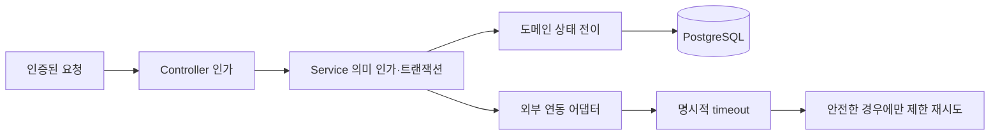

# 도메인 보안 및 회복탄력성

> **규범**: [백엔드 API 및 아키텍처 헌법](../../.agent/knowledge/backend-api-constitution/artifacts/constitution.md)이 우선한다. 이 문서는 현재 구현 지점과 새 외부 연동을 설계할 때의 판단 순서를 설명한다.

## 현재 제어 흐름

컨트롤러 애노테이션은 첫 경계일 뿐이다. 서비스는 owner-only, owner-or-admin, admin-only 등 해당 도메인의 의미를 다시 판정해야 하며, 헬퍼 통일을 이유로 권한 범위를 넓히지 않는다. 감사·소유권 식별자 축은 [사용자 참조 키 규약](user-reference-key-policy.md)을 따른다.

## 현재 구현된 공통 기반

| 관심사 | 현재 구현 | 적용 경계 |
|---|---|---|
| 인증·서비스 인가 | `SecurityUtil`과 서비스별 의미 가드 | 모든 보호된 변경 작업 |
| 생성·수정 감사 | `BaseTimeEntity`의 `crtDt`/`mdfcnDt`, `BaseEntity`의 `frstRgtrId`/`lastMdfrId` | 해당 기반 클래스를 상속하는 엔티티 |
| 낙관적 잠금 | `@Version`을 명시한 엔티티 | 현재 `Board`, `InformalSanction` 등 선택 적용; 기반 클래스가 자동 제공하지 않음 |
| 제한 재시도 | Spring Retry를 사용하는 `MailAsyncProcessor`, `SmsAsyncProcessor` | 멱등성·중복 효과를 검토한 비동기 발송 경로 |
| 비동기 격리 | 전용 executor와 task decorator | 비동기 작업; 보안·MDC·테스트 컨텍스트 전파를 별도 검증 |

`Resilience4j` 서킷 브레이커, 분산 락, 범용 요청 멱등키는 전역 기반으로 구현되어 있지 않다. 향후 목표를 현재 강제 규칙처럼 서술하거나, 라이브러리 이름만으로 보호가 적용됐다고 판단하지 않는다.

## 외부 연동 설계 순서

1. 호출의 최대 허용 지연과 실패 의미를 정하고 connect/read/overall timeout을 명시한다.
2. 작업이 재시도 안전한지 판단한다. 생성·결제·발송처럼 중복 효과가 있는 작업은 멱등키나 공급자 idempotency 계약 없이 자동 재시도하지 않는다.
3. 재시도 횟수·backoff·대상 예외를 제한한다. 인증·검증 실패 같은 영구 오류는 재시도하지 않는다.
4. 장애가 스레드·커넥션 풀을 고갈시킬 수 있으면 bulkhead나 circuit breaker를 별도 설계한다.
5. 성공률, 지연, 재시도, 최종 실패를 관측 가능하게 만들고 정상·지연·타임아웃·부분 실패 테스트를 둔다.

## 동시성과 데이터 무결성

- 상태 전이는 엔티티 또는 서비스의 한 경계에서 검증하고 트랜잭션 안에서 갱신한다.
- 충돌 가능성이 있고 재시도 가능한 편집에는 낙관적 잠금을 우선 검토한다. 재고·금전처럼 직렬화가 필요한 경우에는 실제 경합과 DB 쿼리를 근거로 비관적 잠금 또는 별도 조정 방식을 선택한다.
- 생성 ID는 표준 PK 전략과 `IdGenerationUtil`을 따른다. 시간값이나 `MAX + 1`을 고유성 근거로 사용하지 않는다.
- 감사 기반 클래스는 변경 시각과 행위자를 기록할 뿐, 중요한 비즈니스 상태 변경의 별도 이력 요구를 자동 충족하지 않는다.

## 검증

- 서비스 인가 테스트는 허용 사례뿐 아니라 다른 소유자·일반 사용자·위조된 역할의 거부 사례를 포함한다.
- 재시도 테스트는 성공 횟수만 세지 말고 중복 부작용과 최종 실패를 확인한다.
- 잠금 전략은 동시 요청 테스트로 lost update 또는 중복 처리가 실제로 차단되는지 확인한다.
- 외부 시스템이 없는 검증은 정적 범위로 보고하고 런타임 회복탄력성까지 확인한 것으로 표현하지 않는다.

---
*Verified against current retry, audit, and optimistic-lock implementations: 2026-08-19*
