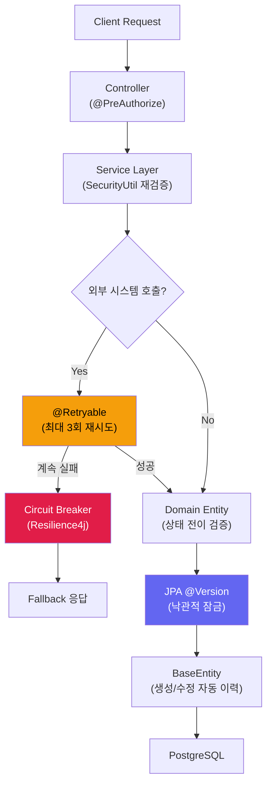

# 도메인 보안 및 회복탄력성 가이드 (Domain Security & Resilience)

> **상위 헌법**: 본 아키텍처는 [백엔드 API 및 아키텍처 헌법](../../.agent/knowledge/backend-api-constitution/artifacts/constitution.md) (18조)의 논리적 지배를 받는다.

본 프로젝트는 엔터프라이즈급 안정성을 위해 다음의 도메인 가드레일을 준수한다.

## 🗺️ 회복탄력성 제어 흐름 (Resilience Control Flow)

## 1. 서비스 레이어 권한 재검증 (Double-Check Security)
- 컨트롤러의 권한 체크(`@PreAuthorize`)와 별개로, 서비스 레이어에서 `SecurityUtil`을 사용하여 리소스 소유자 또는 관리자 권한을 명시적으로 재검증한다.
- 특히 개인정보 수정, 비밀번호 변경, 결재 승인 등 민감한 작업에 필수 적용한다.
- 📦 `nuri.business.security.util.SecurityUtil`

## 2. 상태 전이 유효성 검사 (Deterministic State Transition)
- 도메인 엔티티 내에 상태 전이 로직을 캡슐화하거나, 서비스 레이어에서 현재 상태를 체크하여 유효하지 않은 비즈니스 흐름(예: 이미 처리된 결재의 재수정)을 차단한다.

## 3. 비동기 작업의 회복탄력성 (Async Resilience)
- 외부 시스템(SMTP, SMS Gateway) 연동 시 반드시 `@Retryable`을 사용하여 일시적 장애에 대응한다.
- `@Retryable` 사용 시 self-invocation 문제를 방지하기 위해 반드시 self-injection(Lazy Autowired) 패턴을 사용한다.

## 4. 안전한 ID 생성 전략
- 고부하 상황에서의 충돌을 방지하기 위해 `System.currentTimeMillis()` 대신 `IdGenerationUtil`의 UUID 기반 ID 생성기를 사용한다.
- 📦 `nuri.foundation.core.util.IdGenerationUtil`

## 5. 동시성 제어 및 데이터 무결성 (Concurrency Control)
- 다중 사용자가 동시에 동일 리소스를 수정할 가능성이 있는 엔티티에는 JPA의 `@Version` 어노테이션을 사용하여 **낙관적 잠금(Optimistic Lock)**을 적용한다.
- 재고 차감, 결제 처리 등 정합성이 극도로 중요한 작업에는 필요에 따라 비관적 잠금(Pessimistic Lock) 또는 분산 락(Redis Lock) 사용을 검토한다.

## 6. 장애 전파 방지 (Circuit Breaker)
- 외부 API 호출 시 단순 `@Retryable`을 넘어, **Resilience4j** 등을 활용한 서킷 브레이커를 적용하여 외부 시스템의 장애가 내부 시스템으로 전파되는 것을 차단한다.
- 모든 외부 연동 작업에는 반드시 명시적인 **Connect/Read Timeout**을 설정한다.

## 7. 요청의 멱등성 보장 (Idempotency)
- 네트워크 재시도나 사용자의 중복 클릭으로 인해 동일 요청이 반복될 경우를 대비하여, 생성/처리 로직에 **Request ID** 또는 유니크 키를 활용한 멱등성 체크 로직을 포함한다.

## 8. 도메인 오디팅 (Audit & Traceability)
- 모든 도메인 엔티티의 생성/수정 이력은 `BaseTimeEntity` 및 `BaseEntity`를 상속받아 자동으로 기록되어야 하며, 중요한 상태 변경은 별도의 이력 테이블(Audit Table)에 보존한다.
- 📦 `nuri.business.domain.common.BaseTimeEntity`
- 📦 `nuri.business.domain.common.BaseEntity`

---
*Last Updated: 2026-05-19 (Mermaid Resilience Flow, Constitution Reference & Package Paths Added)*
