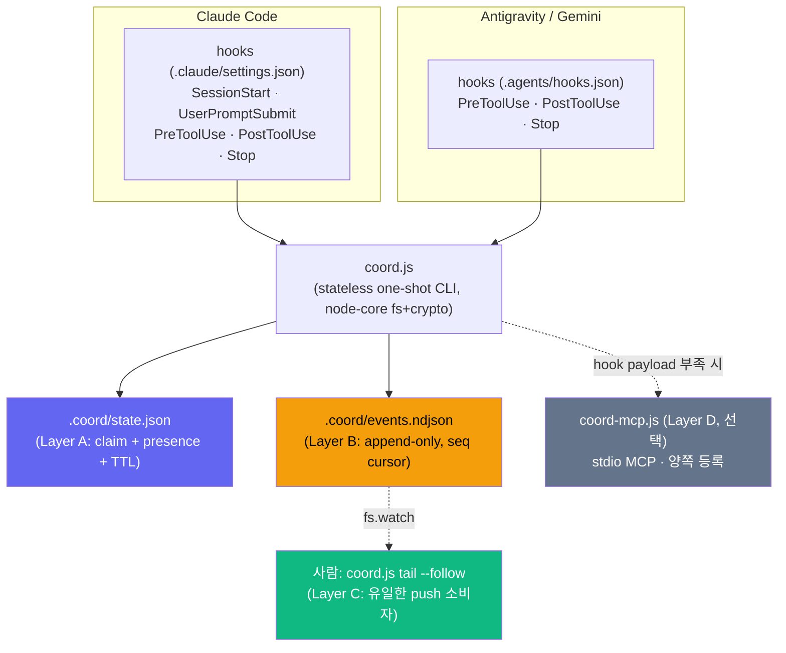

# 이중 Operator 실시간 조정 계층 설계 (Dual-Operator Real-Time Coordination)

> **상태**: 설계(Design) — 구현 보류. 본 문서는 구현 착수 전 리뷰·승인용 SSOT다.
> **적용 범위**: Antigravity(Gemini) ↔ Claude Code가 **동일 워킹트리를 공유**하는 이중 operator 환경([CLAUDE.md](../../CLAUDE.md) §4, [AGENTS.md](../../AGENTS.md)).
> **거버넌스**: 본 설계의 구현은 `.claude/settings.json`·`.agents/hooks.json`·`coord.js` 신설과 [CLAUDE.md](../../CLAUDE.md)/[GEMINI.md](../../GEMINI.md) 프로토콜 조항 추가를 수반하므로, 착수 전 [CLAUDE.md](../../CLAUDE.md) §5에 따른 **사용자 명시 승인**이 필요하다.

---

## 0. 문제 정의 (Problem Statement)

"Antigravity와 Claude Code가 **실시간으로 세션을 공유하며 동시에 협업**할 수 있는가?"

현재 조정(coordination)은 전적으로 **문서·관습 기반**이다. 런타임 조정 채널이 전혀 없다.

- **공유되는 것**: git 워킹트리 + `git commit --only -- <path>` 규율, `.gemini/tasks/*.md` append-only 저널(~150개, 사람이 읽는 체크박스), stateless `db-bridge.js`(Node+pg, one-shot).
- **없는 것**: MCP 설정(`.claude/` 비어 있음, `.mcp.json` 없음), lock/`.lock` 관습, file watcher, socket/named-pipe IPC, presence/status 레지스트리.

## 1. 불가침의 천장 (The Hard Ceiling)

> **두 독립 LLM operator는 인지(cognition)를 공유할 수 없다.**

각 operator는 **turn-based**다 — 자신이 tool을 호출하거나 파일을 읽는 **툴 경계(tool boundary)에서만** 세상을 관찰하며, 추론 중(mid-inference)에는 어떤 것도 push로 밀어넣을 수 없다.

따라서 "실시간 세션 공유"의 물리적 최대치는 다음과 같다:

```
실현 가능 = 툴 경계에서의 이벤트 기반 pull (hook으로 강제)
          + 충돌 회피 (advisory lock / presence)
실현 불가 = 컨텍스트 윈도우 병합, 추론 중 push, 라이브 공유 인지
```

- **관측 지연(observation latency)** = "상대가 다음 hook을 쏘는 시점". 긴 추론 스트레치나 몇 분짜리 `./gradlew compileJava`/`tsc` Bash 실행 중에는 그 시간만큼 서로 눈이 먼다(간헐적으로 unbounded).
- 진짜 push(데몬의 SSE/pipe fan-out)를 **소비할 수 있는 유일한 대상은 사람**이다(`tail --follow`). 어떤 LLM도 소비 불가.

## 2. 핵심 발견 — Antigravity 확장성 (Research, confidence HIGH)

Antigravity는 기존 관습-only 가정보다 훨씬 확장성이 높고, **조정 브리지에 필요한 3대 surface에서 Claude Code와 거의 대칭**이다.

| 확장 Surface | 지원 | 설정 위치 | 브리지 활용 |
|---|:---:|---|---|
| **커스텀 MCP 서버** (local stdio + remote) | ✅ | `mcp_config.json` (Manage MCP Servers → View raw config) | 우리가 짠 Node MCP 서버를 **양쪽 등록**(Claude `.mcp.json` + Antigravity `mcp_config.json`) → 벤더 공인 공유 tool bus |
| **라이프사이클 hook** (PreToolUse/PostToolUse/Pre·PostInvocation/Stop) | ✅ | `.agents/hooks.json` | stdin-JSON in → `{allow_tool, deny_reason}` out(exit 0). 툴 경계마다 coord CLI shell out → **양쪽에서 lock/awareness 강제** |
| **로컬 CLI/node 실행** | ✅ (Security Preset gate) | 에이전트 액션 | `db-bridge.js`처럼 `node coord.js claim <path>`를 에이전트·hook·skill이 직접 호출 |

**⚠ 확장성의 약점(weak spot)**: Antigravity의 rules 파일(`GEMINI.md`/`AGENTS.md`/`.agents/rules`) 로드는 **세션 시작 시 1회**이며 reload 버그 리포트가 존재한다. → **rules 파일을 라이브 버스로 쓰면 안 된다.** 모든 peer 상태는 hook/MCP가 **매 턴 디스크에서 새로 읽어야** 한다.

## 3. 설계안 평가 (5 Approaches Evaluated)

5개 아키텍처를 병렬 설계하고 각각 적대적(adversarial)으로 검증한 결과:

| # | 설계 | 방식 | 판정 | 핵심 이유 |
|:-:|---|:-:|:-:|---|
| A | MCP broker (loopback HTTP/SSE **데몬**) | push-broker | **WEAK** | 상시 데몬 = 이 repo가 의도적으로 피한 실패 유형(crash/port/zombie) 재도입. **데몬 사망 후에도 lock을 쥐었다 착각하는 false-confidence** — 현상유지보다 나쁨 |
| D | named-pipe bus (detached **데몬**) | push-broker | **WEAK** | transport push는 검증됐으나 **어느 LLM도 `tail --follow` 불가 → push는 사람만 소비**. 거대한 실패 표면 대비 에이전트 이득 0 |
| B | append-only event journal | hook-forced-pull | **VIABLE** | 데몬 0·의존성 0. Claude에 풍부한 peer-awareness 주입 |
| C | advisory lock + presence registry | hook-forced-pull | **VIABLE** | 목표(충돌회피·"누가 뭘 만지나")를 정조준. steal/release 원자성 수정 필요 |
| E | shared blackboard (SESSION.md + state.json) | hook-forced-pull | **VIABLE** | 가장 low-tech. Stop마다 release-all 금지 등 2개 수정 필요 |

> **결정: 데몬은 버린다.** LLM이 관측 가능한 모든 것은 **stateless 파일 + one-shot CLI를 같은 hook에서 읽는 것**만으로 전부 전달되며, 데몬의 lifecycle 리스크(crash/hang/leak/port-conflict/zombie/false-confidence)를 하나도 짊어지지 않는다.

## 4. 권장 아키텍처 — 단일 `.coord/` 블랙보드 위 4계층

네 개의 경쟁 시스템이 아니라, **`db-bridge.js`를 본뜬 단일 stateless CLI(`coord.js`) + 대칭 hook** 위에 VIABLE 설계들을 레이어로 통합한다.



### Layer A — 충돌 회피 (lock + presence) · effort M

- `.coord/state.json`에 claim 레코드 `{path(repo-relative POSIX, lowercased), owner, sessionId, intent, grade, acquiredAt, expiresAt/TTL}` + operator별 presence/heartbeat.
- 원자적 first-claim: `fs.openSync(lockfile, 'wx')` (NTFS 원자적 exclusive-create).
- **원자적 TTL steal**: mtime 검사 후 덮어쓰기(❌ TOCTOU 레이스)가 아니라, **rename-to-unique-token + readback-verify**로 소유권 확정(검증에서 지적된 mutual-exclusion 위반 수정).
- release는 readback으로 소유권 확인 후 unlink.
- 양쪽 `PreToolUse(Edit|Write|MultiEdit)` hook이 `coord.js guard --path {file}` 실행 → live peer claim 시 `permissionDecision:deny`(Claude) / `{allow_tool:false, deny_reason}`(Antigravity).
- **소유권은 TTL + 명시적 release로 관리** — Stop마다 release-all 금지(설계 E 검증의 치명적 수정: Stop-release-all은 멀티턴 소유권을 파괴하고 매 턴 경계에서 레이스를 재개방).

### Layer B — 인지 (event journal) · effort S

- `.coord/events.ndjson`, 한 줄 = 한 액션 + monotonic `seq`.
- `PostToolUse` → `coord.js post` (`{seq, ts, op, tool, paths, summary}` append).
- `SessionStart`(시간 창 replay) + `UserPromptSubmit`(턴별 신선도) + `PreToolUse` → `coord.js drain --op X` (`seq>cursor && op!=self` 필터, cursor 전진, Claude 측은 `{hookSpecificOutput:{additionalContext:'[PEER] …'}}`로 컨텍스트 주입).
- Layer A와 **동일 파일·CLI·hook 배관 재사용**. `.gemini/tasks/` 저널 diff 고통 대체.

### Layer C — 사람용 라이브 뷰 (공짜 부산물) · effort S

- 세 번째 터미널에서 `coord.js tail --follow` (`fs.watch`) → 두 에이전트 통합 실시간 피드.
- **push를 실제로 소비 가능한 유일한 대상은 사람**임을 명시적으로 인정.

### Layer D — (선택) 더 견고한 대칭 채널: stdio MCP · effort M

- `.agent/mcp-servers/coord-mcp.js` — 같은 `.coord/` 파일 위에 `claim_path`/`release_path`/`who_owns`/`read_since` tool 노출.
- 양쪽 등록(Claude `.mcp.json` + Antigravity `mcp_config.json`). 데몬/포트 없음(stdio, IDE가 operator별 spawn).
- **MCP는 리서치 HIGH-confidence**(native-edit hook payload는 MEDIUM)라, Gemini edit-hook spike가 실패하면 **Gemini 강제의 더 견고한 경로**가 된다.

### 기존 규율과의 정합 (Non-Collision)

- 데몬·포트·파이프·신규 npm 의존성 **전부 없음**(Node 22 core `fs`/`crypto`만).
- `git commit --only -- <path>`: 런타임 상태는 gitignore → index 오염·WIP 혼입·merge conflict 없음.
- `.githooks/` 컴파일 게이트: **직교**(orthogonal) — coord hook은 `.claude/settings.json`·`.agents/hooks.json`에 있고 `.githooks/`(git hook)와 무관.
- CLI 그레인: `db-bridge.js`의 stateless one-shot CJS 관습 그대로.

## 5. 파일 레이아웃 (File Layout)

```
.agent/scripts/coord.js         # 커밋. stateless CJS one-shot (claim/guard/release/renew/
                                #   status/who/presence/gc + post/drain/tail)
.agent/mcp-servers/coord-mcp.js # 커밋(선택, Layer D). stdio MCP over .coord/
.coord/                         # 런타임 상태 (전부 .gitignore)
  ├─ state.json                 #   Layer A: claims + presence + version
  ├─ events.ndjson              #   Layer B: append-only, seq
  ├─ cursor.claude / cursor.gemini
  ├─ presence/
  └─ *.lock                     #   wx-exclusive mutex
.claude/settings.json           # 커밋. Claude hooks (신설, 현재 .claude/ 비어 있음)
.agents/hooks.json              # 커밋. Antigravity hooks (신설) — ⚠ 경로 검증 필요(§7)
.gitignore                      # /.coord/ 명시적 추가 (§7 주의)
```

> **⚠ .gitignore 주의**: `.coord/`는 repo 루트라 `!**/.agent/` 화이트리스트에 **포함되지 않아 기본 tracked**다. `/.coord/state.json`·`/.coord/events.ndjson`·`/.coord/*.lock`·`/.coord/cursor.*`·`/.coord/presence/`를 **명시적으로** ignore 추가해야 `git commit --only`에 휩쓸리지 않는다.

## 6. MVP 구현 단계 (Deferred — 승인 후 착수)

1. **`.agent/scripts/coord.js` 작성** (CJS, node-core `fs`+`crypto`, `db-bridge.js` 옆에 위치). 서브커맨드: Layer A(`claim/guard/release/renew/status/who/presence/gc`) + Layer B(`post/drain/tail`). 원자적 claim(`openSync 'wx'`), 원자적 TTL-steal(rename+readback), readback-verify release, 경로 정규화(repo-relative POSIX + lowercase), `state.json`은 tmp+rename 원자적 쓰기.
2. **`.coord/` 시드** (`state.json`={version:0, operators:{}, claims:[]}, 빈 `events.ndjson`, cursor=0) + **`.gitignore` 명시 추가**(§5 주의).
3. **CLI 단독 smoke-test** (hook 이전, 두 PowerShell 셸): `claim … --owner claude` → 동일 `--owner gemini`는 DENIED, TTL/`gc` 후 clean steal, `drain` cursor 1회 전진, 동시 steal 2회로 `state.json` tearing 없음 확인.
4. **`.claude/settings.json` 신설** — SessionStart→`drain`(시간창 replay); UserPromptSubmit→`drain`; PreToolUse(Edit|Write|MultiEdit)→`guard`(peer claim 시 deny)+`drain`; PostToolUse→`post`+`renew`; Stop→`release --idle`(heartbeat offline, **release-all 아님**).
5. **permission allowlist** `node .agent/scripts/coord.js *` 추가(툴 경계마다 프롬프트 방지) + CLAUDE.md 프로토콜 1줄.
6. **Claude `additionalContext` 주입 실증** — PreToolUse의 `additionalContext`가 실제 컨텍스트에 주입되는지 live smoke-test(안 되면 Layer B는 UserPromptSubmit/SessionStart 케이던스로 degrade — 문서화).
7. **GEMINI 측 (실험, spike 게이트)** — `.agents/hooks.json` 대칭 신설(동일 `coord.js --owner gemini`), §7의 3대 미확인 사항 확인 전까지 **advisory-by-convention**으로 취급.
8. **(선택, 7의 edit-hook spike 실패 시)** `.agent/mcp-servers/coord-mcp.js`(Layer D) 구축 + 양쪽 등록.

> **권장 착수 순서(Quick Win)**: Layer B 단독 먼저(coord.js `post/drain` + `.coord/events.ndjson` + Claude PostToolUse/drain hook). Gemini 미확인 surface 의존성 0으로 하루 만에 가치의 ~80% 확보. Layer A는 같은 파일·CLI·hook 위에 증분으로 얹는다.

## 7. Gemini 측 결정적 리스크 — "조용히 실패(fail-open)"

Claude 측은 **오늘 전부 구축 가능**(`.claude/` 비어 있음, hook 이벤트 전부 실재, CJS `coord.js`는 `db-bridge.js` 패턴). 문제는 Gemini 측이며 **fail-open(조용히 강제 해제)**이라, **코드 작성 전 ~20분 spike로 검증 필수**. 세 미확인 사항(전부 리서치 MEDIUM):

| # | 미확인 사항 | 실패 시 결과 |
|:-:|---|---|
| 1 | **native-edit payload** — PreToolUse가 `run_command`(args=`.toolCall.args.CommandLine`)만 문서화됨. 네이티브 edit 툴이 수정 **파일 경로를 노출하는지** 미확인 | `guard`가 경로를 못 뽑아 **기본 allow 통과** → 강제 조용히 off, 사람은 대칭이라 착각 |
| 2 | **config 경로 footgun** — 리서치는 `.agents/hooks.json`(**복수**), 이 repo는 전부 `.agent/`(**단수**) | 잘못된 경로면 hook **조용한 no-op** |
| 3 | **Local Mode 필수** — New Worktree Mode면 `.coord/`가 **별개 폴더** | 서로 혼자인 줄 아는 **split-brain(에러 없음)** |

- 추가: Antigravity **Security Preset**이 `coord.js`를 사전 허용해야(아니면 매 턴 사람에게 프롬프트).
- **posture**: Claude 측을 먼저 배포(전부 확인됨), Gemini는 spike로 (1)+(2)+(3) 증명 전까지 advisory. MCP가 HIGH-confidence이므로 native-edit hook spike 실패 시 **Layer D의 MCP `claim`/`who_owns` tool을 Gemini 강제 경로로 우선**.

### spike 체크리스트

- [ ] Antigravity를 **Local Mode**로 실행 중인가? (New Worktree Mode 아님)
- [ ] PreToolUse hook이 **네이티브 파일-edit**에서 발화하며 수정 파일 경로를 stdin JSON에 노출하는가?
- [ ] 이 IDE 설치가 `<root>/.agents/hooks.json`(복수)을 실제로 존중하는가?
- [ ] Security Preset으로 `node .agent/scripts/coord.js *`를 무인 사전허용 가능한가?

## 8. 할 수 없는 것 (Explicit Non-Goals)

- 두 operator의 컨텍스트 윈도우 병합 / 라이브 공유 인지 — 불가(별도 프로세스·별도 컨텍스트).
- 추론 중 peer push/interrupt — 불가. claim/message는 상대의 다음 hook 발화 시에만 관측.
- **낭비된 병렬 작업 방지 — 불가.** lock은 write 경계(PreToolUse)에서 획득되므로, 두 operator가 같은 파일을 병렬로 Read+추론+edit 생성 가능. **두 번째 도달자만 deny**(이미 턴 소모 후). 손상은 막지만 중복 노력은 못 막음.
- **Bash/shell 경유 변경 가드 — 불가.** 단일 Bash 호출(`sed`, `git checkout`, codegen, gradle)이 경로 매처가 못 보는 임의 파일을 건드림 — 최고 위험 다중파일 쓰기가 lock·충돌탐지를 회피.
- off-protocol / 사람의 raw edit 차단 — 불가(advisory, cooperative).
- New Worktree Mode 생존 — 불가(split-brain, 에러 없음).
- Gemini 풍부한 **ambient** peer-awareness — 불가(Antigravity hook은 `allow_tool`/`deny_reason`만 반환, always-on `additionalContext` 채널 미확인. clobber 시 경고는 가능, 세션 간 ambient 주입은 불가).

---

## 부록: 관련 문서

- [CLAUDE.md](../../CLAUDE.md) §4(공유 워킹트리 규율), §5(불가침)
- [AGENTS.md](../../AGENTS.md) — 이중 operator 진입 브리프
- [orchestration-protocol.md](../03-guides/orchestration-protocol.md) — 태스크 등급·위임 파이프라인
- 📦 `.agent/scripts/db-bridge.js` — stateless one-shot CLI 그레인의 원형

---
*작성: 2026-07-07 (dual-operator 실시간 조정 계층 설계 감사 — research→5안 병렬 설계→적대적 검증→종합. 구현 보류, 승인 대기.)*
