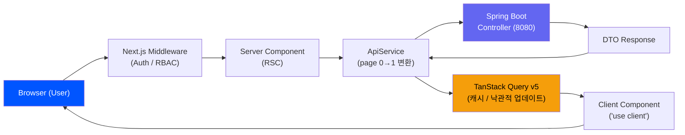

# Frontend Architecture: eGov Enterprise (Modernized)

> **상위 헌법**: 본 아키텍처는 [프론트엔드 디자인 및 UX 헌법](../../.agent/knowledge/frontend-ux-constitution/artifacts/constitution.md)(17조)의 논리적 지배를 받는다.
> **시각 규범**: 디자인 토큰 및 컬러 시스템은 [frontend-design-system.md](./frontend-design-system.md)를 참조한다.

## 🚀 Overview
본 프로젝트의 프론트엔드는 **Next.js 16.2.4 (App Router)** 기반으로 구축되었으며, **React 19**의 최신 기능(Server Components, Actions, Suspense)을 적극 활용합니다. 시각적 예술성과 기술적 성능의 조화를 목표로 합니다.

## 🗺️ Data Flow Architecture



## 🏗️ Core Architecture

### 1. Server Component First (RSC)
- **최우선 설계 원칙**: 모든 컴포넌트는 기본적으로 **Server Component**로 설계하여 클라이언트 측 자바스크립트 번들 사이즈를 최소화합니다.
- **Client Boundary**: 인터랙션이 필요한 리프(Leaf) 노드에만 `'use client'`를 적용하여 클라이언트 바운더리를 엄격히 제한합니다.

### 2. Hub & Spoke Pattern (Orchestration)
복잡한 비즈니스 모듈은 단일 진입점인 `HubClient`를 통해 하위 기능을 오케스트레이션합니다.
- **URL State**: 헌법에 따라 `?tab=...` 등 쿼리 스트링을 사용하여 현재 활성화된 기능을 식별하고 SSR과의 연동성을 확보합니다.
- **Lazy Loading**: 각 탭의 고중량 컴포넌트는 `next/dynamic`을 통해 `ssr: false` 옵션으로 지연 로딩하여 초기 로딩 성능을 최적화합니다.

### 3. Service Layer & Data Fetching
- **ApiService**: 모든 통신은 `ApiService`를 상속받은 전용 서비스 클래스를 통합니다.
    - **자동 매핑**: 프론트엔드 `page`(0-based) -> 백엔드 `pageIndex`(1-based) 자동 변환 처리.
- **Server State**: **TanStack Query (v5)**를 사용하여 데이터 캐싱 및 낙관적 업데이트(Optimistic Update)를 관리합니다.

### 4. Middleware Security & RBAC
`src/middleware.ts`를 통해 라우팅 레벨에서 보안 및 접근 제어를 수행합니다.
- **Session Check & RBAC**: 미들웨어가 HttpOnly `accessToken` JWT를 Web Crypto(`crypto.subtle.verify`)로 서명·만료(exp) 검증하고(단순 존재 확인 아님, `alg` 화이트리스트로 none·비대칭 혼동 공격 차단) 검증된 `payload.role`로 `/admin` 등 민감 경로를 게이팅 — 위조된 `userRole` 쿠키는 불신.

## 🎨 Design System & UI Consistency
- **Styling**: **Tailwind CSS 4**와 **디자인 토큰**을 기반으로 한 유틸리티 퍼스트 디자인.
- **Rich Aesthetics**: `Framer Motion`을 활용한 마이크로 인터렉션과 `backdrop-blur` 등 프리미엄 시각 효과를 아키텍처적으로 지원합니다.
- **Atomic Design**: 컴포넌트를 원자 단위로 분리하여 재사용성을 극대화하고 **Storybook**을 통해 품질을 검증합니다.

## 📁 Directory Structure
```text
src/
 ├── app/             # App Router (Pages, Layouts)
 ├── components/      # UI Components (Atoms, Molecules, Organisms)
 ├── services/        # ApiService & Business Logic
 ├── hooks/           # Custom Hooks (useAppForm 등)
 ├── store/           # Client State (Context API)
 └── types/           # TypeScript Definitions (Generated API)
```

---
*Last Updated: 2026-07-18 (Middleware Security & RBAC — Web Crypto JWT 서명·만료 검증 및 payload.role 게이팅 현행화)*
