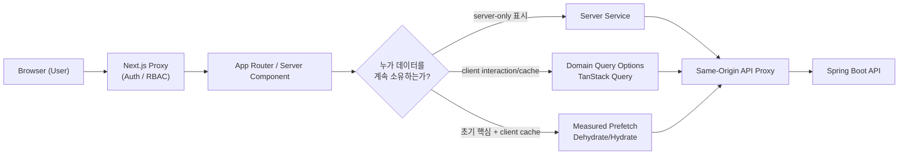

# Frontend Architecture: eGov Enterprise (Modernized)

> **상위 헌법**: 본 아키텍처는 [프론트엔드 디자인 및 UX 헌법](../../.agent/knowledge/frontend-ux-constitution/artifacts/constitution.md)(17조)의 논리적 지배를 받는다.
> **시각 규범**: 디자인 토큰 및 컬러 시스템은 [frontend-design-system.md](./frontend-design-system.md)를 참조한다.
> **현대화 결정**: 사용자 과업·프로필·접근성·데이터 소유권은 [ADR-0003](./decisions/ADR-0003-frontend-ux-modernization-principles.md)을 따른다.
> **URL 검색 상태 결정**: 개인정보성 업무 검색어의 제한적 URL 허용은 [ADR-0009](./decisions/ADR-0009-controlled-url-search-state.md)를 따른다.

## 🚀 Overview
본 프로젝트의 프론트엔드는 **Next.js 16.2.12 계열(App Router)**과 **React 19.2 계열**을 사용한다. 정확한 설치 버전은 `frontend/package.json`과 lockfile을 기준으로 판단한다.

## 🗺️ Data Flow Architecture



## 🏗️ Core Architecture

### 1. Server Component First (RSC)
- **기본 구조**: 모든 컴포넌트는 기본적으로 **Server Component**로 설계한다.
- **Client Boundary**: 상호작용·브라우저 API·클라이언트 상태가 필요한 최소 실용 단위에만 `'use client'`를 적용한다.
- **비용 증거**: 직접 client 파일 LOC가 아니라 route별 client JS, hydration boundary, 실제 사용자 성능으로 판단한다.

### 2. Hub & Spoke Pattern (Orchestration)
복잡한 비즈니스 모듈은 단일 진입점인 `HubClient`를 통해 하위 기능을 오케스트레이션합니다.
- **URL State**: 헌법에 따라 `?tab=...` 등 쿼리 스트링을 사용하여 현재 활성화된 기능을 식별하고 SSR과의 연동성을 확보합니다.
- **URL Privacy**: page/sort/tab뿐 아니라 성명·사번·계정명 등이 포함될 수 있는 일반 업무 검색어도 화면별 route/query key allowlist 안에서는 URL에 둘 수 있다. 선언하지 않은 query는 재전파하지 않고 같은 화면의 조건 변경은 `replace`를 우선하며, 해당 값을 client log·analytics·오류 로그 payload에 복제하지 않는다. 이 허용은 URL 동기화 의무가 아니며 파생 제품은 범위를 더 좁힐 수 있다.
- **URL 금지 경계**: 앱은 자격증명, cookie·session 비밀, 인증·복구 token, 주민등록번호 등 고유식별정보, 금융·건강·생체 등 고위험 개인정보, 응답 데이터와 업무 본문을 의미하는 전용 URL field/state를 설계하거나 일반 검색창에서 입력을 요구·유도하지 않는다. 자유 검색어에 사용자가 예상 밖 값을 직접 넣는 경우를 클라이언트가 완전 판별할 수 없다는 점과 URL·browser history·외부 proxy/WAF/CDN log 잔존 가능성은 ADR-0009의 accepted residual risk이며, 고위험 용도 승인이나 인가 증거가 아니다.
- **Lazy Loading**: route JavaScript, 최초 표시, CLS, 접근 가능한 대체 표현을 측정해 지연 로딩 여부와 SSR 사용을 결정한다. `ssr: false`를 고중량 컴포넌트의 무조건적 기본값으로 두지 않는다.

### 3. Service Layer & Data Fetching
- **ApiService**: 모든 통신은 `ApiService`를 상속받은 전용 서비스 클래스를 통합니다.
    - **자동 매핑**: 프론트엔드 `page`(0-based) -> 백엔드 `pageIndex`(1-based) 자동 변환 처리.
- **Server-owned read**: 클라이언트 캐시가 불필요한 표시 데이터는 server-only service/RSC가 소유할 수 있다.
- **Interactive server state**: mutation, background refresh, client cache가 필요한 데이터는 도메인 가까이에 typed TanStack `queryOptions`와 key hierarchy를 둔다. 중앙 거대 query-key registry를 만들지 않는다.
- **Initial critical data**: prefetch/hydration과 client fetch는 TTFB, 최초 데이터 표시, loading 노출, 중복 요청, route JS와 cache recovery를 representative route에서 비교한 뒤 선택한다. 임의 개수 quota는 없다.
- **Mutation**: optimistic update는 가역적이고 안전한 작업에만 사용한다. 보안·권한·파괴적 작업은 명시적 근거가 없으면 서버 확인 후 반영한다.

### 4. Middleware Security & RBAC
`src/proxy.ts`를 통해 라우팅 레벨에서 보안 및 접근 제어를 수행합니다.
- **Session Check & RBAC**: 미들웨어가 HttpOnly `accessToken` JWT를 Web Crypto(`crypto.subtle.verify`)로 서명·만료(exp) 검증하고(단순 존재 확인 아님, `alg` 화이트리스트로 none·비대칭 혼동 공격 차단) 검증된 `payload.role`로 `/admin` 등 민감 경로를 게이팅 — 위조된 `userRole` 쿠키는 불신.

## 🎨 Design System & UI Consistency
- **Styling**: **Tailwind CSS 4**와 **디자인 토큰**을 기반으로 한 유틸리티 퍼스트 디자인.
- **Profile-driven**: 공공 KRDS와 premium 같은 brand profile은 같은 시맨틱·상태·접근성 계약을 구현하며 light/dark 색상 모드와 독립적으로 선택한다.
- **Effects are conditional**: motion, gradient, blur는 이해와 피드백에 기여하고 대비·성능·reduced-motion을 해치지 않을 때만 사용한다.
- **Component verification**: 재사용 컴포넌트는 Vitest + Testing Library로 계약을 검증하고, 화면의 실제 사용자 흐름은 required Playwright E2E에서 검증한다. 실행되지 않는 카탈로그를 품질 증거로 간주하지 않는다.

## 📁 Directory Structure
```text
src/
 ├── app/             # App Router (Pages, Layouts)
 │   └── **/_components/ # App shell/segment 전용 UI
 ├── components/      # ui primitives + cross-feature shared composites
 ├── features/        # Domain UI + query options + service adapters (점진 도입)
 ├── services/        # ApiService & Business Logic
 ├── hooks/           # Custom Hooks (useAppForm 등)
 ├── store/           # 실제 공유 필요가 검증된 client UI state
 └── types/           # TypeScript Definitions (Generated API)
```

---
*Verified against `frontend/package.json`, current proxy structure, ADR-0003, and ADR-0009: 2026-09-05*
