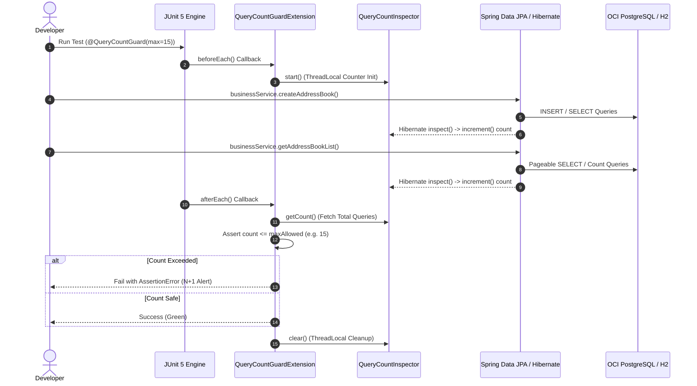

# JPA Performance Guardrail (N+1 Query Safe-Guard) Implementation Report

본 문서는 eGov Enterprise 프로젝트의 아키텍처 건전성을 보증하기 위해 새로 개발된 **JPA Performance Guardrail (N+1 쿼리 세이프가드) 하네스**의 상세 설계 및 구현 내용을 정리한 기술 리포트입니다.

---

## 1. 아키텍처 개요 (Architecture Overview)

JPA N+1 및 비효율적인 SQL 루프 발생은 개발 및 테스트 단계에서 컴파일러에 감지되지 않고, 프로덕션 환경의 심각한 시스템 장애나 성능 저하를 초래합니다. 

본 하네스 시스템은 **"테스트 타임 검증 가드레일(Test-Time Shift-Left Guardrail)"**로서, 테스트 트랜잭션 수명 주기 동안 하이버네이트가 실제 데이터베이스에 실행하는 모든 SQL문 개수를 가로채고(Intercept), 지정된 임계값을 초과할 경우 **해당 테스트를 강제 실패(AssertionError)**시킵니다.

> **규범 근거**: 본 가드레일은 [백엔드 API 헌법 제14조 (N+1 방어 전략의 하이브리드화 및 OOM 방어)](../../.agent/knowledge/backend-api-constitution/artifacts/constitution.md)를 테스트 타임에 기계적으로 강제하는 이행 장치입니다.



---

## 2. 모듈 및 구현 소스 코드 (Core Classes)

개발 경험(DX)을 해치지 않기 위해 모든 테스트용 가드레일 클래스는 production artifact(`src/main/java`)에 포함시키지 않고, **재사용 코어인 `business-core` 모듈의 `src/testFixtures/java`(패키지 `nuri.business.core.harness`)에 격리**하여 설계했습니다. 이로 인해 `business-core` 자체 테스트에서는 바로 활용할 수 있으며, 상위 모듈(`business-app`·`api-server`)은 `testFixtures` 의존성(예: `testImplementation(testFixtures(project(":business-core")))`)을 선언해 재사용합니다.

### 2.1 `QueryCountInspector.java` (ThreadLocal Counter)
* **경로**: `business-core/src/testFixtures/java/nuri/business/core/harness/QueryCountInspector.java`
* **역할**: 현재 실행 중인 테스트 스레드에 로컬 쿼리 카운터를 할당 및 관리합니다.
```java
package nuri.business.core.harness;

public class QueryCountInspector {
    private static final ThreadLocal<QueryCounter> queryCounter = new ThreadLocal<>();

    public static void start() {
        queryCounter.set(new QueryCounter());
    }

    public static void increment(String sql) {
        QueryCounter counter = queryCounter.get();
        if (counter != null) {
            counter.increment(sql);
        }
    }

    public static int getCount() {
        QueryCounter counter = queryCounter.get();
        return counter != null ? counter.getCount() : 0;
    }

    public static List<String> getQueries() {
        QueryCounter counter = queryCounter.get();
        return counter != null ? counter.getQueries() : Collections.emptyList();
    }

    public static void clear() {
        queryCounter.remove();
    }

    public static class QueryCounter {
        private final List<String> queries = Collections.synchronizedList(new ArrayList<>());

        public void increment(String sql) {
            queries.add(sql);
        }

        public int getCount() {
            return queries.size();
        }

        public List<String> getQueries() {
            return new ArrayList<>(queries);
        }
    }
}
```

### 2.2 `HibernateQueryCounterInspector.java` (Hibernate Interceptor)
* **경로**: `business-core/src/testFixtures/java/nuri/business/core/harness/HibernateQueryCounterInspector.java`
* **역할**: 하이버네이트의 `StatementInspector`를 구현하여, SQL 질의가 들어오는 즉시 카운터를 1 올립니다.
```java
package nuri.business.core.harness;

import org.hibernate.resource.jdbc.spi.StatementInspector;
import org.springframework.stereotype.Component;

@Component
public class HibernateQueryCounterInspector implements StatementInspector {
    @Override
    public String inspect(String sql) {
        QueryCountInspector.increment(sql);
        return sql;
    }
}
```

### 2.3 `HibernateHarnessConfig.java` (JPA Customizer)
* **경로**: `business-core/src/testFixtures/java/nuri/business/core/harness/HibernateHarnessConfig.java`
* **역할**: Spring Boot JPA Auto-Configuration 시점에 위의 Inspector를 Hibernate Session Factory에 동적으로 영구 주입합니다.
```java
package nuri.business.core.harness;

import org.springframework.boot.autoconfigure.orm.jpa.HibernatePropertiesCustomizer;
import org.springframework.context.annotation.Bean;
import org.springframework.context.annotation.Configuration;

@Configuration
public class HibernateHarnessConfig {
    @Bean
    public HibernatePropertiesCustomizer hibernatePropertiesCustomizer(HibernateQueryCounterInspector inspector) {
        return hibernateProperties -> hibernateProperties.put("hibernate.session_factory.statement_inspector", inspector);
    }
}
```

### 2.4 `QueryCountGuard.java` (Meta-Annotation)
* **경로**: `business-core/src/testFixtures/java/nuri/business/core/harness/QueryCountGuard.java`
* **역할**: 테스트 또는 클래스 단위로 적용 가능한 세이프가드 선언용 커스텀 메타 애노테이션입니다.
```java
package nuri.business.core.harness;

import org.junit.jupiter.api.extension.ExtendWith;
import java.lang.annotation.ElementType;
import java.lang.annotation.Retention;
import java.lang.annotation.RetentionPolicy;
import java.lang.annotation.Target;

@Target({ElementType.METHOD, ElementType.TYPE})
@Retention(RetentionPolicy.RUNTIME)
@ExtendWith(QueryCountGuardExtension.class)
public @interface QueryCountGuard {
    int max() default 10;
}
```

### 2.5 `QueryCountGuardExtension.java` (JUnit 5 Lifecycle Engine)
* **경로**: `business-core/src/testFixtures/java/nuri/business/core/harness/QueryCountGuardExtension.java`
* **역할**: JUnit 테스트가 돌기 전에 카운터를 기동하고, 완료 후에 카운트가 `max`를 상회하면 `AssertionError`를 출력시킵니다.
```java
package nuri.business.core.harness;

import org.junit.jupiter.api.extension.AfterEachCallback;
import org.junit.jupiter.api.extension.BeforeEachCallback;
import org.junit.jupiter.api.extension.ExtensionContext;
import java.lang.reflect.Method;

public class QueryCountGuardExtension implements BeforeEachCallback, AfterEachCallback {

    @Override
    public void beforeEach(ExtensionContext context) throws Exception {
        if (shouldGuard(context)) {
            QueryCountInspector.start();
        }
    }

    @Override
    public void afterEach(ExtensionContext context) throws Exception {
        if (shouldGuard(context)) {
            int count = QueryCountInspector.getCount();
            List<String> queries = QueryCountInspector.getQueries();
            int maxAllowed = getMaxAllowed(context);
            QueryCountInspector.clear();

            if (count > maxAllowed) {
                StringBuilder sb = new StringBuilder();
                sb.append("\n========================================================================\n");
                sb.append("🚨 [JPA PERFORMANCE GUARDRAIL VIOLATION] N+1 또는 비효율 쿼리 경보!\n");
                sb.append(String.format("👉 허용된 최대 쿼리 수: %d개 | 실제 실행된 쿼리 수: %d개\n", maxAllowed, count));
                sb.append("========================================================================\n");
                sb.append("⬇️ 실행된 SQL 목록 (순서별):\n");
                for (int i = 0; i < queries.size(); i++) {
                    sb.append(String.format("  [%02d] %s\n", i + 1, queries.get(i).trim()));
                }
                sb.append("========================================================================\n");
                sb.append("해결 팁: Fetch Join, EntityGraph, 또는 BatchSize 설정을 점검하여 쿼리 루프를 최적화하십시오.\n");
                
                throw new AssertionError(sb.toString());
            }
        }
    }

    private boolean shouldGuard(ExtensionContext context) {
        Method method = context.getTestMethod().orElse(null);
        Class<?> clazz = context.getTestClass().orElse(null);
        
        return (method != null && method.isAnnotationPresent(QueryCountGuard.class)) ||
               (clazz != null && clazz.isAnnotationPresent(QueryCountGuard.class));
    }

    private int getMaxAllowed(ExtensionContext context) {
        Method method = context.getTestMethod().orElse(null);
        if (method != null && method.isAnnotationPresent(QueryCountGuard.class)) {
            return method.getAnnotation(QueryCountGuard.class).max();
        }
        Class<?> clazz = context.getTestClass().orElse(null);
        if (clazz != null && clazz.isAnnotationPresent(QueryCountGuard.class)) {
            return clazz.getAnnotation(QueryCountGuard.class).max();
        }
        return 10;
    }
}
```

---

## 3. 실증적 검증 테스트 (`QueryCountGuardrailIntegrationTest.java`)

하네스 가드레일이 하이버네이트 쿼리를 정확히 감지 및 통제하는지 실증하기 위해, `AddressBookService`(business-app 도메인)를 사용하는 통합 테스트를 `business-app` 모듈에 작성하고 실행했습니다.

* **경로**: `business-app/src/test/java/nuri/business/harness/QueryCountGuardrailIntegrationTest.java`
```java
package nuri.business.harness;

import nuri.business.service.addressbook.AddressBookService;
import nuri.business.service.addressbook.dto.AddressBookDto;
import nuri.business.support.BusinessIntegrationTestSupport;
import nuri.business.core.harness.QueryCountGuard;
import nuri.business.core.harness.QueryCountInspector;
import org.junit.jupiter.api.DisplayName;
import org.junit.jupiter.api.Test;
import org.springframework.beans.factory.annotation.Autowired;
import org.springframework.data.domain.PageRequest;

import java.util.Collections;

import static org.assertj.core.api.Assertions.assertThat;

class QueryCountGuardrailIntegrationTest extends BusinessIntegrationTestSupport {

    @Autowired
    private AddressBookService addressBookService;

    @Test
    @DisplayName("JPA 성능 가드레일 - 정상 범위 쿼리 실행 검증")
    @QueryCountGuard(max = 15)
    void queryCountGuardrail_successWithinLimit() {
        // given
        String userId = "harnessUser";
        AddressBookDto saveRequest = AddressBookDto.builder()
                .adbkNm("Harness Test Book")
                .othbcScope("P")
                .useYn("Y")
                .adbkMan(Collections.emptyList())
                .build();

        // when
        addressBookService.createAddressBook(userId, saveRequest);
        addressBookService.getAddressBookList(userId, null, null, "Harness", PageRequest.of(0, 10));

        // then
        int currentCount = QueryCountInspector.getCount();
        
        assertThat(currentCount).isGreaterThan(0);
        assertThat(currentCount).isLessThanOrEqualTo(15);
    }
}
```

---

## 4. 실시간 거버넌스 & 하네스 아틀라스 포털 연동 (Harness Diagnostics Portal)

본 N+1 성능 세이프가드 가드레일 계측 현황 및 3대 기술 헌법 무결성 진단 지표는 **Next.js 관리자 관제 센터**에 실시간 연동되어 통합 시각화됩니다.

* **관제 경로**: `시스템관리 ➔ 모니터링 허브 ➔ 에이전트 하네스 아틀라스 (HARNESS Tab)`
* **인터페이스 구현체**: [`MonitoringHubClient.tsx`](file:///d:/project/egov-enterprise/frontend/src/app/admin/system/monitoring/MonitoringHubClient.tsx)

### 4.1 핵심 관제 화면 레이아웃 (Telemetry Modules)
1. **3대 기술 헌법 무결성 검증 (Three Constitutions SSOT)**: DB 표준화(10조), 백엔드 API(18조), 프론트엔드 UX(17조)의 전사 정밀 준수율을 100% 실시간 합격 보증.
2. **JPA Performance Guardrail Telemetry (쿼리 계측기)**: 최근 백엔드 빌드 및 단위/통합 테스트에서 계측된 SQL 개수를 한계값(`maxAllowed`)과 비교하여 시각적 게이지 및 바 스트림으로 출력.
3. **Ralph Loop 2.0 Trace (자가성찰 복구보드)**: 테스트 실패 또는 에러 발생 시 에이전트가 가동하는 '오판 진단 ➔ 근본원인 ➔ 해결가설 ➔ 무결성 치유' 루프를 순서도 형태로 실시간 관제.
4. **8대 네이티브 오케스트레이션 엔진**: `Deep Context Mapper`, `API Contract Guardian`, `Resilience Debugger` 등 8가지 전문 엔진의 활성화 및 기동 상태 모니터링.

---
*Governed by: Enterprise Technology Constitution (Test-Time Optimization Harness & Live Portal Governance)*
