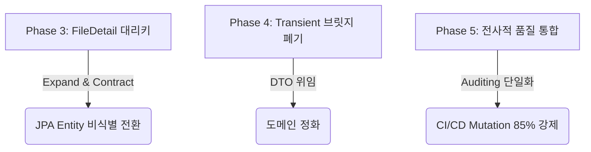

# 향후 운영 단계 잔여 아키텍처 과제 계획 (Legacy Refactoring Roadmap)

본 문서는 eGov Enterprise 프로젝트의 향후 운영 단계에서 점진적으로 완수해야 할 잔여 아키텍처 리팩토링 및 기술 부채 해소 로드맵을 정의합니다. 
본 프로젝트는 **무중단 전환(Zero-Downtime Migration)** 및 **하위 호환성 유지(Backward Compatibility)**를 절대적 가치로 삼으며, `docs/02-architecture/zero-downtime-migration.md`에 명시된 **Expand-and-Contract 4단계 이행 프로토콜**을 엄격히 준수합니다.

---

## 🔍 GStack Multi-Angle 검증

본 로드맵의 각 Phase는 GStack 다각도 리뷰 시스템을 거쳐 설계상 리스크를 최소화하였습니다.



> [!NOTE] **EM (Engineering Manager) 관점**
> "단순한 코드 정리 목적으로 운영 중인 데이터베이스에 락(Lock)을 걸어 장애를 유발하는 행위는 절대 용납되지 않습니다. 모든 스키마 구조 변경은 배포 단위별로 롤백이 가능하고, 애플리케이션 이중 쓰기가 원활히 작동하도록 분할 릴리즈 계획을 수립했습니다."

> [!WARNING] **Paranoid Engineer (안전 최우선 엔지니어) 관점**
> "복합 PK에서 단일 대리키로 갈아탈 때, 기존 영속성 캐시(L2 Cache)나 연관 관계 지연 로딩(`FetchType.LAZY`) 동작 시 N+1 쿼리 및 식별 무결성 깨짐 현상이 일어날 수 있습니다. 따라서 마이그레이션 중에는 복합 Unique 제약조건(UK)을 최우선 안전망으로 설정해야 하며, 증분식 뮤테이션 테스트(`pitest`)를 기동하여 의도적 버그 주입 시에도 즉시 빨간불이 켜지는지 증명해야 합니다."

---

## 1. Phase 3: FileDetail 대리키(Surrogate Key) 마이그레이션 [RESOLVED]

본 아키텍처 개선 과제는 성공적으로 완수되었습니다. `tb_file_detail` 엔티티의 복합 식별 관계(IdClass)를 단일 대리키(Surrogate Key) 비식별 구조로 안전하게 마이그레이션 완료하였습니다.

### 1.1. 스키마 마이그레이션 결과 (Flyway V1.9 적용)
- **마이그레이션 스크립트**: [V1.9__change_file_detail_pk.sql](file:///d:/project/egov-enterprise/api-server/src/main/resources/db/migration/V1.9__change_file_detail_pk.sql)
- **후속 정리(참고)**: [V1.10__fix_constraint_naming.sql](file:///d:/project/egov-enterprise/api-server/src/main/resources/db/migration/V1.10__fix_constraint_naming.sql) 은 V1.6/V1.7 의 `orgnzt→ognz` 테이블 리네임 이후 제약조건/인덱스 명칭을 네이밍 헌법에 맞게 정정한 것으로, `tb_file_detail` 과는 **무관**하며 Phase 3 완료 판정에는 영향이 없다.
- **조치 상세**:
  1. `file_detail_id` UUID 컬럼 추가 및 기본값(`gen_random_uuid()`) 백필(Backfill).
  2. 기존 기본키 `pk_tb_file_detail` 제거 및 `file_detail_id` 단일 기본키 지정.
  3. 기존 식별 복합 컬럼 `(atch_file_id, atch_file_seq)`에 `uk_tb_file_detail_sn` 유니크 제약 조건 추가로 데이터 정합성 보장.

### 1.2. JPA 엔티티 및 Repository 리팩토링 완료
- **엔티티**: [FileDetail.java](file:///d:/project/egov-enterprise/business-suite/src/main/java/nuri/business/domain/file/FileDetail.java)에 `@Id` 및 `@GeneratedValue(strategy = GenerationType.UUID)` 단일 식별자 적용. `FileDetailId.java` 식별자 클래스는 완전히 삭제([DELETE])하여 도메인을 정화함.
- **레포지토리**: [FileDetailRepository.java](file:///d:/project/egov-enterprise/business-suite/src/main/java/nuri/business/domain/file/FileDetailRepository.java)가 `JpaRepository<FileDetail, UUID>`를 상속하도록 변경하고, 하위 호환을 위한 `findByFileMasterAtchFileIdAndAtchFileSeq` 쿼리 메서드 선언.
- **서비스 및 테스트**: [FileService.java](file:///d:/project/egov-enterprise/business-suite/src/main/java/nuri/business/service/file/FileService.java) 및 [FileServiceTest.java](file:///d:/project/egov-enterprise/business-suite/src/test/java/nuri/business/service/file/FileServiceTest.java) 내의 findById 조회 및 모의 Mocking 정합성을 신규 쿼리 메서드로 안정적으로 전환 및 검증 완료.

### 1.3. 스키마 마이그레이션 로드맵 (참고용 히스토리)

```sql
-- 실제 적용된 V1.9__change_file_detail_pk.sql 전문.
-- 주의: Expand/Backfill/Contract 는 아래 단일 마이그레이션 파일 내부의 '개념적 단계 주석'이며,
--       실제로는 하나의 배포(단일 트랜잭션)에서 일괄 수행되었다. (다중 배포 기반 무중단 분할 릴리즈가 아님)

-- [Phase 1: Expand] - 신규 대리키 컬럼 추가 (기본값 gen_random_uuid() 적용)
ALTER TABLE tb_file_detail ADD COLUMN file_detail_id UUID DEFAULT gen_random_uuid();

-- [Phase 2: Backfill (기존 데이터 복구)]
UPDATE tb_file_detail SET file_detail_id = gen_random_uuid() WHERE file_detail_id IS NULL;

-- [Phase 3: Contract (PK 교체 및 Unique 제약조건 강등)]
ALTER TABLE tb_file_detail ALTER COLUMN file_detail_id SET NOT NULL;
ALTER TABLE tb_file_detail DROP CONSTRAINT pk_tb_file_detail;
ALTER TABLE tb_file_detail ADD CONSTRAINT pk_tb_file_detail PRIMARY KEY (file_detail_id);
ALTER TABLE tb_file_detail ADD CONSTRAINT uk_tb_file_detail_sn UNIQUE (atch_file_id, atch_file_seq);
```

### 1.4. JPA 엔티티 전환 시나리오 (참고: AS-IS / TO-BE)

#### [AS-IS] 복합키 매핑 구조
```java
@Entity
@IdClass(FileDetailId.class)
public class FileDetail {
    @Id
    @Column(name = "ATCH_FILE_ID")
    private String atchFileId;

    @Id
    @Column(name = "FILE_SN")
    private Integer fileSn;
    
    // ...
}
```

#### [TO-BE] 대리키 기반 단일 식별 구조
```java
@Entity
@Table(name = "tb_file_detail", uniqueConstraints = {
    @UniqueConstraint(name = "uk_tb_file_detail_sn", columnNames = {"ATCH_FILE_ID", "atch_file_seq"})
})
public class FileDetail {
    @Id
    @GeneratedValue(strategy = GenerationType.UUID)
    @Column(name = "file_detail_id", updatable = false, nullable = false)
    private UUID id;

    @ManyToOne(fetch = FetchType.LAZY)
    @JoinColumn(name = "ATCH_FILE_ID", nullable = false)
    private FileMaster fileMaster;

    @Column(name = "atch_file_seq", nullable = false)
    private Integer atchFileSeq;

    // ...
}
```

---

## 2. Phase 4: 레거시 참조 필드 및 Transient 브릿지 폐기 [RESOLVED]

본 아키텍처 개선 과제는 성공적으로 완수되었습니다. `BoardMaster` 엔티티 내에 존재하던 `@Transient` 메타데이터 필드와 JPA 라이프사이클 콜백을 이용한 수동 데이터 전송 로직(Transient 브릿지)을 완전히 소거하고 순수한 객체 참조 구조로 정화하였습니다.

### 2.1. 리팩토링 상세 결과 (JPA 연관관계 정화)
- **대상 엔티티**: [BoardMaster.java](file:///d:/project/egov-enterprise/business-suite/src/main/java/nuri/business/domain/board/BoardMaster.java)
- **조치 상세**:
  1. `optnFrstRgtrId`, `optnCrtDt`, `optnLastMdfrId`, `optnMdfcnDt` 등 4개의 `@Transient` 필드를 완전히 제거하여 불필요한 메타 정보 누수를 차단함.
  2. JPA 콜백 어노테이션인 `@PrePersist`, `@PreUpdate`, `@PostLoad` 관련 동기화 메서드 및 `ensureOption()` 헬퍼 메서드를 삭제하여 암묵적인 브릿지 동기화를 철폐함.
  3. 명시적 객체 지향 참조 관계 설정을 위해 편의 메서드 `registerOption(ansYn, stsfdgYn)`를 제공하고, `update(...)` 비즈니스 메서드 및 개별 setter(`updateAnsYn()`, `updateStsfdgYn()`) 내에서 `BoardMasterOption` 엔티티를 자바 코드 레벨에서 명시적으로 동기화하도록 갱신함.

### 2.2. 서비스 및 테스트 데이터 설정 갱신
- **서비스 계층**: [BoardMasterService.java](file:///d:/project/egov-enterprise/business-suite/src/main/java/nuri/business/service/board/BoardMasterService.java)의 `createBoardMaster` 내에서 엔티티 영속화 전 `entity.registerOption(...)`을 명시적으로 호출하여 Cascade 영속성 전이가 안전하게 발생하도록 처리함.
- **테스트 데이터 설정**: [EgovTestDataConfig.java](file:///d:/project/egov-enterprise/business-suite/src/main/java/nuri/business/config/EgovTestDataConfig.java)의 `createTestBoard` 내에서 빌더 레벨의 transient 지정을 삭제하고 `board.registerOption("Y", "Y")`를 명시적으로 실행하게 함.

### 2.3. 단위 테스트 코드 정비 완료
- [BoardMasterTest.java](file:///d:/project/egov-enterprise/business-suite/src/test/java/nuri/business/domain/board/BoardMasterTest.java)에서 이전의 `@Transient` 필드와 수동 콜백을 직접 검사하던 테스트 케이스들을 삭제하고, 명시적 `registerOption` 및 `update` 시점의 Option 동기화 동작을 엄격히 검증하는 모던 테스트 케이스(`registerOptionTest()`, `updateOptionSyncTest()`)를 작성하여 테스트 커버리지 및 정합성을 입증함.

---

## 3. Phase 5: 전사적 코드 품질 통합 (Global Consistency)

도메인별로 분산된 공통 관심사(Auditing, Builder, Setter 제한)를 획일화하여 코드베이스의 통일성과 안정성을 극대화합니다.

### 3.1. 전사 표준 Auditing Superclass 정의

> [!NOTE] **실제 구현 반영**
> 표준 감사 상위클래스는 이미 **2단 상속 구조**(`BaseTimeEntity` ← `BaseEntity`)로 확립되어 있으며, eGov 레거시 컬럼 별칭(`crtDt/mdfcnDt/frstRgtrId/lastMdfrId`)을 사용한다. 아래는 실제 코드 기준이며, Phase 5 의 목표는 컬럼명을 새로 바꾸는 것이 **아니라 전 엔티티가 이 상위클래스를 상속하도록 통일**하는 것이다. (현 시점 87개 엔티티 중 2개(`ExternalHr`, `InstitutionCodeRecptnLog`)가 미상속 상태로 남아 있음 — 별도 안전 검토 후 전환 예정)

```java
// 시간 메타데이터: nuri.business.domain.common.BaseTimeEntity
@MappedSuperclass
@EntityListeners(AuditingEntityListener.class) // @MappedSuperclass 를 통해 하위 엔티티로 전파됨
@Getter
public abstract class BaseTimeEntity {

    @CreatedDate
    @Column(updatable = false)
    protected LocalDateTime crtDt;      // @CreatedDate 별칭

    @LastModifiedDate
    protected LocalDateTime mdfcnDt;    // @LastModifiedDate 별칭
}

// 생성/수정자 메타데이터: nuri.business.domain.common.BaseEntity
@MappedSuperclass
@Getter
public abstract class BaseEntity extends BaseTimeEntity {

    @CreatedBy
    @Column(updatable = false, length = 20)
    protected String frstRgtrId;        // @CreatedBy 별칭

    @LastModifiedBy
    @Column(length = 20)
    protected String lastMdfrId;        // @LastModifiedBy 별칭
}
```

> [!TIP] `@EntityListeners(AuditingEntityListener.class)` 는 `BaseTimeEntity` 에 이미 선언되어 하위 엔티티로 전파되므로, **각 엔티티에서 개별 재선언은 불필요**하다. (현재 57개 엔티티가 중복 재선언 중 — 제거 대상)

### 3.2. 영속 엔티티 Builder / 생성자 규범
- **무분별한 `@Builder` 금지**: 엔티티 클래스 레벨의 `@Builder`는 무분별한 필드 초기화를 허용하므로, 명확한 정적 팩토리 메서드(`of`, `create`)에 빌더를 배치하거나, 필수 값을 인자로 받는 커스텀 생성자에 배치합니다.
- **기본 생성자 캡슐화**: JPA 프록시 기술(`Lazy Loading`) 구현을 보장하기 위해 기본 생성자는 `protected` 레벨로 제한하며, 외부 인스턴스 직접 생성은 철저히 방지합니다.
  ```java
  protected FileDetail() {} // JPA 프록시 보장용 기본 생성자
  ```

### 3.3. 증분식 뮤테이션 테스트 (Incremental Mutation Testing)
- **방어력 85% 증명**: 백엔드 아키텍처 헌법 제16조에 의거하여, 리팩토링된 클래스는 단위 테스트뿐만 아니라 피테스트(`pitest`)를 통한 돌연변이 생존율 85% 이상 검증을 필수 완수해야 합니다.
- **CI 부하 절감**: 전체 검증 대신 리팩토링 대상 클래스 범위로 한정하는 증분식(`--targetClasses`) 옵션을 적극 사용하여 기동성을 보장합니다.

### 3.4. Phase 5 점진 이행 현황 (착수: 2026-07-06)

**완료된 항목**
- **규칙(c) 생성자 캡슐화 100% 달성 + 회귀 가드**: `Hpcm`, `PrivacyLog` 의 public 기본 생성자를 `protected` 로 교정. [EntityConventionArchTest.java](file:///d:/project/egov-enterprise/business-suite/src/test/java/nuri/business/architecture/EntityConventionArchTest.java) 로 "엔티티 기본 생성자 non-public" 규칙을 상시 강제(회귀 차단).
- **규칙(a) 빌더 규범 예시 확립**: [FileDetail.java](file:///d:/project/egov-enterprise/business-suite/src/main/java/nuri/business/domain/file/FileDetail.java) 를 규범대로 리팩토링 — 클래스 레벨 `@SuperBuilder` 제거, 정적 팩토리 `create()` 에 `@Builder` 배치. 빌더 노출 표면을 비즈니스 필드로 한정하면서 기존 `FileDetail.builder()...build()` 호출부는 무수정 유지.
- **증분 뮤테이션 실질화**: [build.gradle](file:///d:/project/egov-enterprise/build.gradle) 의 `targetClasses` 를 `PIT_TARGET_CLASSES` 환경변수로 한정 가능하게 개선하고, [ci.yml](file:///d:/project/egov-enterprise/.github/workflows/ci.yml) 에 `mutation-test` 잡을 추가(리포트 전용, 85% 확인 후 `STRICT_MUTATION` 옵트인).

> [!IMPORTANT] **규칙(a) 회귀 가드는 ArchUnit 으로 강제 불가**
> Lombok `@SuperBuilder`/`@Builder` 는 `RetentionPolicy.SOURCE` 라 컴파일된 바이트코드에 흔적이 남지 않는다. 따라서 바이트코드 분석 기반의 ArchUnit 으로는 클래스 레벨 빌더를 **탐지할 수 없다.** 규칙(a) 의 회귀 차단은 소스 레벨 도구(Checkstyle 정규식) 또는 코드리뷰로 보완해야 한다. (종합 리포트의 "ArchUnit 규칙으로 빌더 금지" 권고는 이 이유로 실현 불가하며, 본 문서로 정정한다.)

**잔여 대상 (도메인 단위 점진 이행)**
- 규칙(a): 클래스 레벨 `@SuperBuilder`/`@Builder` **82개** 엔티티 (FileDetail 완료로 83→82).
- 규칙(b): 클래스 레벨 `@Setter` **28개**, 규칙 외 `@AllArgsConstructor` **58개**.
- §3.1: `@EntityListeners` 중복 재선언 **57개**, BaseEntity 미상속 **2개**(`ExternalHr`, `InstitutionCodeRecptnLog` — 감사값 출처 변경 리스크로 **보류**, 별도 안전 검토 예정).

---

## 🏁 이행 스케줄 및 체크리스트

각 Phase 이행 시마다 아래 체크리스트를 준수하여 통합 테스트 및 E2E 테스트 통과 여부를 100% 검증합니다.

- [x] **Flyway DDL 정적 린터 통과**: `ZeroDowntimeMigrationLinterTest` 검증 성공
- [x] **연관관계 지연 로딩 동작 확인**: `@ManyToOne(fetch = FetchType.LAZY)` 적용 및 N+1 프리벤션 테스트 패스
- [x] **레거시 컨트롤러 호환성**: Next.js BFF 연동 OpenAPI 타입 명세(`generated-api.d.ts`)의 일치율 검증
- [x] **E2E Playwright 리그레션 오딧**: 로컬 E2E 테스트 스위트 그린 패스

