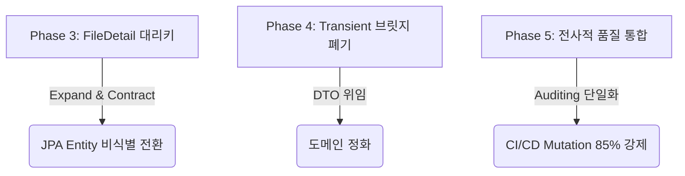

# 향후 운영 단계 잔여 아키텍처 과제 계획 (Legacy Refactoring Roadmap)

본 문서는 eGov Enterprise 프로젝트의 향후 운영 단계에서 점진적으로 완수해야 할 잔여 아키텍처 리팩토링 및 기술 부채 해소 로드맵을 정의합니다. 
본 프로젝트는 **무중단 전환(Zero-Downtime Migration)** 및 **하위 호환성 유지(Backward Compatibility)**를 절대적 가치로 삼으며, `docs/02-architecture/zero-downtime-migration.md`에 명시된 **Expand-and-Contract 4단계 이행 프로토콜**을 엄격히 준수합니다.

---

## 🔍 GStack Multi-Angle 검증

본 로드맵의 각 Phase는 GStack 다각도 리뷰 시스템을 거쳐 설계상 리스크를 최소화하였습니다.



> [!NOTE] **EM (Engineering Manager) 관점**
> "단순한 코드 정리 목적으로 운영 중인 데이터베이스에 락(Lock)을 걸어 장애를 유발하는 행위는 절대 용납되지 않습니다. 모든 스키마 구조 변경은 배포 단위별로 롤백이 가능하고, 애플리케이션 이중 쓰기가 원활히 작동하도록 분할 릴리즈 계획을 수립했습니다."

> [!WARNING] **Paranoid Engineer (안전 최우선 엔지니어) 관점**
> "복합 PK에서 단일 대리키로 갈아탈 때, 기존 영속성 캐시(L2 Cache)나 연관 관계 지연 로딩(`FetchType.LAZY`) 동작 시 N+1 쿼리 및 식별 무결성 깨짐 현상이 일어날 수 있습니다. 따라서 마이그레이션 중에는 복합 Unique 제약조건(UK)을 최우선 안전망으로 설정해야 하며, 증분식 뮤테이션 테스트(`pitest`)를 기동하여 의도적 버그 주입 시에도 즉시 빨간불이 켜지는지 증명해야 합니다."

---

## 1. Phase 3: FileDetail 대리키(Surrogate Key) 마이그레이션

현재 `FileDetail` 엔티티는 `FileMaster`와의 식별 관계(Identifying Relationship)를 맺고 있으며, 복합 식별자(`atchFileId`, `fileSn`)를 PK로 사용하고 있습니다. 이를 단일 대리키(`file_detail_id`) 기반의 비식별 관계로 전환하여 도메인 유연성을 확보해야 합니다.

### 1.1. 스키마 마이그레이션 로드맵 (Expand-and-Contract)

```sql
-- [Phase 1: Expand] - 신규 대리키 컬럼 추가 (NULL 허용으로 구버전 INSERT 방어)
ALTER TABLE atch_file_detail ADD COLUMN file_detail_id UUID DEFAULT gen_random_uuid();

-- [Phase 2: Dual Writing] 
-- 애플리케이션 레이어에서 신규 파일 저장 시 `file_detail_id`에 UUID 자동 적재.
-- 레거시 쿼리는 기존 복합키(atch_file_id, file_sn)로 계속 쓰기 처리.

-- [Phase 3: Backfill (과거 데이터 채우기)]
UPDATE atch_file_detail SET file_detail_id = gen_random_uuid() WHERE file_detail_id IS NULL;

-- [Phase 4: Contract] - 대리키에 NOT NULL 및 PK 부여, 기존 복합키는 UK로 강등
-- linter:ignore
ALTER TABLE atch_file_detail ALTER COLUMN file_detail_id SET NOT NULL;
-- linter:ignore
ALTER TABLE atch_file_detail DROP CONSTRAINT pk_atch_file_detail;
-- linter:ignore
ALTER TABLE atch_file_detail ADD CONSTRAINT pk_atch_file_detail PRIMARY KEY (file_detail_id);
-- linter:ignore
ALTER TABLE atch_file_detail ADD CONSTRAINT uk_atch_file_detail_sn UNIQUE (atch_file_id, file_sn);
```

### 1.2. JPA 엔티티 전환 시나리오

#### [AS-IS] 복합키 매핑 구조
```java
@Entity
@IdClass(FileDetailId.class)
public class FileDetail {
    @Id
    @Column(name = "ATCH_FILE_ID")
    private String atchFileId;

    @Id
    @Column(name = "FILE_SN")
    private Integer fileSn;
    
    // ...
}
```

#### [TO-BE] 대리키 기반 단일 식별 구조
```java
@Entity
@Table(uniqueConstraints = {
    @UniqueConstraint(name = "uk_atch_file_detail_sn", columnNames = {"atch_file_id", "file_sn"})
})
public class FileDetail {
    @Id
    @GeneratedValue(strategy = GenerationType.UUID)
    @Column(name = "file_detail_id", updatable = false, nullable = false)
    private UUID id;

    @ManyToOne(fetch = FetchType.LAZY)
    @JoinColumn(name = "atch_file_id", nullable = false)
    private FileMaster fileMaster;

    @Column(name = "file_sn", nullable = false)
    private Integer fileSn;

    // ...
}
```

---

## 2. Phase 4: 레거시 참조 필드 및 Transient 브릿지 폐기

현재 시스템에는 레거시 프레임워크와의 호환성 및 화면 레이어와의 결합도를 유지하기 위해 `String` 타입의 Alias 필드와 `@Transient`를 이용한 브릿지 로직(Entity 생명주기 콜백 활용)이 다수 존재합니다. 이를 점진적으로 소거하고 순수한 객체 참조 구조로 정화해야 합니다.

### 2.1. Refactoring Before / After

#### [AS-IS] 수동 양방향 동기화 및 쉐도우 ID 필드 유지
```java
public class BoardMaster {
    @Id
    @Column(name = "BBS_ID")
    private String bbsId;

    @Column(name = "BBS_TY_CODE")
    private String bbsTyCode; // 레거시 쉐도우 외래키 필드

    @Transient
    private BoardMasterOption option; // 2단계에서 분리된 신규 옵션 엔티티

    @PostLoad
    protected void syncFieldsOnLoad() {
        if (this.option != null) {
            this.bbsTyCode = this.option.getBbsTyCode();
        }
    }
}
```

#### [TO-BE] 순수 도메인 지향 참조 정화 (브릿지 완전 폐기)
```java
public class BoardMaster {
    @Id
    @Column(name = "BBS_ID")
    private String bbsId;

    @OneToOne(mappedBy = "boardMaster", fetch = FetchType.LAZY, cascade = CascadeType.ALL)
    private BoardMasterOption option; 

    // 레거시 String Getter가 필요했던 컨트롤러/화면 영역은 Entity가 아닌 DTO 변환 시점에 option.getBbsTyCode()를 바인딩하도록 수정합니다.
}
```

### 2.2. 영향도 평가 프로토콜
1. **정적 분석기 도입**: IDE 구조 통계 기능을 활용하여 모든 도메인 내부 `@PostLoad`, `@PrePersist`, `@PreUpdate` 어노테이션 사용처 전수 카운트.
2. **DTO 매핑 레이어 분리**: `Mapstruct` 또는 `DTO Constructor` 패턴을 활용하여 영속 엔티티가 화면 레이어(`Next.js Controller/API`)로 누수되어 String 호환이 강제되는 지점을 원천 차단.

---

## 3. Phase 5: 전사적 코드 품질 통합 (Global Consistency)

도메인별로 분산된 공통 관심사(Auditing, Builder, Setter 제한)를 획일화하여 코드베이스의 통일성과 안정성을 극대화합니다.

### 3.1. 전사 표준 Auditing Superclass 정의
```java
@MappedSuperclass
@EntityListeners(AuditingEntityListener.class)
@Getter
public abstract class BaseEntity {

    @CreatedDate
    @Column(name = "created_at", updatable = false, nullable = false)
    private LocalDateTime createdAt;

    @LastModifiedDate
    @Column(name = "updated_at", nullable = false)
    private LocalDateTime updatedAt;

    @CreatedBy
    @Column(name = "created_by", updatable = false, length = 50)
    private String createdBy;

    @LastModifiedBy
    @Column(name = "updated_by", length = 50)
    private String updatedBy;
}
```

### 3.2. 영속 엔티티 Builder / 생성자 규범
- **무분별한 `@Builder` 금지**: 엔티티 클래스 레벨의 `@Builder`는 무분별한 필드 초기화를 허용하므로, 명확한 정적 팩토리 메서드(`of`, `create`)에 빌더를 배치하거나, 필수 값을 인자로 받는 커스텀 생성자에 배치합니다.
- **기본 생성자 캡슐화**: JPA 프록시 기술(`Lazy Loading`) 구현을 보장하기 위해 기본 생성자는 `protected` 레벨로 제한하며, 외부 인스턴스 직접 생성은 철저히 방지합니다.
  ```java
  protected FileDetail() {} // JPA 프록시 보장용 기본 생성자
  ```

### 3.3. 증분식 뮤테이션 테스트 (Incremental Mutation Testing)
- **방어력 85% 증명**: 백엔드 아키텍처 헌법 제16조에 의거하여, 리팩토링된 클래스는 단위 테스트뿐만 아니라 피테스트(`pitest`)를 통한 돌연변이 생존율 85% 이상 검증을 필수 완수해야 합니다.
- **CI 부하 절감**: 전체 검증 대신 리팩토링 대상 클래스 범위로 한정하는 증분식(`--targetClasses`) 옵션을 적극 사용하여 기동성을 보장합니다.

---

## 🏁 이행 스케줄 및 체크리스트

각 Phase 이행 시마다 아래 체크리스트를 준수하여 통합 테스트 및 E2E 테스트 통과 여부를 100% 검증합니다.

- [ ] **Flyway DDL 정적 린터 통과**: `ZeroDowntimeMigrationLinterTest` 검증 성공
- [ ] **연관관계 지연 로딩 동작 확인**: `@ManyToOne(fetch = FetchType.LAZY)` 적용 및 N+1 프리벤션 테스트 패스
- [ ] **레거시 컨트롤러 호환성**: Next.js BFF 연동 OpenAPI 타입 명세(`generated-api.d.ts`)의 일치율 검증
- [ ] **E2E Playwright 리그레션 오딧**: 로컬 E2E 테스트 스위트 그린 패스

