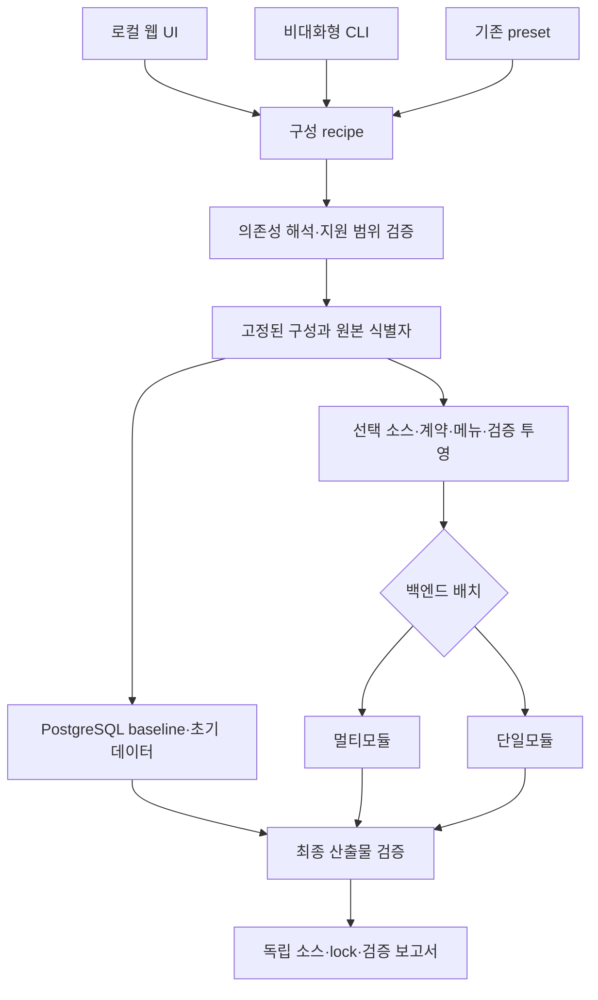

# 선택형 프로젝트 생성기 설계

이 문서는 Foundation과 Core를 기본으로 포함하고, 필요한 업무 기능과 백엔드 소스 배치를 선택하여 독립 프로젝트를 인수하는 설계와 현재 구현 경계를 설명한다. 원본 저장소의 멀티모듈 구조를 유지하면서 **생성 산출물에서 멀티모듈 또는 단일모듈을 선택**한다.

현재 구현은 공통 recipe·의존성 해석기·비대화형 CLI, 20개 업무 도메인의 선택과 자동 포함, PostgreSQL 투영, 두 백엔드 배치, 별도 로컬 웹 UI까지 포함한다. 생성 소스는 도입자가 독립적으로 수정한다. 추가 DB와 생성 후 원본 업데이트 자동 병합은 후속 범위다.

전체 기술 검증은 생성 작업마다 실행한다. DB 재적용이나 개별 계약 검사 통과를 Java·프런트엔드·기동 검증 전체의 완료로 해석하지 않는다. 실행별 완료 여부는 아래 검증 경로의 실제 보고서로 판정한다.

## 1. 적용 경계와 근거

이 문서는 구현 설계이며 규칙의 새 정본이 아니다. [AGENTS](../../AGENTS.md), [오케스트레이션 프로토콜](../03-guides/orchestration-protocol.md), [백엔드 헌법](../../.agent/knowledge/backend-api-constitution/artifacts/constitution.md), [프론트엔드 헌법](../../.agent/knowledge/frontend-ux-constitution/artifacts/constitution.md), [DB 헌법](../../.agent/knowledge/db-standard-constitution/artifacts/constitution.md)을 따른다.

백엔드 헌법 제1·2조의 원본 모듈 책임과 의존 방향은 유지한다. 단일모듈은 사용자 요구에 따른 **내보내기 형식**이며, 원본을 단일모듈로 개편하거나 Entity·서비스·API의 논리적 경계를 없애는 작업이 아니다. 인가 의미, 물리 스키마 근거, 테스트 보존, 실패를 숨기지 않는 생성 규칙도 출력 형식과 무관하게 유지한다.

| 현재 확인한 원본 | 설계에 주는 제약 |
|---|---|
| [재사용 manifest](../../config/reusable-base-profiles.json) | 현재 프로필은 `core`, `collaboration`, `demo`이며 pack은 `core`, `collaboration`, `survey`, `demo`다. 프로필을 기존 사용자용 preset으로 보존한다. |
| [프로필 계약](../../scripts/reusable-base-census.mjs)과 [구성 해석기](../../scripts/project-composer-recipe.mjs) | 기존 preset의 rank·누적 포함을 보존하며, 개별 도메인 선택은 명시적 의존성과 소유권으로 해석한다. |
| [소스 생성기](../../scripts/generate-reusable-base-source.mjs) | 제외 소스와 전이 importer를 제거한다. 사용자가 선택한 기능이 연쇄로 사라지지 않는지도 확인해야 한다. |
| [DB 생성기](../../scripts/generate-reusable-base-db.mjs) | 일회용 PostgreSQL에 현재 migration을 적용한 뒤 프로필 baseline을 만들고 다른 빈 DB에 재적용한다. 검증된 경로를 재사용한다. |
| [재사용 가이드](../03-guides/reusable-base-guide.md) | 릴리스 참조·DB/source lock·제거 게이트·기관 승인 경계를 보존한다. |
| [메뉴 결정](decisions/ADR-0017-task-oriented-menu-navigation.md)과 [권한 카탈로그](../../config/governance/permission-catalog.json) | 메뉴 표시인 NAVIGATION과 API 기능인 OPERATION, 객체 소유권은 서로 다른 계약이다. |
| [Atlas 수집기](../../scripts/atlas-catalog.mjs)와 [route 원장](../../config/ui-route-capabilities.json) | 구조 목록의 존재가 기능 소유권·사용 가능성을 입증하지 않는다. 미확인 항목을 자동 선택 카탈로그로 승격하지 않는다. |

## 2. 하나의 구성 결과와 두 가지 소스 배치

웹 UI와 CLI는 같은 구성 요청을 만들고, 공통 엔진이 의존성과 지원 범위를 해석한다. DB 생성기와 소스 생성기는 이 **해석된 구성(resolved composition)**을 함께 소비한다. 소스 배치 어댑터는 그 뒤에 적용한다.



업무 선택, DB 선택, 소스 배치는 독립 축이다. 동일한 업무·DB·원본을 선택하면 배치가 달라도 API, 메뉴, 테이블, 권한의 의미가 같아야 한다. DB baseline은 Java 파일을 어느 디렉터리에 놓는지에 따라 달라지지 않는다. 레이아웃 변경만으로 동일 DB를 다시 설계하지 않는다.

구성 해석은 파일 삭제·DB 접속·압축 생성과 분리한 순수 계획 단계로 둔다. 잘못된 기능 ID, 모순된 요구, 지원하지 않는 DB·배치는 출력 디렉터리를 만들기 전에 거부한다. 생성 계획에서 직접 선택과 자동 포함을 구분하고 각 포함 사유를 남긴다.

## 3. recipe와 산출물 식별

다음 JSON은 현재 CLI와 UI가 사용하는 `schemaVersion: 1` recipe다. `sourceRef`는 현재 체크아웃의 commit으로 해석되어야 하며, 생성기가 다른 버전을 자동 checkout하지 않는다. UI는 현재 정확한 commit을 저장한다.

```json
{
  "schemaVersion": 1,
  "project": { "name": "agency-service" },
  "sourceRef": "HEAD",
  "selection": { "domains": ["mail", "schedule"] },
  "database": { "vendor": "postgresql" },
  "backendLayout": "single-module"
}
```

`selection`은 `{"preset":"collaboration"}`처럼 `core`·`collaboration`·`demo` 중 한 preset을 지정하거나 `{"domains":["mail","schedule"]}`처럼 명시 도메인을 지정한다. 두 필드를 함께 넣거나 알 수 없는 필드를 추가하면 거부한다. `domains: []`는 Foundation/Core만 포함한다. 프로젝트명은 영문 소문자로 시작하는 1~63자이며 소문자·숫자·단어 사이 하이픈만 허용하고 Windows 예약 이름은 거부한다. `database.vendor`는 `postgresql`, `backendLayout`은 `multi-module` 또는 `single-module`이다. preset에서 개별 선택을 바꾸면 UI는 명시 도메인 집합으로 요청한다. DB 자격증명·관리자 비밀번호·실제 기관 데이터는 recipe에 넣지 않는다.

해석 결과는 직접 선택·자동 포함과 사유, 포함 도메인·테이블·시퀀스·메뉴 경로·권한·화면 경로, catalog/recipe/composition 해시를 담는다. DB와 소스 생성기는 원본 카탈로그에서 recipe를 다시 해석하고 `sourceRef`·현재 commit을 확인한다. DB lock은 빈 DB 재적용 검증 후에만 `validated: true`와 SQL 네 파일의 SHA-256을 기록하며 소스 생성기는 이를 대조한다. 소스 lock·생성 보고서는 원본 식별, 배치, 구성 및 DB 식별, 검증 범위·결과를 기록한다. 배치도 구성 해시에 결속되므로 다른 배치의 lock으로 바꿔 끼우지 않는다.

출력 폴더는 작업공간 내 새 경로만 허용하고 기존 프로젝트를 덮어쓰지 않는다. `.pending-` 디렉터리에 소스를 구성한 후 **의존성 설치 전에 최종 경로를 확정**한다. Windows pnpm이 절대 경로 junction을 만들기 때문에 설치·검증 후 폴더를 rename하여 승격하지 않는다. 최종 위치의 보고서는 `verifying`에서 시작하고 전체 검증 후 `passed`, 실패 시 `failed`가 된다. 폴더가 존재한다는 사실은 완료 증거가 아니다. 실패 결과와 단계는 작업 보고서에 남긴다. ZIP 다운로드와 원격 생성 큐는 현재 제공하지 않는다.

## 4. 멀티모듈과 단일모듈 출력 계약

| 항목 | 멀티모듈 | 단일모듈 |
|---|---|---|
| Gradle 구조 | 기존 온라인 모듈 경계 유지 | `include` 없는 루트 Gradle project 하나 |
| Java 패키지 | 원본 패키지 유지 | 원본 패키지 유지 |
| 책임 구분 | 모듈과 패키지로 표현 | 패키지와 아키텍처 검증으로 표현 |
| 업무·DB 범위 | 해석된 구성과 동일 | 같은 해석된 구성과 동일 |
| 프론트엔드 | 별도 `frontend` 애플리케이션 | 별도 `frontend` 애플리케이션 |
| 테스트·하네스 | 해당 구성의 활성 테스트 실행 | 원본 출처별 suite에서 같은 적용범위의 테스트·하네스 실행 |
| 기존 호출 호환성 | 기존 출력 기본값 | 명시적으로 선택할 때만 적용 |

여러 Gradle 모듈을 그대로 둔 채 실행 jar 하나를 만드는 것은 단일모듈 출력의 완료조건이 아니다. Gradle 프로젝트 목록과 의존 그래프에서 온라인 백엔드가 실제로 하나인지 확인한다. Java 패키지명을 한꺼번에 바꾸는 기능은 이 배치 변환과 별도로 다룬다.

[단일모듈 어댑터](../../scripts/reusable-single-module.mjs)는 다음 계약을 적용한다.

1. 선택된 온라인 모듈의 main 소스·자원과 test·testFixtures를 루트 project의 source set에 연결한다. `foundation`, `business-core`, `business-app`, `api-server`의 기존 소스 디렉터리는 논리적 소스 그룹으로 보존한다. 각 폴더를 별도 Gradle project로 등록하지 않으며, 루트 `src`로 물리 통합하는 기능은 이번 범위에 포함하지 않는다.
2. 모듈 간 `project(...)` 의존성을 실제 외부 의존성·configuration·annotation processor의 합성으로 바꾼다. compileOnly, runtimeOnly, test 의존성을 임의로 모두 implementation에 합치지 않는다.
3. 동일 FQCN, 동일 대상 파일, 설정 자원, service descriptor, 테스트 자원이 충돌하면 전체 목록을 보여주고 실패한다. 파일 순서에 따른 덮어쓰기는 허용하지 않는다. 병합 가능한 자원은 명시 정책과 그 정책의 테스트가 있을 때만 합친다.
4. 동일한 단순 클래스명이라도 패키지가 다르면 보존한다. 테스트는 원본 출처별 source set/task로 격리한다. 같은 이름의 테스트용 application YAML과 H2 자원이 다른 suite를 덮어쓰지 않도록 하며, 해당 suite에 필요한 testFixtures와 classpath만 연결한다. 충돌을 피하려고 테스트를 삭제하거나 skip하지 않는다.
5. 단위 테스트, governance harness, PostgreSQL schema-validation의 실행 경로와 모집단을 보존한다. 모듈별 source 경로를 읽는 검사에는 경로 대응을 제공하고, Gradle task 경로·coverage 입력·CI 소비자도 함께 조정한다.
6. 생성된 Gradle 설정, 실행 스크립트, 컨테이너 빌드, 문서의 경로를 최종 배치에 맞춘다. Java 파일을 합치는 데서 작업을 끝내지 않는다.

`migration-tool`은 온라인 백엔드와 분리된 이관 CLI다. 단일모듈 출력에도 원본 소스를 보존하되 루트 project의 별도 migration source set·테스트 task·`migrationBootJar`로 빌드한다. 온라인 main/test classpath와 실행 jar에 넣지 않는다. Gradle project는 하나지만 온라인과 오프라인 실행 산출물의 책임과 의존성은 분리하며, 이관 도구를 온라인 실행에 필요한 요소처럼 안내하지 않는다.

### 확정한 배치 기준과 구현 확인 항목

출력 레이아웃의 기준은 아래와 같다. 정확한 task·classpath·검증 경로는 어댑터 코드와 실행 결과로 확인하며, 이 표 자체는 구현 완료 증거가 아니다.

| 항목 | 설계 기준 | 구현에서 확인할 내용 |
|---|---|---|
| 단일모듈 파일 배치 | 기존 디렉터리를 소스 그룹으로 유지하고 루트 project만 등록 | Gradle projects 결과, `project(...)` 의존성 부재, 독립 빌드 |
| 테스트 충돌 | 출처별 테스트 suite와 자원·classpath 격리 | 같은 이름의 resource가 다른 suite에 섞이지 않는지와 전체 적용 테스트 실행 |
| 이관 도구 | 별도 source set·test·`migrationBootJar` | 온라인 jar/classpath 부재와 독립 CLI 실행 산출물 |
| 경로 기반 하네스 | 기존 소스 위치와 검사 적용범위 유지 | 루트 실행 시 working directory·source root 탐색·task adapter의 정합성 |

기존 프로필용 소스 생성기와 검증 runner는 `--layout multi-module|single-module`을 받으며 기본값은 `multi-module`이다. Composer는 recipe의 `backendLayout`을 사용한다. 기존 모듈별 build 파일이 출처 자료로 남더라도 루트 settings가 이를 하위 project로 포함하지 않으면 활성 Gradle 모듈로 계산하지 않는다. 단일모듈의 온라인 진입점은 루트 `bootRun`·`bootJar`이며 `harnessTest`·`schemaValidationTest`와 출처별 suite를 묶는 `allTests`를 제공한다. 사용법은 생성된 안내문에서 실제 활성 진입점으로 연결한다.

## 5. 업무 카탈로그와 의존성

사용자의 기본 선택 단위는 **업무 기능(capability)**이다. Java 폴더, 메뉴 한 줄, 화면 하나를 그대로 선택 단위로 삼지 않는다. 기능은 관련 소스·API·화면·테이블·권한·메뉴·테스트와 외부 설정 요구를 함께 소유한다.

[카탈로그](../../scripts/project-composer-catalog.mjs)는 기존 재사용 manifest·Java import·권한 카탈로그와 명시된 프런트엔드 소유권을 읽어 20개 도메인을 구성한다. 기존 소유권 정본을 복제하는 대신 해당 근거를 사용하고, 공유 화면과 필수 UI 참조는 명시적 의존성으로 추가한다. 구성 판단에 사용하는 정보는 다음과 같다.

| 관계·정보 | 의미 |
|---|---|
| 필수 의존성 | 함께 포함해야 컴파일·기동·업무 의미가 성립하는 기능 |
| 선택적 연동 | 두 기능이 함께 있을 때 활성화하는 어댑터·화면 구역 |
| 공유 자원 | 여러 기능이 소비하지만 소유권과 생성 횟수는 하나인 테이블·공통 서비스 |
| 충돌·지원 조건 | 동시에 제공할 수 없는 선택이나 검증되지 않은 조합 |
| 생존 계약 | 선택 후 반드시 남아야 하는 API·route·테이블·대표 사용자 흐름 |
| 검증 소유권 | 기능 전용 검사와 공통·횡단 검사, 제외될 때의 적용범위 근거 |

현재 게시판·댓글·스크랩은 manifest가 함께 선택하도록 선언한 클러스터다. 대시보드는 게시판·알림을 요구한다. `tb_tmplt_info`는 게시판과 템플릿이 공유한다. 반면 [수신자 피커](../../frontend/src/app/components/ui/recipient-picker.tsx)의 주소록은 주입형 선택 연동이다. 이 차이를 무시하고 모든 연결을 강제 의존성으로 만들면 불필요한 기능까지 포함된다.

기존 rank와 세 preset의 포함 범위는 유지한다. 개별 도메인 선택에는 UI 생존에 필요한 추가 의존성이 적용될 수 있다. 예를 들어 `schedule`은 `report`, `system`은 `template`, `survey`와 `stats`는 서로를 포함한다. 같은 도메인 목록을 수동 선택한 결과와 기존 preset의 결과가 항상 같지는 않다. custom 구성은 검토 범위와 게이트 소유권도 선택한 실제 소스에 맞춰 투영한다. 20개 도메인을 선택할 수 있다는 것은 모든 부분집합을 사전 인증했다는 뜻이 아니며 각 생성 작업의 전체 검증을 통과해야 한다.

## 6. 메뉴·권한·DB 초기화

업무 포함 여부와 메뉴 노출 여부는 별도다. 현재 UI는 기능을 선택하면 포함될 메뉴 이름·부모 계층·목적지를 미리 보여준다. 개별 메뉴 체크박스 편집은 제공하지 않는다. 향후 세부 메뉴 조정을 추가하더라도 내비게이션 노출과 코드 제거·API 인가는 구분해야 한다.

선택 기능의 메뉴, 프로그램 연결, 부모 계층, NAVIGATION, OPERATION을 같은 해석 결과에서 생성한다. 필요한 부모 메뉴는 포함하고 빈 분류는 정리한다. query를 사용하는 목적지와 redirect도 확인한다. 기능 선택이 owner-only 또는 수신자·결재자 제한을 완화해서는 안 된다.

기존 profile 경로는 [관리자 초기화 시드](../../api-server/src/main/resources/db/migration/R__zz_seed_base_admin.sql)의 동작을 보존한다. composition 경로는 체크인된 migration을 새 전용 DB에 적용한 최종 메뉴·프로그램을 선택하며, 원래 시드의 최초 초기화·권한 회수 보호 조건을 유지한다. 부모만 필요한 메뉴는 목적지를 제거해 구조로 남긴다. OPERATION은 선택 기능의 코드와 원본 default group만 포함한다. 운영 DB의 현재 메뉴와 사용자별 권한·업무 데이터를 새 프로젝트의 기본값으로 덤프하지 않는다.

[메뉴 snapshot](../../config/project-composer-menus.json)은 DB 없이 계획을 보여주기 위한 **파생 자료**다. 정본은 원본 migration·seed·Contract SQL이다. [메뉴 preview](../../scripts/project-composer-menu-preview.mjs)는 SQL 입력 해시가 달라지면 거부하고, 실제 DB 생성은 migration으로 만든 전체 메뉴·프로그램과 snapshot을 다시 대조한다. 화면 route 수를 메뉴 수로 표시하지 않는다. snapshot 갱신은 [사용 가이드](../03-guides/project-composer-guide.md#메뉴-미리보기-자료-갱신)의 전용 일회용 컨테이너 절차를 따른다.

PostgreSQL은 기존 migration을 적용한 일회용 DB에서 스키마를 투영하고 빈 DB에 재적용하는 경로를 유지한다. FK·인덱스·제약·sequence·기본값·표준 메타·관리자 부트스트랩을 검증한다. ORM Entity로 DDL을 다시 만드는 방식은 현재 물리 계약을 대체하지 않는다. DB나 Entity 변경에 들어갈 때는 DB 헌법과 H1에 따라 live schema·표준 메타를 먼저 조회한다.

Oracle·MySQL/MariaDB·SQL Server는 후속 DB adapter 범위다. DDL 문법 출력만으로 지원 완료라고 하지 않고 driver, SQL, ID 생성, 날짜·문자열·정렬 의미, Flyway 초기화, 실제 vendor의 스키마·대표 업무 검증을 갖춘 뒤 선택 가능하게 한다.

## 7. 로컬 웹 UI와 CLI

로컬 UI는 `npm run project:ui`로 실행해 `http://127.0.0.1:3100`에서 사용한다. 제품의 관리자 화면과 별도이며, 계획 조회에 업무 앱 로그인·업무 DB·운영 서버가 필요하지 않다. [UI 서버](../../scripts/project-composer-server.mjs)와 CLI는 같은 [엔진](../../scripts/project-composer.mjs)과 recipe를 사용한다. 생성·전체 검증에는 Docker·Java 21·Node.js 22 이상·pnpm과 의존성 다운로드 환경이 필요하다.

권장 사용자 흐름은 다음과 같다.

1. 프로젝트명을 입력하고 현재 체크아웃의 원본 commit과 자동 결정되는 새 생성 위치를 확인한다.
2. Foundation/Core가 포함된 상태에서 preset 또는 검증된 업무 기능을 선택한다.
3. 자동 포함 사유와 선택적 연동, 결과 메뉴를 확인한다.
4. PostgreSQL과 백엔드 배치를 선택한다. 미지원 DB는 생성 가능한 옵션으로 표시하지 않는다.
5. 구성·필요 외부 설정·검증 범위를 미리 확인하고 생성한다.
6. 단계별 상태와 오류를 확인한 뒤 소스, recipe, lock, 검증 보고서를 인수한다.

프런트엔드 헌법의 입력 오류 연결·중복 제출 방지·입력 보존과 키보드·상태 전달 계약을 적용한다. 자동 포함 체크박스에는 이유를 제공하고 해제 시 영향을 설명한다. 생성 실패를 빈 결과나 성공 토스트로 바꾸지 않는다.

로컬 서버는 loopback에서만 바인딩하고 요청 출처를 확인한다. 입력 ID는 allowlist와 recipe 스키마로 검증하며 shell 문자열을 조립하지 않는다. 출력 절대 경로를 허용된 새 디렉터리로 제한하고 기존 파일을 덮어쓰지 않는다. DB·관리자 비밀은 UI URL·recipe·로그에 기록하지 않는다. 원격 서비스나 운영 관리자 API의 빌드 실행 권한은 이 단계의 범위가 아니다.

CLI는 `project:catalog`, `project:plan -- --recipe FILE`, `project:create -- --recipe FILE`을 제공한다. UI의 **선택 정보 저장**으로 같은 recipe를 내려받는다. 방향키 기반 마법사는 현재 제공하지 않는다. [Atlas](../03-guides/governance-atlas-guide.md)는 설명·검색·원본 링크에 활용하며 생성기 정본이나 실행 서버는 아니다.

## 8. 구현 범위와 완료조건

| 단계 | 현재 범위 | 완료 판정에 필요한 증거 |
|---|---|---|
| A. 출력 레이아웃 | 두 배치의 소스·실행·검증 어댑터 구현 | 기본 멀티모듈 결과 보존, 단일 Gradle project 확인, 적용 테스트·자원·하네스 보존, 충돌 red, 생성 산출물 컴파일·검증 |
| B. 공통 composition | recipe·해석기·계획 조회·결속된 lock·비대화형 CLI 구현 | 기존 preset 결과의 동등성, 원본·DB·소스 식별 불일치 거부, 잘못된 요청의 무출력 실패, 결정적인 구성 해석 |
| C. 업무 선택 | 20개 도메인·필수 의존성·소스/DB/메뉴/검토 범위 투영 구현 | core+각 선택 기능, 필수 의존 묶음, 선택적 연동, 전체 구성의 생존·제외 계약과 실제 산출물 검증 |
| D. 로컬 UI | 별도 3100 UI·메뉴 미리보기·PG/배치 선택·작업 상태·recipe 저장 구현 | 같은 recipe의 CLI/UI 동등 결과, 키보드 조작, 입력 보존·중복 제출·오류 복구, 실제 전체 생성과 도입 환경 기동 검증 |
| E. DB 확대 | 미구현; PostgreSQL만 제공 | 해당 vendor의 빈 DB 적용·스키마 검증·인가·대표 CRUD와 데이터 의미 검증 |

A~D의 실행 경로가 있다는 사실과 개별 산출물의 검증 완료는 구분한다. 대표 custom 조합의 CI와 각 생성 작업의 full 검증을 완료 기준으로 삼는다. 미완성 조합이나 배치를 테스트 제외로 통과시키지 않고 실패 원인과 실행 증거를 남긴다.

## 9. 검증과 실패 처리

기존 [gate registry](../../config/governance/gates.json), 재사용 계약, [산출물 검증기](../../scripts/verify-reusable-artifact.mjs)를 우선 확장한다. 동일 불변식을 검사하는 별도 게이트를 중복해서 늘리지 않는다.

[대표 조합 검증 진입점](../../scripts/verify-project-composer.mjs)은 `--layout multi-module`에서 mail+schedule, `--layout single-module`에서 board+survey를 공통 엔진으로 생성하고 full 검증한다. [CI](../../.github/workflows/ci.yml)도 이 경로를 사용한다. 생성 프로젝트의 `build/reports/reusable-base/full.json`과 `project-generation-report.json`, 원본의 `build/project-composer/jobs/<작업 ID>/report.json`에서 실행 결과와 원본·profile·layout 일치를 확인한다.

| 검증 층 | 확인할 내용 |
|---|---|
| 계획 계약 | 잘못된 ID·순환·누락 의존성·지원하지 않는 DB/배치·원본 불일치의 실패 |
| 출력 계약 | 원본 불변, 기존 출력 덮어쓰기 거부, 경로 탈출 거부, 파일/FQCN/resource 충돌 실패 |
| 구성 동등성 | 두 배치의 API·메뉴·테이블·권한·기능별 검증 모집단 일치 |
| Java | main/test/testFixtures 컴파일, 영향 단위 테스트, 논리 레이어와 인가 하네스 |
| 프런트엔드 | 생성 계약, 타입·lint·build, route/redirect/메뉴 목적지, 선택 기능의 화면 생존 |
| PostgreSQL | 빈 DB 재적용, Hibernate validate, FK·인덱스·sequence·seed·관리자 기능 부여 |
| 사용자 흐름 | 로그인 → 유효한 메뉴 → 선택 업무의 대표 CRUD, 미선택 기능 부재, 주소록 없는 메일/SMS 같은 선택 연동 경계 |
| 증거 무결성 | 제거 게이트의 정확한 사유, 원본 검토 이력 보존, 현재 구성의 활성 모집단과 실행 보고서 |

새 검사나 변경된 게이트는 green뿐 아니라 의도적 위반이 red가 되는지도 확인한다. 필요한 기능의 route를 연쇄 삭제한 경우, 필수 FK 대상을 빠뜨린 경우, 동일 FQCN을 합친 경우, source path를 잘못 매핑한 경우가 대표 부정 입력이다. 운영 권한이나 실제 외부 메일·SMS를 사용하지 않는 격리 환경에서 검증한다.

조합 수가 늘어나면 모든 부분집합을 매번 빌드하는 대신 core, 각 독립 기능, 모든 명시적 연동 edge, 공유 자원 경계, 전체 구성을 기본 matrix로 유지하고 변경 영향 조합을 추가한다. 이 matrix는 미실행 조합의 성공을 주장하는 근거가 아니다. 새로 지원하는 조합은 실제 산출물 검증을 통과해야 한다.

파일 검사·컴파일·DB 재적용·사용자 흐름은 서로 다른 증거다. 실행하지 못한 단계는 이유와 범위를 보고하고 전체 성공으로 승격하지 않는다. [ADR-0018](decisions/ADR-0018-governance-review-lifecycle-and-adoption.md)에 따라 원본 운영 사실을 도입 기관의 승인으로 복제하지 않으며 기관 도입 검토는 pending에서 시작한다.

## 10. 인수와 이후 변경

생성 결과는 자체 빌드·실행 가능한 소스로 인수한다. 실행 시 원본 저장소나 Composer 서버가 필요하지 않아야 한다. 도입자는 독립 저장소에서 기능과 정책을 수정하고 자신의 검증·운영 근거를 관리한다.

소스 생성기는 출력 루트에 독립 Git 저장소를 초기화하여 부모 저장소의 ignore 규칙이 생성물의 파일 탐색에 영향을 주지 않게 한다. 이는 로컬 작업 경계를 만드는 절차이며 자동 staging·커밋·원격 연결·발행은 하지 않는다. 소스 출처는 원본 이력을 복제하는 대신 생성 lock으로 확인한다.

원본 보안 수정이나 기능 업데이트의 자동 병합은 초기 범위에 포함하지 않는다. lock의 원본 버전과 경로 대응은 후속 변경을 비교하는 근거로 남기되, 기관 소스를 자동 재생성해 덮어쓰지 않는다. 업무별 Gradle 모듈·배포 라이브러리화는 실제 공유 업데이트 요구가 생길 때 검토할 후속 선택지다. 그것을 선택형 프로젝트 생성의 선행 대규모 개편으로 삼지 않는다.
