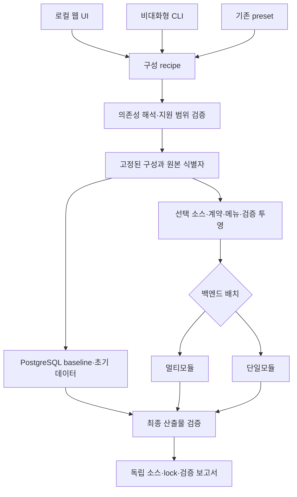

# 선택형 프로젝트 생성기 설계

이 설계는 Foundation과 Core를 기본으로 포함하고, 필요한 업무 기능과 DB, 백엔드 소스 배치를 선택하여 독립 프로젝트를 인수하는 흐름을 정의한다. 원본 저장소의 멀티모듈 구조를 유지하면서 **생성 산출물에서 멀티모듈 또는 단일모듈을 선택**하는 것이 목표다.

상태는 **설계**다. 현재 지원하는 재사용 프로필과 앞으로 구현할 기능을 구분하며, 아래 단계의 완료조건은 구현·검증 결과 없이 충족된 것으로 해석하지 않는다. 사용자 요구에 따라 DB는 PostgreSQL부터 지원하고, 생성 소스는 도입자가 독립적으로 수정한다. 추가 DB, 임의 업무 조합, 로컬 웹 UI는 단계적으로 제공한다.

## 1. 적용 경계와 근거

이 문서는 구현 설계이며 규칙의 새 정본이 아니다. [AGENTS](../../AGENTS.md), [오케스트레이션 프로토콜](../03-guides/orchestration-protocol.md), [백엔드 헌법](../../.agent/knowledge/backend-api-constitution/artifacts/constitution.md), [프론트엔드 헌법](../../.agent/knowledge/frontend-ux-constitution/artifacts/constitution.md), [DB 헌법](../../.agent/knowledge/db-standard-constitution/artifacts/constitution.md)을 따른다.

백엔드 헌법 제1·2조의 원본 모듈 책임과 의존 방향은 유지한다. 단일모듈은 사용자 요구에 따른 **내보내기 형식**이며, 원본을 단일모듈로 개편하거나 Entity·서비스·API의 논리적 경계를 없애는 작업이 아니다. 인가 의미, 물리 스키마 근거, 테스트 보존, 실패를 숨기지 않는 생성 규칙도 출력 형식과 무관하게 유지한다.

| 현재 확인한 원본 | 설계에 주는 제약 |
|---|---|
| [재사용 manifest](../../config/reusable-base-profiles.json) | 현재 프로필은 `core`, `collaboration`, `demo`이며 pack은 `core`, `collaboration`, `survey`, `demo`다. 프로필을 기존 사용자용 preset으로 보존한다. |
| [프로필 계약](../../scripts/reusable-base-census.mjs) | 현재 rank는 누적 포함을 요구한다. 임의 기능 선택에는 rank 순서를 대신할 명시적 의존성 해석이 필요하다. |
| [소스 생성기](../../scripts/generate-reusable-base-source.mjs) | 제외 소스와 전이 importer를 제거한다. 사용자가 선택한 기능이 연쇄로 사라지지 않는지도 확인해야 한다. |
| [DB 생성기](../../scripts/generate-reusable-base-db.mjs) | 일회용 PostgreSQL에 현재 migration을 적용한 뒤 프로필 baseline을 만들고 다른 빈 DB에 재적용한다. 검증된 경로를 재사용한다. |
| [재사용 가이드](../03-guides/reusable-base-guide.md) | 릴리스 참조·DB/source lock·제거 게이트·기관 승인 경계를 보존한다. |
| [메뉴 결정](decisions/ADR-0017-task-oriented-menu-navigation.md)과 [권한 카탈로그](../../config/governance/permission-catalog.json) | 메뉴 표시인 NAVIGATION과 API 기능인 OPERATION, 객체 소유권은 서로 다른 계약이다. |
| [Atlas 수집기](../../scripts/atlas-catalog.mjs)와 [route 원장](../../config/ui-route-capabilities.json) | 구조 목록의 존재가 기능 소유권·사용 가능성을 입증하지 않는다. 미확인 항목을 자동 선택 카탈로그로 승격하지 않는다. |

## 2. 하나의 구성 결과와 두 가지 소스 배치

웹 UI와 CLI는 같은 구성 요청을 만들고, 공통 엔진이 의존성과 지원 범위를 해석한다. DB 생성기와 소스 생성기는 이 **해석된 구성(resolved composition)**을 함께 소비한다. 소스 배치 어댑터는 그 뒤에 적용한다.



업무 선택, DB 선택, 소스 배치는 독립 축이다. 동일한 업무·DB·원본을 선택하면 배치가 달라도 API, 메뉴, 테이블, 권한의 의미가 같아야 한다. DB baseline은 Java 파일을 어느 디렉터리에 놓는지에 따라 달라지지 않는다. 레이아웃 변경만으로 동일 DB를 다시 설계하지 않는다.

구성 해석은 파일 삭제·DB 접속·압축 생성과 분리한 순수 계획 단계로 둔다. 잘못된 기능 ID, 모순된 요구, 지원하지 않는 DB·배치는 출력 디렉터리를 만들기 전에 거부한다. 생성 계획에서 직접 선택과 자동 포함을 구분하고 각 포함 사유를 남긴다.

## 3. recipe와 산출물 식별

다음 JSON은 **목표 입력 계약의 예시**다. 현재 CLI가 이 필드를 모두 받는다는 뜻은 아니다. 구현 시 스키마 버전을 고정하고 기존 preset 인자를 호환 어댑터로 해석한다.

```json
{
  "schemaVersion": 1,
  "project": { "name": "agency-service" },
  "sourceRef": "<검증할 릴리스 태그>",
  "selection": { "preset": "collaboration" },
  "database": { "vendor": "postgresql" },
  "backendLayout": "single-module"
}
```

임의 업무 선택 단계에서는 `selection`에 preset 또는 명시 기능 집합 중 하나를 사용한다. preset을 선택한 뒤 일부를 바꾸는 UI는 최종 명시 집합으로 정규화하되, 원래 선택한 preset은 설명용 이력으로 보존할 수 있다. DB 자격증명·관리자 비밀번호·실제 기관 데이터는 recipe에 넣지 않는다.

lock에는 원본 커밋·릴리스 태그, manifest/recipe/해석 결과/DB 번들의 해시, 엔진 및 레이아웃 변환 버전, 최종 포함 기능, 소스 경로 대응, 검증 결과 위치를 기록한다. 동일 입력의 비교는 의미 있는 파일 내용과 정규화한 구성 해시로 하고 생성 시각이나 임시 디렉터리명을 구성 차이로 취급하지 않는다.

출력 폴더는 새 경로만 허용하고 기존 프로젝트를 덮어쓰지 않는다. 준비 디렉터리에서 생성·검증한 뒤 성공 산출물로 승격하며 실패 결과는 실패 상태와 원인으로 구분한다. 압축 파일은 검증된 폴더의 선택적 전달 형식이다. 초기 버전부터 ZIP 다운로드 서버나 원격 생성 큐를 필수 구성으로 만들 필요는 없다.

## 4. 멀티모듈과 단일모듈 출력 계약

| 항목 | 멀티모듈 | 단일모듈 |
|---|---|---|
| Gradle 구조 | 기존 온라인 모듈 경계 유지 | `include` 없는 루트 Gradle project 하나 |
| Java 패키지 | 원본 패키지 유지 | 원본 패키지 유지 |
| 책임 구분 | 모듈과 패키지로 표현 | 패키지와 아키텍처 검증으로 표현 |
| 업무·DB 범위 | 해석된 구성과 동일 | 같은 해석된 구성과 동일 |
| 프론트엔드 | 별도 `frontend` 애플리케이션 | 별도 `frontend` 애플리케이션 |
| 테스트·하네스 | 해당 구성의 활성 테스트 실행 | 원본 출처별 suite에서 같은 적용범위의 테스트·하네스 실행 |
| 기존 호출 호환성 | 기존 출력 기본값 | 명시적으로 선택할 때만 적용 |

여러 Gradle 모듈을 그대로 둔 채 실행 jar 하나를 만드는 것은 단일모듈 출력의 완료조건이 아니다. Gradle 프로젝트 목록과 의존 그래프에서 온라인 백엔드가 실제로 하나인지 확인한다. Java 패키지명을 한꺼번에 바꾸는 기능은 이 배치 변환과 별도로 다룬다.

단일모듈 어댑터는 다음을 처리해야 한다.

1. 선택된 온라인 모듈의 main 소스·자원과 test·testFixtures를 루트 project의 source set에 연결한다. `foundation`, `business-core`, `business-app`, `api-server`의 기존 소스 디렉터리는 논리적 소스 그룹으로 보존한다. 각 폴더를 별도 Gradle project로 등록하지 않으며, 루트 `src`로 물리 통합하는 기능은 이번 범위에 포함하지 않는다.
2. 모듈 간 `project(...)` 의존성을 실제 외부 의존성·configuration·annotation processor의 합성으로 바꾼다. compileOnly, runtimeOnly, test 의존성을 임의로 모두 implementation에 합치지 않는다.
3. 동일 FQCN, 동일 대상 파일, 설정 자원, service descriptor, 테스트 자원이 충돌하면 전체 목록을 보여주고 실패한다. 파일 순서에 따른 덮어쓰기는 허용하지 않는다. 병합 가능한 자원은 명시 정책과 그 정책의 테스트가 있을 때만 합친다.
4. 동일한 단순 클래스명이라도 패키지가 다르면 보존한다. 테스트는 원본 출처별 source set/task로 격리한다. 같은 이름의 테스트용 application YAML과 H2 자원이 다른 suite를 덮어쓰지 않도록 하며, 해당 suite에 필요한 testFixtures와 classpath만 연결한다. 충돌을 피하려고 테스트를 삭제하거나 skip하지 않는다.
5. 단위 테스트, governance harness, PostgreSQL schema-validation의 실행 경로와 모집단을 보존한다. 모듈별 source 경로를 읽는 검사에는 경로 대응을 제공하고, Gradle task 경로·coverage 입력·CI 소비자도 함께 조정한다.
6. 생성된 Gradle 설정, 실행 스크립트, 컨테이너 빌드, 문서의 경로를 최종 배치에 맞춘다. Java 파일을 합치는 데서 작업을 끝내지 않는다.

`migration-tool`은 온라인 백엔드와 분리된 이관 CLI다. 단일모듈 출력에도 원본 소스를 보존하되 루트 project의 별도 migration source set·테스트 task·`migrationBootJar`로 빌드한다. 온라인 main/test classpath와 실행 jar에 넣지 않는다. Gradle project는 하나지만 온라인과 오프라인 실행 산출물의 책임과 의존성은 분리하며, 이관 도구를 온라인 실행에 필요한 요소처럼 안내하지 않는다.

### 확정한 배치 기준과 구현 확인 항목

출력 레이아웃의 기준은 아래와 같다. 정확한 task·classpath·검증 경로는 어댑터 코드와 실행 결과로 확인하며, 이 표 자체는 구현 완료 증거가 아니다.

| 항목 | 설계 기준 | 구현에서 확인할 내용 |
|---|---|---|
| 단일모듈 파일 배치 | 기존 디렉터리를 소스 그룹으로 유지하고 루트 project만 등록 | Gradle projects 결과, `project(...)` 의존성 부재, 독립 빌드 |
| 테스트 충돌 | 출처별 테스트 suite와 자원·classpath 격리 | 같은 이름의 resource가 다른 suite에 섞이지 않는지와 전체 적용 테스트 실행 |
| 이관 도구 | 별도 source set·test·`migrationBootJar` | 온라인 jar/classpath 부재와 독립 CLI 실행 산출물 |
| 경로 기반 하네스 | 기존 소스 위치와 검사 적용범위 유지 | 루트 실행 시 working directory·source root 탐색·task adapter의 정합성 |

CLI 설계는 `--layout multi-module|single-module`이며 기본값은 `multi-module`이다. 기존 `--profile core|collaboration|demo`와 독립된 옵션으로 생성기와 검증 runner에 전달한다. 기존 모듈별 build 파일이 출처 자료로 남더라도 루트 settings가 이를 하위 project로 포함하지 않으면 활성 Gradle 모듈로 계산하지 않는다. 사용법은 생성된 안내문에서 실제 활성 진입점으로 연결한다.

## 5. 업무 카탈로그와 의존성

사용자의 기본 선택 단위는 **업무 기능(capability)**이다. Java 폴더, 메뉴 한 줄, 화면 하나를 그대로 선택 단위로 삼지 않는다. 기능은 관련 소스·API·화면·테이블·권한·메뉴·테스트와 외부 설정 요구를 함께 소유한다.

카탈로그는 기존 재사용 manifest를 확장하거나 그 원본에서 생성하여 소유권 정본을 중복시키지 않는다. 새로운 선언은 현재 코드와 실제 projection으로 대조한다. 필요한 정보는 다음과 같다.

| 관계·정보 | 의미 |
|---|---|
| 필수 의존성 | 함께 포함해야 컴파일·기동·업무 의미가 성립하는 기능 |
| 선택적 연동 | 두 기능이 함께 있을 때 활성화하는 어댑터·화면 구역 |
| 공유 자원 | 여러 기능이 소비하지만 소유권과 생성 횟수는 하나인 테이블·공통 서비스 |
| 충돌·지원 조건 | 동시에 제공할 수 없는 선택이나 검증되지 않은 조합 |
| 생존 계약 | 선택 후 반드시 남아야 하는 API·route·테이블·대표 사용자 흐름 |
| 검증 소유권 | 기능 전용 검사와 공통·횡단 검사, 제외될 때의 적용범위 근거 |

현재 게시판·댓글·스크랩은 manifest가 함께 선택하도록 선언한 클러스터다. 대시보드는 게시판·알림을 요구한다. `tb_tmplt_info`는 게시판과 템플릿이 공유한다. 반면 [수신자 피커](../../frontend/src/app/components/ui/recipient-picker.tsx)의 주소록은 주입형 선택 연동이다. 이 차이를 무시하고 모든 연결을 강제 의존성으로 만들면 불필요한 기능까지 포함된다.

기존 rank를 단순 삭제하지 않고 기존 세 preset을 새로운 의존성 해석으로 같은 결과가 나오도록 먼저 옮긴다. 상위 pack이 하위 pack의 import를 사용할 수 있었던 프런트 마커, rank를 사용하는 census·review scope·게이트 소유권도 함께 전환한다. 모든 임의 조합의 지원을 한 번에 선언하지 않고, 검증한 기능부터 카탈로그에 선택 가능 상태로 공개한다.

## 6. 메뉴·권한·DB 초기화

업무 포함 여부와 메뉴 노출 여부는 별도다. 최초 UI는 기능을 선택하면 포함될 사용자·관리자 메뉴를 미리 보여준다. 세부 메뉴 조정은 초기 내비게이션 노출을 바꾸는 것으로 설명하고, 코드 제거 또는 API 차단으로 표현하지 않는다.

선택 기능의 메뉴, 프로그램 연결, 부모 계층, NAVIGATION, OPERATION을 같은 해석 결과에서 생성한다. 필요한 부모 메뉴는 포함하고 빈 분류는 정리한다. query를 사용하는 목적지와 redirect도 확인한다. 기능 선택이 owner-only 또는 수신자·결재자 제한을 완화해서는 안 된다.

현재 [관리자 초기화 시드](../../api-server/src/main/resources/db/migration/R__zz_seed_base_admin.sql)는 core 잔존 화면의 최소 관리자 트리를 준비한다. 선택 기능별 메뉴를 제공하려면 별도의 소유권 연결과 초기화 검증이 필요하다. 운영 DB의 현재 메뉴와 사용자별 권한·업무 데이터를 새 프로젝트의 기본값으로 덤프하지 않는다.

PostgreSQL은 기존 migration을 적용한 일회용 DB에서 스키마를 투영하고 빈 DB에 재적용하는 경로를 유지한다. FK·인덱스·제약·sequence·기본값·표준 메타·관리자 부트스트랩을 검증한다. ORM Entity로 DDL을 다시 만드는 방식은 현재 물리 계약을 대체하지 않는다. DB나 Entity 변경에 들어갈 때는 DB 헌법과 H1에 따라 live schema·표준 메타를 먼저 조회한다.

Oracle·MySQL/MariaDB·SQL Server는 후속 DB adapter 범위다. DDL 문법 출력만으로 지원 완료라고 하지 않고 driver, SQL, ID 생성, 날짜·문자열·정렬 의미, Flyway 초기화, 실제 vendor의 스키마·대표 업무 검증을 갖춘 뒤 선택 가능하게 한다.

## 7. 로컬 웹 UI와 CLI

로컬 UI는 제품의 관리자 화면과 별도 실행한다. 프로젝트 생성에 전체 업무 앱의 로그인·DB·운영 서버를 선행 조건으로 두지 않기 위해서다. UI가 받는 입력과 CLI recipe가 같은 엔진으로 정규화되므로 어느 경로를 사용해도 같은 결과를 얻는다.

권장 사용자 흐름은 다음과 같다.

1. 프로젝트명과 원본 버전, 새 생성 위치를 정한다.
2. Foundation/Core가 포함된 상태에서 preset 또는 검증된 업무 기능을 선택한다.
3. 자동 포함 사유와 선택적 연동, 결과 메뉴를 확인한다.
4. PostgreSQL과 백엔드 배치를 선택한다. 미지원 DB는 생성 가능한 옵션으로 표시하지 않는다.
5. 구성·필요 외부 설정·검증 범위를 미리 확인하고 생성한다.
6. 단계별 상태와 오류를 확인한 뒤 소스, recipe, lock, 검증 보고서를 인수한다.

프런트엔드 헌법의 입력 오류 연결·중복 제출 방지·입력 보존과 키보드·상태 전달 계약을 적용한다. 자동 포함 체크박스에는 이유를 제공하고 해제 시 영향을 설명한다. 생성 실패를 빈 결과나 성공 토스트로 바꾸지 않는다.

로컬 서버는 loopback에서만 바인딩하고 요청 출처를 확인한다. 입력 ID는 allowlist와 recipe 스키마로 검증하며 shell 문자열을 조립하지 않는다. 출력 절대 경로를 허용된 새 디렉터리로 제한하고 기존 파일을 덮어쓰지 않는다. DB·관리자 비밀은 UI URL·recipe·로그에 기록하지 않는다. 원격 서비스나 운영 관리자 API의 빌드 실행 권한은 이 단계의 범위가 아니다.

CLI는 먼저 비대화형 recipe 입력과 계획 조회·생성·검증 경로를 제공한다. 방향키 기반 마법사는 필요할 때 같은 엔진 위에 추가할 수 있지만 웹 UI 제공의 선행조건은 아니다. [Atlas](../03-guides/governance-atlas-guide.md)는 설명·검색·원본 링크에 활용하고 생성기 정본이나 실행 서버로 바꾸지 않는다.

## 8. 단계별 완료조건

| 단계 | 구현 범위 | 완료조건 |
|---|---|---|
| A. 출력 레이아웃 | 현재 세 preset과 PostgreSQL 생성 경로에 배치 선택 추가 | 기본 멀티모듈 결과 보존, 단일 Gradle project 확인, 적용 테스트·자원·하네스 보존, 충돌 red, 생성 산출물 컴파일·검증 |
| B. 공통 composition | recipe·해석기·계획 조회·공통 lock·비대화형 CLI | 기존 preset 결과의 동등성, 원본·DB·소스 식별 불일치 거부, 잘못된 요청의 무출력 실패, 반복 생성의 결정성 |
| C. 업무 선택 | rank 누적 모델을 명시 의존성과 기능별 소유권으로 확장 | core+각 선택 기능, 필수 의존 묶음, 선택적 연동, 전체 구성의 생존·제외 계약과 실제 산출물 검증 |
| D. 로컬 UI | 업무 선택·메뉴 미리보기·DB/배치 선택·생성 상태·결과 인수 | 같은 recipe의 CLI/UI 동등 결과, 키보드 완주, 입력 보존·중복 제출·오류 복구, 실제 생성 프로젝트 기동 |
| E. DB 확대 | 실제 필요 DB부터 adapter와 지원 상태 추가 | 해당 vendor의 빈 DB 적용·스키마 검증·인가·대표 CRUD와 데이터 의미 검증 |

단계 A는 사용자에게 당장 필요한 소스 배치 선택을 분리해 제공한다. B~D의 완성 없이 임의 업무 선택 UI가 이미 구현됐다고 표현하지 않는다. 미완성 조합이나 배치를 테스트 제외로 통과시키지 않고 지원 범위를 명시하거나 생성 자체를 거부한다.

## 9. 검증과 실패 처리

기존 [gate registry](../../config/governance/gates.json), 재사용 계약, [산출물 검증기](../../scripts/verify-reusable-artifact.mjs)를 우선 확장한다. 동일 불변식을 검사하는 별도 게이트를 중복해서 늘리지 않는다.

| 검증 층 | 확인할 내용 |
|---|---|
| 계획 계약 | 잘못된 ID·순환·누락 의존성·지원하지 않는 DB/배치·원본 불일치의 실패 |
| 출력 계약 | 원본 불변, 기존 출력 덮어쓰기 거부, 경로 탈출 거부, 파일/FQCN/resource 충돌 실패 |
| 구성 동등성 | 두 배치의 API·메뉴·테이블·권한·기능별 검증 모집단 일치 |
| Java | main/test/testFixtures 컴파일, 영향 단위 테스트, 논리 레이어와 인가 하네스 |
| 프런트엔드 | 생성 계약, 타입·lint·build, route/redirect/메뉴 목적지, 선택 기능의 화면 생존 |
| PostgreSQL | 빈 DB 재적용, Hibernate validate, FK·인덱스·sequence·seed·관리자 기능 부여 |
| 사용자 흐름 | 로그인 → 유효한 메뉴 → 선택 업무의 대표 CRUD, 미선택 기능 부재, 주소록 없는 메일/SMS 같은 선택 연동 경계 |
| 증거 무결성 | 제거 게이트의 정확한 사유, 원본 검토 이력 보존, 현재 구성의 활성 모집단과 실행 보고서 |

새 검사나 변경된 게이트는 green뿐 아니라 의도적 위반이 red가 되는지도 확인한다. 필요한 기능의 route를 연쇄 삭제한 경우, 필수 FK 대상을 빠뜨린 경우, 동일 FQCN을 합친 경우, source path를 잘못 매핑한 경우가 대표 부정 입력이다. 운영 권한이나 실제 외부 메일·SMS를 사용하지 않는 격리 환경에서 검증한다.

조합 수가 늘어나면 모든 부분집합을 매번 빌드하는 대신 core, 각 독립 기능, 모든 명시적 연동 edge, 공유 자원 경계, 전체 구성을 기본 matrix로 유지하고 변경 영향 조합을 추가한다. 이 matrix는 미실행 조합의 성공을 주장하는 근거가 아니다. 새로 지원하는 조합은 실제 산출물 검증을 통과해야 한다.

파일 검사·컴파일·DB 재적용·사용자 흐름은 서로 다른 증거다. 실행하지 못한 단계는 이유와 범위를 보고하고 전체 성공으로 승격하지 않는다. [ADR-0018](decisions/ADR-0018-governance-review-lifecycle-and-adoption.md)에 따라 원본 운영 사실을 도입 기관의 승인으로 복제하지 않으며 기관 도입 검토는 pending에서 시작한다.

## 10. 인수와 이후 변경

생성 결과는 자체 빌드·실행 가능한 소스로 인수한다. 실행 시 원본 저장소나 Composer 서버가 필요하지 않아야 한다. 도입자는 독립 저장소에서 기능과 정책을 수정하고 자신의 검증·운영 근거를 관리한다.

소스 생성기는 출력 루트에 독립 Git 저장소를 초기화하여 부모 저장소의 ignore 규칙이 생성물의 파일 탐색에 영향을 주지 않게 한다. 이는 로컬 작업 경계를 만드는 절차이며 자동 staging·커밋·원격 연결·발행은 하지 않는다. 소스 출처는 원본 이력을 복제하는 대신 생성 lock으로 확인한다.

원본 보안 수정이나 기능 업데이트의 자동 병합은 초기 범위에 포함하지 않는다. lock의 원본 버전과 경로 대응은 후속 변경을 비교하는 근거로 남기되, 기관 소스를 자동 재생성해 덮어쓰지 않는다. 업무별 Gradle 모듈·배포 라이브러리화는 실제 공유 업데이트 요구가 생길 때 검토할 후속 선택지다. 그것을 선택형 프로젝트 생성의 선행 대규모 개편으로 삼지 않는다.
