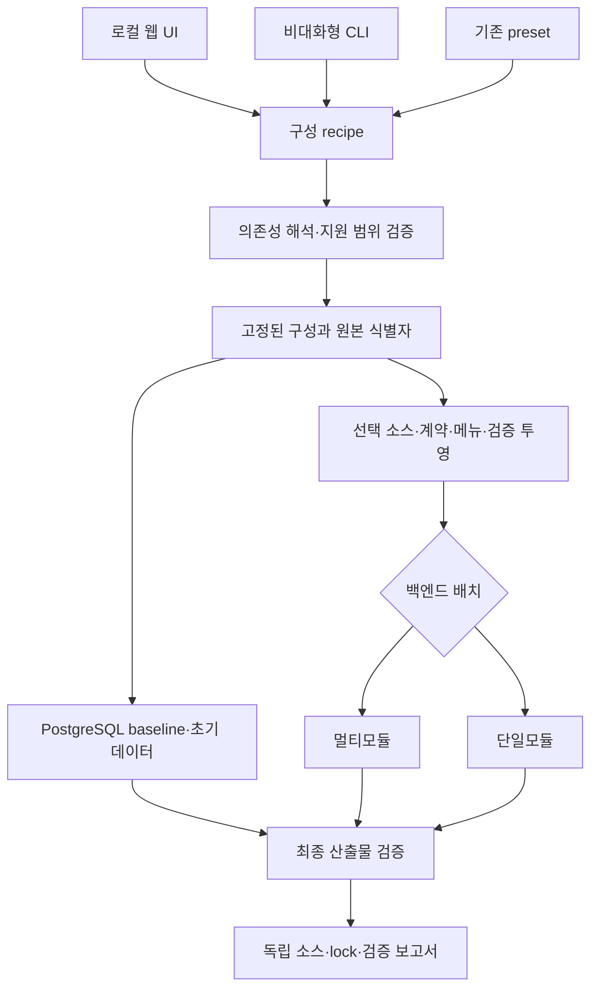

# 선택형 프로젝트 생성기 설계

이 문서는 Foundation과 Core를 기본으로 포함하고, 필요한 업무 기능과 백엔드 소스 배치를 선택하여 독립 프로젝트를 인수하는 설계와 현재 구현 경계를 설명한다. 원본 저장소의 멀티모듈 구조를 유지하면서 **생성 산출물에서 멀티모듈 또는 단일모듈을 선택**한다.

현재 구현은 공통 recipe·의존성 해석기·비대화형 CLI, 19개 업무 도메인의 선택과 자동 포함, PostgreSQL 투영, 두 백엔드 배치, 별도 로컬 웹 UI까지 포함한다. 생성 소스는 도입자가 독립적으로 수정한다. 추가 DB와 생성 후 원본 업데이트 자동 병합은 후속 범위다.

전체 기술 검증은 생성 작업마다 실행한다. DB 재적용이나 개별 계약 검사 통과를 Java·프런트엔드·기동 검증 전체의 완료로 해석하지 않는다. 실행별 완료 여부는 아래 검증 경로의 실제 보고서로 판정한다.

## 1. 적용 경계와 근거

이 문서는 구현 설계이며 규칙의 새 정본이 아니다. [AGENTS](../../AGENTS.md), [오케스트레이션 프로토콜](../03-guides/orchestration-protocol.md), [백엔드 헌법](../../.agent/knowledge/backend-api-constitution/artifacts/constitution.md), [프론트엔드 헌법](../../.agent/knowledge/frontend-ux-constitution/artifacts/constitution.md), [DB 헌법](../../.agent/knowledge/db-standard-constitution/artifacts/constitution.md)을 따른다.

백엔드 헌법 제1·2조의 원본 모듈 책임과 의존 방향은 유지한다. 단일모듈은 사용자 요구에 따른 **내보내기 형식**이며, 원본을 단일모듈로 개편하거나 Entity·서비스·API의 논리적 경계를 없애는 작업이 아니다. 인가 의미, 물리 스키마 근거, 테스트 보존, 실패를 숨기지 않는 생성 규칙도 출력 형식과 무관하게 유지한다.

| 현재 확인한 원본 | 설계에 주는 제약 |
|---|---|
| [재사용 manifest](../../config/reusable-base-profiles.json) | 현재 프로필은 `core`, `collaboration`, `demo`이며 pack은 `core`, `collaboration`, `survey`, `demo`다. 프로필을 기존 사용자용 preset으로 보존한다. |
| [프로필 계약](../../scripts/reusable-base-census.mjs)과 [구성 해석기](../../scripts/project-composer-recipe.mjs) | 기존 preset의 rank·누적 포함을 보존하며, 개별 도메인 선택은 명시적 의존성과 소유권으로 해석한다. |
| [소스 생성기](../../scripts/generate-reusable-base-source.mjs) | 제외 소스와 전이 importer를 제거한다. 사용자가 선택한 기능이 연쇄로 사라지지 않는지도 확인해야 한다. |
| [DB 생성기](../../scripts/generate-reusable-base-db.mjs) | 일회용 PostgreSQL에 현재 migration을 적용한 뒤 구성 baseline을 만들고 다른 빈 DB에 재적용한다. 프리셋(`--profile`)도 같은 해석기로 구성을 만들어 이 경로를 탄다(DEC-OPS-239). |
| [재사용 가이드](../03-guides/reusable-base-guide.md) | 릴리스 참조·DB/source lock·제거 게이트·기관 승인 경계를 보존한다. |
| [메뉴 결정](decisions/ADR-0017-task-oriented-menu-navigation.md)과 [권한 카탈로그](../../config/governance/permission-catalog.json) | 메뉴 표시인 NAVIGATION과 API 기능인 OPERATION, 객체 소유권은 서로 다른 계약이다. |
| [Atlas 수집기](../../scripts/atlas-catalog.mjs)와 [route 원장](../../config/ui-route-capabilities.json) | 구조 목록의 존재가 기능 소유권·사용 가능성을 입증하지 않는다. 미확인 항목을 자동 선택 카탈로그로 승격하지 않는다. |

## 2. 하나의 구성 결과와 두 가지 소스 배치

웹 UI와 CLI는 같은 구성 요청을 만들고, 공통 엔진이 의존성과 지원 범위를 해석한다. DB 생성기와 소스 생성기는 이 **해석된 구성(resolved composition)**을 함께 소비한다. 소스 배치 어댑터는 그 뒤에 적용한다.


```mermaid
flowchart TD
    UI[로컬 웹 UI] --> RECIPE[구성 recipe]
    CLI[비대화형 CLI] --> RECIPE
    PRESET[기존 preset] --> RECIPE
    RECIPE --> RESOLVE[의존성 해석·지원 범위 검증]
    RESOLVE --> COMPOSITION[고정된 구성과 원본 식별자]
    COMPOSITION --> DB[PostgreSQL baseline·초기 데이터]
    COMPOSITION --> SOURCE[선택 소스·계약·메뉴·검증 투영]
    SOURCE --> LAYOUT{백엔드 배치}
    LAYOUT --> MULTI[멀티모듈]
    LAYOUT --> SINGLE[단일모듈]
    DB --> VERIFY[최종 산출물 검증]
    MULTI --> VERIFY
    SINGLE --> VERIFY
    VERIFY --> RESULT[독립 소스·lock·검증 보고서]
```

업무 선택, DB 선택, 소스 배치는 독립 축이다. 동일한 업무·DB·원본을 선택하면 배치가 달라도 API, 메뉴, 테이블, 권한의 의미가 같아야 한다. DB baseline은 Java 파일을 어느 디렉터리에 놓는지에 따라 달라지지 않는다. 레이아웃 변경만으로 동일 DB를 다시 설계하지 않는다.

구성 해석은 파일 삭제·DB 접속·압축 생성과 분리한 순수 계획 단계로 둔다. 잘못된 기능 ID, 모순된 요구, 지원하지 않는 DB·배치는 출력 디렉터리를 만들기 전에 거부한다. 생성 계획에서 직접 선택과 자동 포함을 구분하고 각 포함 사유를 남긴다.

## 3. recipe와 산출물 식별

다음 JSON은 현재 CLI와 UI가 사용하는 `schemaVersion: 1` recipe다. `sourceRef`는 현재 체크아웃의 commit으로 해석되어야 하며, 생성기가 다른 버전을 자동 checkout하지 않는다. UI는 현재 정확한 commit을 저장한다.

```json
{
  "schemaVersion": 1,
  "project": { "name": "agency-service" },
  "sourceRef": "HEAD",
  "selection": { "domains": ["mail", "schedule"] },
  "database": { "vendor": "postgresql" },
  "backendLayout": "single-module"
}
```

`selection`은 `{"preset":"collaboration"}`처럼 `core`·`collaboration`·`demo` 중 한 preset을 지정하거나 `{"domains":["mail","schedule"]}`처럼 명시 도메인을 지정한다. 두 필드를 함께 넣거나 알 수 없는 필드를 추가하면 거부한다. `domains: []`는 Foundation/Core만 포함한다. 프로젝트명은 영문 소문자로 시작하는 1~63자이며 소문자·숫자·단어 사이 하이픈만 허용하고 Windows 예약 이름은 거부한다. `database.vendor`는 `postgresql`, `backendLayout`은 `multi-module` 또는 `single-module`이다. preset에서 개별 선택을 바꾸면 UI는 명시 도메인 집합으로 요청한다. DB 자격증명·관리자 비밀번호·실제 기관 데이터는 recipe에 넣지 않는다.

해석 결과는 직접 선택·자동 포함과 사유, 포함 도메인·테이블·시퀀스·메뉴 경로·권한·화면 경로, catalog/recipe/composition 해시를 담는다. DB와 소스 생성기는 원본 카탈로그에서 recipe를 다시 해석하고 `sourceRef`·현재 commit을 확인한다. DB lock은 빈 DB 재적용 검증 후에만 `validated: true`와 SQL 네 파일의 SHA-256을 기록하며 소스 생성기는 이를 대조한다. 소스 lock·생성 보고서는 원본 식별, 배치, 구성 및 DB 식별, 검증 범위·결과를 기록한다. 배치도 구성 해시에 결속되므로 다른 배치의 lock으로 바꿔 끼우지 않는다.

출력 폴더는 작업공간 내 새 경로만 허용하고 기존 프로젝트를 덮어쓰지 않는다. `.pending-` 디렉터리에 소스를 구성한 후 **의존성 설치 전에 최종 경로를 확정**한다. Windows pnpm이 절대 경로 junction을 만들기 때문에 설치·검증 후 폴더를 rename하여 승격하지 않는다. 최종 위치의 보고서는 `verifying`에서 시작하고 전체 검증 후 `passed`, 실패 시 `failed`가 된다. 폴더가 존재한다는 사실은 완료 증거가 아니다. 실패 결과와 단계는 작업 보고서에 남긴다. ZIP 다운로드와 원격 생성 큐는 현재 제공하지 않는다.

## 4. 멀티모듈과 단일모듈 출력 계약

| 항목 | 멀티모듈 | 단일모듈 |
|---|---|---|
| Gradle 구조 | 기존 온라인 모듈 경계 유지 | `include` 없는 루트 Gradle project 하나 |
| Java 패키지 | 원본 패키지 유지 | 원본 패키지 유지 |
| 책임 구분 | 모듈과 패키지로 표현 | 패키지와 아키텍처 검증으로 표현 |
| 업무·DB 범위 | 해석된 구성과 동일 | 같은 해석된 구성과 동일 |
| 프론트엔드 | 별도 `frontend` 애플리케이션 | 별도 `frontend` 애플리케이션 |
| 테스트·하네스 | 해당 구성의 활성 테스트 실행 | 원본 출처별 suite에서 같은 적용범위의 테스트·하네스 실행 |
| 기존 호출 호환성 | 기존 출력 기본값 | 명시적으로 선택할 때만 적용 |

여러 Gradle 모듈을 그대로 둔 채 실행 jar 하나를 만드는 것은 단일모듈 출력의 완료조건이 아니다. Gradle 프로젝트 목록과 의존 그래프에서 온라인 백엔드가 실제로 하나인지 확인한다. Java 패키지명을 한꺼번에 바꾸는 기능은 이 배치 변환과 별도로 다룬다.

[단일모듈 어댑터](../../scripts/reusable-single-module.mjs)는 다음 계약을 적용한다.

1. 선택된 온라인 모듈의 main 소스·자원과 test·testFixtures를 루트 project의 source set에 연결한다. `foundation`, `business-core`, `business-app`, `api-server`의 기존 소스 디렉터리는 논리적 소스 그룹으로 보존한다. 각 폴더를 별도 Gradle project로 등록하지 않으며, 루트 `src`로 물리 통합하는 기능은 이번 범위에 포함하지 않는다.
2. 모듈 간 `project(...)` 의존성을 실제 외부 의존성·configuration·annotation processor의 합성으로 바꾼다. compileOnly, runtimeOnly, test 의존성을 임의로 모두 implementation에 합치지 않는다.
3. 동일 FQCN, 동일 대상 파일, 설정 자원, service descriptor, 테스트 자원이 충돌하면 전체 목록을 보여주고 실패한다. 파일 순서에 따른 덮어쓰기는 허용하지 않는다. 병합 가능한 자원은 명시 정책과 그 정책의 테스트가 있을 때만 합친다.
4. 동일한 단순 클래스명이라도 패키지가 다르면 보존한다. 테스트는 원본 출처별 source set/task로 격리한다. 같은 이름의 테스트용 application YAML과 H2 자원이 다른 suite를 덮어쓰지 않도록 하며, 해당 suite에 필요한 testFixtures와 classpath만 연결한다. 충돌을 피하려고 테스트를 삭제하거나 skip하지 않는다.
5. 단위 테스트, governance harness, PostgreSQL schema-validation의 실행 경로와 모집단을 보존한다. 모듈별 source 경로를 읽는 검사에는 경로 대응을 제공하고, Gradle task 경로·coverage 입력·CI 소비자도 함께 조정한다.
6. 생성된 Gradle 설정, 실행 스크립트, 컨테이너 빌드, 문서의 경로를 최종 배치에 맞춘다. Java 파일을 합치는 데서 작업을 끝내지 않는다.

`migration-tool`은 온라인 백엔드와 분리된 이관 CLI다. 단일모듈 출력에도 원본 소스를 보존하되 루트 project의 별도 migration source set·테스트 task·`migrationBootJar`로 빌드한다. 온라인 main/test classpath와 실행 jar에 넣지 않는다. Gradle project는 하나지만 온라인과 오프라인 실행 산출물의 책임과 의존성은 분리하며, 이관 도구를 온라인 실행에 필요한 요소처럼 안내하지 않는다.

### 확정한 배치 기준과 구현 확인 항목

출력 레이아웃의 기준은 아래와 같다. 정확한 task·classpath·검증 경로는 어댑터 코드와 실행 결과로 확인하며, 이 표 자체는 구현 완료 증거가 아니다.

| 항목 | 설계 기준 | 구현에서 확인할 내용 |
|---|---|---|
| 단일모듈 파일 배치 | 기존 디렉터리를 소스 그룹으로 유지하고 루트 project만 등록 | Gradle projects 결과, `project(...)` 의존성 부재, 독립 빌드 |
| 테스트 충돌 | 출처별 테스트 suite와 자원·classpath 격리 | 같은 이름의 resource가 다른 suite에 섞이지 않는지와 전체 적용 테스트 실행 |
| 이관 도구 | 별도 source set·test·`migrationBootJar` | 온라인 jar/classpath 부재와 독립 CLI 실행 산출물 |
| 경로 기반 하네스 | 기존 소스 위치와 검사 적용범위 유지 | 루트 실행 시 working directory·source root 탐색·task adapter의 정합성 |

기존 프로필용 소스 생성기와 검증 runner는 `--layout multi-module|single-module`을 받으며 기본값은 `multi-module`이다. Composer는 recipe의 `backendLayout`을 사용한다. 기존 모듈별 build 파일이 출처 자료로 남더라도 루트 settings가 이를 하위 project로 포함하지 않으면 활성 Gradle 모듈로 계산하지 않는다. 단일모듈의 온라인 진입점은 루트 `bootRun`·`bootJar`이며 `harnessTest`·`schemaValidationTest`와 출처별 suite를 묶는 `allTests`를 제공한다. 사용법은 생성된 안내문에서 실제 활성 진입점으로 연결한다.

## 5. 업무 카탈로그와 의존성

사용자의 기본 선택 단위는 **업무 기능(capability)**이다. Java 폴더, 메뉴 한 줄, 화면 하나를 그대로 선택 단위로 삼지 않는다. 기능은 관련 소스·API·화면·테이블·권한·메뉴·테스트와 외부 설정 요구를 함께 소유한다.

[카탈로그](../../scripts/project-composer-catalog.mjs)는 기존 재사용 manifest·Java import·권한 카탈로그와 명시된 프런트엔드 소유권을 읽어 19개 도메인을 구성한다. 기존 소유권 정본을 복제하는 대신 해당 근거를 사용하고, 공유 화면과 필수 UI 참조는 명시적 의존성으로 추가한다. 구성 판단에 사용하는 정보는 다음과 같다.

| 관계·정보 | 의미 |
|---|---|
| 필수 의존성 | 함께 포함해야 컴파일·기동·업무 의미가 성립하는 기능 |
| 선택적 연동 | 두 기능이 함께 있을 때 활성화하는 어댑터·화면 구역 |
| 공유 자원 | 여러 기능이 소비하지만 소유권과 생성 횟수는 하나인 테이블·공통 서비스 |
| 충돌·지원 조건 | 동시에 제공할 수 없는 선택이나 검증되지 않은 조합 |
| 생존 계약 | 선택 후 반드시 남아야 하는 API·route·테이블·대표 사용자 흐름 |
| 검증 소유권 | 기능 전용 검사와 공통·횡단 검사, 제외될 때의 적용범위 근거 |

현재 게시판·댓글·스크랩은 manifest가 함께 선택하도록 선언한 클러스터다. 대시보드는 게시판·알림을 요구한다. `tb_tmplt_info`는 게시판과 템플릿이 공유한다. 반면 [수신자 피커](../../frontend/src/app/components/ui/recipient-picker.tsx)의 주소록은 주입형 선택 연동이다. 이 차이를 무시하고 모든 연결을 강제 의존성으로 만들면 불필요한 기능까지 포함된다.

선택 연동은 [연동 선언](../../scripts/project-composer-integrations.mjs)에 이벤트·포트·선택 외래 키 셋 중 하나로 적고, 계획이 '기능 저하'로 알린다. 저하는 연동의 출발 기능이 포함되고 상대 기능이 빠진 구성에서만 보이며, 자동 포함하지도 생성을 막지도 않는다. 이벤트 연동은 손으로 근거를 적지 않는다. 카탈로그가 네 모듈의 생산 Java에서 리스너가 받는 이벤트 타입을 찾고, 그 이벤트를 만드는 위치와 각 파일의 소유 기능을 계산한다. 소유는 지원 파일 선언이 먼저이고, 그다음 업무 앱 디렉터리다. foundation·business-core 는 core 다. api-server 파일은 참조하는 업무 패키지를 따르고, 여럿이면 나머지를 모두 끌어오는 기능이 소유자다(없으면 실패한다). 리스너가 받는 타입은 애노테이션에 적은 클래스가 먼저이고, 너무 넓은 타입(Object 등)은 거부한다. 생성자·생성자 참조·빌더/팩토리 호출을 발행 위치로 센다. 시험은 이 소유 판정을 단독 선택 19개 구성에서 생성기의 실제 연쇄 제거와 대조한다. 계산된 연결은 저하 선언 또는 '잃는 것 없음(자기 정리)' 분류 중 정확히 하나에 있어야 한다. "늘 함께 포함되어 저하될 수 없다"는 판정 하나를 두 검사가 같이 쓴다. 직접 선택 폐포에 상대가 있고 출발 기능을 담은 모든 preset에도 상대가 있으면 저하될 수 없다. 포트·선택 외래 키 연동은 주석을 뺀 생산 소스에서 정확히 한 번 나오는 문자열로 근거를 단다. 포트와 화면 슬롯의 새 연동을 기계적으로 찾아내는 일은 매니페스트 v2(Phase 2)의 범위다.

자동 포함은 해석기가 이유와 빠지는 조건을 함께 계산한다. 모든 선택에서 동시에 퍼지는 너비 우선 탐색이 각 자동 포함 기능에 선택으로부터 가장 짧은 경로(`chain`)를 남긴다. 단계마다 그 기능 쌍의 간선 종류·근거 파일과 사용자용 한 문장을 싣는다. 해제 대상(`roots`)은 그 기능에 닿는 선택 전부다. 모두 해제해야 빠지고, 하나라도 남기면 남는다. 프리셋은 화면 계열 간선을 따르지 않으므로 사슬과 해제 대상도 같은 간선 집합으로 계산한다. 사용자 문장은 [사유 표](../../scripts/project-composer-reasons.mjs)가 정본이고, 카탈로그가 실제 간선과 양방향으로 대조한다. 종전 개발자 원문 `reason` 은 호환을 위해 남기지만 화면은 쓰지 않는다. 계획의 `inclusionNotes` 가 경로·단계 문장·해제 방법을 조사까지 맞춘 문장으로 만든다([DEC-OPS-243](../../.agent/memory/decisions.md)).

화면 전용 문구(업무 영역, 기능 카드 요약, 시작 구성의 한국어 이름)는 카탈로그 본문에 두지 않는다. [표시 문구](../../scripts/project-composer-presentation.mjs)가 정본이고, 엔진이 카탈로그를 내보낼 때 해시 밖의 `presentation` 으로 덧붙인다. 문구만 고친 변경이 구성 해시와 로컬 DB 번들을 무효로 만들지 않게 하기 위해서다. 미배정 권한 안내와 같은 원칙이다. 반면 자동 포함 사유 문장은 요구 간선의 일부라서 해시 안에 있다. 표시 문구는 실제 기능·시작 구성과 양방향으로 대조되며, 영문·길이 규칙을 어기면 카탈로그를 내보내지 않는다. 카드의 화면 수는 [라우트 원장](../../config/ui-route-capabilities.json)에서 실제 페이지인 경로만 센다([DEC-OPS-244](../../.agent/memory/decisions.md)).

계획 차이(`POST /api/plan/diff`)는 지금 구성과 기능 하나를 더하거나 뺀 직접 선택을 같은 해석기로 비교한다([계획 차이](../../scripts/project-composer-diff.mjs)). 화면에서 카드를 누르면 직접 선택이 되므로 시작 구성에서 출발해도 비교 대상은 직접 선택이다. 결과는 늘고 주는 기능·테이블·메뉴·권한, 새로 생기거나 해소되는 기능 저하, 생성을 막는 외래 키, 빼도 남는 기능을 붙잡는 선택이다. 해소는 상대 기능이 들어와 풀린 저하만 세고, 출발 기능을 빼서 함께 사라진 저하는 세지 않는다. 문장은 빼도 남는 기능이라도 직접 선택으로 바뀌며 생기는 다른 변화를 함께 말한다. 화면은 계획을 확인한 뒤 직접 바꿀 수 있는 카드에만 묻는다(어느 카드가 자동 포함인지 계획이 정한다). 엔진은 계획·카탈로그 조회가 마지막으로 적재한 카탈로그와 메뉴 스냅숏을 다시 써서 미리보기마다 수 초 걸리는 카탈로그 적재를 하지 않는다. 계획과 생성은 늘 카탈로그를 새로 적재해 다시 판정하므로, 미리보기는 판정 근거가 아니라 안내다([DEC-OPS-245](../../.agent/memory/decisions.md)).

생성 전 점검(`POST /api/preflight`)은 생성을 시작하기 전에 이 컴퓨터의 상태를 사실대로 말한다([생성 전 점검](../../scripts/project-composer-preflight.mjs)). 명령을 띄우므로 계획과 같은 출처·CSRF 경계를 지나고, 원본 비교의 기준인 화면의 커밋을 본문으로 받는다(탭마다 다를 수 있다). Docker(Linux 컨테이너)·Java·Node.js 22·pnpm 9 이상이 없거나, 화면을 연 뒤 원본 커밋이 바뀌었거나 알 수 없거나, 출력 위치의 남은 공간이 생성 하나의 실측 크기 두 배(2GB)보다 적으면 차단한다. PostgreSQL 이미지 부재·커밋되지 않은 변경(새 폴더는 파일 단위로 센다)·JDK 21 이 아닌 Java·남은 공간 5GB 미만은 경고다. 생성기 서버의 PATH·JAVA_HOME 은 시작할 때 고정되고 생성도 같은 환경을 쓰므로, 도구가 없을 때는 설치한 뒤 생성기를 다시 시작하라고 말한다. 명령마다 10초 제한을 두고 넘기면 프로세스 트리를 끝내며, 출력 원문 대신 판정에 쓴 버전·개수만 넘긴다. 서버는 모양이 어긋난 항목이 하나라도 있으면 결과 전체를 실패로 돌린다. 화면의 최종 확인은 점검과 구성 요약을 함께 보이고 차단·실패 동안 생성 시작을 잠근다. 계획은 이 상태를 짐작한 고정 경고를 더 내지 않는다([DEC-OPS-246](../../.agent/memory/decisions.md)).

소스 정밀 점검(`POST /api/plan/deep`)은 생성기가 소스를 복사한 뒤에야 하던 투영·규칙 제거·게이트 승인 판정을 디스크를 바꾸지 않고 미리 한다([정밀 점검](../../scripts/project-composer-deep.mjs)). 생성기와 같은 함수를 쓴다: 투영 단계를 모은 `projectSourceTree` 의 Java 연쇄 제거 계획, 선택 투영과 pack 마커 투영 뒤의 프런트 연쇄 제거 계획, 선택 기능 소스의 생존 검사, 규칙 제거 선택(과거 마이그레이션 검증·원본 Atlas 자산과 별칭), 승인 대조(`removedGateAcknowledgement`). 생성물의 파일 집합은 생성기의 복사 판정(`isCopyableSourceFile`)으로 정하고, 제외 도메인 폴더도 디스크가 아니라 그 목록에서 훑는다. 그래서 무시된 파일·작업 트리에서 지운 추적 파일·복사되지 않는 지원 파일을 생성기와 같게 본다. 대소문자 구분은 폴더마다 다를 수 있으므로(NTFS 폴더 속성, WSL 이 만든 폴더) 생성물을 만들 폴더가 물려받을 가장 가까운 기존 상위 폴더에서 재고, 그 폴더로 잴 수 없으면 원본 체크아웃에서 잰다. 가리지 않는 폴더에서는 대소문자만 다른 이름을 같은 파일로 본다. 프런트 제외 경로는 frontend 안의 정규 경로로 바꿔 생성기가 지우는 파일과 같게 센다(끝의 구분자·`./` 는 같은 경로다). frontend 밖이나 대소문자만 다른 제외 경로는 플랫폼에 따라 결과가 갈리므로 생성기와 정밀 점검 모두 실패한다. 프런트 연쇄는 지우기 전에 계산하므로 제외 경로 안의 자산(.css 등)을 가져오는 파일도 함께 걷는다(종전 생성기는 깨진 import 로 남겼다). 차단 사유는 생성하면 같은 자리에서 실패할 사유다: Java·프런트 투영 오류, 화면 필수 진입점 소실, 승인 항목 형식 오류, 승인과 다른 게이트·규칙 제거(빠진 승인과 낡은 승인), 규칙 제거 자산 부재, 선택 기능 소스 소실. 규칙 판정이 예외로 멈추면 그 사유만 내고, 그 규칙을 '적용되지 않는 규칙'으로 몰지 않는다(생성기는 거기서 멈추고 승인 대조까지 가지 않는다). 투영 뒤의 DB 번들·ZDM 원장·하네스 단계는 보지 않는다. 규칙으로 걷는 게이트는 승인만 대조하고 제거 수에는 세지 않으며, 투영이 실패하면 셀 수 없는 개수를 말하지 않는다. 엔진은 지워질 파일 목록까지 돌려주고 서버는 개수·게이트·차단 사유만 넘긴다. 서버는 빈칸 있는 배열, 저장소 기준이 아닌 경로, 차단 사유 없이 비어 있는 투영 결과를 실패로 돌리고, 파일 목록은 앞 200개와 전체 수만, 문장은 한 줄 500자로 넘기며 이 컴퓨터의 절대 경로를 가린다(엔진이 저장소 기준으로 바꾸고 서버가 남은 것을 한 번 더 가린다). 해석기가 거부한 구성은 입력 오류(400), 그 밖의 엔진 오류는 점검 실패(500)다. 최종 확인은 환경 점검 다음에 정밀 점검을 한다. 정밀 점검은 서버의 계산을 수 초 붙잡으므로 환경 점검과 겹쳐 돌리지 않고, 환경이 막거나 점검을 마치지 못하면 건너뛰며, 창을 닫으면 진행 중인 점검을 버린다. 브라우저는 close 이벤트를 다음 화면 갱신 때 보내므로, 버튼으로 닫으면 그 자리에서 버리고 close 이벤트는 창이 닫혀 있을 때만 버린다(닫은 직후 다시 연 창의 점검을 버리지 않는다). Java 연쇄 판정은 파일마다 이미 대조한 타입 수를 기억하고 새로 지워진 타입만 보는 증분 방식이며, 26개 구성에서 종전 판정과 제거 집합·사유·타입 순서가 같다. 시험은 복사한 트리에 생성기의 투영·규칙 제거·승인 대조를 실제로 돌려 정밀 점검이 말한 파일 집합·개수·게이트·규칙 파일과 정확히 대조한다([DEC-OPS-247](../../.agent/memory/decisions.md)).

기존 rank와 세 preset의 포함 범위는 유지한다. 개별 도메인 선택에는 UI 생존에 필요한 추가 의존성이 적용될 수 있다. 예를 들어 `schedule`은 `report`, `system`은 `template`을 포함한다. 통계는 여러 업무의 숫자를 모으는 소비자라 Core에 두고, 업무 쪽 집계는 그 업무가 포트로 넘긴다([DEC-OPS-240](../../.agent/memory/decisions.md)). 같은 도메인 목록을 수동 선택한 결과와 기존 preset의 결과가 항상 같지는 않다. custom 구성은 검토 범위와 게이트 소유권도 선택한 실제 소스에 맞춰 투영한다. 19개 도메인을 선택할 수 있다는 것은 모든 부분집합을 사전 인증했다는 뜻이 아니며 각 생성 작업의 전체 검증을 통과해야 한다.

## 6. 메뉴·권한·DB 초기화

업무 포함 여부와 메뉴 노출 여부는 별도다. 현재 UI는 기능을 선택하면 포함될 메뉴 이름·부모 계층·목적지를 미리 보여준다. 개별 메뉴 체크박스 편집은 제공하지 않는다. 향후 세부 메뉴 조정을 추가하더라도 내비게이션 노출과 코드 제거·API 인가는 구분해야 한다.

선택 기능의 메뉴, 프로그램 연결, 부모 계층, NAVIGATION, OPERATION을 같은 해석 결과에서 생성한다. 필요한 부모 메뉴는 포함하고 빈 분류는 정리한다. query를 사용하는 목적지와 redirect도 확인한다. 기능 선택이 owner-only 또는 수신자·결재자 제한을 완화해서는 안 된다.

프리셋(`--profile`)과 화면 생성기(`--composition`)는 같은 구성 경로를 탄다(DEC-OPS-239). 원본 [관리자 초기화 시드](../../api-server/src/main/resources/db/migration/R__zz_seed_base_admin.sql)는 바꾸지 않고, 번들에는 체크인된 migration을 새 전용 DB에 적용한 최종 메뉴에서 구성만큼 투영한 시드를 쓰며, 원래 시드의 최초 초기화·권한 회수 보호 조건을 유지한다. 부모만 필요한 메뉴는 목적지를 제거해 구조로 남긴다. OPERATION은 선택 기능의 코드와 원본 default group만 포함한다. 운영 DB의 현재 메뉴와 사용자별 권한·업무 데이터를 새 프로젝트의 기본값으로 덤프하지 않는다.

[메뉴 snapshot](../../config/project-composer-menus.json)은 DB 없이 계획을 보여주기 위한 **파생 자료**다. 정본은 원본 migration·seed·Contract SQL이다. [메뉴 preview](../../scripts/project-composer-menu-preview.mjs)는 SQL 입력 해시가 달라지면 거부하고, 실제 DB 생성은 migration으로 만든 전체 메뉴와 snapshot을 다시 대조한다(레거시 연결 프로그램·프로그램 원장은 앱이 읽지 않아 싣지 않는다). 화면 route 수를 메뉴 수로 표시하지 않는다. snapshot 갱신은 [사용 가이드](../03-guides/project-composer-guide.md#메뉴-미리보기-자료-갱신)의 전용 일회용 컨테이너 절차를 따른다.

PostgreSQL은 기존 migration을 적용한 일회용 DB에서 스키마를 투영하고 빈 DB에 재적용하는 경로를 유지한다. FK·인덱스·제약·sequence·기본값·표준 메타·관리자 부트스트랩을 검증한다. ORM Entity로 DDL을 다시 만드는 방식은 현재 물리 계약을 대체하지 않는다. DB나 Entity 변경에 들어갈 때는 DB 헌법과 H1에 따라 live schema·표준 메타를 먼저 조회한다.

Oracle·MySQL/MariaDB·SQL Server는 후속 DB adapter 범위다. DDL 문법 출력만으로 지원 완료라고 하지 않고 driver, SQL, ID 생성, 날짜·문자열·정렬 의미, Flyway 초기화, 실제 vendor의 스키마·대표 업무 검증을 갖춘 뒤 선택 가능하게 한다.

## 7. 로컬 웹 UI와 CLI

로컬 UI는 `npm run project:ui`로 실행해 `http://127.0.0.1:3100`에서 사용한다. 제품의 관리자 화면과 별도이며, 계획 조회에 업무 앱 로그인·업무 DB·운영 서버가 필요하지 않다. [UI 서버](../../scripts/project-composer-server.mjs)와 CLI는 같은 [엔진](../../scripts/project-composer.mjs)과 recipe를 사용한다. 생성·전체 검증에는 Docker·Java 21·Node.js 22 이상·pnpm과 의존성 다운로드 환경이 필요하다.

권장 사용자 흐름은 다음과 같다.

1. 프로젝트명을 입력하고 현재 체크아웃의 원본 commit과 자동 결정되는 새 생성 위치를 확인한다.
2. Foundation/Core가 포함된 상태에서 preset 또는 검증된 업무 기능을 선택한다.
3. 자동 포함 사유와 선택적 연동, 결과 메뉴를 확인한다.
4. PostgreSQL과 백엔드 배치를 선택한다. 미지원 DB는 생성 가능한 옵션으로 표시하지 않는다.
5. 구성·필요 외부 설정·검증 범위를 미리 확인하고 생성한다.
6. 단계별 상태와 오류를 확인한 뒤 소스, recipe, lock, 검증 보고서를 인수한다.

프런트엔드 헌법의 입력 오류 연결·중복 제출 방지·입력 보존과 키보드·상태 전달 계약을 적용한다. 자동 포함 체크박스에는 이유를 제공하고 해제 시 영향을 설명한다. 생성 실패를 빈 결과나 성공 토스트로 바꾸지 않는다.

기능 목록·계획·정밀 점검 요청의 실패는 처음 생긴 자리에서 코드를 단다([오류 분류](../../scripts/project-composer-errors.mjs)). 엔진은 원본 커밋, 메뉴 스냅숏, 기능 선언, 해석기 순서로 본다. 원본이 바뀌었으면 그 때문에 생긴 다른 오류보다 `SOURCE_CHANGED` 를 먼저 단다. 선언 적재 실패는 선언 모듈이 일부러 던진 일반 오류와 선언이 가리키는 파일이 사라진 경우(ENOENT)만 `CATALOG_DRIFT` 이고, 런타임 결함(TypeError 등)과 그 밖의 시스템 오류에는 코드를 달지 않는다. 카탈로그 적재가 실패했는데 메뉴 스냅숏도 낡았으면 갱신하면 풀리는 `MENU_SNAPSHOT_STALE` 로 단다. 해석기 오류는 입력 칸(field)을 오류 코드보다 먼저 보고 나눈다. git 이 없으면 `TOOL_UNAVAILABLE` 이다. 서버는 허용 목록의 코드가 붙은 오류 객체만 그 코드·상태·문장·행동으로 답하고, 같은 이름의 code 속성만 가진 다른 오류는 일반 실패로 답한다. 세부 정보는 코드마다 정한 것만 다시 거른다(첫 위반 한 줄 300자와 절대 경로 가림, 서버 상수인 갱신 명령, 알려진 도구 이름). 화면은 문장을 상태 줄(live region)에, 행동(다시 불러오기·명령 복사·개발자 정보·이름 칸)을 그 밖에 둔다. 다시 불러오기는 이름·선택·구조를 둔 채 기능 목록과 원본 표시만 새로 받고, 새 원본에 없는 기능·시작 구성은 빼면서 그 사실을 알린다. 누른 버튼이 사라지므로 포커스는 요약 제목으로 옮긴다. 생성 요청이 계획 단계 검사에서 이 코드로 거부되거나 다시 불러오기가 실패하면 보이던 계획과 카드 미리보기를 거둔다. 거부된 요청은 작업을 만들지 않았으므로 이전 작업의 결과를 다시 띄우지 않는다. 이름 규칙(Windows 예약 이름 포함)은 해석기·서버·화면이 같은 규칙을 쓰고 화면 사본은 시험이 정본과 대조한다. 메뉴 자료 갱신(`npm run project:menus:refresh`)은 생성과 같은 소유 컨테이너 수명 관리를 쓰며, 지울 때 이미지의 익명 데이터 볼륨도 함께 지우며, 시작에 실패해 ID 를 받지 못한 컨테이너는 이 작업의 표식으로 찾아 지운다(생성도 같다). 정리 실패는 원래 실패를 가리지 않는다 — 생성은 보고서의 `cleanupFailure` 에 남기고, 갱신 명령은 남은 것이 확인된 컨테이너만 이름을 댄다([DEC-OPS-248](../../.agent/memory/decisions.md)). 생성 작업 중 실패도 생긴 지점에서 코드를 단다([작업 실패 분류](../../scripts/project-composer-job-failure.mjs), [DEC-OPS-249](../../.agent/memory/decisions.md)). 원본 변경 → 자식 생성기 보고 → Docker 탐침 순서로 보며, Docker 는 종료 코드가 아니라 엔진 응답과 컨테이너 실행 여부로 판정한다. 자식 생성기는 단계별 허용 코드만 `build` 아래 한 번 쓰는 보고 파일로 알리고, 검증 실패는 같은 작업의 `full.json` 신원과 단계 표가 맞을 때만 단계 id 와 함께 단다. 작업 실패의 로그·보고서 위치는 원본 저장소 기준 경로다. 서버는 작업 코드가 붙은 오류 객체이고 그 코드가 나올 수 있는 단계(검증은 검증 명령의 실패)일 때만 그 코드로 말한다. 화면은 문장을 경보 영역 하나에, 실패 세부·행동(다시 생성·다시 점검·진단 정보 복사)·접힌 로그 끝부분을 그 밖에 둔다. 검증 실패의 로그 끝부분만 다시 걸러 보내고, 작업 보고서에는 저장하지 않는다.

생성 작업의 진행은 단계 타임라인으로 알린다([타임라인](../../scripts/project-composer-timeline.mjs)). 엔진은 구성 확인·DB·소스·설치·검증 다섯 단계와 검증 일곱 단계의 상태·시작 시각·걸린 시간을 단계가 바뀔 때마다 알린다. 검증 단계는 검증기가 단계마다 찍는 머리줄(`[reusable-verify] <프로필>/<배치>: <명령>`)을 자식 출력 관찰로 잡는다. 머리줄 표는 검증기의 단계 표에서 만들고 실제 검증기 출력과 대조해 시험하며, 이관 제품이 복사하는 검증기 파일은 바꾸지 않는다. 검증이 통과하면 검증 보고서(`full.json`)가 잰 단계 시간을 쓰고, 머리줄을 보지 못한 단계도 전체 범위 검증이 통과했으므로 통과로 둔다. 검증기가 끝나면 검증 단계를 바로 닫으므로, 뒤따르는 보고서 확인·DB 정리 실패는 마지막 검증 단계가 아니라 검증 묶음 단계의 실패로 남는다. 진행률은 단계가 끝날 때만 가중치만큼 오르고 시간으로 짐작해 채우지 않는다. 가중치는 구성 1·DB 5·소스 6·설치 5·검증 일곱 단계 합 83 이며 이 컴퓨터에서 끝까지 마친 생성 7회와 검증 보고서 10건의 중앙값에서 정했다. 끝난 작업은 단계별 걸린 시간을 작업 이력 색인(`build/project-composer/history.json`, 최근 50건)에 남긴다. 남은 시간은 같은 배치로 끝까지 마친 최근 기록(최대 20건)에서 남은 단계마다 측정값이 3개 이상일 때만 중앙값으로 말한다. 엔진은 대기 중인 단계의 합과 진행 중인 단계의 보통 시간을 나눠 보내고, 서버는 응답할 때 진행 중인 단계에서만 지난 시간을 빼며 0 아래로 내리지 않는다(한 단계가 늦어져도 뒤 단계의 몫을 깎지 않는다). 남은 단계가 없는 알림에는 추정을 싣지 않는다. 색인은 임시 파일에 쓴 뒤 이름을 바꿔 반쯤 쓴 상태를 남기지 않고, 쓰지 못해도 생성 결과는 바꾸지 않는다(작업 보고서에 같은 값이 있다). 실패를 알리는 마지막 알림 뒤 DB 정리가 도는 동안 작업은 아직 진행 중이지만, 진행 문장은 일반 문구로 되돌아가지 않고 실패 문장은 정리가 끝나면 나온다. 서버는 타임라인의 단계 순서·상태·시각 모양과 추정의 기록 수·대기 합·진행 중 단계가 정확히 맞을 때만 받고, 경과 시간은 응답할 때 서버 시계로 세며 엔진의 절대 시각은 보내지 않는다. 응답 모양 검사와 생성 작업 상태는 [모양 검사](../../scripts/project-composer-server-shape.mjs)·[생성 작업](../../scripts/project-composer-server-job.mjs) 모듈이 맡는다. 화면은 같은 작업의 단계 목록을 제자리에서 고쳐 화면 낭독기가 읽던 자리를 지키고, 1초마다 바뀌는 경과 줄은 알림 영역에 두지 않는다. 취소와 종료 때의 정리는 E6b 에서 다룬다([DEC-OPS-250](../../.agent/memory/decisions.md)).

생성 작업은 취소할 수 있다([DEC-OPS-251](../../.agent/memory/decisions.md)). 화면은 진행 중인 작업에만 취소 단추를 두고, 서버는 작업마다의 경로(`POST /api/jobs/<id>/cancel`, 빈 본문, 계획·생성과 같은 출처·CSRF 경계)로 받는다. 받으면 엔진에 넘긴 취소 신호(AbortSignal)를 끊고 202 로 '취소하는 중' 작업을 돌려준다. 작업은 정리를 마칠 때까지 진행 중이고 그동안 새 작업을 받지 않는다. 명령 실행기는 취소를 시간 제한과 같은 방법으로 처리한다. 프로세스 트리를 끝내고(Windows 는 자식이 살아 있을 때만 taskkill /T 를 보내 끝날 때까지 최대 5초 기다리고, POSIX 는 새 프로세스 그룹에 SIGKILL 을 보낸다) CANCELLED 로 돌려주며, 이미 취소된 신호면 명령을 띄우지 않는다. 엔진([생성 작업](../../scripts/project-composer-generate.mjs))은 취소 뒤의 실패(끝낸 자식의 종료 등)를 모두 취소로 말하고, 자식·컨테이너 시작 실패 분류의 Docker 탐침을 건너뛴다. 검증을 마친 뒤에 온 취소는 결과를 바꾸지 않는다. 임시 DB 정리는 취소 신호 없이 60초 제한 안에서 끝까지 하고, 최종 위치로 옮기기 전이면 만들던 소스 폴더(`.pending-`)와 DB 스키마 폴더를 지우며, 옮긴 뒤면 프로젝트와 그 DB 스키마 폴더를 검증을 마치지 않은 채 남긴다. 지운 폴더가 다시 생기면(아직 쓰는 프로세스) 정리 실패로 남긴다. 무엇을 정리했는지는 작업 보고서의 `cancellation` 이고, 서버는 정해진 값과 정해진 모양의 저장소 기준 경로만 받는다. 보고서를 쓰지 못해도 취소는 취소로 끝난다. 취소를 요청한 작업의 CANCELLED 만 취소로 끝나고, 요청하지 않은 CANCELLED 는 일반 실패다. 생성기 서버는 Ctrl+C·SIGTERM·SIGHUP 을 받으면 새 요청을 받지 않고 진행 중인 생성을 취소해 정리를 최대 60초 기다린 뒤 끝나며, 두 번째 신호는 기다리지 않는다. 명령줄 생성도 같은 신호로 취소·정리한다. 작업 명령은 따로 떨어진 프로세스 그룹이라 터미널 신호를 직접 받지 못하므로 SIGHUP 도 이 경로를 탄다. 작업 보고서는 시작한 프로세스의 번호·컴퓨터 이름·플랫폼과 (Linux 면) PID 네임스페이스(`owner`)를 남기고, 생성기를 시작할 때([기동 시 정리](../../scripts/project-composer-recovery.mjs)) 같은 프로세스 공간에서 시작했고 그 프로세스가 끝난 작업만 다시 정리한다. 기동할 때만 정리하므로 보고서의 프로세스 번호가 이 프로세스와 같으면 같은 번호를 다시 받은 끝난 프로세스로 본다. 끝나지 않은 작업과 취소한 작업은 그 작업 표식의 컨테이너와, 프로젝트를 옮기기 전이면 작업 이름으로 다시 만든 `.pending-` 폴더와 DB 스키마 폴더를, 실패한 작업은 컨테이너만 본다. 보고서에 적힌 경로는 믿지 않는다. 소유를 확인할 수 없는 작업(소유 기록이 없거나, 다른 프로세스 공간이거나, 프로세스가 살아 있는 작업)은 건드리지 않는다. 프로세스 번호가 다시 쓰여 살아 있는 것으로 보이면 정리하지 않는 쪽으로 틀린다. Docker 가 한 번 실패하면 그 기동에서는 더 묻지 않고 다음 기동에 다시 본다. lease·주기적 자동 정리·삭제 API 는 두지 않는다.

로컬 서버는 loopback에서만 바인딩하고 요청 출처를 확인한다. 입력 ID는 allowlist와 recipe 스키마로 검증하며 shell 문자열을 조립하지 않는다. 출력 절대 경로를 허용된 새 디렉터리로 제한하고 기존 파일을 덮어쓰지 않는다. DB·관리자 비밀은 UI URL·recipe·로그에 기록하지 않는다. 원격 서비스나 운영 관리자 API의 빌드 실행 권한은 이 단계의 범위가 아니다.

CLI는 `project:catalog`, `project:plan -- --recipe FILE`, `project:create -- --recipe FILE`을 제공한다. UI의 **선택 정보 저장**으로 같은 recipe를 내려받는다. 방향키 기반 마법사는 현재 제공하지 않는다. [Atlas](../03-guides/governance-atlas-guide.md)는 설명·검색·원본 링크에 활용하며 생성기 정본이나 실행 서버는 아니다.

## 8. 구현 범위와 완료조건

| 단계 | 현재 범위 | 완료 판정에 필요한 증거 |
|---|---|---|
| A. 출력 레이아웃 | 두 배치의 소스·실행·검증 어댑터 구현 | 기본 멀티모듈 결과 보존, 단일 Gradle project 확인, 적용 테스트·자원·하네스 보존, 충돌 red, 생성 산출물 컴파일·검증 |
| B. 공통 composition | recipe·해석기·계획 조회·결속된 lock·비대화형 CLI 구현 | 기존 preset 결과의 동등성, 원본·DB·소스 식별 불일치 거부, 잘못된 요청의 무출력 실패, 결정적인 구성 해석 |
| C. 업무 선택 | 19개 도메인·필수 의존성·소스/DB/메뉴/검토 범위 투영 구현 | core+각 선택 기능, 필수 의존 묶음, 선택적 연동, 전체 구성의 생존·제외 계약과 실제 산출물 검증 |
| D. 로컬 UI | 별도 3100 UI·메뉴 미리보기·PG/배치 선택·작업 상태·recipe 저장 구현 | 같은 recipe의 CLI/UI 동등 결과, 키보드 조작, 입력 보존·중복 제출·오류 복구, 실제 전체 생성과 도입 환경 기동 검증 |
| E. DB 확대 | 미구현; PostgreSQL만 제공 | 해당 vendor의 빈 DB 적용·스키마 검증·인가·대표 CRUD와 데이터 의미 검증 |

A~D의 실행 경로가 있다는 사실과 개별 산출물의 검증 완료는 구분한다. 대표 custom 조합의 CI와 각 생성 작업의 full 검증을 완료 기준으로 삼는다. 미완성 조합이나 배치를 테스트 제외로 통과시키지 않고 실패 원인과 실행 증거를 남긴다.

## 9. 검증과 실패 처리

기존 [gate registry](../../config/governance/gates.json), 재사용 계약, [산출물 검증기](../../scripts/verify-reusable-artifact.mjs)를 우선 확장한다. 동일 불변식을 검사하는 별도 게이트를 중복해서 늘리지 않는다.

[대표 조합 검증 진입점](../../scripts/verify-project-composer.mjs)은 `--layout multi-module`에서 mail+schedule, `--layout single-module`에서 board+survey를 공통 엔진으로 생성하고 full 검증한다. [CI](../../.github/workflows/ci.yml)도 이 경로를 사용한다. 생성 프로젝트의 `build/reports/reusable-base/full.json`과 `project-generation-report.json`, 원본의 `build/project-composer/jobs/<작업 ID>/report.json`에서 실행 결과와 원본·profile·layout 일치를 확인한다.

| 검증 층 | 확인할 내용 |
|---|---|
| 계획 계약 | 잘못된 ID·순환·누락 의존성·지원하지 않는 DB/배치·원본 불일치의 실패 |
| 출력 계약 | 원본 불변, 기존 출력 덮어쓰기 거부, 경로 탈출 거부, 파일/FQCN/resource 충돌 실패 |
| 구성 동등성 | 두 배치의 API·메뉴·테이블·권한·기능별 검증 모집단 일치 |
| Java | main/test/testFixtures 컴파일, 영향 단위 테스트, 논리 레이어와 인가 하네스 |
| 프런트엔드 | 생성 계약, 타입·lint·build, route/redirect/메뉴 목적지, 선택 기능의 화면 생존 |
| PostgreSQL | 빈 DB 재적용, Hibernate validate, FK·인덱스·sequence·seed·관리자 기능 부여 |
| 사용자 흐름 | 로그인 → 유효한 메뉴 → 선택 업무의 대표 CRUD, 미선택 기능 부재, 주소록 없는 메일/SMS 같은 선택 연동 경계 |
| 증거 무결성 | 제거 게이트의 정확한 사유, 원본 검토 이력 보존, 현재 구성의 활성 모집단과 실행 보고서 |

새 검사나 변경된 게이트는 green뿐 아니라 의도적 위반이 red가 되는지도 확인한다. 필요한 기능의 route를 연쇄 삭제한 경우, 필수 FK 대상을 빠뜨린 경우, 동일 FQCN을 합친 경우, source path를 잘못 매핑한 경우가 대표 부정 입력이다. 운영 권한이나 실제 외부 메일·SMS를 사용하지 않는 격리 환경에서 검증한다.

조합 수가 늘어나면 모든 부분집합을 매번 빌드하는 대신 core, 각 독립 기능, 모든 명시적 연동 edge, 공유 자원 경계, 전체 구성을 기본 matrix로 유지하고 변경 영향 조합을 추가한다. 이 matrix는 미실행 조합의 성공을 주장하는 근거가 아니다. 새로 지원하는 조합은 실제 산출물 검증을 통과해야 한다.

파일 검사·컴파일·DB 재적용·사용자 흐름은 서로 다른 증거다. 실행하지 못한 단계는 이유와 범위를 보고하고 전체 성공으로 승격하지 않는다. [ADR-0018](decisions/ADR-0018-governance-review-lifecycle-and-adoption.md)에 따라 원본 운영 사실을 도입 기관의 승인으로 복제하지 않으며 기관 도입 검토는 pending에서 시작한다.

## 10. 인수와 이후 변경

생성 결과는 자체 빌드·실행 가능한 소스로 인수한다. 실행 시 원본 저장소나 Composer 서버가 필요하지 않아야 한다. 도입자는 독립 저장소에서 기능과 정책을 수정하고 자신의 검증·운영 근거를 관리한다.

소스 생성기는 출력 루트에 독립 Git 저장소를 초기화하여 부모 저장소의 ignore 규칙이 생성물의 파일 탐색에 영향을 주지 않게 한다. 이는 로컬 작업 경계를 만드는 절차이며 자동 staging·커밋·원격 연결·발행은 하지 않는다. 소스 출처는 원본 이력을 복제하는 대신 생성 lock으로 확인한다.

원본 보안 수정이나 기능 업데이트의 자동 병합은 초기 범위에 포함하지 않는다. lock의 원본 버전과 경로 대응은 후속 변경을 비교하는 근거로 남기되, 기관 소스를 자동 재생성해 덮어쓰지 않는다. 업무별 Gradle 모듈·배포 라이브러리화는 실제 공유 업데이트 요구가 생길 때 검토할 후속 선택지다. 그것을 선택형 프로젝트 생성의 선행 대규모 개편으로 삼지 않는다.
