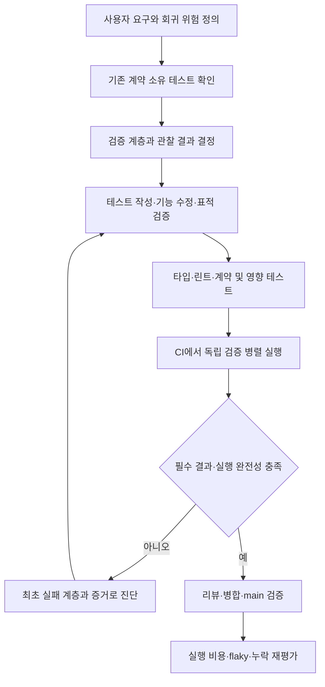

# 테스트 프로세스 재설계와 이행 근거

구현·측정 기준일은 2026-09-21이다. 격리 Windows 일반·계측 실행과 main 변경 통합본의 Linux 전수 E2E를 검증했다. 모집단은 계약별 **50개 spec·135개 본 테스트와 인증 setup 2개**다. Linux 두 샤드에서는 setup이 각각 실행되어 총 4회이며 본 테스트와 시간 가중치에서 제외한다. 이 수는 이행 대조 결과이며 개수 목표가 아니다. **최종 커밋의 required 결과와 전체 소요시간 비교는 [PR #699 검증 기록](https://github.com/lkindo/egov-enterprise/pull/699)이 정본**이다.

이 문서는 테스트의 설계·작성·실행·진단·정리 원칙과 이번 구조 변경의 근거를 함께 기록한다. 현행 규범은 [AGENTS.md](../../AGENTS.md), 범위별 검증은 [테스트 가이드](../03-guides/testing-guide.md), 실행 방법은 [E2E 런북](../03-guides/e2e-test-guide.md), 병합 조건은 [required-check manifest](../../.github/required-checks.json)가 소유한다. 기존 Tier 번호·파일명·파일 수는 새 소유권의 제약으로 삼지 않았다.

## 1. 목표와 판단 기준

**하나의 회귀 위험을 적절한 검증 계층에서 확실하게 검출하고, 실제 사용자 연결은 소수의 명확한 여정으로 검증한다.** 상세 분기·입력 조합을 브라우저에서 반복하거나, 다른 역할·오류 조건을 같은 화면이라는 이유로 삭제하지 않는다.

최적화 판단 순서는 다음과 같다.

1. **정확성:** 테스트 이름·단언이 현재 제품의 수용 기준과 일치하는가.
2. **탐지력:** 해당 결함을 넣었을 때 실패하는가. 단순 접근·토스트를 저장 완료나 송달 완료로 부르지 않는가.
3. **배치:** 같은 계약을 가장 작은 실행 환경에서 검증하는가. 브라우저·실제 DB·production 인가가 필요한 이유가 있는가.
4. **비용:** 환경 준비, 데이터 준비, 실제 검사, 정리, 대기 시간을 구분했는가.
5. **유지성:** 계약의 소유 파일과 실패 원인을 쉽게 찾고, 새 변경에 따라 실행 대상을 누락 없이 고를 수 있는가.

파일 수·테스트 수·커버리지 백분율 하나만을 최적화 목표로 삼지 않는다. 소스 커버리지는 기존 분모와 하한을 유지하고, UI 연결·인가·DB 물리 계약의 완전성과 구분한다.

## 2. 변경 전 진단과 현재 구조

변경 전 [CI run 35555990020](https://github.com/lkindo/egov-enterprise/actions/runs/35555990020)의 두 JSON 리포트에는 `full-suite` **27개 파일·140개 테스트**가 있었다. 테스트별 duration 합은 약 **516.8초**였다. GitHub의 `Run E2E Tests (Sharded)` 스텝은 **shard 1: 132초 / shard 2: 147초**, 준비·업로드를 포함한 전체 잡은 각각 **426초 / 424초**였다. case duration 합, 실행 스텝, 잡 경과시간은 서로 다른 측정값이다. 이는 이전 구조의 단일 실행 표본이며 새 구조의 실측, PR 전체 경과시간 또는 p50/p95가 아니다.

| 변경 전 관측 | 반영한 조치 |
|---|---|
| 보안 23번은 37건·약 19.8초, 게시판 마스터는 2건·약 32.4초 | 테스트 개수 대신 준비·행동 비용으로 판단. 개수 감소 목표를 두지 않음 |
| 04번에 API 거절·추천·초안·VRT·감사 날짜·반응형·axe 혼합 | HTTP 계약, 업무 여정, 품질 파일로 소유권 분리 |
| 07번의 상태 전이·겹침이라는 이름과 실제 제목/컨트롤 단언 불일치 | 데모 제목으로 이름 교정, 주소록·일정 고유 단언을 실제 여정으로 이전 |
| 투표 POM의 결과 확인이 목록 제목 검색 | [온라인 투표 여정](../../frontend/e2e/journeys/online-polls.spec.ts)의 이름을 생성·참여·관리자 검색으로 교정. 집계 수치나 별도 설문 기능의 증거로 확대하지 않음 |
| 정적 캔버스가 단일 단계 결재라는 낡은 설명을 고정 | [제품 설명](../../frontend/src/app/admin/workflow/WorkflowClient.tsx)과 [데모 검사](../../frontend/e2e/journeys/workflow-demo.spec.ts)를 다단계 승인·합의·반려·재상신과 캔버스 비연동 경계에 맞춤 |
| API-only와 다중 역할 검사에도 자동 fixture가 기본 page를 준비 | [API fixture](../../frontend/e2e/fixtures/api-test.ts)와 [브라우저 fixture](../../frontend/e2e/fixtures/browser-test.ts) 분리 |

현재 등록된 본 테스트는 API 계약 **36개**, 브라우저 여정·품질 **99개**다. 5개 중복을 통합했지만 권한 행렬·IDOR·Origin·XSS·접근성·시각 기준선을 제거하지 않았다. 경로·제목 단언에 그치는 기존 검사는 그 한계를 유지해 기록했고, 이번 이동을 새로운 CRUD·송달·결과 집계 검증으로 계산하지 않았다.

## 3. 기능 변경 한 건의 표준 흐름

### 3.1 설계: 먼저 계약을 정의한다

각 테스트가 답할 질문을 **역할/전제 → 행동 → 관찰 결과 → 실패 조건**으로 적는다. PR 설명·테스트의 `describe`/`test.step`에 필요한 만큼 기록하며 모든 테스트마다 별도 원장·승인 문서를 만들지 않는다.

- 예: `일반 사용자가 타인의 주소록을 수정하면 거부되고 원본이 유지된다`.
- 예: `관리자가 업무를 등록하면 서버가 부여한 번호의 상세 화면으로 이동한다`.
- 예: `등록 요청이 500이면 입력 내용이 유지되고 재시도할 수 있다`.

성공·권한 거절·잘못된 입력·장애 복구 중 요구에 해당하는 위험을 고른다. 모든 기능에 같은 수의 양성/음성 테스트를 기계적으로 만들지 않는다. 동일 기능의 UI·API·DB 검사는 각각 다른 경계를 관찰할 때만 함께 둔다.

### 3.2 배치: 계약에 필요한 최소 실행 환경을 선택한다

| 계약 | 주 검증 계층 | 브라우저에 남길 연결 증거 |
|---|---|---|
| 순수 계산·형식·분기·변환 | JUnit 또는 Vitest 단위 테스트 | 계산과 별개인 실제 폼 연결이 필요한 경우만 |
| 입력 오류·다이얼로그·정적 노드 선택·로딩/실패 상태 | React Testing Library/Vitest 컴포넌트 | 실제 라우트·초기 데이터·대표 저장/오류 경로 |
| 요청 DTO·응답·검색·페이징·service/repository 협력 | Spring 통합/MockMvc | 실제 요청이 화면에서 만들어지고 결과가 표시되는 경로 |
| SQL·제약·동시 쓰기·Flyway/JPA 정합 | PostgreSQL Testcontainers | DB 정합을 브라우저 반복으로 대체하지 않음 |
| 실행 중인 서버의 HTTP·배포 설정·Next 프록시 계약 | Playwright request 기반 API 계약 | 쿠키·리다이렉트·브라우저 정책 연결의 대표 경로 |
| 역할 전환·등록/수정 후 재조회·목록→상세 연결 | Playwright 브라우저 여정 | 사용자 조작과 영속 결과를 직접 확인 |
| XSS 실행·HttpOnly·세션 소실·위조 쿠키 | 브라우저 보안 계약 | 실제 렌더링·쿠키·탐색을 사용 |
| 인가 행렬·IDOR·Origin 허용/거절·버전 충돌 | production 인가를 사용하는 API/통합 계약 | 인가 편집 UI와 쿠키→프록시 연결은 별도 유지 |
| axe·시각 기준선·반응형·키보드 | 브라우저 품질 검증 | 같은 화면의 CRUD와 다른 계약이므로 보존 |
| 소스 취약점·의존성·비밀·아키텍처·돌연변이 점수 | 기존 CodeQL/의존성/gitleaks/하네스/PIT | E2E green으로 대체하지 않음 |

Playwright request는 브라우저 없이 실행할 수 있다. 그러나 `page.evaluate(fetch)`를 backend 직접 요청으로 옮기면 **브라우저 쿠키 → Next → backend** 경로가 달라진다. 전송 경계가 계약인 경우 같은 BFF 경로와 쿠키를 사용하는 API 요청을 유지하고, 실제 브라우저 연결도 대표 테스트에 남긴다. [Playwright API testing](https://playwright.dev/docs/api-testing)

H2/create-drop, mock-security, API 응답을 주입한 컴포넌트 테스트의 한계는 [E2E 밖 검증 가이드](../03-guides/non-e2e-verification-guide.md)를 따른다. 브라우저에서 하던 검사를 아래 계층으로 옮길 때에는 잃는 경계를 먼저 식별한다.

### 3.3 작성: 실제 결과를 이름과 단언에 일치시킨다

파일명은 `대상-계약.spec.ts`, 새로 작성하거나 의미를 교정하는 제목은 **조건 + 행동 + 관찰 결과**로 작성한다. `Tier 14`, `Advanced`, `Intelligence`, `Full Lifecycle`처럼 검사 내용을 찾기 어려운 표현만으로 새 계약을 명명하지 않는다. 기존 제목을 보존한 검사도 아래 소유 파일과 본문 단언으로 범위를 판정한다.

| 이전 표현 | 실제 단언에 맞춘 표현·판단 |
|---|---|
| Electronic Approval (Workflow State Machine) | 결재 양식 데모 화면의 제목을 표시한다 |
| Full Board Master Lifecycle / permanently delete | 게시판을 생성·수정한 뒤 사용 중지하면 목록에 대기 상태로 표시된다 |
| Notification: Real-time Delivery | 생성한 알림을 열어 읽은 뒤 새로고침해도 읽음 상태가 유지된다 |
| Mail Dispatch | 발송 요청이 접수되고 발신 이력에서 해당 제목을 찾을 수 있다 |
| Login Policy Management (06) | 조직 정책의 이전 주소가 정본 탭으로 이동한다 |

단순 toast보다 실제 조회 결과·정확한 ID·UI 상태를 단언한다. `if (visible)` 안에서만 단언하거나, 빈 상태와 성공 상태를 모두 받아들이는 폴백으로 회귀를 숨기지 않는다. 목록 자체가 비어도 되는 조회 계약과 특정 생성 항목의 존재 계약은 구별한다.

한 여정은 하나의 업무 결과를 중심으로 묶는다. 등록→상세→수정→삭제처럼 이어지는 흐름은 `test.step`으로 합칠 수 있다. 역할·오류 전제·고유 실패 조건이 다른 테스트를 거대한 단일 테스트로 합치지 않는다. 앞 단계 실패로 뒷 단계가 실행되지 않는 비용은 별도의 빠른 API/컴포넌트 검사로 보완한다.

## 4. 현재 테스트 구성과 준비 과정

### 4.1 계약별 파일과 중복 없는 project

[Playwright 설정](../../frontend/playwright.config.ts)은 다음 세 project를 사용한다. 브라우저 project 이름 `full-suite`는 기존 시각 기준선 파일명을 보존하기 위해 유지했다.

| project | 실제 대상 | 등록 모집단 |
|---|---|---|
| `setup` | [auth.setup.ts](../../frontend/e2e/auth.setup.ts) | 인증 준비 2개 |
| `api-contract` | [contracts/](../../frontend/e2e/contracts/) | 9개 spec·36개 테스트 |
| `full-suite` | [journeys/](../../frontend/e2e/journeys/), [quality/](../../frontend/e2e/quality/) | 여정 33개 + 품질 8개 spec·99개 테스트 |

API·브라우저 project 모두 setup에 의존하며 서로의 spec을 선택하지 않는다. 기본 전수 등록은 **137개(setup 2 + 본 검사 135)**다. 실행 전 `--list` inventory와 실제 JSON report의 project/test 좌표를 대조하고, spec 누락·중복·잘못된 project·예상 밖 skip·flaky를 [결과 계약](../../scripts/playwright-result-contract.mjs)이 차단한다. 등록 수 확인은 실제 실행 성공과 구분한다.

화면명이 비슷해도 다른 제품이면 소유자를 나눈다. [조직 정책](../../frontend/e2e/journeys/organization-policy.spec.ts)과 [로그인 보안 정책 화면](../../frontend/e2e/journeys/security-administration.spec.ts), [온라인 투표](../../frontend/e2e/journeys/online-polls.spec.ts)와 [일반 설문 목록 접근](../../frontend/e2e/journeys/public-navigation.spec.ts), [정적 캔버스](../../frontend/e2e/journeys/workflow-demo.spec.ts)와 [실제 결재](../../frontend/e2e/journeys/approvals.spec.ts)는 같은 계약이 아니다. 전체 이동 지도는 7절에 있다.

### 4.2 fixture는 요청한 자원만 준비한다

- [api-test.ts](../../frontend/e2e/fixtures/api-test.ts)는 격리 대상 확인과 request를 제공하며 page/browser를 자동 생성하지 않는다. Bearer 역할 요청이 필요한 경우 `adminRequest`·`userRequest`를 사용할 수 있다. 기존 쿠키/BFF 계약의 전송 방식은 별도로 보존한다.
- [browser-test.ts](../../frontend/e2e/fixtures/browser-test.ts)는 실제 사용하는 page만 준비한다. `actorPage`는 역할별 context/page, console·network guard, coverage 수집과 종료를 관리한다. 관리자·일반 사용자 page와 다중 결재자·VRT 익명 page도 이 경로를 사용한다.
- [page-observation.ts](../../frontend/e2e/fixtures/page-observation.ts)가 각 page의 오류 검사와 coverage를 묶는다. [base-test.ts](../../frontend/e2e/fixtures/base-test.ts)는 호환 re-export이며 예전의 불필요한 기본 page 자동 준비를 유지하지 않는다.
- [refresh 계약](../../frontend/e2e/contracts/authentication.spec.ts)은 사용자당 하나인 refresh 기록이 다른 테스트의 로그인·로그아웃과 충돌하지 않도록 [일회용 관리자](../../frontend/e2e/fixtures/visual-admin.ts)를 쓴다. 잠금·IDOR 공격자·권한 회수도 각 테스트의 주체와 준비 조건을 보존한다.
- [VRT](../../frontend/e2e/quality/visual-baselines.spec.ts)는 전용 사용자와 알림 격리를 유지한다. 스냅샷 4개를 [새 디렉터리](../../frontend/e2e/quality/visual-baselines.spec.ts-snapshots/)로 옮겼다. 세 파일은 원본 바이트를 유지하고 로그인 로그 한 파일은 병행 작업에서 전달된 Linux 기준선 갱신본을 보존한다(§8 출처).
- 운영 화면의 불필요한 포털 방문, 통계 검사의 선행 monitoring 방문, 관리자 axe의 이동 후 재로드를 제거했다. [업무 보고 데이터 준비](../../frontend/e2e/helpers/work-report-data.ts)는 API·브라우저 검사에서 공유하고 고유 태그를 사용한다.

데이터 정리의 원칙은 해당 테스트가 만든 ID와 고유 이름으로 범위를 좁히고 실패를 진단에 남기는 것이다. 조회 필터 자체를 검사하는 업무 보고는 필터가 깨져도 반환된 외부 행을 정리하지 않는다. 삭제 API가 없는 결재 이력 등은 실행 전용 DB의 수명으로 폐기한다. 예전의 전역 prefix 삭제를 테스트 종료 시 실행하지 않는다. API seed는 준비에만 사용하고 UI 등록을 검사하는 여정은 폼 입력을 유지한다.

### 4.3 실제 쓰기 전에 실행 환경의 소유권을 확인한다

실행 진입점은 [run-isolated-e2e.mjs](../../scripts/run-isolated-e2e.mjs)다. 로컬과 CI는 아래의 서로 다른 소유권 증거를 확인한다.

| 경계 | 로컬 격리 실행 | CI 격리 실행 |
|---|---|---|
| 입력 환경 | root/frontend의 실제 `.env*` 존재를 거부하고 환경 파일을 읽거나 이동하지 않음. 필요한 환경 변수만 전달 | 같은 입력 제한을 적용하고 `--ci-compose`로 이번 run/attempt/shard의 스택 확인 |
| DB | 새 임의 ID의 PostgreSQL 컨테이너, tmpfs 데이터 영역, loopback 동적 포트. 기존 이름·볼륨 재사용 없음 | 이번 Compose project 소유 DB/API/volume/network의 ID·label·생성 시각·연결 확인 |
| API·FE | 실행기가 직접 띄운 자식 프로세스와 새 DB 연결. FE 빌드 rewrite 목적지도 해당 API와 대조 | API bootstrap·datasource·네트워크를 검사하고 준비한 FE의 rewrite 목적지 대조 |
| 쓰기 허용 | 살아 있는 실행기 control endpoint가 manifest의 run/DB ID와 현재 자원 상태를 확인해야 허용 | 동일한 live-owner 확인과 Compose 런타임 재검증 필요 |
| 종료 | 실행기가 만든 프로세스·DB만 회수하고 runtime manifest 제거 | workflow의 해당 project 정리와 실행기 자식 프로세스 회수 |

manifest 파일이나 환경 플래그만으로 쓰기를 허용하지 않는다. [격리 계약](../../scripts/e2e-isolation.mjs)을 [global setup](../../frontend/e2e/fixtures/global-setup.ts), 인증 준비, API worker fixture와 쓰기 fixture의 실행 경로에 연결했다. 원격 주소·재사용 자원·죽은 owner·잘못된 datasource/config는 실행을 거부하는 대상이다. 안전장치의 부정 검증과 실제 E2E 성공은 별개의 증거로 관리한다.

## 5. 로컬·PR·main 실행 프로세스

### 5.1 로컬: 가까운 검사 후 격리된 실제 연결을 확인한다

1. 변경한 계약의 표적 단위/컴포넌트/통합 검사를 실행한다.
2. 타입·린트·코드젠·하네스를 실행한다. E2E 소스는 `pnpm -C frontend run type-check:e2e` 대상이다.
3. 실제 연결은 환경 파일이 없는 전용 worktree에서 `node scripts/run-isolated-e2e.mjs -- --project=api-contract --project=full-suite`로 확인한다. 실행기가 새 DB와 해당 소스의 API/FE를 준비하므로 이미 떠 있는 개발 서버를 재사용하지 않는다.
4. 최초 실패의 trace·화면·HTTP·서버 로그를 대조하고 가장 가까운 계층에서 수정한다. 로컬 통과와 원격 required CI 통과를 구분한다.

현재 worker는 **로컬 1개, CI 2개**, CI shard는 **2개**다. API/browser 분리를 새 VM·새 DB 개수 증가로 연결하지 않았다. API 계약에도 Next/BFF가 포함되므로 backend 단독 실행으로 전체 계약을 대신하지 않는다.

Windows/macOS에서는 Linux 기준선을 비교하는 `quality/visual-baselines.spec.ts :: Visual Regression Baseline` **한 건에만 기존 플랫폼 waiver**가 적용된다. VRT 세션 격리 검사는 계속 실행한다. Linux CI는 이 skip을 허용하지 않으며 기준선 4개를 실제로 검증해야 한다. Windows 결과를 Linux 시각 회귀 통과라고 보고하지 않는다.

명령·범위별 최소 검증의 정본은 [테스트 가이드](../03-guides/testing-guide.md)와 [E2E 런북](../03-guides/e2e-test-guide.md)다.

### 5.2 PR·통합 push: 독립 모듈을 분리하고 선택된 검증을 병렬 실행한다

- [CI](../../.github/workflows/ci.yml)의 변경 분류가 성공하면 온라인 backend, 독립 migration, frontend, 선택된 PIT, E2E, 보안·재사용 검증을 각 조건에 따라 시작한다. E2E와 PIT는 backend 전체 성공 대기 대신 classifier 결과에 의존한다.
- 기존 6개 required context와 실패 집계를 유지한다. E2E/PIT가 먼저 끝나도 backend 테스트·스키마·JaCoCo 실패를 허용하지 않는다.
- 온라인 PIT가 선택되면 제품 8개 배치를 모두 실행하되 `max-parallel: 3`으로 동시 실행을 제한한다. 세 workflow 합계 동시 20개가 관측된 초기 실행에서 E2E shard 2가 111초, 긴 migration PIT가 116초 대기한 점을 반영해 E2E·migration·재사용 검증의 runner 경합을 줄이는 조치다. 관측한 20개를 관리 API로 확인한 계정 한도로 단정하지 않으며, 다른 PR의 부하나 GitHub 배정 순서까지 통제하거나 전체 완료 시간 단축을 보장하지 않는다.
- E2E가 필요한 PR은 **API·브라우저 전수**를 두 shard에 배분한다. 일부 경로만 계산하는 shadow 후보가 실제 실행 범위를 줄이지 않는다.
- API 이미지에 Buildx GHA cache를 연결했다. 두 shard가 캐시를 읽고 첫 shard만 export한다. 캐시가 비어 있거나 export에 실패해도 이미지 빌드·부팅·필수 검증을 생략하지 않는다.
- FE artifact를 공유해 backend/frontend 완료를 다시 기다리는 의존성은 만들지 않았다. 각 E2E 스택은 자기 API rewrite·인증 설정에 맞춘 FE를 사용한다.
- CodeQL 양언어 전수 분석, 기존 재사용 프로필/레이아웃, 의존성 snapshot readiness, PIT strict 기준을 유지한다.

[변경 분류기](../../scripts/ci-change-scope.mjs)는 Gradle/toolchain, `src/testFixtures`, main/test 리소스 등 PIT 입력을 포함한다. [ADR-0022](decisions/ADR-0022-ci-independent-module-impact-and-cache.md)에 따라 온라인 4모듈은 결합된 범위를 유지하고 독립 `migration-tool`의 build/PIT만 분리한다. 공통 Gradle·ID 생성 의미 계약은 양쪽 실행, 미지·빈 비교는 전수 fallback이며 10개 PIT scope의 75% strict 기준은 같다. 온라인·이관 커버리지는 각 LINE 85%·BRANCH 70%를 강제하고 기존 로컬 전수 커버리지도 유지한다. 개별 Java 파일별 시험 선택은 도입하지 않았다.

Gradle action은 v6.3.0의 검증 대상 commit에 고정하고 `cache-provider: basic`을 명시했다. 캐시 복원 성공이나 구성 변경만으로 필수 검사를 통과시키지 않으며, 실제 hit·전송 비용·전체 경과시간은 같은 검증 범위의 원격 실행으로 평가한다.

실행 job `e2e-tests`·`mutation-scope`·`mutation-scope-migration`의 상태 조건은 `!cancelled()`로 두어 기존 선택 범위를 보존하면서 취소에 반응하게 하고, 결과 집계와 cleanup의 `always()`는 유지한다. GitHub는 취소할 때 job 조건을 재평가하므로 실행 job의 `always()`는 취소 후에도 참이 될 수 있다([공식 취소 동작](https://docs.github.com/en/actions/reference/workflows-and-actions/workflow-cancellation)).

### 5.3 main·릴리스·정기 점검

| 시점 | 현재 실행 또는 운영 원칙 |
|---|---|
| PR | 변경 분류에 필요한 기존 필수 검사. E2E 대상이면 API·브라우저 전수 |
| main/master push | PR과 같은 모듈 영향 분류. 비교 기준 부재·미지·빈 변경은 전수 fallback |
| 릴리스 | 대상 SHA의 필수 성공 증거와 배포 산출물·설정·스키마 계약 확인. 다른 SHA의 green 재사용 금지 |
| 주간/명시적 점검 | 독립 이관은 월요일 03:23 KST와 수동 실행에서 전수. 기존 의존성 전수 감사·비용·flaky 추세 검토와 지정 환경의 부하·DR 검증 유지 |

### 5.4 영향 선별은 shadow로 평가하고 실행은 전수로 유지한다

[shard planner](../../scripts/e2e-shard-plan.mjs)의 `IMPACT_RULES`와 `buildImpactShadowPlan`은 일부 FE 경로와 계약 소유 spec의 후보를 연결한다. 일반 프론트 의존 그래프를 완성한 것이 아니다. 현재 설문 규칙의 `app/polls/`·`app/admin/polls/`는 실제 `app/admin/survey/`와 다르므로 실제 설문 변경은 전수 fallback이다. 도움말 허브의 커뮤니티 소비자와 게시판 입력 화면의 FAQ 소비자도 현 후보에서 빠진다([CommunityPage](../../frontend/e2e/pages/CommunityPage.ts), [KnowledgePage](../../frontend/e2e/pages/KnowledgePage.ts)). 이 불완전한 후보를 실행 축소에 사용하지 않는다.

- 수정된 등록 spec은 자신을 후보에 넣고, 명시된 route는 해당 소유 spec을 후보에 넣는다. 좁은 후보에도 모든 품질 spec과 공통 application shell을 포함한다.
- backend·공유 코드·fixture·설정 등 규칙에 없는 경로, 추가/삭제/이동, 알 수 없는 상태, 비교 기준 부재는 **전수 후보로 fallback**한다.
- 계획은 항상 `mode: shadow`, `executes: full`이다. CI는 별도로 계산한 두 shard의 전수 목록을 실행한다.
- 실행 후 unexpected/flaky 파일 중 후보 밖에 있던 항목을 대조해 누락을 기록한다. 현재 `selectionReady`는 false이며, 후보와 전수가 모두 green인 표본만으로 의존성 완전성을 주장하지 않는다.

선별 단위는 spec 전체다. 테스트 제목 grep으로 현재 실행 완전성 검사를 우회하지 않는다. 영향 선택의 실제 활성화는 대표 PR 비교에서 탐지 누락 방지와 준비 비용을 포함한 시간 이득을 확인한 뒤 별도로 판단한다. 빈 선택·누락·중복·잘못된 project·skip·flaky는 기존 [planner 계약](../../scripts/e2e-shard-plan.test.mjs)과 [결과 계약](../../scripts/playwright-result-contract.test.mjs)의 부정 검증으로 지킨다.

## 6. 실패 진단과 중복 정리 절차

### 6.1 실패는 발생한 계층에서 분류한다

| 관측 | 먼저 볼 증거·조치 |
|---|---|
| 환경 준비 실패 | 이미지 빌드·Compose·readiness·JVM 로그. 제품 테스트 실패와 구분 |
| API/DB 계약 실패 | 요청·응답 상태/형태, production 인가, 서버 로그, 해당 PostgreSQL 상태 |
| 브라우저 여정 실패 | trace·DOM·screenshot, 네트워크 요청과 backend 로그를 같은 시점으로 대조 |
| axe/VRT/반응형 실패 | 렌더 조건·역할·폰트·기준선·실제 접근성 트리. 기준선 재생성으로 원인을 덮지 않음 |
| 재시도 통과 | flaky로 분류하고 원인 수정. 현행 `flaky=0` 판정을 재시도 수 증가로 우회하지 않음 |
| 실행 결과 부재 | 선택 계획·project·setup·샤드·report 경로를 확인. 0건 실행을 성공으로 취급하지 않음 |

원시 응답·쿠키·토큰·개인정보를 문서나 공용 메모리에 옮기지 않는다. 필요한 진단은 합성 데이터와 정제된 산출물로 남긴다.

### 6.2 고유 단언 이전과 실제 통합 결과

중복 여부는 **역할·전제·행동·관찰 결과·오류 감시·전송 경계**로 비교했다. 같은 URL이나 POM 호출만으로 삭제하지 않았다.

| 기존 중복 | 현재 소유자·결과 | 보존한 고유 계약 |
|---|---|---|
| 게시판 wizard 성공 + master 생명주기 | [board-masters](../../frontend/e2e/journeys/board-masters.spec.ts)에 통합, 1개 감소 | master→wizard 버튼, 같은 템플릿과 단계·메뉴명·완료 표시, 직접 maker의 빈 이름 오류, 사용 중지 상태 |
| 주소록 접근 smoke + 생성/검색 | [address-book](../../frontend/e2e/journeys/address-book.spec.ts)에 통합, 1개 감소 | 협업 허브 링크와 직접 목록 진입, 정확한 제목·검색 컨트롤, 이름 있는 등록 dialog |
| 일정 제목 smoke + 캘린더 조작 | [schedules](../../frontend/e2e/journeys/schedules.spec.ts)에 제목 이전, 1개 감소 | 선택 탭·등록폼 열기/취소·수정/삭제 컨트롤. UI 저장 성공을 새로 입증한 것은 아님 |
| FAQ 생성 두 경로 | [help-content](../../frontend/e2e/journeys/help-content.spec.ts)에 통합, 1개 감소 | master/direct-write 진입, 도움말 허브 신규 등록, 관리자 검색, 일반 사용자 노출·검색 |
| 포상 접근 smoke + 수정/삭제 | [rewards](../../frontend/e2e/journeys/rewards.spec.ts)에 toolbar 단언 이전, 1개 감소 | 검색 후 총 건수 표시, 수정·삭제·삭제 후 검색 결과 |

로그인 axe 두 조건과 계산 폰트는 [동일 품질 소유자](../../frontend/e2e/quality/login-accessibility.spec.ts)로 모으되 **3개 검사를 유지**했다. `/login`과 `?e2e=true`, 전체 문서/본문 감사, motion 조건, 오류 예외 상한이 같지 않기 때문이다. 부서 초기 선택·저장 disabled·DnD 영속화도 [조직 여정](../../frontend/e2e/journeys/department-hierarchy.spec.ts)에 모으고 각각의 검사를 보존했다. 관측/통계는 선행 방문만 제거했으며 고유 검사를 합치지 않았다.

기존 CSRF라는 이름은 [일반 사용자 쿠키와 잘못된 CSRF 헤더의 관리자 쓰기 요청 거부](../../frontend/e2e/contracts/request-denial.spec.ts)로 교정했다. 이 단언으로 Spring API의 CSRF 보호를 입증하지 않는다. 별도의 [Origin 계약](../../frontend/e2e/contracts/authentication.spec.ts)은 공격 출처의 403·오류 코드와 동일 출처의 정상 200을 확인한다. 정적 캔버스 설명은 실제 다단계 결재와 캔버스 비연동 경계를 제품·테스트 양쪽에서 함께 교정했다.

통합으로 새로 미사용이 된 POM 메서드 5개(FAQ 생성 1개·주소록 진입/검증 2개·일정 진입/검증 2개)를 제거하고, 함께 사라진 FAQ 강제 클릭 1건에 맞춰 하네스의 force-click 기준을 8→7로 낮췄다.

통합으로 뒤 단계가 앞 단계 실패에 묶이는 비용이 있으므로 적은 비용의 독립 검사를 무조건 합치지 않는다. 이후에도 고유 단언 대응을 diff에 남기고 해당 오류가 남은 검사에서 실패하는지 검증한다. 이번 정적 대조의 한계와 실제 실행 상태는 8절에 구분했다.

## 7. 이전 27개 파일에서 현재 소유자로의 이동 지도

첫 열은 삭제된 이전 파일의 식별자이며 링크 대상이 아니다. 마지막 열은 실제 존재하는 계약 소유 파일이다. 이 표는 이행 근거이며 경로 이름만으로 실행을 줄이는 allowlist가 아니다. `접근`은 화면을 열어 표시를 단언하는 수준으로, 저장·상태 전이의 증거와 구분한다.

| 이전 spec | 이전된 주요 계약 | 현재 소유 파일 |
|---|---|---|
| `01-core-base.spec.ts` | 로그인 axe·폰트, 역할별 dashboard·logout, 관리자 셸 | [quality/login-accessibility](../../frontend/e2e/quality/login-accessibility.spec.ts), [journeys/application-shell](../../frontend/e2e/journeys/application-shell.spec.ts), [quality/admin-accessibility](../../frontend/e2e/quality/admin-accessibility.spec.ts), [journeys/authentication](../../frontend/e2e/journeys/authentication.spec.ts) |
| `02-admin-system.spec.ts` | 사용자 편집·삭제, 그룹 등록, role 별칭, 행사 등록·삭제 | [journeys/user-administration](../../frontend/e2e/journeys/user-administration.spec.ts), [journeys/security-administration](../../frontend/e2e/journeys/security-administration.spec.ts), [journeys/event-administration](../../frontend/e2e/journeys/event-administration.spec.ts) |
| `03-board-community.spec.ts` | wizard, 일반/Q&A 글 CRUD, 댓글 UI+API, 커뮤니티 접근, 이전 화면 접근 | [journeys/board-masters](../../frontend/e2e/journeys/board-masters.spec.ts), [journeys/board-articles](../../frontend/e2e/journeys/board-articles.spec.ts), [journeys/community-navigation](../../frontend/e2e/journeys/community-navigation.spec.ts) |
| `03-board-master-management.spec.ts` | wizard→수정→사용 중지, 빈 이름 오류 | [journeys/board-masters](../../frontend/e2e/journeys/board-masters.spec.ts) |
| `04-quality-resilience.spec.ts` | API 거절, 추천 표시, 초안, VRT 격리·스냅샷, 감사 날짜, 반응형, axe | [contracts/request-denial](../../frontend/e2e/contracts/request-denial.spec.ts), [journeys/board-articles](../../frontend/e2e/journeys/board-articles.spec.ts), [quality/board-draft-recovery](../../frontend/e2e/quality/board-draft-recovery.spec.ts), [quality/visual-baselines](../../frontend/e2e/quality/visual-baselines.spec.ts), [journeys/audit-log](../../frontend/e2e/journeys/audit-log.spec.ts), [quality/responsive-shell](../../frontend/e2e/quality/responsive-shell.spec.ts), [quality/route-accessibility](../../frontend/e2e/quality/route-accessibility.spec.ts) |
| `05-public-experience.spec.ts` | API 투표와 목록/중복참여 UI, 홍보 노출, FAQ, 포털 접근 | [journeys/online-polls](../../frontend/e2e/journeys/online-polls.spec.ts), [journeys/portal-promotions](../../frontend/e2e/journeys/portal-promotions.spec.ts), [journeys/help-content](../../frontend/e2e/journeys/help-content.spec.ts), [journeys/public-navigation](../../frontend/e2e/journeys/public-navigation.spec.ts) |
| `06-ops-governance.spec.ts` | 조직 정책 별칭·탭, 그룹별 메뉴 조회 | [journeys/organization-policy](../../frontend/e2e/journeys/organization-policy.spec.ts), [journeys/menu-administration](../../frontend/e2e/journeys/menu-administration.spec.ts) |
| `07-productivity-suite.spec.ts` | 정적 양식 제목, 주소록 dialog, 일정 제목 | [journeys/workflow-demo](../../frontend/e2e/journeys/workflow-demo.spec.ts), [journeys/address-book](../../frontend/e2e/journeys/address-book.spec.ts), [journeys/schedules](../../frontend/e2e/journeys/schedules.spec.ts) |
| `08-advanced-collaboration.spec.ts` | 주소록 UI 생성/검색, 통계 다운로드 이벤트·파일명 | [journeys/address-book](../../frontend/e2e/journeys/address-book.spec.ts), [journeys/statistics](../../frontend/e2e/journeys/statistics.spec.ts) |
| `09-admin-observability-workspace.spec.ts` | 통합 검색의 빈 결과 | [journeys/global-search](../../frontend/e2e/journeys/global-search.spec.ts) |
| `10-operational-extension.spec.ts` | 포상 수정/삭제, 외부인사 접근, 메모보고 탭, SMS 접수 | [journeys/rewards](../../frontend/e2e/journeys/rewards.spec.ts), [journeys/operations-navigation](../../frontend/e2e/journeys/operations-navigation.spec.ts), [journeys/sms-submission](../../frontend/e2e/journeys/sms-submission.spec.ts) |
| `11-enterprise-workflow.spec.ts` | 다단계 승인·합의·반려·재상신, 부서일정 접근 | [journeys/approvals](../../frontend/e2e/journeys/approvals.spec.ts), [journeys/schedules](../../frontend/e2e/journeys/schedules.spec.ts) |
| `12-notification.spec.ts` | 알림 읽음 영속화, 긴 본문 overflow, 검색 | [journeys/notifications](../../frontend/e2e/journeys/notifications.spec.ts) |
| `13-mail.spec.ts` | 발신 이력·긴 제목·입력 오류·수신자 찾기·이메일 비노출 | [journeys/mail](../../frontend/e2e/journeys/mail.spec.ts) |
| `14-admin-workflow.spec.ts` | 정적 Process Studio 고지·샘플·노드 선택; 실제 다단계 결재와 캔버스 비연동 설명 | [journeys/workflow-demo](../../frontend/e2e/journeys/workflow-demo.spec.ts) |
| `15-collaboration-extension.spec.ts` | 스크랩 목록 제목 | [journeys/scraps](../../frontend/e2e/journeys/scraps.spec.ts) |
| `16-system-observability.spec.ts` | 계측 부재 고지·새로고침 요청·반출 모달·통계 제목 | [journeys/system-observability](../../frontend/e2e/journeys/system-observability.spec.ts), [journeys/statistics](../../frontend/e2e/journeys/statistics.spec.ts) |
| `17-support-governance.spec.ts` | 매뉴얼·FAQ·Q&A 생성/검색 | [journeys/help-content](../../frontend/e2e/journeys/help-content.spec.ts) |
| `18-business-extension.spec.ts` | ISM 별칭→결재 허브, HPCM 제목·표 | [journeys/public-navigation](../../frontend/e2e/journeys/public-navigation.spec.ts), [journeys/help-content](../../frontend/e2e/journeys/help-content.spec.ts) |
| `19-hierarchy-modernization.spec.ts` | 메뉴 구조/API, 공통코드 A2 master-detail 선택·상세·키보드·reflow, 부서 선택·DnD 영속화 | [journeys/menu-administration](../../frontend/e2e/journeys/menu-administration.spec.ts), [contracts/menu-visibility](../../frontend/e2e/contracts/menu-visibility.spec.ts), [journeys/common-codes](../../frontend/e2e/journeys/common-codes.spec.ts), [journeys/department-hierarchy](../../frontend/e2e/journeys/department-hierarchy.spec.ts) |
| `20-common-security-validation.spec.ts` | 세션 소실과 보호 경로 이동, 프로그램/메뉴 접근 | [journeys/authentication](../../frontend/e2e/journeys/authentication.spec.ts), [journeys/application-shell](../../frontend/e2e/journeys/application-shell.spec.ts) |
| `21-advanced-resilience.spec.ts` | 합성 500의 UI 반응, 게시글 256/257자 오류·focus | [quality/error-recovery](../../frontend/e2e/quality/error-recovery.spec.ts) |
| `22-deep-security-guard.spec.ts` | 저장 댓글 XSS 렌더링·reload, 잘못된 query에서 셸 생존 | [quality/stored-xss](../../frontend/e2e/quality/stored-xss.spec.ts), [quality/error-recovery](../../frontend/e2e/quality/error-recovery.spec.ts) |
| `23-security-auth-supplement.spec.ts` | 로그인·쿠키·위조 토큰, API/경로 인가, IDOR, 잠금·refresh·Origin, axe·빈 목록 | [journeys/authentication](../../frontend/e2e/journeys/authentication.spec.ts), [contracts/authentication](../../frontend/e2e/contracts/authentication.spec.ts), [contracts/authorization](../../frontend/e2e/contracts/authorization.spec.ts), [journeys/authorization](../../frontend/e2e/journeys/authorization.spec.ts), [contracts/address-book-ownership](../../frontend/e2e/contracts/address-book-ownership.spec.ts), [quality/login-accessibility](../../frontend/e2e/quality/login-accessibility.spec.ts), [journeys/user-administration](../../frontend/e2e/journeys/user-administration.spec.ts) |
| `24-org-schedule-journey.spec.ts` | 조직 순환/삭제 가드, 일정 API CRUD·담당자, 캘린더 UI 컨트롤 | [contracts/department-hierarchy](../../frontend/e2e/contracts/department-hierarchy.spec.ts), [contracts/schedules](../../frontend/e2e/contracts/schedules.spec.ts), [journeys/schedules](../../frontend/e2e/journeys/schedules.spec.ts) |
| `25-deptjob-workreport-journey.spec.ts` | 업무함·업무 UI CRUD, 채번/default API, 보고 검색·pageUnit·페이저·수정/삭제 | [journeys/department-work](../../frontend/e2e/journeys/department-work.spec.ts), [contracts/department-work](../../frontend/e2e/contracts/department-work.spec.ts), [contracts/work-reports](../../frontend/e2e/contracts/work-reports.spec.ts), [journeys/work-reports](../../frontend/e2e/journeys/work-reports.spec.ts) |
| `26-security-admin-coverage.spec.ts` | 그룹 배정·회수·버전 충돌·즉시 인가 반영·편집 UI, 정책 화면 접근 | [journeys/security-administration](../../frontend/e2e/journeys/security-administration.spec.ts) |

## 8. 이행 증거와 현재 검증 상태

이행 시 원본의 정적 test 선언 **117개**를 대조했다. 반복 생성되는 인가 행렬·viewport·route 사례 때문에 원본 실행 사례는 **140개**였다. **112개 선언을 유지하고 중복 선언 5개를 통합**한 결과 현재 실행 사례는 **135개**다. 새 파일이 50개로 늘어난 이유는 HTTP·브라우저·품질 소유권 분리이며, 파일 수나 테스트 수를 성과 목표로 사용하지 않는다.

main `6ac17d46f`의 UI·시각 기준선을 통합한 변경의 PR은 [#699](https://github.com/lkindo/egov-enterprise/pull/699)다. [CI run 35579358480](https://github.com/lkindo/egov-enterprise/actions/runs/35579358480), SHA `56aa75d7`에서 Linux E2E·VRT와 `e2e-test` required context가 성공했다. 최종 커밋의 전체 required 결과는 PR 검증 기록에서 확인한다. [이전 PR #698](https://github.com/lkindo/egov-enterprise/pull/698)은 대체되어 닫혔다. 초기 run `35575211930`의 E2E 성공과 합성 fixture 리터럴 탐지 후 전체 실행 취소는 별도 이력이다.

| 확인 항목 | 2026-09-21에 확보한 근거 | 의미와 한계 |
|---|---|---|
| 이전/이후 소유권 | 이행용 `build/e2e-migration-map.json` 117행 대조, 보존 112개 제목이 지정된 owner에 정확히 1회 존재 | 7절에 영구 요약. 동적 등록은 inventory로 별도 대조 |
| 보존 선언의 단언 | `build/e2e-assertion-preservation.json`에서 보존 112개 본문의 matcher 수 감소 없음 | 보조 정적 증거다. matcher 수만으로 탐지력 동등성을 보증하지 않으며 POM·통합 의미는 6절의 이전 근거와 diff로 검토 |
| VRT 이동 | 이동 시 4개 SHA256 동일. 최종 대조에서는 3개가 원본과 같고 로그인 로그 1개는 병행 작업의 Linux 생성본과 동일 | 이 작업에서 캡처·재생성하지 않음. 출처와 현재 소스 조합의 Linux 검증은 구분 |
| 타입·린트 | 프런트엔드 전체·E2E TypeScript 검사와 전체 ESLint 통과 | ESLint 오류 0개·경고 115개로 기존 상한 138개 이내. 실제 연결 성공의 대체 증거가 아님 |
| 준비/정리 부정 검사 | 합성 응답에 외부 보고서를 섞어도 조회 계약은 실패를 숨기지 않고 정리는 외부 ID를 삭제하지 않음을 확인 | 실제 HTTP 대신 request 대역으로 확인한 준비 함수의 경계 |
| 등록 모집단 | setup 2개 + API 36개 + browser 99개 등록 확인. 분리 project의 모집단과 실행 좌표를 inventory로 대조하는 경로 연결 | 실제 실행 report가 있어야 성공·누락·skip·flaky 판정 완료 |
| 실제 Windows E2E | main 통합 전 새 일회용 DB에서 **136 passed(본 테스트 134 + setup 2), 플랫폼 skip 1, unexpected/flaky/global error 0**. 목록·결과 완전성 및 cleanup 통과. Playwright 구간 540.8초 | 로컬 worker 1과 정적 검사 병행 결과로, Linux CI 성능과 직접 비교하지 않음 |
| 실제 Linux E2E·VRT | run `35579358480`, SHA `56aa75d7`, workers=2. **50개 파일·135개 본 테스트(API 36 + browser 99)**가 두 샤드에 정확히 한 번씩 실행됨. setup은 각 2개·총 4회. skip/retry/flaky/unexpected/global error 모두 0 | Linux VRT 4장 포함. inventory·결과·ID·project 대조 후 현재 프로파일 갱신. 전체 required CI 성공은 별개 |
| 실제 계측 E2E | main 통합 전 별도의 새 일회용 DB와 계측 production build에서 **136 passed, 플랫폼 skip 1, unexpected/flaky/global error 0**. Playwright 구간 595.0초. 수집 JSON 104개의 형식 검증과 HTML 보고서 생성 성공 | 일반 실행과 분리된 선택적 계측 결과다. 두 실행 모두 소유한 프로세스·DB를 회수했으며 공유 DB를 사용하지 않음 |
| 변경 계약·산출물 | 격리·선별 후보·결과 완전성·required CI 계약, 인증·정리·오류 관찰·coverage·VRT 하네스 검사와 부정 사례 통과. Java 하네스 결속, 문서 링크·공용 메모리·Atlas 정합 검사 통과 | 의도적 위반의 red를 확인. 새 원격 CI, PIT 전체 및 CodeQL 실행 성공을 뜻하지 않음 |

이행용 `build/` JSON은 리뷰용 산출물이며 영구적인 두 번째 테스트 원장이 아니다. 지속되는 결론은 이 문서와 실제 spec·[Playwright 설정](../../frontend/playwright.config.ts)·[하네스](../../frontend/src/__tests__/e2e-harness-hygiene.test.ts)가 설명한다. 실행 결과 원본이나 민감 값을 문서에 복제하지 않는다.

이동한 기준선은 `admin-login-logs-baseline-full-suite-linux.png`, `common-code-hub-baseline-full-suite-linux.png`, `dashboard-baseline-full-suite-linux.png`, `login-page-baseline-full-suite-linux.png`다. 현재 위치는 [visual-baselines 스냅샷 디렉터리](../../frontend/e2e/quality/visual-baselines.spec.ts-snapshots/)다. `full-suite` project명은 유지했다. 로그인 로그 이미지의 현재 SHA256은 `36cac96b9cb85afbf05dec035d9320ad7087d8fe52e5deb05ac10cf10cf388be`이며 [Linux baseline run 35565296084](https://github.com/lkindo/egov-enterprise/actions/runs/35565296084)의 생성 커밋 `59ba9a51c` 및 병합된 PR #697의 파일과 일치한다. 이전 기준선으로 덮어쓰지 않았다. 해당 UI 변경과 최신 기준선의 통합 및 초기 검증 run에서 재편된 경로의 Linux 비교를 완료했다. 네 이미지를 재생성하거나 허용 오차를 늘려 통과시키지 않았다.

기존 baseline 인증 경로도 별도 API 진입점으로 정리했다. [launcher](../../scripts/ui-quality-baseline-launch.mjs)는 실제 build attestation·컨테이너·이미지 검증을 다시 실행한 뒤 공용 비공개 인증 writer를 사용하며 일반 E2E teardown에 연결하지 않는다. 이 변경 때문에 FP-006 파일 해시가 바뀌었으나 승인된 490행과 방어 함수의 내용은 원본과 동일함을 대조했다. 예외 범위·사유·만료·fingerprint는 유지했고 source hash와 하네스의 해당 registry 결속만 갱신했다. 하네스 registry 변경도 실제 Java 검사에서 red를 확인한 뒤 산출된 hash와 맞췄다.

선택적 E2E coverage 명령도 같은 격리 runner를 사용한다. `next/font`와 충돌하는 임시 Babel 설정을 없애고 SWC 변환 뒤 Webpack loader에서 Istanbul 계측을 적용한다. 기존 제외 목록과 보안 헤더를 유지하며 기본 빌드는 이 loader를 사용하지 않는다. 실제 계측 build·전수 실행·수집 JSON 검증·`frontend/coverage/index.html` 생성까지 확인했다. 빈 수집 결과나 잘못된 JSON은 성공으로 처리하지 않으며 실행 실패와 보고서 생성 실패도 보존한다. 보고서와 원시 계측 JSON은 로컬 생성물로 Git에 포함하지 않는다.

CI·게이트의 실행/부정 검증 정본은 [shard 계약](../../scripts/e2e-shard-plan.test.mjs), [결과 계약](../../scripts/playwright-result-contract.test.mjs), [격리 계약](../../scripts/e2e-isolation.test.mjs), [required 계약](../../scripts/required-checks-contract.test.mjs)과 [gate registry](../../config/governance/gates.json)다. 메인 CI뿐 아니라 시각 기준선 갱신도 inventory와 실제 결과를 대조한 뒤에만 다음 단계로 진행하며 flaky·skip·누락 결과를 허용하지 않는다. 로컬 정적 green과 새 CI 실행의 required green을 동일시하지 않는다.

## 9. 측정·유지와 다음 판단

[duration profile](../../frontend/e2e/shard-duration-profile.json)은 현재 [Linux run `35579358480`](https://github.com/lkindo/egov-enterprise/actions/runs/35579358480)의 SHA `56aa75d7cafb30b242244a3867b776f3fc806151`에서 관측한 **50개 파일별 본 테스트 duration 합**이다. `weightMethod=observed-passed-attempt-duration-sum`, workers=2, Playwright 1.63.0, 두 diagnostics artifact ID·입력 SHA256을 함께 기록했다. 본 테스트 합은 **548,848ms**이며 setup 4회는 제외했다. 현재 가중치는 이 한 실행의 관측값이며 전체 CI wall-clock·p50/p95·보장 절감률이 아니다. 이전 실측 `35575211930`과 그 전 선언 수 배분 추정의 출처는 `source.previousSource` 이력에 보존했다. 오래된 측정값은 재측정 신호로 보고하되 잘못된 provenance·누락 spec·0 이하 duration은 계속 차단한다.

현재 측정 커밋은 저장소에 존재하고 HEAD의 조상이어야 한다. 실제 측정 SHA를 다른 SHA로 바꾸지 않는다. 현재 출처 `56aa75d7`은 작업 브랜치의 조상이며 merge commit으로 main에 통합해 도달 가능성을 유지한다. 과거 `1ddbabd60`은 `previousSource`의 역사적 출처로 남으므로 현재 검증을 위해 대체된 원격 브랜치를 영구 보존할 필요는 없다. 출처 확인은 새 HEAD의 실행 성공이나 시간 동일성을 보증하지 않는다.

| 현재 Linux 측정: run 35579358480 | shard 1 | shard 2 |
|---|---|---|
| Playwright report wall time | **135.458초** | **155.931초** |
| GitHub E2E 실행 스텝 | **150초** | **171초** |
| 준비·업로드 포함 전체 job | **623초** | **454초** |
| API 이미지 빌드 스텝 | **299초** | **111초** |
| 프런트엔드 빌드 스텝 | **62초** | **65초** |

원본은 [shard 1 job](https://github.com/lkindo/egov-enterprise/actions/runs/35579358480/job/106268490780)과 [shard 2 job](https://github.com/lkindo/egov-enterprise/actions/runs/35579358480/job/106268490824)이다. 두 shard 모두 Buildx `CACHED` 표시는 0건이었고 첫 shard만 cache export를 수행했다. 첫 shard의 299초는 이미지 빌드 스텝 전체 시간이며, 그중 GHA cache export 단계(`#33`)는 184.1초였다. 이 실행은 cache hit에 따른 절감의 증거가 아니다.

**workflow 생성부터 `e2e-test` required context 완료까지**의 관측 시간은 [변경 전 전체 PR 35558688331](https://github.com/lkindo/egov-enterprise/actions/runs/35558688331)의 **1,984초(33분 4초)**에서 현재 실행의 **695초(11분 35초)**로 짧아졌다. 이 값에는 상류 잡 대기·runner 배정·빌드·검사·업로드·집계가 포함된다. 본 테스트 구간이 크게 단축됐다는 뜻은 아니며, 상류 backend/frontend 완료 대기를 없앤 실행 구조와 함께 해석한다. 서로 다른 실행 두 건의 관측 비교이므로 보장 절감률이나 전체 required CI 완료시간 개선으로 확대하지 않는다.

| 유지 항목 | 검증 기준 |
|---|---|
| 변경 커밋의 전수 런타임 | inventory·결과 일치와 skip/flaky/오류 0, VRT 실행을 해당 SHA의 결과로 확인 |
| CI 병렬화·캐시 | 기존 필수 실패 차단을 유지하고 cold/warm·대표 PR의 준비/완료 시간을 비교 |
| shard 가중치 | 실제 분배 결과와 표본 변동을 확인하고 측정 SHA·artifact 출처와 함께 갱신 |
| 영향 후보 평가 | 전수 실패 중 shadow 후보가 놓친 계약과 이유를 수집. 실행 축소는 별도 판단 |
| 테스트 유지 | 새 기능의 계약 owner를 확인하고 고유 역할·조건·관찰 결과를 보존하며 중복 준비부터 정리 |

시간은 **최초 잡 시작 전 대기 / 필수 체크 완료 경과시간 / 총 러너 시간 / 환경 준비 / fixture 준비·정리 / 본 검사 / 재시도**로 나눠 측정한다. 비교에는 runner·worker·모집단·캐시 조건을 명시하고 case duration 합을 wall-clock으로 제시하지 않는다. 단일 표본에서 p95나 보장 절감률을 만들지 않는다.

최초 분석의 backend PR 약 32분→20분, FE PR 약 20분→11~12분은 **각각 선택된 검증 범위에 대한 병렬화 추정**이었다. backend 표본은 migration PIT와 frontend가, FE 표본은 backend와 전체 PIT가 생략된 실행이었다. 이 추정을 모든 검증이 선택된 PR·main의 전체 CI 완료 시간으로 확대하지 않는다.

과거 성공 실행의 전체 범위를 별도로 재집계했다. 아래 시간은 **workflow 생성부터 필수 체크 6개의 마지막 완료까지**이며 스케줄러·의존성 대기를 포함한다. 정리한 수치는 리뷰용 `build/ci-measurement/measurement-report.json`에 있고, 영구 근거는 각 GitHub 실행과 잡이다.

| 변경 전 범위·원본 | 필수 체크 완료 경과시간 | 마지막 경로의 주요 비용 |
|---|---|---|
| [전체 PR 35558688331](https://github.com/lkindo/egov-enterprise/actions/runs/35558688331): backend·frontend·제품/migration PIT·schema 선택 | **75분 42초** | backend 이후 [migration validate-verify PIT 잡](https://github.com/lkindo/egov-enterprise/actions/runs/35558688331/job/106211310196) **49분 4초** |
| [전체 main 35563243387](https://github.com/lkindo/egov-enterprise/actions/runs/35563243387): 같은 검증 범위와 main의 foundation 캐시 우회 | **73분 36초** | backend 이후 [migration validate-verify PIT 잡](https://github.com/lkindo/egov-enterprise/actions/runs/35563243387/job/106224438556) **47분 22초** |

두 실행 모두 해당 migration PIT의 incremental history 복원을 확인했다. **history 복원은 테스트 실행 생략이나 짧은 실행 시간을 뜻하지 않는다.** 전체 CI의 지배 경로는 이 표본에서 migration PIT였으므로, E2E 준비·샤드 시간 개선만으로 전체 완료 시간이 같은 비율로 줄었다고 계산하지 않는다. PR/main의 선택 범위·캐시 정책·러너 대기 차이도 함께 기록한다.

### 9.1 migration PIT: 느린 실패 탐지를 빠른 단언으로 대체한다

위 두 과거 migration validate-verify 잡은 전체 **49분 4초 / 47분 22초** 중 coverage 단계가 **7분 28초 / 7분 16초**, mutation 단계가 **40분 14초 / 38분 38초**였다. 두 실행에서 동일한 mutation identity의 timeout 9건을 확인했다. [MigrationVerifierTest](../../migration-tool/src/test/java/nuri/migration/verify/MigrationVerifierTest.java)와 [MigrationVerifierTypedIdentityTest](../../migration-tool/src/test/java/nuri/migration/verify/MigrationVerifierTypedIdentityTest.java)에 빠른 경계·mapping·상태 단언을 보강해, 해당 9건을 timeout 대신 **KILLED**로 검출했다.

로컬 표적 검증은 `MigrationVerifier`와 기존 두 빠른 테스트 클래스에 한정했다. JUnit **32개 통과**, strict 75 조건의 PIT는 **153 mutants 중 130 KILLED(85%)**, coverage **3초**, mutation **21초**, PIT 총 **25초**였다. history에 의한 제외는 0건이다. 제품 코드·CI PIT 대상 및 테스트 선택·임계값·timeout 설정은 변경하지 않았다. 이 표적 실행의 25초는 전체 migration scope나 Linux CI의 실행시간이 아니다.

**재편 PR의 required 결과와 전체 소요시간 비교, 병합 후 후속 검증 링크는 [PR #699 검증 기록](https://github.com/lkindo/egov-enterprise/pull/699)이 정본**이다. 위 E2E 실측과 로컬 표적 PIT 결과는 각각의 실행 범위에 한정한다. 임계값·대상 테스트·보안 스캔을 완화하지 않으며, 전체 완료·절감 실적은 해당 커밋의 필수 체크 6개와 같은 검증 범위의 실행시간을 함께 확인해 판정한다.

### 9.2 병합 후 검증: 재시도 통과도 실패로 다룬다

[main 실행 35586917559](https://github.com/lkindo/egov-enterprise/actions/runs/35586917559)에서는 조직도 드래그의 첫 시도가 저장 요청 없이 실패하고 재시도만 통과해 `flaky=0` 계약이 차단했다. trace에서 계층 미리보기는 정상이나 드롭 직후 클릭 억제 구간에 저장 클릭이 들어간 것을 확인했다. [해당 여정](../../frontend/e2e/journeys/department-hierarchy.spec.ts)은 overlay 생성·소멸로 드롭 완료를 확인한 뒤 저장 응답과 서버에 영속된 상위 부서를 검증한다. 고정 대기·클릭 재시도·flaky 허용을 추가하지 않는다. 이 실패 실행은 성공한 전체 CI 절감 표본에 포함하지 않는다.

### 9.3 독립 모듈 분리와 캐시 변경의 비교 기준

[main 실행 35591415184](https://github.com/lkindo/egov-enterprise/actions/runs/35591415184), SHA `ac46dc4f`에서 필수 체크 완료까지 **33분 40초**, E2E required 완료까지 **8분 17초**가 걸렸다. 같은 실행의 이관 테스트 task 구간은 **26분 44초**였다. 마지막 값은 Gradle task 관측 구간이며 전체 job이나 독립 실행의 예상 소요시간이 아니다.

이 실행은 [ADR-0022](decisions/ADR-0022-ci-independent-module-impact-and-cache.md)의 모듈 분리·Gradle 캐시 변경 전 기준선이다. 온라인 4모듈과 독립 이관을 각 source로 실행하면 불필요한 이관 비용과 직렬 대기를 줄일 수 있지만, 새 원격 실측 없이 절감률이나 성공 시간을 제시하지 않는다. 비교에는 선택된 모듈·required 체크·캐시 cold/warm·task cache hit·runner 대기를 함께 남긴다. E2E 후보 선별과 개별 Java 시험 선별은 이번 변경에 포함하지 않는다.
