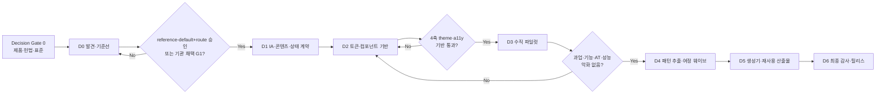

# eGov Enterprise UI/UX 전면 현대화 적대적 재검토 및 실행 계획

> **실행 에이전트:** 이 문서는 `docs/03-guides/orchestration-protocol.md`에 따라 한 작업 패키지씩 실행한다. 현재 문서는 구현 완료 보고가 아니라, 2026-08-20 Claude 원안을 대체하는 권고 계획이다.
>
> **2026-09-05 URL 정책 갱신:** [ADR-0009](decisions/ADR-0009-controlled-url-search-state.md)가 개인정보성 업무 검색어의 통제된 URL 사용을 승인했다. 아래 2026-08-20 검토 기록 중 “자유 검색어·식별자 URL 제외”와 `PD-UX-002` 승인 대기 문구는 당시 상태를 설명하는 역사로만 읽고, 현행 구현·검증에는 ADR-0009와 프런트엔드 헌법 제4조를 적용한다.
>
> **2026-09-05 IA 상태 갱신:** [ADR-0007](decisions/ADR-0007-reference-default-ia-approval.md)이 ADR-0004의 hybrid 방향을 reference-default IA로 승인해 공통 base에서 “잠정” 지위를 끝냈다. route별 disposition은 일괄 승인되지 않았으며 owner PR review로 개별 승인한다. 기관 채택 시에는 실사용자·실메뉴·실권한으로 원 G1을 다시 수행한다. 아래 2026-08-20의 ADR-0004 잠정·승인 대기 서술은 역사적 검토 문맥으로만 읽는다.

**목표:** 코드 정리 여부가 아니라 실제 사용자와 프레임워크 채택자가 더 안전하고 빠르게 핵심 과업을 완료했음을 증명하는 UI/UX 현대화를 수행한다.

**아키텍처:** 제품 증거와 정보구조를 먼저 고정하고, 브랜드 프로필과 색상 모드를 분리한 시맨틱 디자인 시스템을 만든 뒤, 서로 다른 화면 유형의 수직 파일럿에서 검증된 패턴만 추출한다. 이후 관리자 화면 수가 아니라 종단간 사용자 여정의 가치·빈도·위험을 기준으로 작은 웨이브를 이식하며, 접근성·반응형·성능·회복 가능성을 각 웨이브의 완료 조건으로 둔다.

**기술 스택:** Next.js 16 App Router, React 19, TypeScript, Tailwind CSS 4, TanStack Query 5, React Hook Form/Zod, Vitest/Testing Library, Playwright, axe-core, Spring Boot API, Flyway.

**상태:** Recommended · ADR-0007 reference-default IA 승인 · 기반 계약·긴급 접근성 수리·컴포넌트 경계 2개 배치 로컬 구현 · 원안 그대로의 착수는 거부 · G0와 기관 채택 G1 미통과 및 route별 disposition 미완결로 theme·파일럿·대규모 이식 보류

**검토일:** 2026-08-20

**검토 대상:** 저장소 밖 Claude local plan `cozy-jumping-torvalds.md`, 17,014 bytes, SHA-256 `E6CC6639A79C0A4EDA0167A0FDD3B530A3C52201FA21C4C27959BA327E59EED7`, 최종 수정 2026-08-20 22:40:04 KST

---

## 1. 최종 판정

### 1.1 결론

원안은 다음 강점을 가진 **프런트엔드 구조 현대화 초안**이다.

- 빅뱅 재작성 대신 점진 이식을 선택했다.
- 현재 코드의 중복 컴포넌트, 색상 부채, 거대 클라이언트 파일, query key 분산을 계측하려 했다.
- 테마 토큰, 공통 컴포넌트, 템플릿, 생성기, 재사용 프로필, 품질 게이트를 하나의 로드맵으로 연결했다.
- URL·메뉴·proxy·재사용 패키지의 연쇄 동기화와 기존 CSP/동적 렌더 제약을 의식했다.
- 라이트/다크 시각 검증, 래칫, 의도적 위반의 red 증명 같은 좋은 품질 원칙을 포함했다.

그러나 **UI/UX 전면 개선 계획으로는 그대로 승인할 수 없다.** 원안은 사용자·과업·정보구조·콘텐츠·실사용 성과보다 컴포넌트 수와 코드 비율을 우선하며, 몇몇 핵심 전제는 현재 디스크와 모순된다. 그대로 실행하면 다음과 같은 실패가 가능하다.

1. 잘못된 IA와 내부 용어를 더 일관되게 만들어 오히려 변경 비용을 키운다.
2. 정적 데모와 출처 없는 지표를 더 신뢰성 있어 보이게 만든다.
3. 실제 사용 중인 파일을 dead code로 오인해 기능을 파손한다.
4. 이미 존재하는 오류 경계를 페이지마다 복제해 헌법과 회복 범위를 악화한다.
5. `StandardDataTable`의 기존 pagination/empty 계약 위에 같은 기능을 다시 얹는다.
6. 접근성 자동 검사 수를 늘리고도 키보드·스크린리더 사용자가 과업을 완료하지 못한다.
7. 관리자 94화면만 이식하고 일반 사용자 25화면과 관리자→사용자 여정을 방치한다.
8. proxy allowlist와 메뉴 SQL을 생성기가 추론해 인가·DB 경계를 잘못 변경한다.
9. `'use client'` 파일 LOC를 줄인 뒤 실제 전송 JS나 사용자 체감 성능이 좋아졌다고 오판한다.

따라서 최적안은 **원안의 P0~P8을 순서만 다듬는 것이 아니라, 제품 증거 → IA·상태 계약 → 기반 → 수직 파일럿 → 패턴 추출 → 여정 웨이브 → 생성기/재사용 산출물 → 최종 감사**로 재구성하는 것이다.

### 1.2 승인 범위

| 범위 | 판정 | 조건 |
|---|---|---|
| 읽기 전용 census, 문서 오류 정정, 테스트 분류 | 즉시 진행 가능 | baseline을 약화하거나 구현 방향을 선결하지 않을 것 |
| 헌법·ADR 개정 | 즉시 진행 | 사용자 승인에 따라 본 계획과 ADR-0003으로 선행 반영 |
| 사용자 연구·top-task·IA 검증 | 최우선 | Decision Gate 0의 필수 입력 |
| 테마 plumbing·시각 재설계 | Gate 0 후 진행 | KRDS 적용 수준·브랜드 프로필·접근성 목표가 먼저 고정될 것 |
| 명백한 보안·접근성·콘텐츠 진실성 결함 수리 | 즉시 진행 가능 | IA·브랜드·권한 의미를 바꾸지 않는 최소 수리만 허용하며 D2/G2 진척으로 계산하지 않을 것 |
| 대규모 컴포넌트 이동·템플릿 확정 | 보류 | 최소 3개 상이한 파일럿과 reachability 증거가 필요 |
| 관리자 웨이브 이식 | 보류 | 해당 route disposition 개별 승인, 기관 채택 시 IA 재검증, 사용자 성과 baseline, 파일럿 gate 통과 필요 |
| 화면 생성기·메뉴 산출물 | 강한 보류 | 안정된 3개 이상 예시, 인가 분류, DB 별도 승인 경계 필요 |

### 1.3 원안 요소별 처리

| 원안 요소 | 처리 | 이유 |
|---|---|---|
| 점진적 rebuild | 유지 | 롤백·회귀 격리에 유리하다. 단, 한 웨이브는 3~5 route 또는 한 종단간 여정으로 제한한다. |
| KRDS + Premium | 수정 | 하나의 CSS import 선택이 아니라 `brand profile × color mode`의 독립 축으로 설계한다. |
| admin-first | 조건부 유지 | 화면 수 94/119가 아니라 과업 가치·빈도·위험·준비도로 우선순위를 다시 산정하고 비관리자 후속 웨이브를 명시한다. |
| 3계층 토큰 | 유지 | KRDS 버전·추적 매트릭스·실제 렌더 검증을 추가한다. component token은 반복 필요가 확인될 때만 만든다. |
| 컴포넌트 물리 루트 1개 | 폐기 | primitive/shared/feature/route-local이라는 의미 경계가 물리적 단일 루트보다 중요하다. |
| 10개 primitive 선제 생성 | 축소 | 파일럿이 요구한 최소 컴포넌트부터 계약 기반으로 추가한다. |
| List/CRUD/Detail/Hub 4 template | 재설계 | 업무 기능을 소유하지 않는 얇은 slot 기반 scaffold로 제한하며 wizard/tree/calendar/composer/matrix는 별도 패턴으로 둔다. |
| 중앙 `lib/query-keys.ts` | 폐기 | domain-local typed query options/key factory로 전환한다. |
| client TanStack 기본·Hydration ≤5 | 폐기 | 데이터 소유권과 측정 결과에 따른 route별 선택으로 바꾼다. 숫자 quota를 두지 않는다. |
| 페이지별 `error.tsx` 확대 | 폐기 | 독립 복구 단위와 query reset 범위에 맞춘 도메인 경계를 사용한다. |
| axe 전 화면 sweep | 명칭·계약 수정 | `route × role × state × theme × viewport` 대표 자동 검사와 수동 AT 평가로 나눈다. |
| Client LOC 51.3→45% | 정보성 지표로 강등 | hydration·bundle 비용을 직접 측정하지 못하고 분모 조작이 가능하다. |
| 생성기의 proxy/menu SQL 자동화 | 제거 | 인가 의미와 live schema/메뉴 결정을 안전하게 추론할 수 없다. 검토용 manifest만 생성한다. |
| 재사용 프로필 산출물 | 유지·강화 | positive ownership, static route reference, 실제 산출물 install/type/lint/test/build 검증을 추가한다. |
| 성능·반응형을 P8에서 마감 | 폐기 | 컴포넌트와 모든 이식 웨이브의 DoD에 내장하고 마지막에는 감사만 한다. |

### 1.4 원안 Phase별 재배치

| Claude 원안 | 적대적 판정 | 새 위치 |
|---|---|---|
| P0 착수 위생·계측 | 일부 즉시 가능 | Task 0.1~0.5. 단, dead-code·error coverage·client LOC의 측정 정의를 먼저 수정 |
| P1 KRDS 토큰·테마 | 방향 유지, 선행 결정 누락 | G0/G1의 KRDS profile·접근성 목표 승인 후 Task 2.1~2.2 |
| P2 component kit·긴급 수리 | 빅뱅 이동·페이지 boundary 증식 거부 | Task 2.3 긴급 접근성 수리 후 Task 2.4 의미 경계별 small batch |
| P3 template·fetch·generator | 서로 다른 성숙도와 위험을 한 단계에 혼합 | fetch 원칙은 ADR-0003으로 선행, template은 파일럿 후 Task 4.1, generator는 Task 5.1로 지연 |
| P4 2화면 pilot | 실제 route 전제 오류, archetype 부족 | Task 3.1~3.4의 dense list·cross-role·complex interaction·hub 파일럿 |
| P5 admin wave | route count 기반이며 user surface 누락 | Task 4.3의 complete journey wave. 비관리자 25 route 포함 |
| P6 final quality gate | 너무 늦고 axe를 준수와 혼동 | 접근성·반응형·성능을 G2와 모든 wave에 내장, Task 6.1은 최종 감사만 수행 |
| P7 reusable boundary | 좋은 목표이나 ownership/build 증거 부족 | Task 5.2 positive ownership + clean artifact 검증 |
| P8 performance·responsive | 사후 마감으로는 재작업 위험 | baseline부터 모든 pilot/wave에 포함하고 D6에서 재측정 |

원안의 P5·P6·P7 병렬화도 그대로 사용하지 않는다. mass route migration, component path 이동, profile cut은 같은 import·route·test 파일을 경쟁적으로 수정하므로, profile/component 경계를 먼저 고정하고 wave owner가 독립적인 파일 집합을 가질 때만 제한적으로 병렬화한다.

---

## 2. 검토 방법과 증거 한계

### 2.1 사용한 방법

검토는 원안의 숫자를 그대로 신뢰하지 않고 다음을 현재 디스크에서 다시 확인했다.

1. 라우트·컴포넌트·테스트·오류 경계의 exact census.
2. route entry에서 시작하는 transitive reachability와 test-only 참조 구분.
3. 실제 사용자 여정이 UI를 통과하는지 E2E 본문 확인.
4. 정적 데모·부분 구현·실데이터 화면의 코드상 진실 확인.
5. 현재 헌법과 원안의 구현 순서·기술 선택 충돌 확인.
6. Next.js, TanStack Query, WCAG, KRDS의 공식 문서와 현재 계획 비교.
7. UX, 기술 실현성, 거버넌스·접근성의 독립 레드팀 3개 결과 교차 검증.

### 2.2 증거의 한계

- 활성 PRD, 사용자 인터뷰, 사용 로그, 지원 문의 분류, 운영 RUM이 없으므로 실제 과업 우선순위와 사용성 목표치는 아직 확정할 수 없다.
- 현재 census는 파일·식별자·문자열 기반 계측이 섞여 있다. 수치마다 모집단과 측정식을 명시하지 않으면 서로 비교할 수 없다.
- 자동 테스트 green은 현재 assertion을 충족한다는 뜻이지 과업 성공, 접근성 준수, 기능 실제성을 자동으로 증명하지 않는다.
- 이 문서에서 제안하는 숫자 목표 중 baseline 전의 값은 **초기 guardrail**이다. P0 조사 후 근거와 함께 확정하거나 변경한다.

---

## 3. 2026-08-20 착수 전 재검증 기준선과 현재 delta

> 이 절의 3.1~3.4는 Claude 원안을 반박하기 위해 동결한 **2026-08-20 boot baseline**이다. 이후 로컬 구현으로 수리된 항목도 당시 결함과 계획 선택의 근거를 보존하기 위해 과거형 기준선으로 남긴다. 현재 상태는 3.5와 실행 계약의 검증 결과를 함께 읽어야 하며, 이 과거 기준선을 현재 미해결 결함 목록으로 인용해서는 안 된다.

### 3.1 구조·코드 기준선

| 항목 | 착수 전 실측 | 해석 |
|---|---:|---|
| 전체 `page.tsx` | 119 | route 개수이지 사용자 가치나 작업량이 아니다. |
| `/admin` 아래 `page.tsx` | 94 | `/admin`에도 일반 USER 접근 가능 화면이 있어 단일 관리자 persona로 간주할 수 없다. |
| 비관리자 route | 25 | 로그인, 포털, 검색, 설문, 결재, 쪽지, 도움말 등 교차 역할 여정의 사용자 면이 포함된다. |
| `src/components` TSX | 54 | 테스트 포함 방식에 따라 변동하며 단일화 자체가 품질 목표는 아니다. |
| `src/app/components` TSX | 52~53 | dashboard 4개와 theme provider까지 있어 `ui/layout`만 옮겨서는 삭제할 수 없다. |
| `@/app/components/` import | 107 files / 308 sites | 기계 이동 시 client boundary, mock, dynamic import, service/context 결합을 파손할 수 있다. |
| 코드 census | FE 593 files / 78,371 LOC | 2026-08-20 `node scripts/code-census.mjs --json` 결과. |
| 직접 client LOC ratio | 51.3% | 파일 내 지시어 휴리스틱과 전체 `src` 분모라 hydration 비용 KPI로 부적합하다. |
| 600 LOC 초과 FE 파일 | 10 | `UserOrgHubClient` 1,385, Monitoring 990, Banner 968, SecurityHub 877, CommonCode 861 등. 줄 수만으로 분할하지 않는다. |
| 기존 color guard 탐지 | 103 + 786 = 889 | production TSX/JSX의 특정 Tailwind palette utility 탐지 수이며 전체 색 리터럴 수가 아니다. |
| `HydrationBoundary` | 1 | 사용 개수는 최적 데이터 전략의 증거가 아니다. |
| `next/image` production import | 3 | 개수가 아니라 실제 LCP resource·bytes·CLS를 본다. |

### 3.2 컴포넌트·경계의 반례

- `frontend/src/app/components/ui/virtual-scroll-list.tsx`는 `user-picker.tsx`가 import하고 `/note` route가 `UserPicker`를 사용한다. 원안의 dead-code 삭제 후보는 틀렸다.
- 실제 `/admin/user/manage`는 `UserOrgHubClient`를 렌더한다. 원안이 첫 파일럿의 버그 근거로 든 `UserManageClient.tsx`의 10개 제한은 현재 route가 사용하지 않는 코드다.
- `StandardDataTable`은 이미 검색, loading/error/empty, 모바일 카드, 선택·일괄 작업, pagination props·계산·UI를 가진 641줄 복합 컴포넌트다. 여기에 `PagePagination`과 `EmptyState`를 조합한 `ListPageTemplate`을 얹으면 중복 계약이 생긴다.
- `StandardDataTable` 모바일 카드는 클릭 핸들러가 없어도 `role="button"`과 `tabIndex=0`을 가지며, button 역할 컨테이너 안에 checkbox를 중첩한다. 표준으로 승격하기 전에 시맨틱·키보드 계약부터 수리해야 한다.
- `PageHeader`는 client `DynamicBreadcrumb`에 결합돼 있고 `PageHeader`와 `HubHeader`가 각각 `<h1>`을 가진다. 무조건 합성하면 client graph와 heading 중복이 커진다.
- root layout이 Header, Sidebar, Footer, AppShell, `max-w-7xl`을 이미 소유한다. 책임 분리 없이 `admin/layout.tsx`를 추가하면 shell과 폭 제한이 중복될 수 있다.

### 3.3 오류·접근성·반응형 기준선

| 항목 | 착수 전 실측 | 적대적 해석 |
|---|---|---|
| route `error.tsx` | 10 + `global-error.tsx` 1 | 119 page 모두 조상 error 경계를 가지며 `none`은 0이다. “35 page 미커버”는 사실이 아니다. |
| 전역 React boundary | `Providers`의 `StandardErrorBoundary` | 파일 수만 늘려도 실제 회복 범위가 개선되지 않는다. |
| admin retry | 무범위 `queryClient.refetchQueries()` | 도메인 오류 복구가 전체 query refetch storm을 만들 수 있다. |
| axe 실행 route | 로그인, 관리자 dashboard | `AxeBuilder` 호출 3회지만 고유 화면은 2개다. |
| 대비 검사 | core E2E 두 곳에서 `color-contrast` 비활성 | 자동 접근성 green이 실제 대비를 증명하지 않는다. |
| 반응형 E2E | 375/768/1280, `/admin`·`/admin/work-hub` | shell overflow와 sidebar만 보며 업무 액션 parity, zoom, overlay focus는 보지 않는다. |
| VRT | 사실상 dashboard 1장 | 동적 영역을 mask하고 전체 1%를 허용해 작은 focus/error/action 회귀를 놓칠 수 있다. |
| Lighthouse | `/login`, performance 0.85 warn, accessibility 0.9 error | 인증 후 핵심 업무 흐름이나 현장 성능의 증거가 아니다. |

### 3.4 제품·여정 기준선

- `docs/01-product/README.md`는 현재 활성 PRD가 없다고 명시한다.
- `PD-UX-001`의 reference-default IA 방향은 ADR-0007로 승인됐고, exact label/group/order/visibility와 route별 disposition의 개별 owner 승인이 남았다. 원안은 이 경계를 별건으로 미루면서 그보다 먼저 생성기와 메뉴 SQL을 만들려 했다.
- 설문 E2E의 “Admin Create → User Participate”에서 사용자 투표는 UI가 아니라 API로 직접 수행된다. 이 green은 참여 화면의 사용 가능성을 증명하지 않는다.
- 배너/팝업, FAQ, 설문, 결재는 관리자 설정과 일반 사용자 경험이 이어지는 종단간 흐름이다. admin 화면만 이식하면 여정이 반쪽으로 남는다.
- `/admin/workflow`는 코드 주석상 백엔드 미연동 정적 데모이고 `24`, `156`, `99.9%`, `LOW` 같은 고정 지표를 운영 데이터처럼 표시한다.
- 승인 작성 등 일부 화면도 저장 미연동/부분 구현이다. 디자인을 개선하기 전에 `live | partial | demo | unavailable` 상태를 밝혀야 한다.
- UI에는 `Identity_ID`, `Draft Center`, `Encryption Active`, “인텔리전스”, “노드”, “스트림” 같은 내부 용어와 혼합 언어가 남아 있다. 원안의 “없습니다 문자열 통합”만으로 콘텐츠 문제가 해결되지 않는다.

### 3.5 2026-08-21 로컬 구현 delta

다음은 승인 없이 안전하게 수행할 수 있었던 기반 계약과 긴급 수리의 현재 디스크 상태다. 이는 사용자 연구·기관 채택 시 IA 재검증·route별 disposition 승인·실사용 baseline을 대신하지 않으며, G0·기관 채택 G1 또는 전체 현대화 완료를 뜻하지 않는다. 아래 pre-Gate 보안·접근성·콘텐츠 진실성 수리와 호환 경계 정리는 D2 착수나 G2 진척으로 계산하지 않는다.

| 영역 | 현재 로컬 상태 | 검증/한계 |
|---|---|---|
| route truth | filesystem route 119개와 redirect-only alias 2개를 manifest로 고정했다. route status는 `live` 0, `partial` 9, `unavailable` 2, `unverified` 108이다. | 구조 exactness와 일부 실행 계약만 확인했다. 역할·메뉴·제품 소유권은 승인 전이며 `decisionSafe=false`다. |
| IA direction | [ADR-0007](decisions/ADR-0007-reference-default-ia-approval.md)이 ADR-0004의 과업 중심 기본 내비게이션+명시적 관리 센터를 reference-default IA로 승인했다. 사용자 연구 없는 승인은 accepted risk이며 공통 base에서 잠정 지위는 끝났다. | disposition overlay는 `proposed`, `acceptedDecision=null`이고 route별 처분은 일괄 승인되지 않았다. 승인된 route만 menu/generator가 소비할 수 있으며, 기관 채택 시 live menu/role과 실제 사용자 증거로 원 G1을 재수행한다. |
| reachability | 2026-08-21 15:45 KST 현재 [census 생성기](../../scripts/frontend-reachability-census.mjs) 재실측은 620개 source를 `runtime=452`, `test-only=164`, `ambiguous=1`, `safe-candidate=3`으로 분류했다. | 소스 변경에 따라 변하는 시점값이며 삭제 승인이 아니다. 현재값은 `node scripts/frontend-reachability-census.mjs --check`로 다시 확인한다. 실제 사용 중인 virtual list와 orphan client의 차이는 계약으로 고정했다. |
| 색상 guard | 두 기존 래칫을 101 + 774로 낮췄다. | 의미가 같은 색상만 토큰으로 이식한 결과이며 baseline 완화가 아니다. 전체 시각 품질이나 대비 준수를 뜻하지 않는다. |
| 표·heading | `StandardDataTable`의 가짜/nested row button을 제거했고, `PageHeader`를 server-safe하게 만들고 `HubHeader` heading level 계약을 추가했다. 119 route의 실제 렌더·loading·error 분기 heading을 감사했다. | redirect/alias는 렌더 heading 모집단이 아니다. 수동 AT/zoom 증거는 여전히 외부 입력이다. |
| modal·focus | 로그인, 모바일 sidebar, 글로벌 커맨드 센터에 background isolation, focus trap, 초기/복귀 focus 계약을 추가했다. 로그인 route에서는 전역 overlay를 렌더하지 않는다. | NVDA·VoiceOver·iOS 실기기 검증은 아직 없다. |
| 오류 회복 | root/admin 오류의 무범위 `refetchQueries()`를 제거해 실패한 route boundary의 `reset()`만 수행한다. raw 오류·비신뢰 digest는 사용자 UI와 인증 경계 console에 노출하지 않는다. | 도메인별 retry key는 파일럿에서 실제 query ownership이 확인될 때만 추가한다. |
| reference baseline | current authoritative r12는 synthetic setup 2/2, proxy 3/3, 대상 E2E 15건 통과·Windows VRT 1건 의도적 skip 뒤 exact 8 scenario·96/96 state·48/48 performance를 완료했다. state/performance invalid는 0이고 assertion은 156/156다. r12 automated-only compact summary는 PR #434 head required CI run `32502622801`을 통과해 merge commit `f39ba9930df973710318088ccb00a2800643d9a3`에 병합됐고, 병합 뒤 Java CI run `32504902346`과 dependency graph run `32504902338`도 성공해 durable historical evidence로 발행됐다. | user 12·FAQ 18·board deploy 6의 mutation evidence 36건은 case-bound 실행·authoritative readback·rollback·cleanup·active residue 0으로 닫혔다. execution-captured protocol hash와 manual 48건이 없어 8개 `currentBaseline`은 모두 `unmeasured`다. |
| r13 evidence readiness | fresh UUID attempt의 run-scoped staging, exact 282 자동 JSON + 마지막 `automated-run-seal.json`, source/protocol/tooling finish verification, rollback-safe canonical swap과 combined summary v2 계약을 구현했다. clean-checkout measured 판정은 ignored raw 파일이 아니라 tracked current summary의 exact 8 scenario projection을 사용한다. | 계약 86/86과 TSC/plan은 green이지만 runtime은 아직 시작하지 않았다. protocol·tooling·production input이 실행 commit과 exact 일치하는 clean snapshot을 commit 승인으로 먼저 만들어야 하며, 실제 수동 접근성 48건은 자동으로 채우지 않는다. **2026-08-22 DEC-OPS-012 로 r13 런타임 실행을 보류했고 구현물은 그대로 보존한다 — 보류는 measured 승격이 아니다.** |
| axe·responsive | `color-contrast` 비활성화를 제거했고 reduced-motion은 axe 대상에만 한정했다. r12 exact 자동 모집단에서 axe violation·horizontal overflow·failed assertion은 0이었다. | 정의된 자동 state의 후보 0건일 뿐 WCAG 준수나 실기기 reflow 완료가 아니다. 수동 keyboard·NVDA·zoom·forced-colors·reduced-motion 증거가 남았다. |
| 데모 정직성 | `/admin/workflow`의 고정 수치·행동을 정적 데모로 명시하고 미지원 mutation을 disabled 처리했다. dashboard의 가짜 활동·가짜 운영 수치를 제거하고 오류와 0건을 분리했다. | 나머지 108개 unverified route를 live로 승격하지 않았다. |
| 컴포넌트 경계 | skeleton 호환 shim과 status badge를 작은 batch로 공용 경계에 이식했다. | 서로 다른 수직 파일럿 3개 전에는 대규모 이동을 금지한다. |

위 r12는 현재 자동 증거의 정본이고 r11 이하 실행은 역사다. r8의 focus assertion 실패 6건, axe violation case 14건(violation 16건), 4px overflow 2건과 r9의 mutation prerequisite 36건은 r12에서 각각 자동 finding 0·case-bound executed evidence 36건으로 관측됐지만 과거 artifact를 수기 수정하지 않는다. r12의 full JSON 282개와 별도 diagnostic JSON 8개 원본은 privacy 검사를 통과했어도 계속 ignored/untracked `ephemeral-ignored`이며, UA-04는 그 원본을 복제하지 않은 automated-only compact summary만 durable historical evidence로 발행했다. execution-captured protocol hash와 manual 48건이 닫히기 전에는 `measured` 또는 전체 현대화 완료로 승격하지 않는다.

현재 reference-default IA 승인은 유효하지만, G0 입력·기관 채택 G1 재검증·미승인 route disposition은 **phase-advancement blocker**다. 활성 제품 책임자·top-task 연구, role/capability 승인, live effective-menu/authority 증거, KRDS profile·브랜드 결정이 없으므로 theme 확정·파일럿·대규모 route wave와 미승인 route의 generator/menu 변경은 계속 보류한다. 다만 이것만으로 실행 루프 전체의 terminal blocker를 선고하지 않는다. 승인 없이 안전한 내부 수리·계약 보강·현재 디스크 최종 검증을 먼저 소진한 뒤, 남은 항목을 실행 계약의 `Genuine blocker` 조건으로 다시 감사한다.

---

## 4. P0/P1 적대적 발견 사항

### F-01 — 제품 증거 없이 화면 수로 우선순위를 결정함 (Blocker)

**공격 시나리오:** 94개 admin route를 먼저 통일했지만 실제 고빈도 과업은 로그인, 검색, 결재, 설문 응답이다. 코드 adoption은 100%인데 과업 시간과 문의량은 악화된다.

**원인:** 활성 PRD·사용자군·top-task·현재 과업 성공률·실패 비용이 없다. 화면 수는 구현 규모일 뿐 사용자 가치가 아니다.

**필수 보완:**

- 프레임워크 채택자와 최종 제품 사용자를 분리한다.
- 사용자 가설을 시스템 관리자, 보안/권한 관리자, 콘텐츠 관리자, 일반 업무 사용자, 결재자/설문 응답자, SI 개발자/디자이너로 시작하되 조사로 수정한다.
- 역할별 top-task, 빈도, 오류 비용, 민감도, 현재 완료율·시간·오류·도움 요청을 수집한다.
- 사용자 접근이 불가능하면 명칭을 “프런트엔드 디자인 시스템·아키텍처 현대화”로 축소하고 UX 효과를 미검증으로 표시한다.

**수용 기준:** 활성 UX brief/PRD에 사용자, 상위 과업, 범위·비목표, 성공 기준, 결정권자, 가설과 검증 시점이 있다.

### F-02 — IA 결정 전에 생성기가 현행 구조를 고착함 (Blocker)

**공격 시나리오:** 중복·고아·내부 용어 메뉴가 generator 기본값이 되고, 이후 IA 변경이 route·DB·proxy·POM 전체 재작업으로 번진다.

**필수 보완:**

- `PD-UX-001`의 남은 route별 disposition 승인을 해당 route의 generator/menu 소비보다 앞선 fail-closed Gate로 유지한다.
- URL 안정성과 메뉴 IA를 분리한다. URL을 유지하면서 label/group/order/visibility를 바꿀 수 있다.
- 119 route를 `유지 | 이동 | 별칭 | 통합 | 숨김 | demo | 폐기`로 분류한다.
- 역할×top-task×진입 경로 행렬, 카드 소팅, tree test, 첫 클릭 테스트를 수행한다.
- breadcrumb, 전역 검색, 최근 항목, 즐겨찾기, deep link, 뒤로가기 계약을 함께 결정한다.

**초기 목표:** 상위 과업 tree-test success와 first-click success 각각 80% 이상. 실제 위험·표본에 따라 조사 계획에서 확정한다.

### F-03 — “전면 개선”에서 비관리자 25 route와 교차 역할 여정이 누락됨 (Blocker)

**필수 여정:**

- J1 인증·세션: 로그인 → 목적지 복귀 → 만료 경고 → 연장/재로그인.
- J2 사용자·권한: 사용자 등록 → 권한 배정 → 대상 사용자 메뉴/거부 확인.
- J3 설문: 생성·문항 → 게시 → 사용자 UI 응답 → 중복 방지 → 통계.
- J4 콘텐츠: 게시판 생성 → 글 작성·초안 복원·첨부 → 열람·댓글·추천.
- J5 도움말: FAQ 등록 → 일반 사용자 검색·열람.
- J6 프로모션: 배너/팝업 생성 → 포털 노출 → 닫기/다시 보지 않기.
- J7 업무: 부서 업무 등록 → 상세 → 수정·삭제 → 보고·결재.

**수용 기준:** 25개 비관리자 route 모두 처리 계획이 있고, 각 wave가 최소 한 개의 완결된 교차 역할 여정을 포함한다. 과업 액션은 UI로 수행하고 API는 seed/cleanup에만 사용한다.

### F-04 — live/partial/demo를 구분하지 않아 가짜 기능을 미화함 (Blocker)

**필수 산출물:** route capability truth manifest.

```text
route, profile, capabilityStatus, dataSource, supportedActions,
visibleLabel, operationalDecisionSafe, completionPrerequisite, owner
```

**수용 기준:**

- live 화면의 출처 없는 운영 지표와 비동작 action은 0건이다.
- demo는 허용 프로필에서만 노출하고 명시적 demo 배너를 가진다.
- core/collaboration 산출물에서 demo 역참조는 hard red다.
- unavailable/partial 상태를 실제 기능처럼 표현하지 않는다.

### F-05 — dead code 판정과 파일럿 전제가 실제 route reachability를 보지 않음 (Blocker)

**반례:** `virtual-scroll-list.tsx → user-picker.tsx → /note`는 live path다. `/admin/user/manage → UserOrgHubClient`이며 원안이 지목한 `UserManageClient`는 route entry가 아니다.

**필수 보완:**

- raw `rg` 0건 대신 `route entry → static/dynamic import → component` reachability를 사용한다.
- production, test-only, docs/public API, generator/reusable profile 소비를 분리한다.
- base framework의 외부 소비 가능성까지 포함한 `project-safe-deletion-analysis.md` 절차를 적용한다.
- 구조 이동과 행동 변경, visual 변경, 삭제를 같은 PR에 강제로 섞지 않는다.

**수용 기준:** 삭제 대상마다 live route 0, dynamic import 0, profile/public contract 0, test/doc 의도 확인, dependency 정리, build 결과를 증거로 남긴다.

### F-06 — 오류 경계 파일 수를 회복 가능성으로 오인함 (Blocker)

**필수 보완:**

- `error.tsx coverage`를 `nearest recovery boundary + reset scope + auth context` inventory로 바꾼다.
- 같은 복구 의미의 페이지별 boundary 복제를 금지한다.
- 전역 `refetchQueries()` 대신 실패 query family 또는 명시된 domain scope만 reset한다.
- render throw, layout throw, query failure, 4xx/5xx, offline, empty는 서로 다른 테스트로 다룬다.
- fallback 진입 focus, 설명, 재시도, 복귀, reduced-motion, screen-reader announcement를 검증한다.

**수용 기준:** 독립 복구가 필요한 domain만 경계를 가지며, 주입된 실패에서 영향 밖 영역과 query가 유지되고 재시도가 실제로 회복된다.

### F-07 — 네 템플릿과 StandardDataTable이 새 god component를 만듦 (Blocker)

**필수 보완:**

- 템플릿을 layout/heading/action/state slot을 제공하는 server-safe page scaffold로 제한한다.
- fetch, query key, mutation, authorization, domain validation을 template이 소유하지 않는다.
- 화면 유형을 `list/search | form | detail | dashboard | wizard/stepper | tree/master-detail | calendar/timeline | composer | matrix/canvas`로 분류한다.
- `StandardDataTable`을 headless table state, desktop table, mobile representation, pagination, selection/bulk, status display로 분해할지 characterization test 후 결정한다.
- table 접근성 결함을 표준 승격 전에 수정한다.

**수용 기준:** 최소 3개의 상이한 production 파일럿에서 같은 slot 계약이 반복된 뒤에만 추출하며, template 없이 더 단순한 화면을 실패로 판정하지 않는다.

### F-08 — E2E green을 실제 사용자 성공으로 오인함 (Blocker)

**테스트 분류:**

| 종류 | 목적 | API 직접 호출 허용 |
|---|---|---|
| Route smoke | route·shell·console crash | seed/로그인 fixture 허용 |
| Contract integration | API·인가·영속 계약 | 계약 자체가 목적이면 허용 |
| User journey | 사용자가 UI로 목표 완료 | 준비·정리만 허용, 핵심 action 우회 금지 |
| Accessibility state | keyboard·focus·name/role·axe | 상태 준비만 허용 |
| Visual regression | theme·layout·critical region | deterministic fixture 허용 |

**수용 기준:** top-task는 UI-only journey를 가지며 제출 request, 사용자 feedback, 영속 결과를 모두 단언한다. 핵심 button/feedback을 의도적으로 제거하면 red가 되는 부정 증거를 가진다.

### F-09 — 접근성을 axe route 수와 토큰 대비로 축약함 (Blocker)

자동 검사는 필요하지만 충분하지 않다. 평가 모집단은 URL 목록이 아니라 다음 case key를 사용한다.

```text
caseId = route + role + dataState + interactionState + brandProfile + colorMode + viewport
```

**필수 수동 매트릭스:**

- keyboard: skip link, logical order, visible/not-obscured focus, trap, Escape, composite widget arrow keys, focus return.
- screen reader: title, landmark, heading, table headers, label/hint/error, dialog announcement, live region, toast/status.
- reflow/zoom: 200% text resize, 320 CSS px 상당, 400% zoom.
- visual modes: light/dark, forced colors/high contrast, reduced motion, color-only 정보 금지.
- input: pointer/touch target, dragging alternative, hover-only 기능 금지.
- state: loading, empty, filtered-zero, validation, 403, 5xx, modal/sheet/menu open.

**수용 기준:** 대표 case의 axe violation 0, `color-contrast` 비활성 제거 또는 만료 있는 waiver, 핵심 과업 keyboard 완료 100%, NVDA+Chrome 최소 기준 수동 기록. 자동 결과만으로 “WCAG 준수”를 선언하지 않는다.

### F-10 — 반응형을 마지막 마감으로 미룸 (Blocker)

**필수 viewport:** 320, 360/375, 767/768, 1023/1024, 1279/1280, 필요 시 1535/1536. portrait/landscape와 400% zoom 상당 조건을 포함한다.

**수용 기준:** top-task action parity, 예상 밖 horizontal scroll 0, mobile menu focus/scroll lock/return, soft keyboard 노출 후 submit 접근, 긴 한국어·URL·validation error·overlay 상태를 모든 wave에서 검증한다.

### F-11 — 중앙 query key와 hydration quota가 데이터 의미를 손상함 (Blocker)

**필수 보완:**

- domain이 `all / lists / list(params) / details / detail(id)` hierarchy를 소유한다.
- 가능하면 typed `queryOptions()`에 key와 fetch function을 함께 둔다.
- list/detail parameter 포함, prefix uniqueness, exact invalidation, profile cut을 계약 테스트한다.
- server component는 구조 기본값으로 유지하되 초기 핵심 데이터는 측정상 이익이 있을 때 prefetch/hydrate한다.
- interaction 후 또는 비핵심 데이터는 client fetch를 사용한다.
- TTFB, 최초 데이터 표시, loading 노출, duplicate request, route JS, cache recovery로 선택을 기록한다.

**수용 기준:** 중앙 거대 registry가 없고 domain 제거가 core query key를 수정하지 않는다. 임의의 `HydrationBoundary ≤ N` 목표가 없다.

### F-12 — generator가 인가·DB 결정을 추론함 (Blocker)

**금지:** generator의 무조건적 proxy allowlist 수정, 실행 가능한 menu INSERT/Flyway 생성, menuSn/parent/order/role 추론.

**허용:** 명시적 입력으로 route/component/test/query skeleton과 검토용 manifest를 dry-run 생성.

**필수 입력:** domain, route, screen type, API operation ID, authorization class(`admin-only | authenticated | public | explicit-exception`), profile ownership, 선택적 menu intent.

**수용 기준:**

- 기본값은 admin deny-by-default 보존과 proxy 무수정이다.
- USER-accessible 예외는 별도 승인 산출물로만 제안한다.
- DB menu는 검토용 draft이며 live schema 조회와 별도 L2 DB task 없이는 적용되지 않는다.
- temp dir exact output, import resolution, tsc/lint, idempotence, overwrite/path traversal/collision red test가 있다.
- 안정된 production 예시 3개 전에 generator API를 고정하지 않는다.

### F-13 — 콘텐츠 설계와 개인정보 UX가 빠짐 (High)

**필수 보완:**

- 사용자 가시 문구, 내부 용어, 날짜·시간대·숫자·단위·status, empty/error/success 문구 인벤토리를 만든다.
- 한국어 우선 ADR에 따라 action은 “동사+대상”, 오류는 “상태/원인 또는 조건/다음 행동/입력 보존/참조 코드” 구조를 사용한다.
- hover-only tooltip에 필수 정보를 두지 않는다.
- field-level 데이터 분류, URL allowlist, 역할×필드×action visibility를 만든다.
- 성명·사번·계정명 등이 포함될 수 있는 일반 업무 검색어는 [ADR-0009](decisions/ADR-0009-controlled-url-search-state.md)의 화면별 route/query key allowlist 안에서만 URL에 둘 수 있다. unknown query를 재전파하지 않고 same-view 변경은 `replace`를 우선하며 client log·analytics·오류 로그 payload에 복제하지 않는다. 이 허용은 화면별 URL 동기화 의무가 아니다.
- 앱은 자격증명, cookie·session 비밀, 인증·복구 token, 주민등록번호 등 고유식별정보, 금융·건강·생체 등 고위험 개인정보, 응답 데이터와 업무 본문을 위한 전용 URL field/state를 설계하지 않고 일반 검색창에서 그런 입력을 요구·유도하지 않는다. 자유 입력값의 의미를 완전 탐지할 수 없으므로 사용자의 예상 밖 붙여넣기는 accepted residual risk이며 고위험 용도 승인이 아니다. credential-name gate는 key 이름을 차단하는 장치이지 값 DLP가 아니다.

**수용 기준:** 승인 예외 외 사용자 가시 영어 UI 0, 설명 없는 내부 용어 0, label 대신 placeholder만 사용한 입력 0, 허용 검색어의 unknown-query 재전파·client log·analytics 복제 0, 고위험 용도의 전용 URL field/state와 일반 검색창 입력 요구·유도 0. 이 기준은 자유 입력값 DLP를 보장한다는 뜻이 아니다.

### F-14 — 기술 proxy 지표가 UX 성과로 오인됨 (High)

| 원안 지표 | 새 지위 | 대체/보완 |
|---|---|---|
| Client LOC ratio | informational | route initial JS, chunk delta, boundary graph, Web Vitals |
| container 300 LOC | diagnostic | 책임 수, dependency direction, cyclomatic/interaction complexity, testability |
| useAppForm 100% | eligible form ratchet | mutating/validated form만 모집단; simple search/filter 예외 |
| `error.tsx` 100% | 제거 | injected recovery success와 blast radius |
| free-string query key 0 | 보조 | hierarchy, parameter, invalidation behavior |
| color literal 0 | scanner-specific ratchet | actual rendered contrast와 structured waiver |
| next/image file count | 제거 | actual LCP resource, bytes, dimensions, CLS |
| axe screen count | coverage metadata | route×role×state×mode와 manual AT 결과 |

### F-15 — 색 lint 확장과 신규 gate가 현재 CI에서 허위 red/green을 만들 수 있음 (High)

- 현 lint는 aggregate `--max-warnings 253`을 사용한다. 새 warn 탐지를 한꺼번에 늘리면 즉시 hard red가 될 수 있고 cap 상향은 H2 위반이다.
- 신규 E2E spec은 `shard-duration-profile.json` exact-match에 함께 등록하지 않으면 CI가 실패한다.
- golden snapshot은 구현과 기대값을 같이 갱신하면 자기충족 green이 될 수 있다.

**게이트 공통 계약:** owner, exact population, execution path, required CI consumer, artifact, empty-population hard fail, 판정 red fixture, 실행 binding red fixture, exception owner/reason/reviewBy, cost tier를 가진다.

### F-16 — 재사용 base를 단순 build green으로 평가함 (High)

**필수 보완:**

- route/service/feature/POM/asset/static route string의 positive ownership inventory를 만든다.
- import graph가 놓치는 `router.push`, redirect, menu config, CSS/JSON/assets를 별도 검사한다.
- core/collaboration/demo를 clean temp output으로 생성해 install/type/lint/test/build/bundle/smoke를 각각 실행한다.
- 저장소를 모르는 채택자 최소 3명이 문서만으로 profile 선택, theme 설정, route 생성, feature 제거, 접근성 상태 추가를 수행한다.
- 생성 후 upstream update/semver/escape hatch 전략을 문서화한다.

---

## 5. 목표 운영 모델

### 5.1 사용자와 표면 분리

| 표면 | 주 사용자 | 핵심 위험 | 기본 프로필 예시 |
|---|---|---|---|
| Public portal | 시민/일반 사용자 | 신뢰, 쉬운 언어, 접근성, 낮은 학습 비용 | KRDS standard/aligned |
| Authenticated workspace | 업무 사용자/결재자 | 과업 연속성, 세션, 작성 데이터 보존 | KRDS aligned 또는 조직 profile |
| Administration console | 시스템·보안·콘텐츠 관리자 | 고밀도 데이터, 오류 비용, 권한·감사 | KRDS aligned 또는 premium |
| Framework adopter DX | SI 개발자·디자이너·아키텍트 | 생성물 진실성, 제거 가능성, 문서 재현성 | core/collaboration/demo |

`/admin`이라는 URL prefix만으로 persona나 UI 밀도를 결정하지 않는다. proxy의 실제 access class와 업무 목적을 함께 본다.

### 5.2 테마 모델

```text
semantic component contract
          │
          ├── brand profile: krds-standard | krds-aligned | premium
          │
          └── color mode: light | dark | high-contrast/forced-colors strategy
```

- component는 raw brand color가 아니라 semantic token만 소비한다.
- brand profile과 color mode는 독립 축이다.
- 정부 masthead/운영기관 식별자는 색상 theme가 아니라 자격·콘텐츠·기관 configuration이다.
- 새 프로젝트 bootstrap은 profile을 명시적으로 선택하며 무음 기본값으로 정부 식별자를 켜지 않는다.
- KRDS는 `version, checkedAt, source, adopted/adapted/notApplicable/deferred, reason, owner, reviewBy` 추적 매트릭스로 증명한다.

### 5.3 컴포넌트 소유 경계

```text
frontend/src/
├── components/ui/          # service/router/context를 모르는 primitive
├── components/shared/      # 여러 feature가 쓰는 composite
├── features/<domain>/      # domain UI + query options + service adapter
└── app/**/_components/     # shell 또는 segment 전용 UI
```

하나의 물리 루트 자체는 목표가 아니다. shared primitive가 feature에 의존하지 않고, profile 제거가 core를 파손하지 않으며, route-local 책임이 전역 API로 새지 않는 것이 목표다.

### 5.4 비동기·권한·작성 상태 모델

모든 scaffold와 주요 패턴은 다음 상태 중 적용 가능한 상태를 명시해야 한다.

- initial loading / background refresh with stale data.
- first-use empty / filtered-zero.
- partial data failure / offline / timeout.
- 401 / 403 / 404 / 409 / 422 / 429 / 5xx.
- mutation idle / pending / success / failure / safe rollback.
- destructive pending / confirmation / irreversible completion.
- session expiring / expired / re-authenticated.
- dirty / unsaved / autosaved / restored.
- read-only / disabled / insufficient permission.
- live / partial / demo / unavailable.

실패를 빈 데이터로 보이게 하거나, background refresh 실패가 이미 표시된 데이터를 지우거나, 재로그인·retry가 사용자 입력을 소실해서는 안 된다.

---

## 6. 개편된 단계 지도와 의사결정 게이트



### Gate 정의

| Gate | 승인 질문 | 통과하지 못하면 |
|---|---|---|
| G0 | 어떤 사용자·과업·프로필·표준을 위해 무엇을 바꾸는가? | visual/theme/IA 구현 금지. census·조사와 의미 불변의 명백한 보안·접근성·진실성 결함 수리만 허용; 이 수리는 D2/G2 진척으로 계산하지 않음 |
| G1 | 공통 base는 ADR-0007 reference-default와 해당 route disposition이 승인됐는가? 기관 채택은 목표 IA, 민감 상태, 성공 baseline, route 진실 상태를 다시 승인했는가? | 미승인 route의 generator/menu 소비와 기관별 대규모 route migration 금지 |
| G2 | profile×mode에서 component contract, 접근성, CSS budget, rollback이 증명됐는가? | production pilot 금지 |
| G3 | 최소 3개 상이한 수직 pilot이 사용자·기능·접근성·모바일·성능에서 악화가 없는가? | template API와 mass wave 확정 금지 |
| Wave gate | 해당 여정이 end-to-end로 완료되고 required CI가 현재 SHA에서 green인가? | 다음 wave 진입 금지 |
| Release gate | KRDS 범위·접근성·성능·프로필 산출물·운영 handoff 증거가 완결됐는가? | “전면 개선 완료” 선언 금지 |

---

## 7. 상세 실행 계획

아래 task는 기본적으로 한 worker가 한 변경 세트를 소유한다. 파일 경로는 현재 예상이며, P0의 census 결과로 exact target을 확정한다. 경계·인가·DB 의미가 달라지면 같은 이름이라는 이유로 기계적 sweep을 하지 않는다.

### Task 0.1 — 원안 supersession과 측정 정의 고정

**Owner:** architecture/governance

**Files:**

- Modify: `docs/02-architecture/ui-ux-modernization-plan.md`
- Create: `docs/02-architecture/decisions/ADR-0003-frontend-ux-modernization-principles.md`
- Modify: `.agent/knowledge/frontend-ux-constitution/artifacts/constitution.md`
- Modify: `.agent/knowledge/frontend-ux-constitution/metadata.json`
- Modify: `docs/02-architecture/frontend-architecture.md`
- Modify: `docs/02-architecture/frontend-design-system.md`
- Modify: `.agent/memory/decisions.md`
- Modify: `docs/02-architecture/decisions/README.md`
- Modify: `docs/README.md`

**Steps:**

1. 원안 source path, timestamp, SHA-256를 기록해 검토 대상을 고정한다.
2. exact census와 heuristic footprint를 별도 열로 나눈다.
3. UX 결과와 engineering proxy를 별도 metric family로 분리한다.
4. 헌법에서 task-first, profile neutrality, WCAG 2.2, evidence-based fetching, scoped recovery, risk-based optimistic UI를 선행 반영한다.
5. 원안을 그대로 실행하지 않는다는 판정과 보존할 원칙을 문서화한다.

**Acceptance Criteria:** 본 문서, ADR, 헌법, architecture guide, design-system guide의 용어와 우선순위가 서로 모순되지 않는다.

**Verify:**

```powershell
npm run verify:docs
node --test scripts/shared-memory-contract.test.mjs
```

### Task 0.2 — 활성 UX brief/PRD와 조사 설계

**Owner:** product/UX

**Files:**

- Create: `docs/01-product/ui-ux-modernization-brief.md`
- Modify: `docs/README.md`
- Reference: `docs/01-product/README.md`

**Steps:**

1. 프레임워크 채택자와 최종 사용자를 별도 연구 대상으로 정의한다.
2. top-task 후보, 빈도, 실패 비용, 민감도, 디바이스/보조기술을 기록한다.
3. 사용자 접근이 가능하면 역할별 맥락 인터뷰·업무 관찰을 설계한다. 방향 조사 기본안은 역할별 3명 이상, 12~18명이며 사용자군이 다르면 조정한다.
4. 파일럿 사용성 평가는 주요 역할별 약 5명 반복을 기본안으로 하되 표본 목적과 한계를 명시한다.
5. 접근 불가 시 expert walkthrough를 대체 증거로 쓰되 “사용자 검증 완료”라고 표현하지 않는다.
6. 개인정보를 수집하지 않는 연구·analytics event 정책과 보관 기간을 정한다.

**Acceptance Criteria:** 사용자, top-task, baseline protocol, 비목표, 의사결정권자, 연구 한계, success/rollback 기준이 승인돼 있다.

**Verify:** `npm run verify:docs`

### Task 0.3 — route·role·capability truth census

**Owner:** frontend-platform + product

**Files:**

- Create: `config/ui-route-capabilities.json`
- Create: `scripts/ui-route-capabilities-contract.mjs`
- Create: `scripts/ui-route-capabilities-contract.test.mjs`
- Modify: `config/governance/gates.json`
- Modify: relevant runner/CI binding only after gate metadata is accepted

**Required schema:**

```json
{
  "route": "/admin/workflow",
  "roles": ["ADMIN"],
  "surface": "admin-console",
  "status": "demo",
  "dataSource": "static-mock",
  "supportedActions": [],
  "profileOwners": ["demo"],
  "journeys": [],
  "decisionSafe": false,
  "evidence": ["frontend/src/app/admin/workflow/WorkflowClient.tsx"]
}
```

**Steps:**

1. filesystem route 119개, proxy access class, DB/menu 노출, redirect/alias, reusable profile ownership을 결합한다.
2. `live | partial | demo | unavailable`을 evidence와 함께 지정한다.
3. static route string과 dynamic import 소비를 별도로 수집한다.
4. 모든 route가 exactly once 존재하고 소유자·상태·역할이 비어 있지 않은지 계약화한다.
5. `/admin/workflow`와 부분 구현 화면은 demo 격리 또는 사용자 고지 작업을 연계한다.
6. 빈 input, route 누락, 중복 route, demo가 core profile에 남는 fixture가 red인지 증명한다.

**Acceptance Criteria:** 119/119 route가 exact 분류되고 none/unknown이 0이거나 owner·reviewBy가 있는 예외다.

**Verify:**

```powershell
node --test scripts/ui-route-capabilities-contract.test.mjs
npm run test:operational-contracts
```

### Task 0.4 — reachability·안전 삭제 재계측

**Owner:** frontend-platform

**Files:**

- Modify/Create: 기존 census script 또는 별도 `scripts/frontend-reachability-census.mjs`
- Create: corresponding contract test and fixtures
- Modify: 삭제 후보 manifest. 새 manifest가 없다면 먼저 schema를 제안하고 승인받는다.

**Steps:**

1. route entry, dynamic import, test-only, docs/public API, reusable profile consumer를 구분한다.
2. `virtual-scroll-list.tsx`를 삭제 후보에서 제거하고 live chain을 fixture로 고정한다.
3. `UserManageClient`와 `UserOrgHubClient`의 live/test-only 소비를 분리한다.
4. 기존 54/52 component count처럼 측정 방식에 따라 달라지는 수치는 `files`, `imports`, `JSX renders`, `production reachable`로 이름을 분리한다.
5. 실제 제품 소스가 아닌 temp fixture에서 false-dead와 dynamic import 위반을 red 증명한다.

**Acceptance Criteria:** 삭제 대상은 안전 삭제 절차의 모든 증거를 만족하며, route-reachable component를 dead로 분류하지 않는다.

**Verify:**

```powershell
node --test scripts/frontend-reachability-census.test.mjs
pnpm -C frontend run type-check
pnpm -C frontend run build
```

### Task 0.5 — 사용성·접근성·반응형·성능 baseline

**Owner:** UX research + quality engineering

**Files:**

- Create: `docs/04-operations/ui-ux-baseline-protocol.md`
- Create: `config/ui-quality-scenarios.json`
- Create: scenario schema/contract test
- Modify: `docs/03-guides/testing-guide.md`

**Baseline archetypes:**

- `/login`: 인증·오류·목적지 복귀.
- `/admin`: shell/hub/navigation.
- `/admin/system/logs/user` 또는 실측 단순 dense list.
- `/admin/user/manage`: 복합 hub/master-detail.
- `/admin/community/boards/insert-board-article?bbsId={syntheticBoardId}`: form/composer/autosave. upload control은 실제 지원 여부를 먼저 확인하고 선결하지 않는다.
- 설문 또는 FAQ의 admin→user complete process.
- tree/DnD, calendar 또는 wizard 중 최소 하나.

**Steps:**

1. task success, completion time, critical/noncritical errors, assistance, first-click, recovery를 동일 protocol로 측정한다.
2. scenario를 route+role+state+theme+viewport로 고정한다.
3. axe에서는 deterministic mode로 대비 규칙을 켜고 자동 검출 범위를 정직하게 기록한다.
4. keyboard, NVDA+Chrome, 200% text, 400% zoom/320 CSS px, forced colors, reduced motion을 수동 기록한다.
5. route JS, actual LCP element/resource, CLS, interaction latency proxy를 cold/warm 조건과 반복 횟수와 함께 기록한다.
6. 민감한 raw 입력·사용자 식별자를 결과 artifact에 기록하지 않는다.

**Acceptance Criteria:** 모든 파일럿 후보에 재현 가능한 post-emergency / pre-pilot reference baseline과 증거 위치가 있다. 원래 pre-change artifact가 없음을 현재 수치로 덮지 않고, baseline 없는 고정 개선율을 약속하지 않는다.

**Verify:**

```powershell
node --test scripts/ui-quality-scenarios-contract.test.mjs
pnpm -C frontend exec playwright test e2e/01-core-base.spec.ts e2e/04-quality-resilience.spec.ts
```

### Task 1.1 — IA·URL·개인정보 결정

**Owner:** product/UX + security + architecture

**Files:**

- Existing: `docs/01-product/information-architecture.md`
- Accepted reference-default IA record: `docs/02-architecture/decisions/ADR-0007-reference-default-ia-approval.md`
- Accepted URL search record: `docs/02-architecture/decisions/ADR-0009-controlled-url-search-state.md`
- Modify: route별 disposition overlay와 승인 기록; 기관 채택 시 별도 G1 acceptance record
- Modify: `docs/04-operations/pending-decisions.md` when `PD-UX-001`의 잔여 route 범위가 바뀌거나 ADR-0009의 route/key 범위가 바뀐다
- Modify: route capability manifest

**Steps:**

1. reference-default에서는 route별 disposition과 정적 menu 근거를 검토하고, 기관 채택 시 role×task×route matrix와 live menu census를 다시 작성한다.
2. 기관 채택 시 open card sort로 사용자 용어, closed card sort/tree test로 목표 구조를 검증한다.
3. URL 유지와 navigation label/group/order 변경을 별도 결정한다.
4. URL parameter는 화면별 route/query key allowlist로 관리한다. 현재 주소창 검색 승인은 `/search?q`, `/admin/community/boards/select-board-list` 및 `/admin/community/[id]`의 `searchCnd`·`searchWrd`다.
5. 허용된 일반 업무 검색어는 caller가 선언한 key만 재조립하고 unknown query를 버리며 same-view 변경에 `replace`를 사용한다. client log·analytics에는 복제하지 않는다. 앱은 자격증명·token·고유식별정보·고위험 개인정보·응답 본문 용도의 전용 URL field/state를 설계하거나 일반 검색창에서 입력을 요구·유도하지 않는다. 자유 입력값의 예상 밖 붙여넣기는 accepted residual risk이며 고위험 용도 승인이 아니다. credential-name gate는 key 차단이지 DLP가 아니다. 허용은 다른 화면의 URL 동기화를 의무화하지 않는다.
6. 119 route와 2 alias의 disposition 및 redirect/deep-link/back contract를 owner PR review로 route별 개별 승인한다.

**Acceptance Criteria:** ADR-0007의 reference-default IA 승인을 유지하되 미승인 route는 menu/generator가 소비하지 않는다. 기관 채택 시 원 G1을 재수행하고, route별 disposition은 개별 승인 근거를 가진다. URL 검색 상태는 ADR-0009와 exact allowlist 계약을 따르며 새 route/key는 승인 기록과 회귀 계약 없이 추가하지 않는다. `PD-UX-002`의 검색어 판단은 이 결정으로 닫혔고 나머지 세 부류는 축소된 범위로 계속 추적한다.

**Verify:**

```powershell
npm run verify:docs
npm run test:operational-contracts
```

### Task 1.2 — 콘텐츠·용어·상태 계약

**Owner:** content design + domain owners

**Files:**

- Create: `docs/03-guides/frontend-content-style.md`
- Create: `config/frontend-visible-terms.json` 또는 실제 구현에 적합한 structured glossary
- Modify: `docs/README.md`

**Steps:**

1. 가시 영어, 내부 시스템 은유, action labels, statuses, date/time/number/unit를 census한다.
2. first-use empty, filtered-zero, permission, unavailable, partial error 문구를 분리한다.
3. error message 구조와 입력 보존 여부를 표준화한다.
4. 긴 한국어, unbroken URL, 실제 최대 데이터 fixture를 만든다.
5. glossary는 사용자 언어를 코드 식별자에 억지로 맞추지 않는다.

**Acceptance Criteria:** 파일럿의 모든 label/status/error/empty가 content owner 검토를 받고 internal jargon과 비동작 action이 없다.

**Verify:** `npm run verify:docs`

### Task 2.1 — KRDS 추적 매트릭스와 profile contract

**Owner:** design-system + accessibility

**Files:**

- Create: `docs/02-architecture/krds-profile-mapping.md`
- Create: `config/krds-profile-mapping.json`
- Create: mapping contract and fixture tests
- Modify: `docs/02-architecture/frontend-design-system.md`

**Steps:**

1. 공식 upstream 2025.08 UI/UX guideline과 사용 resource의 version/URL/license/checkedAt을 고정한다.
2. 원칙, style, component, basic pattern, service pattern, identity element를 `adopted | adapted | notApplicable | deferred`로 매핑한다.
3. `krds-standard`, `krds-aligned`, `premium`의 목적과 허용 identity를 구분한다.
4. deviation에 reason, owner, evidence, reviewBy를 요구한다.
5. 공식 self-checklist를 release evidence와 연결한다.
6. upstream version 변경 시 stale contract가 red가 되는 refresh trigger를 정의한다.

**Acceptance Criteria:** 단순 토큰 유사성을 “KRDS compliant”라고 부르지 않는다. 적용 가능한 필수 항목은 충족하거나 승인된 예외를 가진다.

**Verify:**

```powershell
node --test scripts/krds-profile-mapping-contract.test.mjs
npm run verify:docs
```

### Task 2.2 — brand profile × color mode 토큰 plumbing

**Owner:** frontend-platform/design-system

**Files:**

- Modify: `frontend/src/app/globals.css`
- Create: `frontend/src/styles/themes/krds.css`
- Create: `frontend/src/styles/themes/premium.css`
- Modify: `frontend/src/app/layout.tsx`
- Create/Modify: theme token contract tests
- Modify: `docs/03-guides/design-tokens.md`

**Steps:**

1. primitive→semantic adapter를 정의하되 component token은 실제 반복에만 추가한다.
2. `[data-brand-theme="..."]`를 브랜드 축, `.dark`를 color-mode 축으로 둔다.
3. 검증된 서버 환경값으로 `<html data-brand-theme>`를 출력해 FOUC와 CSP 위험을 줄인다.
4. typography, iconography, spacing, focus, motion, content density token도 필요한 범위에서 포함한다.
5. `premium light/dark` baseline을 먼저 고정하고 `krds light/dark`를 추가한다.
6. token set equality와 actual CSS layer/import order를 검사한다.
7. token ratio test는 preflight로 명명하고 실제 DOM 대비와 구분한다.

**Acceptance Criteria:** 네 조합이 semantic contract를 충족하고 premium baseline의 승인되지 않은 drift, missing token, CSP error, theme flash가 없다. aggregate lint warning cap을 올리지 않는다.

**Verify:**

```powershell
pnpm -C frontend run type-check
pnpm -C frontend exec vitest run <theme-contract-test-path>
pnpm -C frontend run lint
pnpm -C frontend run build
pnpm -C frontend run bundle:check
```

### Task 2.3 — 접근성·shell·table 긴급 수리

**Owner:** accessibility + frontend-platform

**Files:**

- Modify: `frontend/src/app/components/ui/standard-data-table.tsx`
- Modify: `frontend/src/app/components/layout/page-header.tsx` 또는 이동 후 정본
- Modify: header/sidebar/layout 관련 파일
- Modify/Create: component and browser tests
- Modify: axe specs and `frontend/e2e/shard-duration-profile.json` when a spec is added

**Steps:**

1. non-clickable mobile card의 fake button semantics를 제거한다.
2. nested interactive control과 row activation을 분리하고 accessible table name/caption, row action name을 제공한다.
3. server-safe heading shell과 client breadcrumb leaf를 분리하고 page당 `<h1>` 하나를 보장한다.
4. 1024~1279에서 GNB만 숨는 것이 실제 navigation loss인지 검증한 후 single-primary-nav 또는 More menu를 결정한다. 단순 `xl→lg` 치환을 금지한다.
5. sticky header에 focus가 가려지지 않고 mobile menu가 focus/scroll/return 계약을 지키는지 검사한다.
6. `color-contrast` 비활성은 제거하거나 owner/reason/reviewBy와 대체 수동 증거가 있는 waiver로 바꾼다.

**Acceptance Criteria:** keyboard, pointer, touch, screen-reader에서 동일 top action에 도달하고 table/mobile representation이 fake/nested role 없이 동작한다.

**Verify:**

```powershell
pnpm -C frontend exec vitest run <table-and-shell-test-paths>
pnpm -C frontend exec playwright test e2e/01-core-base.spec.ts e2e/04-quality-resilience.spec.ts
pnpm -C frontend run type-check
pnpm -C frontend run build
```

### Task 2.4 — 컴포넌트 경계의 소규모 이동

**Owner:** frontend-platform

**Files:** batch마다 exact list를 별도 작업 계획에 고정

**권장 순서:**

1. service/router/context를 모르는 primitive.
2. 여러 feature가 사용하는 shared composite.
3. app shell.
4. dashboard/feature-bound component는 해당 feature로 이동.

**Steps:**

1. characterization test를 먼저 추가한다.
2. path move와 compatibility shim을 적용한다.
3. production/test/dynamic imports를 small batch로 전환한다.
4. RSC/client boundary와 route bundle delta를 확인한다.
5. old importer가 0이 된 뒤 shim을 삭제한다.
6. behavior, visual token, dead deletion은 필요한 경우 별도 변경으로 격리한다.

**Acceptance Criteria:** `app/components` 삭제 자체를 목표로 하지 않는다. 각 파일은 의미 경계에 있고 dependency direction이 지켜진다.

**Verify:**

```powershell
rg -n "@/app/components/" frontend/src frontend/e2e
pnpm -C frontend run type-check
pnpm -C frontend run type-check:e2e
pnpm -C frontend run lint
pnpm -C frontend run build
pnpm -C frontend run bundle:check
```

### Task 3.1 — 수직 파일럿 1: 단순 dense list/search

**Owner:** selected domain owner

**Candidate:** `/admin/system/logs/user` 또는 operation/events/network/programs 중 실제 단순 route를 census 후 선택.

**목표:** list/search/filter/pagination, URL privacy, loading/filtered-zero/error/403/mobile representation을 검증한다.

**수용 기준:** 기존 기능 parity, domain-local query contract, UI-only top-task E2E, mobile action parity, actual contrast, keyboard/NVDA, route bundle delta, baseline 대비 과업 악화 없음.

### Task 3.2 — 수직 파일럿 2: 교차 역할 complete process

**Owner:** survey 또는 help domain owner

**Candidate:** 설문 admin create→user UI vote→admin statistics 또는 FAQ create→user search/read.

**목표:** admin-only와 authenticated UI, content, feedback, persistence, privacy, permission을 한 여정에서 검증한다.

**특기사항:** 설문 사용자 vote의 API 우회를 제거한다. API는 setup/cleanup에만 쓴다.

**수용 기준:** 사용자 핵심 action이 모두 UI를 통과하며 network request, feedback, stored result, duplicate prevention, permission denial을 단언한다.

### Task 3.3 — 수직 파일럿 3: 복잡 interaction

**Owner:** selected complex domain owner

**Candidate:** board wizard/composer, organization tree, calendar, permission matrix 중 하나.

**목표:** 단순 CRUD template로 표현할 수 없는 state, DnD 대안, autosave/restore, overlay focus, long content, touch를 검증한다.

**수용 기준:** keyboard/touch alternative, unsaved/autosaved/restored contract, 320px reflow, error recovery, existing E2E parity가 모두 증명된다.

### Task 3.4 — 수직 파일럿 4: complex hub/master-detail

**Owner:** user domain owner

**Candidate:** `/admin/user/manage`의 실제 `UserOrgHubClient`.

**전제:** 처음부터 간단한 CRUD로 간주하지 않는다. 1~3 파일럿에서 scaffold/data/state 계약이 안정된 후 착수한다.

**수용 기준:** 다섯 관련 route의 공유 hub 계약, role/field visibility, large-data behavior, selection/focus, list/detail query invalidation을 유지한다.

### Task 4.1 — 검증된 page scaffold와 domain pattern 추출

**Owner:** frontend-platform + pilot owners

**Files:** 실제 세 파일럿의 중복에서 경로를 확정

**Steps:**

1. 세 파일럿의 반복 구조와 상이한 업무 규칙을 diff한다.
2. page scaffold는 title, description, breadcrumbs, actions, status/feedback slots만 소유한다.
3. list/form/detail/hub는 거대 prop object가 아니라 composable slots와 작은 contracts를 사용한다.
4. wizard/tree/calendar/composer/matrix는 domain pattern 또는 독립 구현으로 남길 수 있다.
5. 모든 public variant/state를 실행되는 component lab 또는 production fixture에서 검증한다.

**Acceptance Criteria:** abstraction은 생산 소비자 3개 이상에서 실제로 반복되고, feature dependency를 역으로 끌어오지 않으며, 사용하지 않는 variant가 없다.

### Task 4.2 — domain-local query option 확산

**Owner:** wave domain owner

**Files:** `frontend/src/features/<domain>/query-options.ts` 또는 current service 구조에 맞춘 domain-local 경로

**Steps:**

1. existing key/invalidation behavior의 characterization test를 작성한다.
2. typed hierarchy와 fetch function을 가까이 둔다.
3. list/detail/mutation 별 invalidation을 migrate한다.
4. broad prefix가 다른 domain 또는 unrelated params를 refetch하지 않는지 확인한다.
5. profile 제거가 core aggregate 수정 없이 가능해야 한다.

**Acceptance Criteria:** inline literal 감소는 결과이지 목표가 아니며, parameter와 invalidation semantics가 실행 테스트로 보존된다.

### Task 4.3 — 여정 기반 migration wave

**Owner:** one domain/journey owner per wave

**Wave size:** 기본 3~5 route 또는 하나의 complete process. URL/IA migration과 visual migration은 rollback 경계가 다르면 분리한다.

**우선순위 계산:**

```text
priority = (task value × frequency × failure cost × accessibility risk × readiness) / effort
```

숫자 산식은 의사결정을 돕는 도구이며 정성 근거를 대체하지 않는다.

**각 wave DoD:**

- behavior parity manifest와 intentional change 목록.
- loading/empty/error/permission/offline/unsaved 상태.
- UI-only journey 또는 해당 화면의 contribution test.
- keyboard/AT/contrast/reflow/mobile action parity.
- route JS/bundle/performance budget.
- profile ownership과 static route references.
- 관련 local checks green; 병합 권위는 현재 SHA의 required CI green.
- rollback trigger와 되돌릴 exact artifact/flag/path.

**중단 조건:** baseline 증가·예외 확대, access classification 없는 proxy 변경, live reachability가 남은 삭제, RSC/hydration error, query invalidation 범위 확대, broken profile navigation, theme token 누락, top-task 성과 악화 중 하나라도 발생하면 다음 wave로 넘어가지 않는다.

### Task 5.1 — generator는 패턴 안정 후 도입

**Owner:** platform-governance

**Files:**

- Create/Modify: generator script and schema
- Create: temp fixtures and contract tests
- Modify: operational gate registry/runner binding

**Steps:**

1. 3개 이상의 stable production example에서 최소 output schema를 도출한다.
2. dry-run이 default이고 기존 파일 overwrite를 기본 거부한다.
3. path traversal, duplicate route, query collision, invalid operation/auth class를 거부한다.
4. proxy와 DB를 자동 수정하지 않고 review manifest만 산출한다.
5. generated output을 temp directory에서 exact-set, import resolution, type, lint, optional build로 검증한다.
6. POM은 실제 complete process에서 재사용 가치가 있을 때만 생성한다.

**Acceptance Criteria:** snapshot만 바꿔 green으로 만들 수 없고 semantic assertion과 non-empty exact population이 있다.

### Task 5.2 — reusable profile artifact 검증

**Owner:** platform-governance

**Files:**

- Modify: `config/reusable-base-profiles.json`
- Modify: reusable-base generator/verifier scripts
- Create/Modify: route ownership and static reference contracts
- Modify: `docs/03-guides/reusable-base-guide.md`

**Steps:**

1. core/collaboration/demo positive ownership과 allowed dependencies를 명시한다.
2. removePaths만으로 완전성을 주장하지 않는다.
3. work-hub 같은 제거 route의 header/menu/static link가 남지 않는지 검사한다.
4. clean temp artifact마다 install/type/e2e-type/lint/test/build/bundle/smoke를 실행한다.
5. 독립 채택자 3명 이상의 cold-start 과업을 기록한다.
6. release-tag starter가 runtime-upgradable framework인지 one-time generated starter인지 ADR-0001에 맞춰 명시한다.

**Acceptance Criteria:** 각 profile이 명시한 route와 feature만 포함하고 잔존 reverse reference가 0이며 문서만으로 재현된다.

### Task 6.1 — 최종 접근성·KRDS·성능 감사

**Owner:** accessibility + quality engineering + design-system + domain owners

**Steps:**

1. PR required small set과 scheduled/release broad sample을 분리한다.
2. common chrome, structurally distinct pages, complete processes, random sample, all critical states를 평가한다.
3. KRDS mapping과 self-checklist를 최신 pinned version에 대조한다.
4. keyboard, NVDA+Chrome, 목표 환경의 추가 AT, zoom/reflow, forced colors, reduced motion 결과를 재검증한다.
5. route JS와 lab Web Vitals를 반복 측정하고 가능한 경우 privacy-approved field RUM을 보조한다.
6. waiver가 owner/reason/evidence/reviewBy를 갖고 만료됐는지 확인한다.
7. 사용자 성과를 baseline protocol로 다시 측정한다.

**Acceptance Criteria:** 자동 위반 0만으로 완료하지 않는다. 선언한 범위·version·date·exceptions·evidence를 가진 release sign-off가 있고 rollback threshold를 넘지 않는다.

---

## 8. 파일럿과 웨이브의 공통 증거 패키지

각 변경 세트는 다음 artifact를 남긴다. 원시 개인정보·토큰·쿠키·세션 로그는 포함하지 않는다.

| Artifact | 필수 내용 |
|---|---|
| Scope manifest | route, role, journey, profile, states, files, intentional behavior changes |
| Before/after evidence | task metrics, critical screenshots/regions, actual DOM/a11y result, route bundle |
| Parity checklist | field/action/permission/autosave/mobile/keyboard/current E2E 계약 |
| Gate evidence | local commands, current SHA, required CI contexts, non-empty population |
| Red proof | temp fixture 판정 red + runner/binding 제거 red, expected message |
| Waiver | id, criterion, scope, reason, owner, evidence, reviewBy |
| Rollback | trigger, exact files/flag/artifact, data compatibility, owner |

### 표준 화면 상태 checklist

- 정상, 최초 loading, background refresh.
- first-use empty, filtered-zero.
- long content, maximum realistic rows/columns.
- inline validation, server validation, conflict, rate-limit.
- 401/403/404/5xx, offline/timeout, partial failure.
- dialog/sheet/menu/tab open·disabled·error.
- mutation pending/success/failure, double submit prevention.
- dirty/autosave/restore/session expiry.
- light/dark and supported brand profiles.
- 320px/relevant breakpoint boundaries/zoom.
- keyboard, screen reader, pointer/touch, reduced motion/forced colors.

---

## 9. 성공 지표 체계

### 9.1 사용자·제품 결과 — 1차 지표

| 영역 | Metric | Baseline/Target 원칙 | Rollback signal |
|---|---|---|---|
| 과업 | completion rate | P0 동일 protocol baseline 후 target 확정 | 통계·정성상 유의한 악화 또는 치명 실패 |
| 효율 | median completion time | 숙련도·device 분리 | 반복 평가에서 지속 악화 |
| 오류 | critical error / recovery rate | 과업별 분리 | 데이터 유실, 중복 제출, 회복 불가 1건이라도 발생 |
| 탐색 | first-click/tree-test success | 기관 채택 목표 IA 승인 전 측정 | 승인 baseline 하회 |
| 폼 | first-submit success, field error, recovery | mutating form만 모집단 | 입력 유실·오류 원인 불명 증가 |
| 신뢰 | fake/unknown metric count | 목표 0 | live surface에 출처 없는 지표 노출 |
| 모바일 | top-task action parity | desktop 대비 명시 | 핵심 action 누락/접근 불가 |
| 접근성 | keyboard/AT task success | 핵심 과업 100%를 목표 | blocker 또는 핵심 과업 실패 |
| 채택자 DX | first compliant screen time | 독립 채택자 baseline | 문서만으로 완료 불가 |
| 지원 | task-related inquiry/retry | 데이터가 있을 때 전후 비교 | 권한·용어 오해 증가 |

### 9.2 성능·회복 결과 — 2차 지표

- route별 initial client JS와 changed chunk delta.
- 실제 LCP element/resource bytes, CLS, INP 또는 controlled interaction latency proxy.
- cold/warm cache를 분리한 반복 측정의 중앙값과 분산.
- loading 노출 시간, duplicate request count, retry recovery.
- profile artifact별 CSS/JS budget.
- 가능한 운영 환경에서 privacy-approved p75 field Web Vitals. 없으면 lab 결과임을 명시한다.

초기 참고 목표는 현행 공식 Core Web Vitals의 good threshold인 p75 LCP 2.5s 이하, INP 200ms 이하, CLS 0.1 이하이지만, 배포 인프라와 기기 모집단을 정한 뒤 프로젝트 budget으로 확정한다.

### 9.3 엔지니어링 건강도 — 보조 지표

- production-reachable duplicate implementation count.
- scanner 모집단이 명시된 color debt ratchet.
- domain query hierarchy adoption과 invalidation contract coverage.
- component dependency direction violations.
- profile orphan route/static reference count.
- expired waiver count.
- route recovery test coverage.
- 직접 client LOC는 추세 진단용으로만 유지하며 UX·bundle 성과로 등치하지 않는다.

---

## 10. 접근성 준수 모델

### 10.1 목표

- 공통 base: WCAG 2.2 A 및 AA 성공기준을 제품 목표로 한다.
- 공공 profile: KWCAG 2.2와 pinned KRDS의 적용 항목을 추가로 매핑한다.
- 전수 평가 전에는 `compliant` 대신 `target`, `aligned`, `evaluated subset`을 사용한다.
- 준수 주장은 날짜, 표준 version, 대상 URI/process, role/state/viewport, 제외와 예외, 평가 방법을 함께 기록한 경우에만 허용한다.

### 10.2 대비

- normal text 4.5:1, large text 3:1, 적용되는 non-text UI/focus 3:1 등 각 성공기준의 실제 분기를 따른다.
- token pair test는 저비용 preflight다. alpha, gradient, image, blur, opacity, actual font, hover/focus/disabled/selected, forced colors는 실제 rendered state로 평가한다.
- `color-contrast` 자동 규칙을 끈 green은 대비 준수 증거가 아니다.

### 10.3 자동·수동 증거 분리

| 계층 | 역할 | 하지 못하는 주장 |
|---|---|---|
| Static/token contracts | 누락·set drift·명백한 ratio 사전 차단 | 실제 component 조합과 전체 WCAG 준수 |
| Unit/component browser tests | role/name/keyboard/focus/state contract | complete process usability와 AT 발화 품질 |
| axe representative scan | 자동 검출 가능한 실제 DOM 위반 | 모든 상태·키보드 과업·의미 적절성 |
| Manual AT/reflow | 실제 interaction·announcement·zoom 검증 | 모든 사용자 집단의 사용성 |
| User evaluation | 과업 성공·이해·오류 확인 | 전체 표준 conformance 판정 |

---

## 11. 성능·렌더링 의사결정 표

| 데이터/컴포넌트 특성 | 기본 후보 | 확인할 증거 |
|---|---|---|
| 인증 후 첫 화면의 핵심 읽기 데이터 | RSC fetch 또는 TanStack prefetch+hydrate | TTFB, data display, duplicate request, cache handoff |
| interaction 후 필요한 비핵심 데이터 | client query | route JS, waterfall, loading feedback |
| 서버가 단독 소유하고 client cache가 불필요 | server-only service/RSC | serialization, freshness, navigation behavior |
| client에서 mutation·background refresh 필요 | domain TanStack query options | key hierarchy, invalidation, rollback/recovery |
| 고중량 browser-only visualization | 측정 후 dynamic import | SSR 가능성, initial JS, placeholder/CLS, accessibility alternative |
| LCP image | current Next Image API를 측정 기반 적용 | actual LCP, dimensions, preload/fetchPriority 효과 |

`force-dynamic`이라는 사실만으로 server prefetch가 느리다고 결론내리지 않는다. 반대로 RSC-first 원칙만으로 모든 데이터를 hydrate하지 않는다. 동일 representative route에서 비교 실험 후 ADR 또는 wave evidence로 선택한다.

---

## 12. 품질 게이트 설계표

| Gate | 단계 | 실행 경로 | 반드시 필요한 red/비공허성 | 비고 |
|---|---|---|---|---|
| Route capability truth | G1 hard | operational contracts + required consumer | route 누락/중복/unknown/demo leakage | 119 exact census |
| KRDS mapping | G2 hard | docs/operational contract | 필수 item 누락, stale version, expired deviation | 준수 claim과 분리 |
| Theme set equality | G2 hard | Vitest + frontend-build | 한 token 삭제/추가, selector 미적용 | profile×mode |
| Token contrast preflight | G2 hard | Vitest | foreground=background fixture, pair 누락 | WCAG 충분조건 아님 |
| Component a11y | G2/wave hard | unit/browser | role/name/keyboard/focus 파손 | 열린 state 실재 선단언 |
| Error recovery | wave hard | static + Playwright | boundary 제거, injected throw, reset 실패 | 파일 수 gate 금지 |
| Query semantics | wave hard | domain unit/integration | param 누락, collision, over-broad invalidation | 중앙 문자열 0 아님 |
| Responsive/reflow | wave hard | Playwright critical set | 320 overflow, breakpoint 양쪽, focus obscured | shell만 검사 금지 |
| Representative axe | PR hard subset | Playwright | 0 scenario, state selector miss, contrast disabled | broad set은 scheduled/release |
| Manual accessibility | pilot/release sign-off | human evidence | issue 재검증 전 close 불가 | owner 지정 |
| VRT regions | pilot/wave | Linux CI | critical region 작은 회귀 | baseline 갱신 이유/artifact |
| Route JS budget | wave | build artifact | artifact 0, budget 초과 | Client LOC 대체 |
| Generator semantic | D5 hard | operational temp fixture | overwrite/path traversal/auth/menu auto-change | snapshot 단독 금지 |
| Profile artifact | D5/release hard | isolated output verifier | route/static ref leakage, build failure | install부터 smoke까지 |

required CI에 연결되지 않은 local hook은 빠른 feedback이지 병합 권위가 아니다. 현재 SHA의 required aggregate contexts가 최종 병합 증거다. 신규 E2E spec은 duration profile과 0-test/skip contract를 같은 변경에서 갱신한다.

---

## 13. 헌법 개정 결정

### 13.1 왜 선행 개정이 필요한가

현행 헌법은 시각적 놀라움, 고정 Hub Blue, 필수 micro-interaction을 최상위 미학으로 두며 다음 구현 세부를 절대 규칙으로 만든다.

- 모든 server fetch/cache를 TanStack Query로만 관리.
- 민감 데이터를 Zustand 또는 SessionStorage에 저장.
- 모든 initial data에 HydrationBoundary를 표준 적용.
- 모든 form에 `useAppForm` 강제.
- 모든 mutation에 optimistic UI 의무.
- 모든 UI element에 4.5:1 대비 의무.
- image `priority`, visualization `ssr:false`, 전역 `refetchQueries()` 같은 구체 API.

이는 브랜드 중립 재사용 base, current dependency, 보안, WCAG 기준, 실제 데이터 소유권, 위험 기반 상호작용과 충돌한다. 원안처럼 P6에서 뒤늦게 개정하면 P1~P5가 현행 헌법을 위반한 채 진행된다. 따라서 ADR-0003과 헌법 개정은 구현보다 앞선다.

### 13.2 조항별 처리

| 조항 | 처리 | 새 장기 원칙 | 가이드/ADR로 내릴 세부 |
|---|---|---|---|
| 전문, §1~2 | 대폭 개정 | 과업 성공·신뢰·접근성 우선, profile-neutral semantic contract | Hub Blue, glass, gradient, premium recipe |
| §3 | 개정 | server-first와 최소 client boundary | directive/분할 세부 |
| §4 | 개정 | state owner 1개, 민감정보 비영속, measured fetch | TanStack API, Zustand, dehydrate quota |
| §5~6 | 개정 | mobile-first reflow, semantic tokens, reduced motion | exact breakpoint, CSS path, lint level |
| §7 | 개정 | accessible input·server contract | 모든 form hook 강제 |
| §8 | 개정 | measured budget·stable loading UX | deprecated/conditional library API |
| §9·15 | 대폭 개정 | WCAG 2.2 AA, 공공 profile KWCAG/KRDS, actual criteria | axe API와 CI shard name |
| §10 | 유지하되 정본 연결 | accepted CSP 정책 약화 금지 | 세부 directive는 DEC-OPS-011/contract가 권위 |
| §11 | 개정 | deterministic hydration과 smallest practical client boundary | 무조건 useEffect/ssr:false 처방 |
| §12 | 개정 | independent recovery scope와 targeted retry | global refetch와 미학 |
| §13 | 개정 | reversible/safe mutation만 optimistic | 모든 mutation 강제, exact generated path |
| §14 | 개정 | population·binding·red proof가 있는 검증 | 도구/샤드/Storybook 역사 전문 |
| §16 | 개정 | reflow·long content·input-mode parity | hover-only tooltip, 무조건 line-clamp |
| §17 | 유지 | 승인 즉시 시행 | - |

### 13.3 헌법과 가이드의 경계

헌법에는 수년간 유지할 결과 원칙을 남긴다. 파일 경로, 라이브러리 API, exact CI job, 일시적인 census 수치는 ADR·architecture guide·testing guide·gate registry가 소유한다. 보안 accepted decision처럼 강한 역사·실측 근거가 있는 세부는 해당 DEC/contract를 정본으로 연결하고 헌법에서 복제하지 않는다.

---

## 14. 위험 레지스터와 대응

| ID | 위험 | 가능성/영향 | 조기 신호 | 완화 | Rollback |
|---|---|---|---|---|---|
| R1 | 잘못된 IA 고착 | 높음/높음 | generator가 미승인 route 또는 기관별 목표 sitemap보다 먼저 생성 | ADR-0007 + route별 승인, 기관 채택 G1 재검증 | generator/menu 작업 철회 |
| R2 | live 파일 오삭제 | 중간/높음 | raw grep만으로 dead 판정 | route reachability + build | compatibility shim 복원 |
| R3 | component mega-abstraction | 높음/높음 | prop/slot 급증, domain import | 3 production consumers rule | scaffold 제거, local composition 복귀 |
| R4 | 접근성 false confidence | 높음/높음 | axe count만 보고 완료 | manual AT + complete process | release 보류 |
| R5 | demo를 live로 오인 | 중간/높음 | source 없는 metric/action | capability manifest, demo banner | profile에서 제거 |
| R6 | auth 완화 | 중간/치명 | generator proxy allowlist diff | explicit auth class, default no-change | proxy diff 즉시 revert, security test |
| R7 | DB/menu 오염 | 중간/높음 | generated executable SQL | review manifest only, H1/L2 task | 적용 금지; 별도 migration 취소 절차 |
| R8 | RSC/client graph 확대 | 높음/중간 | shared header/template client화 | server-safe scaffold, build artifact | batch shim으로 복귀 |
| R9 | broad query refetch | 높음/중간 | retry/mutation 후 unrelated request | domain key test, scoped reset | old key behavior 복귀 |
| R10 | theme FOUC/CSP | 중간/높음 | hydration/CSP console error | server-selected data attribute | premium baseline selector로 복귀 |
| R11 | mobile 회귀 누적 | 높음/높음 | P8까지 mobile 미검사 | wave DoD에 reflow 내장 | wave rollback |
| R12 | gate 비용/플레이키 | 중간/중간 | CI 30분 초과, 빈 scan | PR subset + scheduled broad | hard 승격 철회 후 informational |
| R13 | metric gaming | 높음/중간 | LOC만 감소, JS 불변 | direct outcome budgets | KPI 제거 |
| R14 | user research 불가 | 중간/높음 | participant 0 | scope 명칭 축소, expert baseline | UX claim 보류 |

---

## 15. 즉시 중단 조건

다음 중 하나라도 발생하면 해당 작업을 멈추고 원인·증거·선택지를 보고한다.

- frozen baseline 증가, coverage threshold 하향, exclusion/waiver 무기한 확대, `max-warnings` 상향.
- access classification과 사용자 승인 없이 proxy allowlist 변경.
- live route, dynamic import, public/reusable contract가 남은 파일 삭제.
- physical schema 조회와 별도 승인 없이 menu/Flyway/운영 DB 변경.
- component 이동 후 RSC/client boundary error, hydration warning, dynamic import/mock 파손.
- query mutation 후 list/detail 불일치 또는 unrelated domain refetch.
- profile retained route 삭제, removed route static link 잔존, install/build 미검증.
- theme token 누락, actual contrast failure, CSP error, baseline drift.
- breakpoint 변경으로 primary navigation/action이 keyboard 또는 pointer에서 접근 불가.
- top-task 성공·입력 보존·권한 의미가 baseline보다 악화.
- 같은 원인 가설로 세 번 연속 실패.

---

## 16. 검증 명령 모음

### 16.1 현재 상태·census

```powershell
git status --short
node scripts/code-census.mjs --json

@(rg --files frontend/src/app -g "page.tsx").Count
@(rg --files frontend/src/app/admin -g "page.tsx").Count
@(rg --files frontend/src/components -g "*.ts" -g "*.tsx").Count
@(rg --files frontend/src/app/components -g "*.ts" -g "*.tsx").Count

rg -n "@/app/components/" frontend/src frontend/e2e
rg -n "virtual-scroll-list|VirtualScrollList" frontend/src frontend/e2e
rg -n "UserManageClient|UserOrgHubClient" frontend/src frontend/e2e
rg -n "queryClient\.refetchQueries|invalidateQueries" frontend/src
```

### 16.2 문서·거버넌스

```powershell
npm run verify:docs
node --test scripts/shared-memory-contract.test.mjs
npm run test:operational-contracts
npm run test:base-profile
```

### 16.3 프런트 소스 batch

```powershell
pnpm -C frontend run type-check
pnpm -C frontend run type-check:e2e
pnpm -C frontend run lint
pnpm -C frontend exec vitest run <affected-test-paths>
pnpm -C frontend run build
pnpm -C frontend run bundle:check
```

### 16.4 접근성·반응형·E2E

```powershell
pnpm -C frontend exec playwright test e2e/01-core-base.spec.ts
pnpm -C frontend exec playwright test e2e/04-quality-resilience.spec.ts --grep "Responsive Layout"
npm run verify:e2e
```

새 spec을 추가하면 `frontend/e2e/shard-duration-profile.json`의 exact profile과 source provenance, 0-test/skip contract를 같은 변경에서 갱신한다.

### 16.5 profile artifact

각 clean generated output에서 다음을 별도로 실행한다.

```powershell
pnpm -C frontend install --frozen-lockfile
pnpm -C frontend run type-check
pnpm -C frontend run type-check:e2e
pnpm -C frontend run lint
pnpm -C frontend run test:coverage
pnpm -C frontend run build
pnpm -C frontend run bundle:check
```

실제 output path는 사용자 입력과 generator 계약으로 확정한 뒤 사용한다. 계획 문서가 임의의 삭제·출력 경로를 고정하지 않는다.

---

## 17. 제품 결정 상태

| Decision | 기본 권고 | 결정자 | Deadline/Blocking |
|---|---|---|---|
| KRDS profile | 공공 배포는 `krds-aligned` 기본, standard claim은 매핑 전수 충족 시만 | product/design owner | D2 blocker |
| Premium profile | 민간/참조 demo용 opt-in, 정부 identity 기본 off | product owner | D2 blocker |
| IA | **Accepted — ADR-0007 reference-default.** 기존 URL을 우선 보존하고 route별 disposition은 owner PR review로 개별 승인한다. 기관 채택 시 실사용자·실메뉴·실권한으로 원 G1을 재수행한다. | IA owner | 미승인 route의 generator/menu 소비와 기관별 wave blocker |
| URL search state | **Accepted — ADR-0009.** 일반 업무 개인정보 검색어는 exact route/key allowlist, unknown-query 차단, same-view `replace`, log·analytics 비복제와 accepted risk 아래 허용한다. 허용은 의무가 아니다. 앱은 자격증명·token·고유식별정보·고위험 개인정보·응답 본문 용도의 전용 URL field/state를 설계하거나 일반 검색창에서 입력을 요구·유도하지 않는다. 자유 입력값의 예상 밖 붙여넣기는 accepted residual risk이며 고위험 용도 승인이 아니다. credential-name gate는 key 차단이지 DLP가 아니다. | security+product | base 정책 해소; 새 route/key·파생 제품 예외만 별도 결정 |
| User research access | 실제 사용자 모집 우선; 불가하면 UX claim 축소 | sponsor/product | G1 blocker |
| Analytics/RUM | 개인정보 없는 schema 승인 전 외부 SaaS/원시 query 수집 금지 | privacy/security | field metric blocker |
| Component catalog | 실행되는 internal lab 우선; 비개발자 공유 요구 확정 시 Vite Storybook ADR 검토 | design-system owner | D2/D4 decision |
| Supported AT/browser | 최소 NVDA+Chrome, 배포 대상에 따라 VoiceOver+Safari/Edge high contrast 추가 | accessibility owner | G2 blocker |

---

## 18. 공식 근거와 적용 해석

- [KRDS 리소스](https://www.krds.go.kr/html/site/outline/outline_05.html): 2025.08 UI/UX 가이드라인, 구현 리소스, 변경 이력, 자체 검증 체크리스트를 upstream pin과 release evidence의 기준으로 사용한다.
- [KRDS 소개](https://www.krds.go.kr/html/site/utility/utility_01.html): primitive→semantic→component token과 사용자 여정/서비스 패턴까지 포함하므로 단순 색상 매핑을 KRDS 준수로 부르지 않는다.
- [KRDS 디자인 토큰](https://www.krds.go.kr/html/site/style/style_07.html): 표준형/확장형과 token mode를 profile 설계에 반영한다.
- [KRDS 디지털 포용](https://www.krds.go.kr/html/site/utility/utility_04.html): 공공 profile의 KWCAG/WCAG mapping과 component/pattern 접근성 검토에 사용한다.
- [WCAG 2.2](https://www.w3.org/TR/WCAG22/): 공통 base의 A+AA 목표와 conformance scope의 기준이다. W3C는 최신 2.2 사용을 권고한다.
- [WCAG 2.2의 새 성공기준](https://www.w3.org/WAI/standards-guidelines/wcag/new-in-22/): focus not obscured, dragging alternative, target size, redundant entry, accessible authentication을 파일럿 상태표에 포함한다.
- [WAI 접근성 평가](https://www.w3.org/WAI/test-evaluate/): 자동 도구 하나만으로 conformance를 판정하지 않고 지식 있는 사람의 평가를 결합하는 근거다.
- [WCAG-EM 2.0](https://www.w3.org/TR/wcag-em-2/): common page, structurally distinct page, complete process, state와 대표 표본 선정에 사용한다.
- [Next.js Server and Client Components](https://nextjs.org/docs/app/getting-started/server-and-client-components): Server Component 기본과 구체적인 client boundary 최소화의 근거다. LOC quota가 아니라 실제 bundle 경계를 본다.
- [Next.js Image](https://nextjs.org/docs/app/api-reference/components/image): Next 16에서 `priority`가 deprecated이므로 측정된 LCP에 current `preload`/loading/fetchPriority 지침을 적용한다.
- [TanStack Query Advanced SSR](https://tanstack.com/query/v5/docs/framework/react/guides/advanced-ssr): client-only와 server prefetch/hydration을 섞을 수 있고 waterfall·data ownership trade-off가 있으므로 임의 quota 대신 route별 측정을 사용한다.
- [Web Vitals](https://web.dev/articles/vitals): p75 LCP/INP/CLS 참고 threshold와 mobile/desktop 분리 측정에 사용한다.

### 적용상 주의

공식 문서는 이 저장소의 정확한 구현 선택을 대신하지 않는다. KRDS mapping, WCAG 평가 범위, Next/TanStack rendering 선택은 현재 코드·배포 프로필·사용자 과업의 evidence에 맞춰 ADR과 wave artifact로 구체화한다.

---

## 19. 완료 정의

다음이 모두 충족될 때만 “UI/UX 전면 개선 완료”라고 표현할 수 있다.

1. 119 route의 role/surface/capability/profile/journey 분류가 현재 구현과 일치한다.
2. 활성 UX brief/PRD와 top-task baseline/after 결과가 있고 핵심 과업이 악화되지 않았다.
3. 승인된 IA에서 중복·고아·모호한 항목이 0이거나 명시된 예외다.
4. 일반 사용자 25 route를 포함한 핵심 complete process가 UI-only journey로 검증된다.
5. live surface의 fake metric, 비동작 action, 미표시 demo가 0이다.
6. 각 profile이 pinned KRDS mapping과 동일 semantic/accessibility contract를 가진다.
7. 대표 route×role×state×theme×viewport 자동 검사와 수동 keyboard/AT/reflow 결과가 release sign-off를 충족한다.
8. error recovery가 파일 수가 아니라 실제 injected failure에서 증명된다.
9. query key/invalidation과 server/client ownership이 domain contract로 검증된다.
10. core/collaboration/demo 산출물이 격리 환경에서 install부터 production build/smoke까지 통과한다.
11. 성능은 Client LOC가 아니라 route artifact와 사용자/field 또는 controlled lab 결과로 budget을 충족한다.
12. required CI가 현재 SHA에서 green이며 미실행 검증과 waiver가 명시돼 있다.

이 조건 전에는 “기반 완료”, “파일럿 완료”, “N개 여정 이식 완료”처럼 증거 범위에 맞는 표현만 사용한다.
