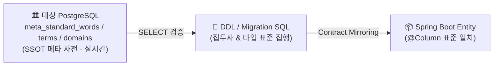

# Database Standardization & Governance Manual

본 매뉴얼은 프로젝트의 물리적 데이터베이스 설계 규칙과 메타 표준을 적용하는 실무 가이드다. 규범 원본은 [DB 표준화 헌법](../../.agent/knowledge/db-standard-constitution/artifacts/constitution.md)이며, 명칭과 타입의 유일한 진실 원천(SSOT)은 현재 대상 DB의 `meta_standard_words`·`meta_standard_terms`·`meta_standard_domains`다. 테이블 수나 마이그레이션 번호처럼 계속 변하는 현황은 이 문서에 고정하지 않고, 마이그레이션과 실제 `information_schema`에서 확인한다.

---

## 1. DB 메타 거버넌스 & 진실의 원천 (SSOT)

모든 데이터베이스 오브젝트(테이블, 컬럼, 뷰, 시퀀스 등)를 신설하거나 수정할 때는 반드시 아래의 거버넌스 단계를 거쳐야 한다.



### 1.1 표준화 워크플로우
1. **단어 사전 조회**: 신규 컬럼이나 테이블이 필요할 때, 먼저 DB 내의 `meta_standard_words` 테이블(DB 헌법 제2조의 유일 SSOT)을 `node .agent/scripts/db-bridge.js`로 실시간 조회하여 공식 한글 단어에 1:1 매핑된 물리 영문 약어를 확인한다.
2. **조합 규칙**: 두 개 이상의 단어가 조합될 때는 언더스코어(`_`)를 구분자로 삼는 스네이크 케이스(Snake Case)를 적용한다 (예: `게시판_마스터_ID` ➔ `BBS_MSTR_ID`).
3. **가드레일**: 메타 사전에서 승인되지 않은 영문 약어나 임의 생략어는 사용하지 않는다. 기존 외부 계약 때문에 예외가 필요한 경우에는 [DB 명명 예외 대장](../02-architecture/db-naming-exceptions.md)에 근거와 종료 조건을 기록한다.

---

## 2. PostgreSQL 물리 타입 결정

프로젝트 전체에 적용되는 고정 타입표를 복사해서 사용하지 않는다. 같은 이름의 ID라도 업무 자연키는 `varchar`, 내부 기술키는 `bigint`·시퀀스·identity가 될 수 있다. 다음 순서로 대상 컬럼의 물리 타입과 길이를 결정한다.

1. `meta_standard_words`에서 단어를 확인한다.
2. `meta_standard_terms`에서 조합 용어와 물리명을 확인한다.
3. 연결된 `meta_standard_domains`의 타입·길이·스케일을 그대로 적용한다.
4. 대상 환경의 `information_schema.columns`와 현재 Flyway 마이그레이션을 대조한다.
5. Entity·DTO·OpenAPI/Zod 상한이 물리 제약을 넘지 않는지 확인한다.

대표 예시는 다음과 같지만, 실제 설계값은 반드시 위 조회 결과가 우선한다.

| 용도 | 흔한 물리 표현 | JPA 후보 |
|:---|:---|:---|
| 여부 | `varchar(1)` + `CHECK (... IN ('Y','N'))` | `String` 또는 명시적 converter |
| 일자 문자열 | `varchar(8)` (`YYYYMMDD`) | `String` |
| 시각 | `timestamp` | `LocalDateTime` |
| 내부 생성키 | `bigint` + sequence/identity 등 | `Long` + `@GeneratedValue` |
| 업무 자연키·코드 | 메타 도메인이 정한 `varchar(n)` | `String` |

> [!IMPORTANT]
> **여부(FLAG) 필드 데이터 무결성 규칙**
> 메타 도메인에서 의미상 boolean 여부로 정의된 `VARCHAR(1)` 필드는 `Y` 또는 `N`만 허용하는 **`CHECK (필드명 IN ('Y', 'N'))`** 제약조건을 둔다. 이름이 `_yn`으로 끝나더라도 레거시 외부 계약상 비-boolean 값인 컬럼은 자동 변환하지 말고 [예외 대장](../02-architecture/db-naming-exceptions.md)과 schema-validation write-smoke에 등록한다. 문자형은 DB 헌법에 따라 `char`가 아니라 메타가 선언한 `varchar`를 사용한다.

### 2.1 삭제 정책 및 논리 삭제(선택) 아키텍처 연계
DB 헌법은 논리 삭제(`del_yn`) 컬럼을 모든 테이블에 의무화하지 않는다. 삭제 방식은 도메인의 보존·복원·법적 파기 요구에 따라 선택하고, 논리 삭제를 채택하면 repository query, 명시적 filter 또는 동등한 접근 정책과 회귀 테스트로 삭제 행의 기본 노출을 차단한다. 특정 Hibernate annotation이 저장소 전체에 적용된다고 가정하지 말고 실제 Entity와 조회 경로를 확인한다.
- **E2E 테스트 상태 격리 (Test Isolation)**: E2E는 운영 DB가 아닌 일회용 테스트 DB를 사용하고, 테스트 접두사로 생성한 데이터만 관리자 API 기반 cleanup으로 정리한다. `TRUNCATE`나 임의 DML을 일반 실행 지침으로 삼지 않는다. 상세는 [E2E 운영 런북](./e2e-test-guide.md)을 따른다.

### 2.2 Audit 컬럼 표준 명칭
DB 헌법 제8조 1항은 Audit 4종 컬럼을 생성자(`frst_rgtr_id`), 생성일시(`crt_dt`), 수정자(`last_mdfr_id`), 수정일시(`mdfcn_dt`)로 직접 선언한다. 대상 PostgreSQL 물리 스키마와 JPA naming strategy를 확인한 뒤, 자바 필드명에서 같은 snake_case가 결정적으로 만들어지는 경우에만 `@Column(name = "...")` 생략을 검토한다. 명명 변경 리스크는 schema validation과 관련 하네스로 확인하고, 불일치하거나 외부 계약인 경우 명시적 매핑을 유지한다.

| 물리 컬럼명 (= 헌법 제8조 1항 선언명) | 대표 타입 | 용도 |
|:---|:---|:---|
| `frst_rgtr_id` | `VARCHAR(20)` | 최초 등록자(생성자) ID |
| `crt_dt` | `TIMESTAMP` | 최초 등록(생성) 일시 |
| `last_mdfr_id` | `VARCHAR(20)` | 최종 수정자 ID |
| `mdfcn_dt` | `TIMESTAMP` | 최종 수정 일시 |

---

## 3. 데이터베이스 물리 제약조건 명명 체계

인프라 튜닝 및 장애 상황 발생 시 정밀한 로그 추적과 유지보수 효율을 높이기 위해, 모든 DB 제약조건과 인덱스는 아래의 고유 접두사를 결합한 표준화된 식별명을 부여해야 한다.

| 제약조건 분류 | 표준 접두사 (Prefix) | 명명 규칙 (Naming Pattern) | 예시 |
|:---|:---|:---|:---|
| **기본키 (PK)** | `pk_` | `pk_[테이블명]` | `pk_tb_bbs_master` |
| **외래키 (FK)** | `fk_` | `fk_[기준테이블]_[참조테이블]` | `fk_tb_bbs_master_optn_tb_bbs_master` |
| **고유 제약조건 (Unique)** | `uk_` | `uk_[테이블명]_[컬럼명]` | `uk_tb_user_esntl_id` |
| **인덱스 (Index)** | `ix_` | `ix_[테이블명]_[컬럼명]` | `ix_tb_bbs_item_crt_dt` |
| **체크 제약조건 (Check)** | `ck_` | `ck_[테이블명]_[컬럼명]` | `ck_tb_bbs_master_use_yn` |

---

## 4. 멱등적 데이터 시딩 (Seed Data) 작성 가이드

Repeatable seed는 재실행해도 같은 결과가 나야 하지만 모든 충돌을 `DO UPDATE`로 덮어쓰지 않는다. 애플리케이션이 계속 소유하는 기준값만 명시적으로 갱신하고, 운영자가 변경할 수 있는 값이나 최초 프로비저닝 값은 `DO NOTHING` 또는 별도 승인 절차로 보존한다. 충돌 키는 실제 PK/UNIQUE 제약을 확인해 선택한다.

### 4.1 멱등성 SQL 모범 예시

```sql
-- 운영 변경을 보존해야 하는 최초 행
INSERT INTO tb_role_info (role_id, role_nm, role_expln, role_crt_ymd)
VALUES ('ROLE_USER', '일반 사용자', '기본 사용자 역할', CURRENT_DATE)
ON CONFLICT (role_id) DO NOTHING;

-- 기준 데이터가 코드 릴리스에 의해 계속 소유되는 경우에만
-- ON CONFLICT (...) DO UPDATE SET <권위 있는 필드만> = EXCLUDED.<필드>;
```

현재 운영 시드의 경계와 관리자 비밀번호 보존 방식은 [`R__seed_framework.sql`](../../api-server/src/main/resources/db/migration/R__seed_framework.sql)을 정본으로 확인한다. seed 변경은 빈 DB 재실행뿐 아니라 기존 행이 있는 DB에서 운영자 값을 덮어쓰지 않는지도 검증한다.

---

## 5. 무중단 스키마 진화 (Expand-and-Contract)

컬럼 타입 변경이나 마이그레이션과 같이 서비스에 영향을 미칠 수 있는 고위험 DDL 작업 시, 시스템 중단을 방지하기 위해 DB 헌법 제7조에 명시된 **"확장 후 축소 (Expand-and-Contract)"** 패턴을 반드시 적용한다.
- 적용 전 현재 스키마·배포 토폴로지·구버전 호환 기간을 확인하고, Contract 단계의 파괴적 DDL은 사용자 승인과 롤백 계획을 갖춘 별도 변경으로 수행한다. 실행 경로와 예외 마커는 DB 헌법 제7조 및 `ZeroDowntimeMigrationLinterTest`를 따른다.

---
*Last reviewed against current sources: 2026-08-19.*
*Governed by: Database Standardization Governance Constitution (10 Articles)*
