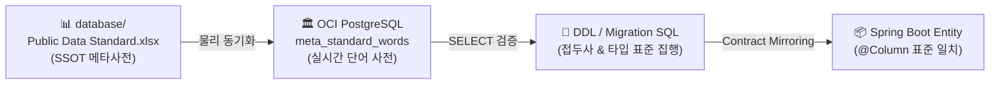

# Database Standardization & Governance Manual

본 매뉴얼은 **eGov Enterprise v5** 프로젝트의 물리적 데이터베이스 설계 규칙과 메타 표준을 이행하기 위한 공식 실무 가이드라인이다. 본 문서는 **DB 표준화 헌법 (10조)**의 기본 정신을 현업 테이블 설계 및 마이그레이션에 투영하여, 91개 모든 OCI PostgreSQL 테이블의 표준 일관성을 영구히 수호하는 단일 참조점(SSOT) 역할을 담당한다.

---

## 1. DB 메타 거버넌스 & 진실의 원천 (SSOT)

모든 데이터베이스 오브젝트(테이블, 컬럼, 뷰, 시퀀스 등)를 신설하거나 수정할 때는 반드시 아래의 거버넌스 단계를 거쳐야 한다.



### 1.1 표준화 워크플로우
1. **단어 사전 조회**: 신규 컬럼이나 테이블이 필요할 때, 먼저 `database/Public Data Standard.xlsx` 또는 DB 내의 `meta_standard_words` 테이블을 조회하여 공식 한글 단어에 1:1 매핑된 물리 영문 약어를 확인한다.
2. **조합 규칙**: 두 개 이상의 단어가 조합될 때는 언더스코어(`_`)를 구분자로 삼는 스네이크 케이스(Snake Case)를 적용한다 (예: `게시판_마스터_ID` ➔ `BBS_MSTR_ID`).
3. **가드레일**: 사전에 정의되지 않은 영문 약어나 임의의 생략어(예: `board_id` 등)는 **DB 헌법 제2조에 의해 영구히 금지**된다.

---

## 2. OCI PostgreSQL 17 표준 데이터 타입 맵

PostgreSQL 17의 고성능 및 저장 효율을 극대화하고 백엔드 JPA의 데이터 가두기 정밀도를 높이기 위해, 아래의 표준 타입 매핑 규칙을 철저히 집행한다.

| 표준 도메인 | PostgreSQL 물리 타입 | 권장 바인딩 용도 | JPA 매핑 자바 타입 |
|:---|:---|:---|:---|
| **고유 식별자 (ID)** | `VARCHAR(20)` | 각 테이블의 기본키(PK) 및 외래키(FK) | `String` |
| **단순 코드 (CODE)** | `VARCHAR(6)` | 공통 코드, 분류 코드 등 고정 범위값 | `String` |
| **한 글자 여부 (FLAG)** | `CHAR(1)` | 사용 여부(`USE_YN`), 삭제 여부(`DEL_YN`) | `String` 또는 `@Convert` 활용 |
| **짧은 텍스트** | `VARCHAR(100)` | 사용자명, 타이틀, 메뉴 이름 등 | `String` |
| **긴 텍스트** | `VARCHAR(4000)` | 게시판 본문, 상세 설명, 에러 로그 등 | `String` (또는 `@Lob` 지양) |
| **날짜 (DATE)** | `CHAR(8)` | 등록일자, 수정일자 (`YYYYMMDD` 형식) | `String` |
| **일시 (DATETIME)** | `TIMESTAMP` | 타임스탬프가 초 단위까지 필요한 추적성 일시 | `LocalDateTime` |
| **수량 / 숫자** | `NUMERIC(10)` | 금액, 누적 조회수, 정렬 순서 등 | `Long` 또는 `BigDecimal` |

> [!IMPORTANT]
> **여부(FLAG) 필드 데이터 무결성 규칙**
> 모든 `CHAR(1)` 여부 필드는 반드시 `Y` 또는 `N`만을 가질 수 있도록 물리 테이블 생성 시 **`CHECK (필드명 IN ('Y', 'N'))`** 제약조건을 의무적으로 추가해야 한다.

### 2.1 논리 삭제(Soft Delete) 아키텍처 연계
DB 헌법 제8조에 의거, 물리적인 `DELETE`는 절대 금지된다. 삭제 시 `use_yn = 'N'` 으로 상태를 업데이트해야 하며, 이를 백엔드 레이어에서 완벽히 은닉하기 위해 모든 JPA Entity 상단에 **`@SQLRestriction("use_yn = 'Y'")`**를 부착하여 전역(Global) 필터링을 집행한다.
- **E2E 테스트 상태 격리 (Test Isolation)**: Playwright E2E 테스트 수행 시 테스트 간 데이터 간섭을 방지하기 위해, 각 테스트 시나리오 실행 전에 테스트 프로파일(`test`) 하에서만 예외적으로 물리 `TRUNCATE` 또는 테스트 데이터 삭제(Cleanup) 스크립트를 동작시켜 DB 상태 멱등성을 보장해야 한다. (상세는 `docs/03-guides/e2e-test-guide.md` 참조)

### 2.2 Audit 컬럼 명칭 매핑 (헌법 선언 vs 물리 현실)
DB 헌법 제8조는 Audit 4종 컬럼을 `reg_id`, `reg_dt`, `updt_id`, `updt_dt`로 선언하나, 실제 OCI 물리 테이블에서는 표준 용어 사전 기반의 약어가 적용되어 아래와 같이 매핑된다. 신규 Entity 작성 시 반드시 **물리 컬럼명(우측)**을 `@Column(name = "...")`에 사용한다.

| 헌법 선언명 | OCI 물리 컬럼명 | 데이터 타입 | 용도 |
|:---|:---|:---|:---|
| `reg_id` | `frst_rgtr_id` | `VARCHAR(20)` | 최초 등록자 ID |
| `reg_dt` | `crt_dt` | `TIMESTAMP` | 최초 등록 일시 |
| `updt_id` | `last_mdfr_id` | `VARCHAR(20)` | 최종 수정자 ID |
| `updt_dt` | `mdfcn_dt` | `TIMESTAMP` | 최종 수정 일시 |

---

## 3. 데이터베이스 물리 제약조건 명명 체계

인프라 튜닝 및 장애 상황 발생 시 정밀한 로그 추적과 유지보수 효율을 높이기 위해, 모든 DB 제약조건과 인덱스는 아래의 고유 접두사를 결합한 표준화된 식별명을 부여해야 한다.

| 제약조건 분류 | 표준 접두사 (Prefix) | 명명 규칙 (Naming Pattern) | 실제 OCI DB 예시 |
|:---|:---|:---|:---|
| **기본키 (PK)** | `pk_` | `pk_[테이블명]` | `pk_tb_bbs_master` |
| **외래키 (FK)** | `fk_` | `fk_[기준테이블]_[참조테이블]` | `fk_tb_bbs_master_optn_tb_bbs_master` |
| **고유 제약조건 (Unique)** | `uk_` | `uk_[테이블명]_[컬럼명]` | `uk_tb_user_esntl_id` |
| **인덱스 (Index)** | `ix_` | `ix_[테이블명]_[컬럼명]` | `ix_tb_bbs_item_crt_dt` |
| **체크 제약조건 (Check)** | `ck_` | `ck_[테이블명]_[컬럼명]` | `ck_tb_bbs_master_use_yn` |

---

## 4. 멱등적 데이터 시딩 (Seed Data) 작성 가이드

개발 환경 및 운영 환경에 초기 셋팅 데이터(seed 데이터)를 입력할 때에는, 시스템의 중복 에러를 방지하고 배포를 무중단화하기 위해 반드시 `ON CONFLICT DO UPDATE` 구문을 사용하는 **멱등성(Idempotency) SQL 쿼리**로 작성해야 한다.

### 4.1 멱등성 SQL 모범 예시

```sql
-- 테이블: TB_BBS_MASTER (게시판 마스터 - OCI DB 실재 표준화 테이블)
-- 목적: 중복 삽입 시 기본키(BBS_ID) 충돌을 방지하고 필드 값을 안전하게 최신화(Sync)합니다.

INSERT INTO public.tb_bbs_master (
    bbs_id, 
    bbs_ttl, 
    bbs_expln,
    bbs_type_cd, 
    bbs_atrb_cd,
    use_yn, 
    file_atch_psblty_yn,
    atch_psblty_file_qty,
    atch_psblty_file_sz,
    frst_rgtr_id, 
    crt_dt
) VALUES (
    'BBS_MSTR_WIKI_FREE', 
    '엔터프라이즈 위키', 
    '지식 허브 위키 게시판',
    'BBST07', 
    'BBSA01',
    'Y', 
    'Y',
    5,
    10485760,
    'SYSTEM', 
    CURRENT_TIMESTAMP
) 
-- 1. 기본키(bbs_id) 충돌 발생 시 예외를 터뜨리지 않고 업데이트 모드로 전환
ON CONFLICT (bbs_id) 
DO UPDATE SET
    bbs_ttl = EXCLUDED.bbs_ttl,
    bbs_expln = EXCLUDED.bbs_expln,
    bbs_type_cd = EXCLUDED.bbs_type_cd,
    use_yn = EXCLUDED.use_yn,
    last_mdfr_id = 'SYSTEM',
    mdfcn_dt = CURRENT_TIMESTAMP;
```

---

## 5. 무중단 스키마 진화 (Expand-and-Contract)

컬럼 타입 변경이나 마이그레이션과 같이 서비스에 영향을 미칠 수 있는 고위험 DDL 작업 시, 시스템 중단을 방지하기 위해 DB 헌법 제7조에 명시된 **"확장 후 축소 (Expand-and-Contract)"** 패턴을 반드시 적용한다.
- 이 복잡한 4단계(Expand → Sync → Redirect → Contract) 트랜지션은 에이전트 전용 무중단 설계 스킬인 **`zero-downtime-migration-planner`**를 기동하여 안전하게 위임받아 수행할 수 있다.

---
*Last Updated: 2026-05-19 (PostgreSQL 17 Constraint Prefix & Idempotency Seeding Standardized)*
*Governed by: Database Standardization Governance Constitution (10 Articles)*
