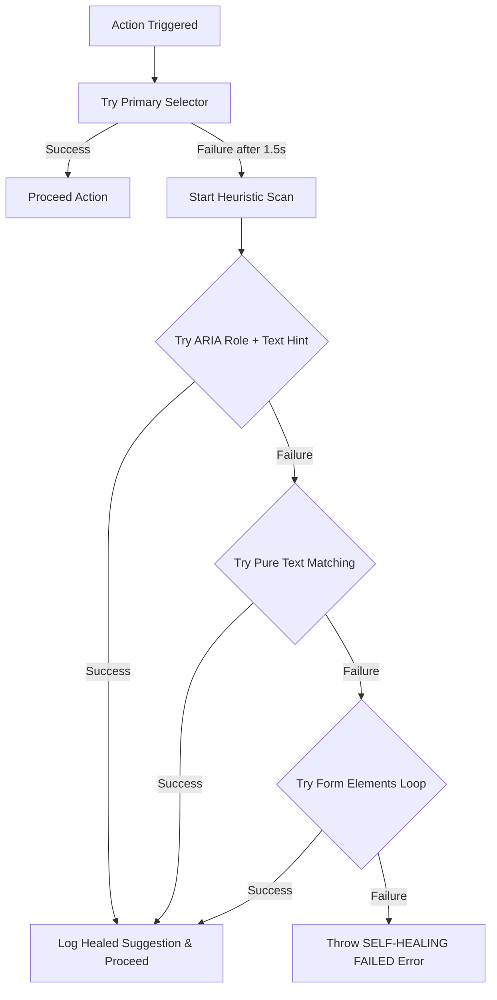

# 🤖 자가 치유형 E2E 테스트 하네스 (Self-Healing E2E Agent) 가이드

본 문서는 프론트엔드 UI/UX 변경에 매우 민감한 E2E 테스트의 취약성(Flakiness)을 극복하고, 동적으로 셀렉터 일탈을 복구하는 **자가 치유형 Playwright E2E 테스트 하네스**의 구조 및 연동법에 대해 설명합니다.

> **관련 문서 (See also)**: 본 하네스는 [테스트 종합 가이드 (testing-guide.md)](./testing-guide.md)를 상위 SSOT로 따르며, E2E 실행 명령·Tier 구조·워커 수는 [E2E 운영 런북 (e2e-test-guide.md)](./e2e-test-guide.md)을 참조하십시오.

---

## 1. 개요 및 설계 동기 (Self-Healing Motivation)

* **E2E의 취약점**: 마이너한 UI 디자인 수정(예: 버튼 Tailwind 클래스 변경, 마크업 구조 고도화)이 발생할 때, 기존의 CSS/XPath 셀렉터가 깨져 테스트 빌드가 실패하는 고질적 문제가 존재합니다.
* **해결책**: 주 셀렉터(Primary Selector) 감지에 실패하더라도 즉각 예외를 던지지 않고, 사전 정의된 **텍스트 힌트** 및 **시맨틱 ARIA 역할(Role)**을 결합한 휴리스틱 다각도 스캔을 가동해 요소를 복구(Heal)합니다.
* **효과**: 빌드 실패율을 낮추고, 치유된 내역을 콘솔에 기록하여 개발자에게 셀렉터 수정 힌트를 실시간으로 피드백합니다.

---

## 2. 자가 치유 에이전트 아키텍처

자가 치유 엔진은 [`self-healing-agent.ts`](../../frontend/e2e/fixtures/self-healing-agent.ts)에 구현되어 있으며, Playwright의 전역 확장 피스처([`base-test.ts`](../../frontend/e2e/fixtures/base-test.ts))에 `healingAgent`로 이식되어 모든 E2E 테스트에서 즉시 사용할 수 있습니다.

### 2.1 적용된 치유 매커니즘 흐름도


---

## 3. 실전 사용 가이드 (CLI & API Usage)

E2E 테스트 시 주 셀렉터가 깨질 수 있는 위험 요소가 있는 입력란이나 클릭 영역에 `healingAgent`를 사용합니다.

### 3.1 클릭 동작 자가 치유 예시
* **기존 방식 (셀렉터 변경 시 즉시 깨짐)**:
  ```typescript
  await page.click('button.bg-blue-600.text-white');
  ```
* **자가 치유 도입 방식 (클래스가 변경되어도 텍스트 힌트로 자가 치유)**:
  ```typescript
  import { test } from '../fixtures/base-test';

  test('게시글 등록 테스트', async ({ healingAgent }) => {
    // bg-blue-600 클래스가 bg-primary로 변경되어도 '등록' 텍스트 힌트로 자동 복구
    await healingAgent.safeClick('button.bg-blue-600.text-white', {
      textHint: '등록',
      role: 'button'
    });
  });
  ```

### 3.2 텍스트 입력 동작 자가 치유 예시
* **자가 치유 도입 방식**:
  ```typescript
  import { test } from '../fixtures/base-test';

  test('로그인 테스트', async ({ healingAgent }) => {
    // ID 입력란의 placeholder나 name 속성을 Heuristic으로 스캔하여 입력
    await healingAgent.safeFill('input#userId', 'admin', {
      textHint: '아이디',
      role: 'textbox'
    });
  });
  ```

---

## 4. 모니터링 및 로깅 피드백

자가 치유 에이전트가 성공적으로 요소를 복구하면, Playwright 테스트 콘솔에 다음과 같은 시각적 알림이 생성되어 개발자가 지속적으로 셀렉터를 개선할 수 있도록 돕습니다:

```bash
⚠️ [E2E FRAGILITY DETECTED]: 주 셀렉터 'button.bg-blue-600.text-white'를 찾을 수 없습니다. 자가 치유(Self-Healing) 매커니즘을 시작합니다...
❇️ [SELF-HEALED SUCCESS]: ARIA 역할 'button' 및 텍스트 힌트 '등록'를 통해 엘리먼트를 치유 완료했습니다. (실제 텍스트: '등록')
```

---
*Governed by: Enterprise Technology Constitution (Test & Automation Annex)*
