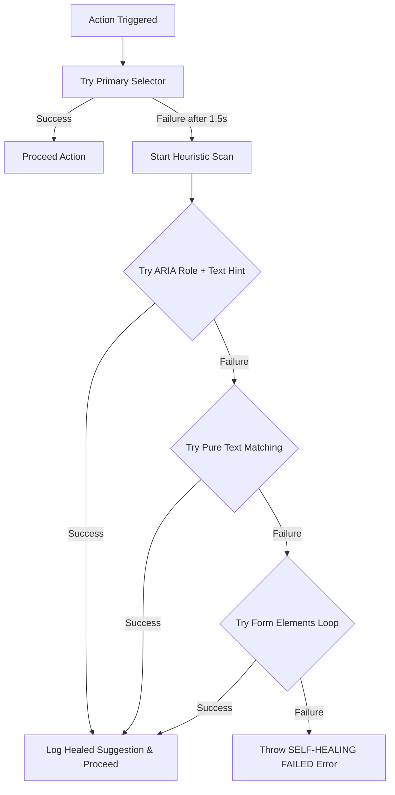

# 자가 치유형 E2E 보조 fixture 평가

`SelfHealingAgent`는 주 selector가 실패하면 role·text 기반 후보를 찾아 동작을 계속하는 선택형 Playwright fixture다. `base-test.ts`에 노출되어 있지만 현재 스펙에는 `healingAgent`·`safeClick`·`safeFill` 호출부가 없다. 따라서 필수 하네스나 CI 품질 게이트로 간주하지 않는다.

> **관련 문서 (See also)**: 본 하네스는 [테스트 종합 가이드 (testing-guide.md)](./testing-guide.md)를 상위 SSOT로 따르며, E2E 실행 명령·Tier 구조·워커 수는 [E2E 운영 런북 (e2e-test-guide.md)](./e2e-test-guide.md)을 참조하십시오.

> **사용 경계**: 기본 테스트는 `getByRole`, `getByLabel`, stable test id 같은 의미 기반 locator로 명확하게 실패해야 한다. fuzzy fallback이 다른 버튼을 선택하면 실제 접근성 이름·화면 계약 파손을 통과시킬 수 있다. 이 fixture는 로컬 진단 실험에만 사용하고, CI에 커밋하는 테스트의 성공 조건으로 사용하지 않는다.

---

## 1. 개요 및 설계 동기 (Self-Healing Motivation)

* **E2E의 취약점**: 마이너한 UI 디자인 수정(예: 버튼 Tailwind 클래스 변경, 마크업 구조 고도화)이 발생할 때, 기존의 CSS/XPath 셀렉터가 깨져 테스트 빌드가 실패하는 고질적 문제가 존재합니다.
* **보조 방식**: 주 selector가 실패하면 사전 정의된 텍스트 힌트와 ARIA 역할을 결합해 후보를 찾는다.
* **한계**: 치유 성공은 원래 selector 계약의 성공이 아니다. 로그를 근거로 원 locator를 수정한 뒤 일반 Playwright 실행으로 다시 검증해야 한다.

---

## 2. 자가 치유 에이전트 아키텍처

자가 치유 엔진은 [`self-healing-agent.ts`](../../frontend/e2e/fixtures/self-healing-agent.ts)에 구현되어 있으며, Playwright의 전역 확장 피스처([`base-test.ts`](../../frontend/e2e/fixtures/base-test.ts))에 `healingAgent`로 이식되어 모든 E2E 테스트에서 즉시 사용할 수 있습니다.

### 2.1 적용된 치유 매커니즘 흐름도


---

## 3. 로컬 진단 예시

아래 예시는 fixture 동작을 조사할 때만 사용한다. 제품 E2E에는 우선 의미 기반 locator를 직접 작성한다.

### 3.1 클릭 동작 자가 치유 예시
* **기존 방식 (셀렉터 변경 시 즉시 깨짐)**:
  ```typescript
  await page.click('button.bg-blue-600.text-white');
  ```
* **자가 치유 도입 방식 (클래스가 변경되어도 텍스트 힌트로 자가 치유)**:
  ```typescript
  import { test } from '../fixtures/base-test';

  test('게시글 등록 테스트', async ({ healingAgent }) => {
    // bg-blue-600 클래스가 bg-primary로 변경되어도 '등록' 텍스트 힌트로 자동 복구
    await healingAgent.safeClick('button.bg-blue-600.text-white', {
      textHint: '등록',
      role: 'button'
    });
  });
  ```

### 3.2 텍스트 입력 동작 자가 치유 예시
* **자가 치유 도입 방식**:
  ```typescript
  import { test } from '../fixtures/base-test';

  test('로그인 테스트', async ({ healingAgent }) => {
    // ID 입력란의 placeholder나 name 속성을 Heuristic으로 스캔하여 입력
    await healingAgent.safeFill('input#userId', 'admin', {
      textHint: '아이디',
      role: 'textbox'
    });
  });
  ```

---

## 4. 모니터링 및 로깅 피드백

자가 치유 에이전트가 요소를 복구하면 Playwright 테스트 콘솔에 다음 알림을 남긴다. 이 알림이 발생한 실행은 원 selector가 실패했다는 뜻이므로 완료 증거로 사용하지 않는다.

```bash
⚠️ [E2E FRAGILITY DETECTED]: 주 셀렉터 'button.bg-blue-600.text-white'를 찾을 수 없습니다. 자가 치유(Self-Healing) 매커니즘을 시작합니다...
❇️ [SELF-HEALED SUCCESS]: ARIA 역할 'button' 및 텍스트 힌트 '등록'를 통해 엘리먼트를 치유 완료했습니다. (실제 텍스트: '등록')
```

---
*Governed by: Enterprise Technology Constitution (Test & Automation Annex)*

*Last reviewed against current sources: 2026-08-19.*
