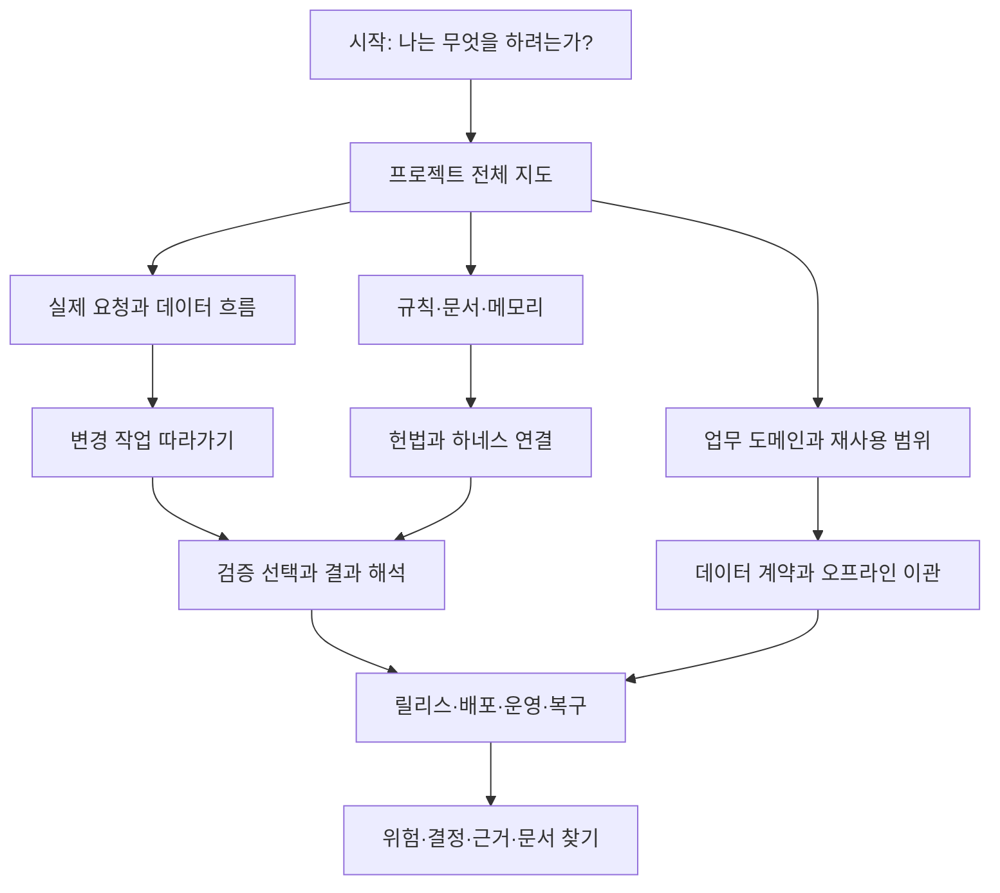
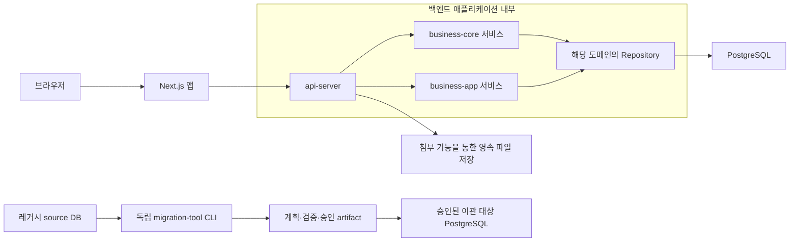
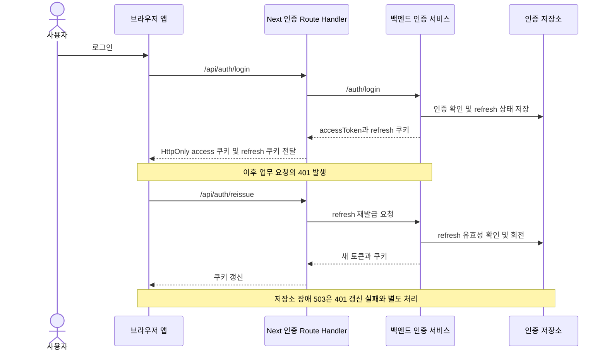
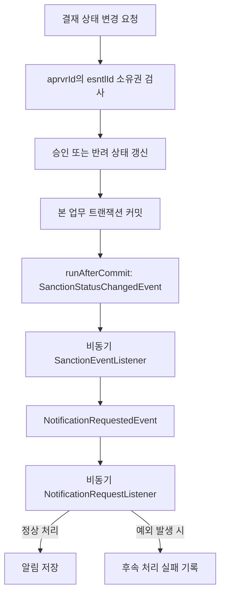
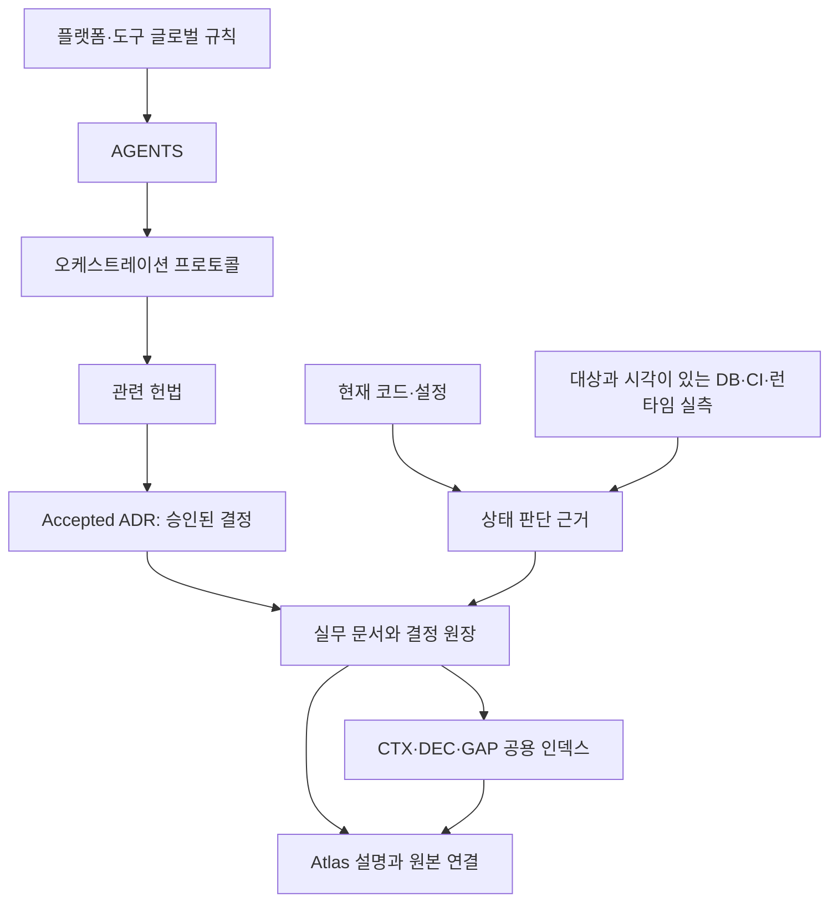
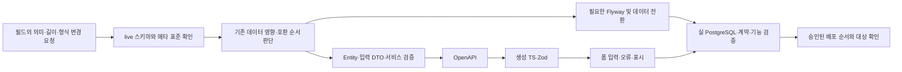
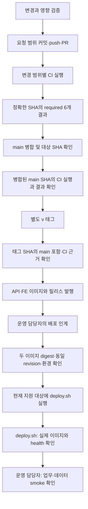
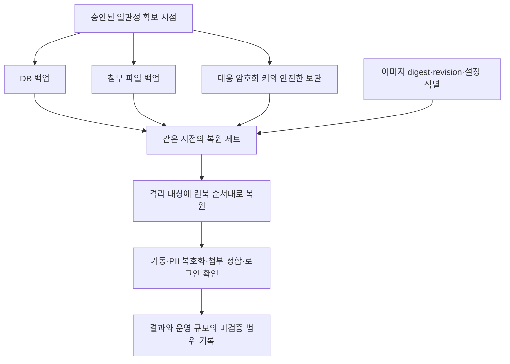

# Governance & Harness Atlas 보강 검토 및 개선안

> 상태: **Atlas 보강 적용 — 외부 운영 실측·실제 독자 평가는 별도**
>
> 검토일: 2026-09-10
>
> 검토 기준: `fcdf13c2c`의 코드·설정·문서와 현재 Atlas
>
> 범위: 콘텐츠 완결성, 설명의 정확성, 정보 구조, 도식, 탐색, 유지보수·검증 방식
>
> 권위: 비규범 검토·적용 기록. 정책·제품 결정·운영 적용을 승인하거나 변경하지 않는다.

1–11절은 보강 전 `fcdf13c2c`를 조사한 근거와 설계다. 당시 누락·수치·실험 결과를 현재 생성물의 결함이나 상태로 읽지 않는다. 적용 범위는 [12절](#12-적용-결과와-검증-경계), 현재 사용법·생성 절차는 [Atlas 가이드](governance-atlas-guide.md), 현재 목록은 [Atlas](../../frontend/public/governance_harness_atlas.html)를 따른다.

## 1. 검토 결론과 목표

[현재 Atlas](../../frontend/public/governance_harness_atlas.html)는 **규칙을 지키며 개발하고, 어떤 검증 근거로 결과를 판단하는지** 설명하는 데 강점이 있다. 공통 규칙, 3대 헌법, 게이트의 강제력, 읽기 전용 DB bridge, 오프라인 이관의 안전 경계를 이미 포함한다. 대시보드의 대표 요청 경로, 온보딩, 교육용 시뮬레이터도 있다.

사용자가 원하는 **프로젝트 전반을 직관적으로 이해하는 상세 지도**가 되려면 업무 도메인·모듈·실제 사용 흐름·운영 책임을 연결해야 한다. 현재는 개별 설명 사이를 독자가 원본을 찾아가며 조합해야 한다. 설명 내부의 모순도 먼저 교정해야 한다.

권장 목표는 다음 질문에 차례로 답하는 것이다.

1. 이 프로젝트는 무엇을 제공하며, 재사용 코어와 선택 기능은 어디서 나뉘는가?
2. 사용자의 요청과 데이터는 어떤 구성요소를 거치며, 실패하면 어디서 처리되는가?
3. 내가 바꾸려는 기능에는 어떤 헌법·결정·데이터 계약이 적용되는가?
4. 어떤 검사가 무엇을 막고, 어느 명령과 CI 경로에서 실행되는가?
5. 코드 변경이 릴리스·배포·운영·복구로 이어질 때 무엇을 확인해야 하는가?
6. 각 설명의 원본과 확인 근거는 무엇이며, 아직 모르는 것은 무엇인가?

**완결성의 기준은 범위가 정의된 항목을 빠짐없이 분류하고 상세 근거까지 도달하게 하는 것이다.** 모든 클래스·테이블·문서 본문을 한 페이지에 복제하는 방식은 현행화 비용을 키운다. Atlas는 개요와 연결을 소유하고, 상세 규범·운영 절차는 기존 원본이 소유하도록 한다.

## 2. 조사 범위와 확인한 사실

### 2.1 확인 범위

- [프로젝트 개요](../../README.md), [모듈 선언](../../settings.gradle), core/app의 실제 domain 디렉터리.
- [AGENTS](../../AGENTS.md), [SOP](orchestration-protocol.md), 3대 헌법과 공용 메모리.
- [문서 인덱스](../README.md), 아키텍처·제품·개발·운영 문서 및 Accepted ADR.
- [재사용 프로필](../../config/reusable-base-profiles.json), [라우트 역량 목록](../../config/ui-route-capabilities.json), [API 소비자 목록](../../config/governance/operation-consumer-census.json), [인가 정책](../../config/governance/authorization-policies.json).
- [게이트 registry](../../config/governance/gates.json), [검증 진입점](../../scripts/verify.mjs), [CI](../../.github/workflows/ci.yml), [릴리스](../../.github/workflows/release.yml), [배포 스크립트](../../scripts/deploy.sh).
- Atlas HTML·JavaScript 및 [Atlas 계약 테스트](../../frontend/src/__tests__/cross-stack/governance-atlas-contract.test.ts).

이번 검토에서는 OCI·원격 ruleset·운영 배포를 재실측하지 않았다. 저장소 설정과 과거 운영 확인 기록을 현재 운영 성공의 증거로 사용하지 않는다. 아래 내용은 프로젝트 전체 기능의 런타임 재검증 결과가 아니다.

### 2.2 실측으로 드러난 설명 공백

| 항목 | 기준 커밋에서의 관찰 | 의미 |
|---|---|---|
| 정보 구조 | 13개 패널. 규칙·SOP·워크플로·시뮬레이터·스킬·실패 분석이 6개 | 개발 절차는 상세하지만 제품·업무·운영을 한 번에 보는 진입점은 약함 |
| 문서 연결 | 추적 중인 docs Markdown/HTML 78개 중 Atlas의 `href`·`docLink`에 개별 파일 URL이 있는 문서는 11개 | 직접 링크 조사이며 완성도 비율은 아님. 역사 문서·디렉터리 경유도 구분해야 함 |
| 발견 가능성 | 루트 README와 docs 인덱스에 Atlas 직접 링크가 없었음 | 신규 독자가 설명 지도에 도달하기 어려움 |
| 도메인 분류 | core 최상위 domain 폴더 15개, app 19개. 재사용 profile 3개와 pack 4개 | 폴더 수는 업무 도메인 수와 다름. 서로 다른 분류 축을 설명할 카탈로그 필요 |
| 화면 역량 | 라우트 역량 목록은 119개 항목이며 `UNVERIFIED`·`unverified` 필드가 존재 | 화면·파일 존재를 구현 완료나 실제 권한 증거로 자동 승격할 수 없음 |
| 수치 관리 | Atlas의 schema-validation 수치 49가 최소 5곳에 반복 | 하나의 원본 변경이 여러 설명의 불일치로 이어질 수 있음 |
| 렌더링 검사 | 계약은 DOMParser로 읽으며 카드 생성 JavaScript를 실행하지 않음 | 스크립트 문자열과 실제 표시 결과를 함께 확인할 필요 |

78개·119개 등의 수치는 **개선안 추가 전 기준 커밋의 조사값**이다. 최신 값을 유지할 현황판으로 사용하지 않는다. 직접 링크가 없는 문서가 모두 누락이라는 뜻도 아니다. 역사 자료·제안·대체된 결정은 역할을 구분해 연결해야 한다.

### 2.3 가장 먼저 교정할 현재 설명

| 현재 Atlas 위치 | 확인한 문제 | 교정 방향 |
|---|---|---|
| 1492행 / 1629행 | 앞에서는 server-only 조회를 허용한다고 설명하고 뒤에서는 TanStack hydration 통일 또는 헌법 예외 승인이 필요하다고 함 | [프론트 헌법 제4조](../../.agent/knowledge/frontend-ux-constitution/artifacts/constitution.md)의 현재 상태 소유권 원칙에 맞춰 모순 제거 |
| 1703행 | `5 STABLE`·5개 context·네 aggregate로 설명해 `secure-coding` 누락 | [required-checks](../../.github/required-checks.json)에서 개수·목록·source job 관계를 함께 파생 |
| 1701행 | docs-only가 두 경량 계약 뒤 종료한다고 설명 | [.githooks/pre-push](../../.githooks/pre-push)의 운영 계약 카탈로그와 Atlas 조건 실행 범위에 맞춤 |
| 1752행 | 현행 이관 설계보다 Atlas를 우선하도록 읽힘 | [이관 설계](../02-architecture/legacy-migration-tool-design.md)와 현재 구현을 안내하는 설명으로 수정 |

금지 문구를 추가하는 것만으로 같은 의미의 다른 표현까지 검증할 수는 없다. 반복 수치·명령·상태를 공통 데이터로 표현하고, 정책 설명은 해당 조항과 대조해야 한다.

## 3. 현재 13개 패널의 보강 판단

| 현재 패널 | 현재 설명의 강점 | 보강할 내용 | 권장 배치 |
|---|---|---|---|
| 현행 대시보드 | 통제 상태·버전·대표 조회 경로 | 제품 목적, 전체 구성, 실행 환경 구분 | 시작 / 프로젝트 지도 |
| 온보딩 | 기동 명령·브랜치·흔한 오류 | 신규 개발자와 재사용 도입자 경로, 검증 선택 | 시작 / 변경 여정 |
| 3대 헌법 | 규범 목표와 집행 차이 | 조항→구현→검사→실패 사례→잔여 사각 | 규칙과 증거 |
| 공통 에이전트 규칙 | 권위 계층·진입점·H1~H5 | 메모리 갱신·결정 대체·gap 종료 과정 | 규칙과 메모리 |
| 게이트웨이 SOP | 로컬·CI 강도와 한계 | 변경 종류→명령→실행 전제→증거 선택 | 검증 지도 |
| 개발 워크플로 | 분류부터 근거 보고까지의 5단계 | PR·main·릴리스·운영 인계까지 연결 | 변경·배포 여정 |
| 시뮬레이터 | 교육용 경계·대표 작업 예시 | 실패·미확인·승인 필요 분기와 회복 | 변경 여정의 사례 |
| 에이전트 실행 자산 | 지침과 실제 강제력 구분 | 선택 조건·입력·출력·관련 원본 | 규칙과 메모리 |
| DB bridge·매핑 | 읽기 전용 경계·컬럼 계약 | 필드 변경이 전체 계층에 미치는 영향 | 데이터 계약 |
| Legacy Migration | 독립 CLI·승인·검증·운영 한계 | 전체 지도 내 위치, 재개와 전체 복원 차이 | 데이터 이관 |
| 실패 분석 | 가설·증거·수정·재검증 | 3회 실패 종료 분기, 운영 증상별 근거 | 변경 여정 / 운영 |
| 하네스 지도 | 9개 범주·구현·사각 | 개별 rule/gate→runner→CI→해당 SHA의 결과 | 검증 지도 |
| 공백·로드맵 | 우선순위·운영 실증·결정 필요 구분 | 안정 ID·현재 효력·해결 조건·근거 | 위험·결정·문서 |

기존 hash URL은 재구성 후에도 대응하는 패널 또는 하위 절로 연결한다. 이미 구현된 키보드 탐색·인쇄·reduced-motion·테마 처리는 유지한다.

## 4. 권장 정보 구조: 10개 주제와 3단계 깊이

각 주제는 **한눈에 보는 요약 → 관계와 흐름 도식 → 상세 설명·원본·검증 근거** 순서로 구성한다. 첫 화면에 모든 표를 펼치지 않고, 관심 항목에서 깊이 들어가게 한다.

위 그림은 **제안하는 탐색 구조**다. 소프트웨어 실행 순서나 승인 자동화를 뜻하지 않는다.

| 주제 | 반드시 답할 질문 | 상세 콘텐츠 |
|---|---|---|
| 1. 시작과 읽는 법 | 이 문서는 누구를 위한 것이며 무엇을 증명하는가? | 독자별 경로, 범례, 규범/현재 소스/외부 실측/제안 구분 |
| 2. 프로젝트 전체 지도 | 구성요소와 배포 단위는 무엇인가? | 5개 Gradle 모듈+Next.js, 코드 의존과 런타임 구분, 온라인 앱/CLI |
| 3. 업무 도메인과 재사용 범위 | 어떤 기능을 제공하고 무엇을 제거·교체할 수 있는가? | profile/pack/기능군/route/API 연결, 기존 결합과 미확인 역량 |
| 4. 실제 요청과 데이터 흐름 | 인증·조회·쓰기·이벤트·오류는 어떻게 움직이는가? | 대표 사례별 시퀀스와 실패 분기, 상태·트랜잭션 소유권 |
| 5. 규칙·문서·메모리 | 무엇을 따르고 어디서 사실을 재확인하는가? | 규칙 계층, 헌법별 조항 지도, ADR/DEC/GAP 생명주기, 실행 자산 |
| 6. 데이터 계약과 이관 | 필드를 바꾸거나 레거시 데이터를 옮길 때 어디에 영향이 있는가? | 표준 메타·Flyway·DTO·OpenAPI·Zod·폼, 독립 ETL 및 복원 |
| 7. 변경 작업 따라가기 | 문서/API/UI/DB/게이트 변경을 어떻게 마무리하는가? | 입력·수정 경로·출력·승인 경계·green/red·실패 재개 사례 |
| 8. 검증 지도 | 어떤 검사가 어디서 무엇을 막는가? | gate/runner/profile/CI, 실행 전제, 결과 해석, 선택 검사와 운영 실증 |
| 9. 릴리스·운영·복구 | 코드가 어떻게 배포되고 장애 시 무엇을 복원하는가? | 태그·이미지·환경·영속 상태, 진단, 백업·키·첨부·로그 파기 |
| 10. 위험·결정·문서 찾기 | 미확인 내용과 정본을 어떻게 찾는가? | Gap/Decision ID, 해결 조건, 문서 상태, 용어 검색, 원본·증거 검색 |

읽기 경로는 실제 사용자 평가로 확인한다. 아래 순서는 제안이며 소요 시간이 검증된 것은 아니다.

- **새 개발자:** 1→2→3→4→7→8.
- **에이전트 운영자:** 1→5→7→8→10.
- **QA·리뷰어:** 2→4→5의 조항 지도→8→10.
- **운영자:** 2의 실행 환경→9→6의 복원 경계→10.
- **재사용 도입자:** 2→3→7의 신규 기능 사례→9의 인계→10.

## 5. 프로젝트·업무 설명의 구체적인 보강

### 5.1 전체 구성도

코드 의존도, 요청 흐름, 배포 토폴로지는 서로 다른 그림으로 둔다. 특히 `foundation`을 모든 HTTP 요청이 반드시 통과하는 별도 서버처럼 그리지 않는다.

다음은 저장소 구성에서 확인한 온라인 앱과 선택형 이관의 **개념 경계도**다. 현재 OCI 운영 배치도를 의미하지 않는다.

설명에는 다음을 함께 둔다.

- `foundation`은 공통 응답·오류·보안·이벤트·포트 등의 라이브러리 모듈이다.
- 재사용 코어와 app의 단방향 의존 규칙, 실제 잔여 app 간 결합을 구분한다.
- `migration-tool`은 온라인 API와 독립된 선택형 CLI이며 `foundation`에 의존하지 않는다.
- 공식 `deploy.sh` 경로는 현재 Compose 번들 DB 전용이다. OCI 진단 연결과 OCI 배포 지원은 별도로 판단한다.
- 계층도에서는 화살표에 “컴파일 의존”, 실행도에서는 “호출/응답”, 운영도에서는 “네트워크/저장” 의미를 명시한다.

원본: [모듈 선언](../../settings.gradle), [백엔드 구조](../02-architecture/backend-architecture.md), [ADR-0001](../02-architecture/decisions/ADR-0001-core-app-product-boundary.md), [배포 경계](../../scripts/deploy.sh).

### 5.2 업무 도메인 카탈로그

출발 인벤토리는 다음과 같다. `system` 등 같은 이름의 폴더를 하나로 합치거나 기술 지원 폴더를 독립 업무로 자동 분류하지 않는다.

| 소스 축 | 검토 기준 커밋의 최상위 domain 폴더 |
|---|---|
| business-core | auth, code, common, config, deptjob, file, group, log, login, menu, organization, program, stamp, system, user |
| business-app | addressbook, board, comment, help, informalsanction, isg, mail, memoreport, note, notification, operation, report, schedule, scrap, sms, stats, survey, system, template |
| 재사용 profile | core, collaboration, demo |
| 재사용 pack | core, collaboration, survey, demo |

화면 카탈로그는 “기능군→도메인→대표 작업”으로 읽게 하고, 기술 폴더·재사용 pack과의 매핑을 별도 필드로 둔다. 한 도메인의 상세 카드에는 다음 정보를 포함한다.

| 카드 필드 | 작성·검증 기준 |
|---|---|
| 목적·대상 사용자·대표 작업 | README/제품 문서/실제 화면에서 확인. 미승인 제품 의미는 미확인 표시 |
| 모듈·profile·pack | 재사용 manifest와 실제 소스 대조 |
| 화면·API·서비스 | route 역량 목록과 operation 소비자 목록을 초기값으로 삼고 실제 연결 확인 |
| 데이터 | Entity·Flyway 위치와 표준 계약. live DB 확인일은 별도 필드 |
| 인증·인가·정체성 축 | 실제 정책·guard·소유자 필드 근거. owner-only/owner-or-admin/admin-only 구별 |
| 읽기·쓰기·부수효과 | 저장/캐시 무효화/파일/이벤트 등 경계와 실패 영향 |
| 검증·잔여 위험 | gate·기능 테스트·E2E·관련 GAP/ADR 링크 |
| 증거 상태 | 소스 확인/격리 실행/운영 실측/미확인 범위를 각각 표시 |

`UNVERIFIED` 항목은 숨기지 않는다. 예를 들어 페이지 존재만으로 역할·메뉴 노출·업무 완료·운영 지원을 확정할 수 없다. 신규 도메인이나 route가 발견되면 카탈로그에 분류되거나 명시적인 미확인 항목으로 남아야 한다.

### 5.3 대표 흐름은 최소 여섯 가지

| 흐름 | 기존 설명과 보강점 | 우선 원본 |
|---|---|---|
| 대시보드 조회 | 기존 9단계 유지. RSC cache/Suspense 소유권과 오류 전파 설명 정합화 | [dashboard-data](../../frontend/src/app/dashboard-data.ts) |
| 로그인·갱신·로그아웃 | 쿠키·JWT·refresh 저장/회전·실패 처리의 연결 추가 | [AuthServiceImpl](../../business-core/src/main/java/nuri/business/service/auth/impl/AuthServiceImpl.java), [로그인 BFF](../../frontend/src/app/api/auth/login/route.ts) |
| 일정 또는 게시글 쓰기 | 화면 검증→API 입력→서비스 인가→트랜잭션→DB 제약→응답→화면 오류의 실제 사례 | [입력 검증 가이드](frontend-form-validation-loop.md), [횡단관심사](cross-cutting-conventions.md) |
| 결재 상태 변경·알림 | 승인 권한과 본 업무 커밋 이후 비동기 알림의 경계를 분리 | [InformalSanctionService](../../business-app/src/main/java/nuri/business/service/informalsanction/InformalSanctionService.java) |
| 첨부 업로드·다운로드·점검 | DB 메타데이터와 파일 실물, 권한, 정합성 보고의 관계 | [운영 후속 계약](../04-operations/readiness-followups.md), [백업 런북](../04-operations/backup-and-restore-runbook.md) |
| 레거시 이관 | 기존 설명 유지. dry-run/PASS/STARTED/FAILED와 부분 커밋·재개·전체 복원 구별 | [이관 복구 런북](../04-operations/migration-recovery-runbook.md) |

아래는 **로그인과 만료 후 재발급의 대표 경로**다. 브라우저의 모든 업무 API가 로그인 BFF를 통과한다는 뜻은 아니다.

상세 설명에는 `esntlId`와 `loginId`, HttpOnly 쿠키와 접근 가능한 세션 표시값의 차이, 동시 401의 갱신 조정, 만료·인가 거부·저장소 장애의 차이를 포함한다. 토큰이나 쿠키의 실제 값은 예시에도 싣지 않는다.

결재 후 알림은 다음처럼 커밋 전후를 표시한다.

이 사례의 승인자 가드는 관리자라는 이유로 우회한다고 설명하면 안 된다. 후속 알림은 프로세스 내 이벤트 경로이며 durable queue/outbox나 전달 보장을 구현했다고 그리지 않는다. 후속 실패가 이미 커밋된 원래 결재를 롤백하는 것도 아니다.

원본: [결재 서비스](../../business-app/src/main/java/nuri/business/service/informalsanction/InformalSanctionService.java), [상태 리스너](../../business-app/src/main/java/nuri/business/service/informalsanction/event/SanctionEventListener.java), [알림 리스너](../../business-app/src/main/java/nuri/business/service/notification/listener/NotificationRequestListener.java).

## 6. 규칙·하네스·메모리를 이해하는 도식

### 6.1 규칙과 증거의 관계

이 도식의 위쪽은 규칙의 적용 관계, 아래쪽은 설명의 근거 관계다. 코드가 다르다는 이유로 헌법이 자동 개정되지는 않는다. 문서가 원본 내용을 요약할 때 의미가 달라지면 원본으로 돌아가 판단한다.

### 6.2 헌법 조항에서 실제 차단까지

각 조항에는 “검사 없음/부분 집행/기계 집행”과 근거를 함께 보여 준다. 한 가지 green 결과로 조항 전체가 보장된다고 표시하지 않는다. 기존 [게이트 registry](../../config/governance/gates.json)의 source·runner·profile·CI 연결을 재사용하며 별도 경쟁 registry를 만들지 않는다.

대표 사례는 서비스 인가, DB 길이와 제약, Entity 외부 노출, URL 검색 상태, 폼 오류 복구를 우선한다. 정적 탐지·기능 음성 테스트·실제 E2E가 각각 무엇을 증명하는지 설명한다.

### 6.3 공용 메모리의 생명주기

메모리 패널에는 다음 세 경로를 한 그림 안의 독립 레인으로 표시한다.

| 시작 조건 | 저장·갱신 경로 | 완료 또는 재검토 조건 |
|---|---|---|
| 지속 가능한 프로젝트 사실 확인 | 원본→CTX 요약·링크 | 관련 원본 변경 시 해당 사실 재확인 |
| 사용자 승인 결정 | 승인 근거→ADR 또는 기존 결정 원장→DEC 인덱스 | 대체 결정의 대상 ID와 일부 대체 범위 기록 |
| 재현 가능한 미해결 위험 | 근거·해결 조건→GAP 인덱스 | 해당 조건의 실제 검증 후 종료 |

원시 세션 로그·진행률·추측·시크릿을 장기 메모리로 승격하지 않는다. 단순 날짜 갱신은 외부 실측 갱신이 아니다. accepted 결정도 일부 조항이 대체될 수 있으므로 유효 범위를 표시한다.

## 7. 데이터 변경과 검증 선택을 설명하는 방식

### 7.1 필드 하나의 변경 영향

이는 영향 분석의 개요다. 모든 변경을 동일한 배포 순서로 실행한다는 의미는 아니다. 확장/축소, 기존 값 정규화, 암호화, 날짜·시각·타임존은 각각 계약과 되돌림 조건을 설명한다. 현재 물리값·최대 길이·오염 행 수는 live 확인 없이 확정하지 않는다.

우선 상세 사례는 [길이 정합 런북](../04-operations/standard-length-alignment-runbook.md)과 [ADR-0014](../02-architecture/decisions/ADR-0014-deferred-standard-design-alignment.md)를 사용한다. 운영 판단이 필요한 항목을 단순 프론트 `maxLength` 변경으로 끝내지 않는다.

### 7.2 검증 선택표

Atlas는 [verify.mjs](../../scripts/verify.mjs)와 [SOP 검증 범위](orchestration-protocol.md)를 근거로 다음 항목을 표시해야 한다.

- docs / fast / push / be / fe / full / e2e / ops 각각의 대상·실행 명령·필요 환경·생성 근거.
- `full`의 범위 밖인 브라우저 E2E와 원격 ruleset 대조.
- pre-commit / pre-push / localGate / required CI의 역할과 우회·권위 차이.
- 내부 source job의 실제 실행, 영향 없음에 따른 skip, required aggregate 성공의 차이.
- 주간·수동 Dependency-Check·k6·ZAP·Lighthouse·전체 Git 이력 시크릿 검사와 병합 필수 검사 구분.
- visual baseline 갱신은 결과를 커밋할 수 있는 쓰기 workflow라는 점과 실행 주체·승인 범위 표시.
- 테스트 파일 존재, runner 선택, 실행 성공, 정책 차단, 운영 실증을 구분하는 범례.

사용자는 “DB DTO 길이 변경” 같은 작업을 선택해 필요한 검사와 전제를 볼 수 있어야 한다. 교육용 시뮬레이터는 실제 승인이나 검사 성공 상태를 생성하지 않는다. 실패 사례를 선택하면 근거 확인→최소 수정→재검증으로 돌아가고, 같은 원인 3회 실패는 종료·보고 분기로 표현한다.

## 8. 릴리스·운영·복구 보강

### 8.1 변경부터 배포까지

이 그림은 책임과 산출물의 흐름이다. 커밋·push·태그·외부 발행·운영 변경은 당시 사용자 요청과 승인 범위에서 수행한다. 모든 노드가 자동 실행된다고 설명하지 않는다.

[release.yml](../../.github/workflows/release.yml)은 이미지·릴리스를 발행한다. 운영 기동은 별도의 [deploy.sh](../../scripts/deploy.sh)와 환경 인계가 소유한다. 이전 이미지 선택만으로 DB·첨부·키까지 되돌아가는 것은 아니다.

### 8.2 운영 배치와 관측

별도 배치도에는 [Compose](../../docker-compose.yml)·[prod overlay](../../docker-compose.prod.yml)의 frontend/API/번들 DB, 영속 볼륨, 설정 공급 위치를 표시한다. API 관리 포트·health·metrics 경계와 외부 수집기/경보의 실제 연결 여부를 구분한다. 설정 이름·목적은 설명하되 실제 환경변수 값·호스트 자격증명·키는 포함하지 않는다.

운영 증상별 진입표는 다음 수준까지 제공한다.

| 증상 | 먼저 확인할 경계 | 연결할 설명 |
|---|---|---|
| 401 / 403 | 인증 만료·토큰 전달 / 도메인 인가 | [보안 플레이북](security-hardening-playbook.md), [정체성 가이드](identity-model-guide.md) |
| 503·Retry-After | 인증 저장소 가용성·연결·세션 유지 | [JWT 필터](../../foundation/src/main/java/nuri/foundation/security/jwt/JwtAuthenticationFilter.java), [운영 후속 계약](../04-operations/readiness-followups.md) |
| 첨부 다운로드 실패·점검 이상 | DB 메타와 파일 실물·점검 완주 여부 | [백업 런북](../04-operations/backup-and-restore-runbook.md), [운영 후속 계약](../04-operations/readiness-followups.md) |
| 성능 저하 | 요청 구간·쿼리·부하 조건·캐시 | [DB 최적화](../04-operations/database-optimization-guide.md), [부하 시험](../04-operations/load-test-guide.md) |
| 복호화 실패·키 전환 | 데이터와 키 세트·전환 창 | [키 회전](../04-operations/crypto-key-rotation.md) |
| 로그 증가·파기 작업 | 승인된 보존 설정·실제 scheduler | [로그 보존 정책](../04-operations/log-retention-policy.md) |

첨부 점검은 읽기 전용 진단이고 로그 파기는 실제 데이터 변경이다. 두 동작을 같은 “정기 점검”으로 설명하지 않는다. 격리 환경의 장애 시험을 운영 실행 지침으로 그대로 제시하지 않는다.

### 8.3 백업 세트와 복원 판정

Atlas에는 키 자체를 기록하지 않는다. 세트 관계와 보관 책임만 설명한다. 백업 주기·RTO/RPO·운영 규모의 복원 실증은 [현재 미결정 원장](../04-operations/pending-decisions.md) 및 [백업 런북](../04-operations/backup-and-restore-runbook.md)에 연결한다.

## 9. 상세하고 직관적인 화면을 만드는 원칙

### 9.1 모든 도식과 상세 카드의 공통 형식

각 도식은 한 가지 질문에 답하도록 하고 아래 내용을 함께 제공한다.

1. **한 문장 목적**과 상황 예시.
2. **번호가 있는 주요 단계**, 주체·모듈·입력·출력.
3. **화살표의 의미**와 시스템/트랜잭션/승인 경계.
4. **성공과 실패 분기**, 실패 시 원래 작업에 미치는 영향.
5. **원본·검증 경로·근거·미확인 범위**로 이동하는 상세 연결.
6. 그림 없이도 같은 정보를 얻을 수 있는 **텍스트 설명 또는 표**.

큰 그림은 핵심 노드만 보여 주고 복잡한 부분은 상세 그림으로 분리한다. 색상만으로 상태를 구분하지 않고 이름·아이콘·범례를 병기한다. 모바일에서도 확대 없이 핵심 경로를 읽도록 세로 배치를 제공한다.

### 9.2 탐색과 문서 연결

- 제목·도메인·rule/gate/ADR/GAP ID·파일 경로·명령으로 검색한다.
- 모든 검색 결과에 해당 주제, 요약, 원본, 상태를 표시한다.
- 기존 deep link를 보존하고 뒤로 가기·앞으로 가기·키보드 이동을 확인한다.
- 인쇄 시 선택한 패널과 전체 설명을 구분해 제공하고 숨겨진 본문이 빠지지 않게 한다.
- [문서 인덱스](../README.md)와 Atlas를 양방향 연결한다.
- 현행 가이드·Accepted ADR·Draft·역사·tombstone을 표시하고 이전 문서는 대체 원본에 연결한다.
- 사용자 전역 스킬을 프로젝트가 자동 설치·상속한다고 표현하지 않는다.

### 9.3 수동 설명과 생성 사실의 경계

| 내용 | 관리 방식 |
|---|---|
| 목적·이유·트레이드오프·대표 사례 | 사람이 작성하고 원본 조항·코드와 대조 |
| 게이트·runner·profile·required checks·버전·ADR 목록 | 기존 원본에서 파생 데이터 생성 |
| 도메인·route·API 연결 | 기존 목록+실제 소스에서 수집, 의미가 미확인인 필드는 유지 |
| 운영 DB·원격 CI·복원·부하 결과 | 대상·확인 시각·artifact가 있는 별도 실측 기록 |
| 미해결 위험과 결정 상태 | 기존 GAP/ADR/결정 원장 연결, Atlas에서 임의 종결 금지 |

원본 추적에는 `sourcePath`와 관련 입력의 revision 또는 content digest를 사용한다. 생성물 자신의 HEAD를 다시 기록하는 순환 갱신은 피한다. 외부 확인은 `observedAt / target / evidenceRef`로 구분하고 페이지 생성일로 덮어쓰지 않는다.

## 10. 누락을 방지하는 완료 기준

### 10.1 범위와 항목의 대응 검사

| 검증 대상 | 분모 | 완료 기준 |
|---|---|---|
| 프로젝트 구성 | 모듈 선언·프론트·배포·독립 도구 | 각 구성요소가 지도에 있거나 제외 사유가 표시됨 |
| 업무 범위 | 소스 domain·재사용 profile/pack·route/operation 목록의 대조 결과 | 분류 또는 명시적 미확인 상태가 있으며 자동 누락 없음 |
| 헌법 | 3대 헌법의 조항 | 각 조항의 설명·집행 여부·원본에 도달 가능 |
| 하네스 | 기존 registry의 gate/runner/profile | 실제 실행 경로·강제력·사각으로 연결 |
| 워크플로 | .github/workflows의 전체 workflow 파일 | 트리거·권한·산출물·required 여부·쓰기 동작을 분류하고 카탈로그에 연결 |
| 문서 | 추적 문서 목록과 문서 인덱스 | 현행/제안/역사/대체 상태를 구분해 직접 또는 카탈로그를 통해 도달 |
| 위험·결정 | 활성 GAP·Accepted ADR·유효 DEC 관계 | ID·근거·해결 조건 또는 대체 관계 확인 가능 |

자동 대응 검사는 **존재와 연결**을 검증한다. 설명의 의미·권한 정책·운영 준비도는 원본 대조와 해당 실행 근거로 판단한다.

### 10.2 회귀 검증

- 생성 사실의 모든 표시 위치를 원본과 비교한다. 일부 수치만 변조해도 실패해야 한다.
- JavaScript를 실행한 결과에서 헌법·하네스 카드, 링크, 명령을 확인한다. 렌더러 호출 제거가 실패해야 한다.
- 소유한 헌법·문서의 경로와 절 링크를 검사한다. 대상 삭제·절 이름 변경의 의도적 위반도 확인한다.
- 도메인·gate·ADR 추가 또는 제거 시 연결 누락을 검출한다. 미확인을 성공으로 표시하는 변경은 실패해야 한다.
- 기존 hash URL, 키보드 탐색, 모바일, 인쇄, reduced-motion과 텍스트 대체를 검증한다.
- 새 검사는 실제 로컬·CI 경로에 연결하고 기존 required 검사 범위와 부정 검증을 보존한다.

앞선 메모리 내 변조 실험에서는 schema 수치 한 곳을 49→999로 바꿔도 문구 존재 조건이 참으로 남았다. 렌더러 호출을 제거하면 하네스 9개·헌법 3개 카드가 모두 0개가 되었고 console 오류는 없었다. 이는 표적 검사 방식의 사각을 확인한 결과이며 변조본 전체 계약이 통과했다고 주장하는 것은 아니다.

### 10.3 독자 과업 평가

새 개발자·QA·운영자·도입자에게 다음 질문을 주고 정답 근거 도달 여부, 탐색 시간, 잘못된 확신을 기록한다. 아직 측정하지 않은 시간 절감률이나 완성도 점수는 부여하지 않는다.

- 특정 기능을 고칠 때 수정 파일·권한·데이터 축·검사를 찾을 수 있는가?
- `verify:full` 성공 후에도 남는 E2E·운영 검증을 구별하는가?
- 결재 성공과 후속 알림 실패의 관계를 설명하는가?
- 이미지 발행과 운영 배포를 구별하고, 백업 복원에 필요한 세트를 찾는가?
- 미확인 route 또는 과거 DB 확인 기록을 현재 운영 성공으로 오해하지 않는가?
- Atlas와 원본이 충돌할 때 올바른 판단 경로를 찾는가?

## 11. 권장 적용 순서

| 단계 | 구체적 산출물 | 완료 확인 |
|---|---|---|
| 1. 설명 정합 | 2.3의 모순 교정, 원본 권위·실측 상태 정리 | 현재 헌법·manifest·훅 대조, 해당 계약 통과 |
| 2. 뼈대와 사실 | 10개 주제의 탐색 틀, 기존 hash 매핑, 원본 기반 파생 데이터 | 카탈로그 대응·생성 diff 검사, 미확인 보존 |
| 3. 전체 지도와 대표 흐름 | 모듈/도메인 지도, 인증·조회·쓰기·이벤트·첨부 시퀀스 | 실제 호출·권한·커밋 경계 대조 |
| 4. 규칙과 검증 | 조항별 연결, 메모리 생명주기, 작업별 검증 선택, 실패 분기 | runner·CI 연결 및 green/red 확인 |
| 5. 운영과 복구 | 릴리스/배포 분리, 배치·관측·백업·복원·이관 상태도 | 런북·배포 소스 대조, 운영 미실측 표시 |
| 6. 탐색과 완결성 | 검색·문서 지도·용어·접근성·인쇄·독자 과업 평가 | 누락 목록 해소 또는 미확인 명시, 표시·회귀·사용성 검증 |

전체 문서를 한 번에 다시 쓰기보다 한 주제의 도식·설명·원본·검증을 함께 완성하고 확대한다. 하네스 I/O 최적화와 공용 메모리 경량화는 선행 검토의 별도 개선 축이며, 이 콘텐츠 보강의 필수 선행 조건으로 묶지 않는다.

## 12. 적용 결과와 검증 경계

사용자 요청에 따라 Atlas 화면·설명·생성기·검증을 적용했다. 기존 HTML 주소를 유지하며 사람이 작성하는 설명과 기존 원본에서 생성하는 목록을 분리했다.

| 적용 단계 | 구현된 결과 | 확인할 원본 |
|---|---|---|
| 1. 설명 정합 | RSC cache/Suspense, 승인 재사용·안전 경계, required context와 shard, DB bridge, 배포 범위와 운영 미확인을 현행 원본에 맞춤 | [설명 템플릿](../../frontend/atlas/atlas.template.html) |
| 2. 뼈대와 사실 | 10개 주제·16개 카탈로그, 소스 digest, 모든 표시 수치 생성, 과거 주소 연결 | [생성기](../../scripts/build-atlas.mjs), [카탈로그](../../scripts/atlas-catalog.mjs) |
| 3. 전체 지도와 대표 흐름 | 모듈·재사용·도메인 목록과 Service/Controller 정적 참조, 조회·인증·쓰기·결재 이벤트·첨부·이관 6개 대표 도식 | [업무·흐름 설명](../../frontend/atlas/atlas.template.html) |
| 4. 규칙과 검증 | 헌법 조항 원문·집행 대응 상태, 대표 정책→검사 연결, 메모리 생명주기, 변경별 명령과 실패·미확인·승인 경계 학습 선택 | [화면 동작](../../frontend/atlas/atlas-runtime.js), [Atlas 계약](../../frontend/src/__tests__/cross-stack/governance-atlas-contract.test.ts) |
| 5. 운영과 복구 | CI·릴리스 발행·실제 배포 구분, 관측·증상별 진단·DB/파일/키 복원 세트, 이관 상태·부분 커밋·재개 | [운영 설명](../../frontend/atlas/atlas.template.html), [기존 런북](../04-operations/backup-and-restore-runbook.md) |
| 6. 탐색과 완결성 | 전체/목록 검색, 상태·원본 링크, 문서·ADR·DEC·GAP, 키보드·모바일·테마·인쇄·모션 감소, 생성 누락·앵커·실제 JS 표시 회귀 | [스타일](../../frontend/atlas/atlas.css), [문서 링크 검사](../../scripts/docs-link-integrity.mjs), [생성물 계약](../../scripts/atlas-generation.test.mjs) |

카탈로그는 소스 항목을 빠짐없이 분류하는 범위에서 완결성을 검사한다. 도메인 파일과 Service/Controller 선언의 연결은 실제 호출·DI 선택·권한 보장이 아니다. 화면/API의 의미 연결이나 조항 집행의 명시 근거가 부족한 항목은 미확인으로 남기고 원본을 제공한다. 헌법 원문과 승인 정책은 수정하지 않았다.

검사는 기존 operational test glob·required CI 경로를 사용한다. Atlas 원본 변경도 훅의 Atlas 계약 대상에 포함했고, 기존 프론트·백엔드·E2E 분류를 약화하지 않았다. 훅 내용 변경에 맞춰 해당 baseline digest만 갱신했다. 생성물·카탈로그 누락, 상태 거짓 승격, 수치 일부 변조, 렌더러 제거, 깨진 파일·제목 링크는 부정 검증 대상으로 두었다.

실제 브라우저 확인은 이 정적 페이지의 표시·탐색·검색·키보드·인쇄·반응형 동작을 대상으로 한다. 자동 접근성 검사와 소스 대조는 새로운 독자의 이해도 평가나 화면낭독기 전체 과업 검증을 대신하지 않는다. [독자 과업 평가](#103-독자-과업-평가)는 실제 참여자의 탐색 시간·오해를 수집할 때 사용한다. OCI·원격 ruleset·운영 배포·복원·부하 실행 결과는 이번 문서 변경으로 갱신하지 않는다.

### 12.1 로컬 적용 검증 기록 · 2026-09-10

| 확인 | 결과와 범위 |
|---|---|
| `npm run verify:docs` | 운영 계약 577개 + 실제 JavaScript를 실행하는 Atlas 계약 17개 통과. 소스 누락·상태 거짓 승격·일부 수치 변조 등의 부정 사례 포함 |
| 프론트 영향 검사 | `tsc --noEmit`, 변경한 runtime·계약 파일 ESLint 통과. 기존 CSP 정책 계약 8개 통과 |
| 훅 변경 | Bash 문법 검사와 `HarnessBaselineIntegrityTest` 통과. 변경한 pre-push의 digest만 갱신 |
| 문서·헌법 참조 | 소유 Markdown 93개, 로컬 링크 1,467개에서 파일·제목·HTML anchor·헌법 metadata 참조 오류 0개 |
| 실제 Chromium | 10개 주제 × 390/768/1440px에서 가로 넘침 없음. 검색·원본 파일명·상세 링크·뒤로/앞으로·초점·모션 감소·JavaScript 비활성 본문 확인 |
| 인쇄 | 전체/현재 주제 선택, 숨겨진 상세 내용 펼침, 필터·펼침 상태 복구 확인. 검색 제어부는 인쇄에서 제외 |
| 자동 접근성 | 10개 주제 × 밝은/어두운 테마의 axe WCAG A/AA 검사에서 검출 위반 0개. 변경 작업 학습 영역도 재확인 |
| 생성물 | `atlas:build` 뒤 `atlas:check`로 원본·카탈로그·정적 HTML 일치 확인. 기록·인덱스 정리 후에도 재생성·표적 검사를 수행 |

위 결과는 해당 로컬 변경의 검증 기록이며 원격 CI 실행이나 모든 업무의 런타임 검증을 의미하지 않는다. 동결된 테스트 수를 향후 품질 점수로 사용하지 않는다.
