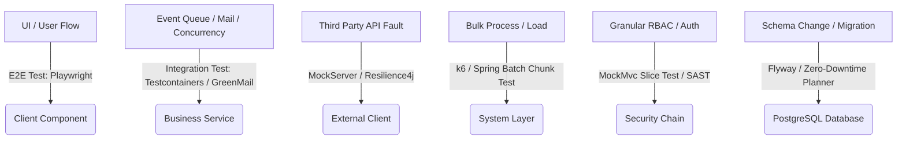

# E2E 테스트 범위를 벗어난 기능들에 대한 정밀 검증 방안 (Beyond E2E Verification Guide)

> **상위 원칙**: 본 문서는 [테스트 종합 가이드 (testing-guide.md)](./testing-guide.md) 및 [프론트엔드/백엔드/DB 3대 헌법]을 상위 규범으로 따르며, 사용자 인터페이스(UI) 중심의 E2E 테스트(Playwright)만으로는 온전히 검증할 수 없는 백그라운드, 동시성, 성능, 보안, 외부 연동 및 마이그레이션 영역의 정밀 검증을 위한 표준 가이드라인을 제공합니다.

---

## 📋 목차

1. [개요 및 한계 극복 전략](#1-개요-및-한계-극복-전략)
2. [6대 핵심 영역별 정밀 검증 전략](#2-6대-핵심-영역별-정밀-검증-전략)
   - [2.1. 비동기 이벤트 및 백그라운드 태스크](#21-비동기-이벤트-및-백그라운드-태스크)
   - [2.2. 고부하 동시성 및 데이터 레이스 컨디션](#22-고부하-동시성-및-데이터-레이스-컨디션)
   - [2.3. 외부 API 장애 및 회복탄력성](#23-외부-api-장애-및-회복탄력성)
   - [2.4. 대용량 데이터 처리 및 성능 병목](#24-대용량-데이터-처리-및-성능-병목)
   - [2.5. 정밀 보안 권한 및 소스 코드 취약점](#25-정밀-보안-권한-및-소스-코드-취약점)
   - [2.6. DB 스키마 마이그레이션 무중단 검증](#26-db-스키마-마이그레이션-무중단-검증)
3. [검증 하네스 및 파이프라인 통합 방안](#3-검증-하네스-및-파이프라인-통합-방안)
4. [체크리스트 및 모범 사례](#4-체크리스트-및-모범-사례)

---

## 1. 개요 및 한계 극복 전략

E2E 테스트(Playwright)는 사용자 브라우저 관점의 블랙박스 테스트로서 기능의 최종 흐름을 확인하는 데 탁월합니다. 하지만 다음과 같은 아키텍처적 한계를 지닙니다:
*   **비가시성(Invisibility)**: 백그라운드 메시지 큐의 데이터 유입이나 힙 메모리(Heap Memory) 누수, DB 락 경합은 화면상으로 즉각 관측되지 않습니다.
*   **플레이키니스(Flakiness)**: 외부 써드파티 API(PG사 결제, 메일 서버 등) 상태에 따라 E2E 테스트가 고의가 아닌 요인으로 깨지는 현상이 잦습니다.
*   **느린 피드백 루프**: 브라우저 기동과 시나리오 실행 오버헤드로 인해 수백 가지의 보안 비인가 시나리오나 부하 동시성을 E2E로 구동하는 것은 비현실적입니다.

이를 극복하기 위해 본 가이드라인은 각 아키텍처 계층에서 최적화된 **'대체 및 결합 검증 프레임워크(Complementary Verification Framework)'**를 설계하여 무결성을 보증합니다.



---

## 2. 6대 핵심 영역별 정밀 검증 전략

### 2.1. 비동기 이벤트 및 백그라운드 태스크

*   **대상**: RabbitMQ/Kafka 메시지 발행 및 소비, `@Async` 이벤트 리스너, SMTP 메일 및 SMS 실제 발송 여부, 스케줄링 배치 작업.
*   **왜 E2E로 검증할 수 없는가?**: E2E 테스트에서는 "요청 완료" 화면이나 200 OK 응답만 확인할 뿐, 실제 메시지가 유실 없이 비동기 큐에 쌓였는지, 데드 레터 큐(DLQ, Dead Letter Queue)에 들어가지 않고 안전하게 소비되었는지 추적할 수 없습니다.

#### 🛡️ 검증 방안 및 구현체

1.  **메일 발송 실 발송 검증 (GreenMail 활용)**:
    테스트 런타임에 메모리 내 가상 SMTP 서버인 `GreenMail`을 가동하여 실제 이메일이 표준 프로토콜 규격에 맞게 정상적으로 발송되었는지, 본문 내용과 첨부파일이 손상되지 않았는지 검증합니다.
    ```java
    @SpringBootTest
    @RegisterExtension
    static GreenMailExtension greenMail = new GreenMailExtension(ServerSetupTest.SMTP)
            .withPerMethodLifecycle(false);

    @Test
    @DisplayName("비동기 메일 발송 - SMTP 발송 및 본문 검증")
    void sendNotificationEmail_success() throws Exception {
        // Given
        EmailRequest request = new EmailRequest("target@egov.com", "시스템 경고", "디스크 용량 초과");

        // When
        mailService.sendAsyncEmail(request);

        // Then: 메일이 실제로 1건 유입되었는지 확인 (비동기 타임아웃 고려)
        assertTrue(greenMail.waitForIncomingEmail(5000, 1));
        MimeMessage[] receivedMessages = greenMail.getReceivedMessages();
        assertEquals(1, receivedMessages.length);
        assertEquals("시스템 경고", receivedMessages[0].getSubject());
        assertTrue(GreenMailUtil.getBody(receivedMessages[0]).contains("디스크 용량 초과"));
    }
    ```

2.  **Spring ApplicationEvent 및 DB Outbox 패턴 기반 경량 비동기 검증 (Awaitility 활용)**:
    외부 인프라(RabbitMQ/Kafka)를 무겁게 띄우지 않고, JVM 내부 메모리 기반의 `ApplicationEventPublisher` 및 트랜잭션 유실을 100% 방지하는 **Transactional Outbox Pattern**을 기반으로 동작하는 비동기 이벤트를 검증합니다.
    비동기 스레드는 즉시 실행 완료되지 않으므로, 고정된 `Thread.sleep()` 대신 동적 타임아웃을 지원하는 **`Awaitility`** 도구를 사용하여 폴링 방식으로 정밀 검증을 수행합니다.
    ```java
    @SpringBootTest
    @ActiveProfiles("test")
    class ApplicationEventConcurrencyTest {

        @Autowired private ApplicationEventPublisher eventPublisher;
        @Autowired private TransactionalOutboxRepository outboxRepository;
        @Autowired private PaymentEventListener paymentEventListener;

        @Test
        @DisplayName("비동기 이벤트 검증 - 결제 완료 시 Outbox 기록 및 리스너 비동기 소비 정합성 보증")
        void paymentEvent_asyncProcessingVerified() {
            // Given: 결제 완료 이벤트 발행
            PaymentCompletedEvent event = new PaymentCompletedEvent("PAY-9921", 75000);

            // When: 트랜잭션 바운더리 내에서 이벤트 발행 (DB Outbox 테이블 기록)
            eventPublisher.publishEvent(event);

            // Then: Awaitility를 사용하여 최대 3초 동안 100ms 간격으로 비동기 리스너의 작업 완료 상태를 동적으로 확인
            await()
                .atMost(3, TimeUnit.SECONDS)
                .pollInterval(100, TimeUnit.MILLISECONDS)
                .untilAsserted(() -> {
                    // 1. 비동기 리스너가 성공적으로 이벤트를 처리하여 카운트를 증가시켰는지 검증
                    assertEquals(1, paymentEventListener.getProcessedCount("PAY-9921"));
                    
                    // 2. Transactional Outbox 테이블의 메시지 상태가 'PROCESSED'로 정상 업데이트되었는지 검증
                    OutboxStatus status = outboxRepository.findStatusByEventId("PAY-9921");
                    assertEquals(OutboxStatus.PROCESSED, status);
                });
        }
    }
    ```

---

### 2.2. 고부하 동시성 및 데이터 레이스 컨디션

*   **대상**: 선착순 쿠폰 발급, 예산/재고 차감, 다중 사용자의 동일 게시글 수정(낙관적/비관적 락), 트랜잭션 격리 레벨.
*   **왜 E2E로 검증할 수 없는가?**: Playwright 등 브라우저 기반 E2E는 근본적으로 단일 클라이언트 스레드로 동작하므로, 밀리초(ms) 단위로 밀려드는 다중 스레드의 동시 접근(Race Condition)을 고의적으로 발생시키거나 정밀 제어할 수 없습니다.

#### 🛡️ 검증 방안 및 구현체

1.  **멀티스레드 스트레스 통합 테스트 (`CountDownLatch` 활용)**:
    `ExecutorService`를 통해 100~500개의 독립적인 스레드를 동시에 기동하고, `CountDownLatch`로 시작 시점을 완전 동기화하여 특정 리소스에 대해 동시 요청을 폭격한 뒤 데이터 무결성을 검증합니다.
    ```java
    @SpringBootTest
    class CouponConcurrencyIntegrationTest {

        @Autowired private CouponService couponService;
        @Autowired private CouponRepository couponRepository;

        @Test
        @DisplayName("동시성 제어 - 100개 쿠폰 초과 신청 시 분산 락/낙관적 락을 통한 무결성 보증")
        void issueCoupon_concurrencyLimitVerified() throws InterruptedException {
            int threadCount = 200; // 발행 가능 재고는 100개이나 200명이 동시 신청
            ExecutorService executorService = Executors.newFixedThreadPool(32);
            CountDownLatch latch = new CountDownLatch(1);
            CountDownLatch doneLatch = new CountDownLatch(threadCount);

            // 200개의 요청을 스레드 풀에 대기시킴
            for (int i = 0; i < threadCount; i++) {
                final String userId = "USER-" + i;
                executorService.submit(() -> {
                    try {
                        latch.await(); // 모든 스레드가 여기서 대기
                        couponService.issueCoupon("COUPON-001", userId);
                    } catch (Exception e) {
                        // 정상적으로 락 충돌이나 재고 고갈 예외 발생 (기록 생략)
                    } finally {
                        doneLatch.countDown();
                    }
                });
            }

            // When: 200개 스레드 동시 기동 (폭격 시작)
            latch.countDown();
            doneLatch.await(); // 전체 종료 시까지 대기

            // Then: 최종 발행된 쿠폰 개수가 정확히 100개인지 보증 (초과 발급 0건)
            long issuedCount = couponRepository.countByCouponId("COUPON-001");
            assertEquals(100, issuedCount, "쿠폰은 어떠한 동시성 상황에서도 딱 100개만 발행되어야 합니다.");
        }
    }
    ```

---

### 2.3. 외부 API 장애 및 회복탄력성

*   **대상**: PG사 결제 API 연동, 공공데이터 포털 API, SMS/카카오톡 발송 대행 서비스, 타 사내 프레임워크 연동.
*   **왜 E2E로 검증할 수 없는가?**: E2E 환경에서 실제 외부 PG사 서버의 방화벽 차단, 503 서버 장애, 응답 지연(Timeout)을 임의로 재현하기 어려우며, 외부 서버의 안정성에 의해 우리 전체 E2E 테스트의 신뢰성이 무너집니다.

#### 🛡️ 검증 방안 및 구현체

1.  **외부 서버 모의 검증 (`WireMock` 또는 `MockWebServer` 활용)**:
    로컬/CI 환경 내에 경량 가상 HTTP 서버인 `WireMock`을 구동하여 외부 응답을 가로채고, 의도적인 타임아웃 지연이나 5xx 장애 상태 코드를 주입하여 시스템의 예외 처리 로직을 완벽히 격리 검증합니다.
    ```java
    @SpringBootTest
    @AutoConfigureWireMock(port = 9099)
    class ExternalPaymentResilienceTest {

        @Autowired
        private PaymentClient paymentClient;

        @Test
        @DisplayName("장애 회복탄력성 - 외부 API 503 에러 연속 발생 시 서킷 브레이커 작동 검증")
        void payment_circuitBreakerOpen_onExternal503() {
            // Given: 외부 API가 3번 연속 503 Service Unavailable을 뱉도록 WireMock 세팅
            stubFor(post(urlEqualTo("/v1/payments"))
                    .willReturn(aResponse()
                            .withStatus(503)
                            .withHeader("Content-Type", "application/json")
                            .withBody("{\"error\":\"Service Unavailable\"}")));

            // When & Then: 서킷 브레이커 동작으로 CallNotPermittedException 또는 폴백 결과가 리턴되는지 검증
            for (int i = 0; i < 5; i++) {
                try {
                    paymentClient.requestPayment("ORDER-100", 50000);
                } catch (Exception e) {
                    // 서킷 브레이커가 점진적으로 차단하며 정상 폴백을 리턴하는지 추적
                }
            }

            // 서킷 브레이커 상태가 OPEN으로 변경되었는지 검증
            CircuitBreakerState state = paymentClient.getCircuitBreakerState();
            assertEquals(CircuitBreaker.State.OPEN, state);
        }
    }
    ```

---

### 2.4. 대용량 데이터 처리 및 성능 병목

*   **대상**: 5만 건 이상의 엑셀 파일 파싱 및 벌크 삽입, 일 단위 정산 마감 쿼리, 대용량 PDF 파일 렌더링 및 다운로드.
*   **왜 E2E로 검증할 수 없는가?**: Playwright E2E 시나리오에서 수십 MB 크기의 파일을 첨부하고 업로드하는 액션은 엄청난 대기 시간을 소요시키며, CI 환경의 노드 메모리 부족(OOM)이나 네트워크 제한으로 인해 파이프라인의 고속 피드백 루프를 파괴합니다.

#### 🛡️ 검증 방안 및 구현체

1.  **힙 메모리 누수 및 속도 측정 단위 테스트 (Spring Batch Chunk 단위 검증)**:
    대규모 마크업 데이터를 로컬 메모리에 빠르게 적재한 뒤, 데이터베이스 커넥션 풀을 적절히 점유하며 GC(Garbage Collection) 대상에서 제외되는 메모리 누수 객체가 없는지 JVM `Runtime.getRuntime()`을 모니터링하여 체크하는 통합 테스트를 구성합니다.
    ```java
    @SpringBootTest
    class ExcelBulkUploadMemoryTest {

        @Autowired private BulkUploadService bulkUploadService;

        @Test
        @DisplayName("대용량 엑셀 업로드 - 50,000건 처리 시 OOM 방지 및 메모리 무결성 검증")
        void bulkUpload_memoryLeakCheck() {
            // Given: 50,000건의 Mock 데이터를 메모리 스트림으로 생성
            InputStream mockExcelStream = generateMockExcelStream(50000);
            
            long beforeUsedMem = Runtime.getRuntime().totalMemory() - Runtime.getRuntime().freeMemory();

            // When: 벌크 업로드 서비스 실행
            bulkUploadService.processExcelUpload(mockExcelStream);

            // 강제 GC 호출을 통해 미소멸 참조 정리 유도
            System.gc();
            long afterUsedMem = Runtime.getRuntime().totalMemory() - Runtime.getRuntime().freeMemory();

            // Then: 작업 완료 및 GC 이후 메모리 증가량이 50MB 이내로 제어되는지 보증 (메모리 누수 차단)
            long deltaMemMb = (afterUsedMem - beforeUsedMem) / (1024 * 1024);
            assertTrue(deltaMemMb < 50, "대용량 처리가 끝난 후 힙 메모리 점유율 증가 폭이 50MB를 넘지 않아야 합니다. 현재: " + deltaMemMb + "MB");
        }
    }
    ```

2.  **API 성능 타겟 부하 테스트 (`k6` 스크립트 활용)**:
    E2E 시나리오 외에 독립적으로 구동되는 가벼운 JS 기반의 `k6` 부하 테스트 도구를 가동해 비즈니스 핵심 API의 한계 임계값(TPS, p99 Latency)을 정량 검증합니다.

    > 📌 k6 스크립트 및 SLO 임계값의 SSOT는 [load-test-guide.md](../04-operations/load-test-guide.md) 및 [k6-load-test-quickstart.md](../04-operations/k6-load-test-quickstart.md)이며, 표준 스크립트는 `test/load-tests/scenarios/`에 있다. 아래 인라인 예시의 `p(95)<200`은 `/api/v1/menus/hierarchy` 엔드포인트에 한정한 예시 임계값으로, 프로젝트 표준 SLO(p95 < 500ms)가 아니다.

    ```javascript
    // 예시 k6 스크립트 (canonical 스크립트: test/load-tests/scenarios/ — docs/04-operations/load-test-guide.md 참조)
    import http from 'k6/http';
    import { sleep, check } from 'k6';

    export let options = {
        vus: 100, // 100명의 가상 사용자 동시 요청
        duration: '30s', // 30초 동안 폭격
        thresholds: {
            http_req_duration: ['p(95)<200'], // 95%의 요청이 200ms 이내에 완료될 것
            http_req_failed: ['rate<0.01'],   // 에러율 1% 미만일 것
        },
    };

    export default function () {
        let res = http.get('http://localhost:8080/api/v1/menus/hierarchy');
        check(res, {
            'status is 200': (r) => r.status === 200,
            'body matches size': (r) => r.body.length > 1000,
        });
        sleep(0.1);
    }
    ```

---

### 2.5. 정밀 보안 권한 및 소스 코드 취약점

*   **대상**: 접근 제어(RBAC - Role Based Access Control), 미세 객체 식별자 권한 탈취(IdOR), SQL Injection 페이로드 방어, CSRF 토큰 변조 공격.
*   **왜 E2E로 검증할 수 없는가?**: 비인가 접근 시도가 `403 Forbidden`을 뱉는지 E2E로 모두 확인하려면 브라우저 세션을 계속 재기동하고 로그인 단계를 수없이 번복해야 하므로 테스트 시간이 기하급수적으로 증가합니다.

#### 🛡️ 검증 방안 및 구현체

1.  **Spring Security 슬라이스 테스트 (`@WebMvcTest` + `@WithMockUser` 활용)**:
    서버와 실제 DB 기동 없이 `@WebMvcTest` 어노테이션으로 가상의 스프링 시큐리티 컨텍스트만 주입하여, 권한별 리소스 진입 통제 및 CSRF 토큰 누락 시 즉각적인 차단(`403/401`)을 50ms 내외로 초고속 차단 검증합니다.
    ```java
    @WebMvcTest(MenuController.class)
    class MenuSecuritySliceTest {

        @Autowired private MockMvc mockMvc;

        @Test
        @DisplayName("보안 검증 - ADMIN 권한이 없는 일반 사용자가 메뉴 강제 등록 시도 시 403 Forbidden 차단")
        @WithMockUser(username = "normal_user", roles = {"USER"}) // USER 권한 주입
        void createMenu_forbiddenForUser() throws Exception {
            mockMvc.perform(post("/api/v1/admin/menus")
                            .with(csrf()) // CSRF 토큰을 주입하더라도 권한 문제로 차단되어야 함
                            .contentType(MediaType.APPLICATION_JSON)
                            .content("{\"menuNm\":\"비밀메뉴\",\"urlPath\":\"/admin/secret\"}"))
                    .andExpect(status().isForbidden()); // 💥 403 Forbidden 검증
        }

        @Test
        @DisplayName("보안 검증 - CSRF 토큰이 누락된 모든 상태 변경 요청은 즉각 403 Forbidden 차단")
        @WithMockUser(username = "admin_user", roles = {"ADMIN"})
        void createMenu_missingCsrf_forbidden() throws Exception {
            mockMvc.perform(post("/api/v1/admin/menus")
                            // .with(csrf()) 💥 고의로 CSRF 주입 누락
                            .contentType(MediaType.APPLICATION_JSON)
                            .content("{\"menuNm\":\"메뉴\",\"urlPath\":\"/admin\"}"))
                    .andExpect(status().isForbidden());
        }
    }
    ```

2.  **정적 보안 스캔 (SAST / SCA)**:
    - **SAST**: `SonarQube` 또는 `Snyk Code`를 CI 파이프라인에 주입하여 하드코딩된 패스워드/API Key 검출, 안전하지 않은 암호화 난수(Random vs SecureRandom) 사용, SQL Injection 취약 코드를 빌드 전 자동 스캔합니다.
    - **SCA**: npm 및 gradle 의존 패키지 라이브러리의 보안 위협을 `snyk test` 또는 Gradle Dependency Check 플러그인으로 빌드 단계에서 사전에 차단합니다.

---

### 2.6. DB 스키마 마이그레이션 무중단 검증

*   **대상**: Flyway/Liquibase DDL 스크립트 실행, 컬럼 추가/삭제/변경 시 데이터 유실 여부, 컬럼명/타입 불일치(JPA Entity 정합성).
*   **왜 E2E로 검증할 수 없는가?**: E2E 테스트는 현재 구동되고 있는 최신 애플리케이션 화면만 바라봅니다. 마이그레이션 도중 구버전 서버와 신버전 서버가 롤링 배포(Rolling Deployment) 방식으로 공존하는 과도기 순간에 DB가 두 버전의 쿼리를 모두 수용할 수 있는지(무중단 마이그레이션 정합성)는 E2E로 원천 검증이 불가능합니다.

#### 🛡️ 검증 방안 및 구현체

1.  **Zero-Downtime Migration (Expand-and-Contract) 검증**:
    DB 헌법에 정의된 무중단 마이그레이션 원칙을 강제하기 위해, 물리 테이블 수정 시 구컬럼과 신컬럼을 둘 다 유지한 상태에서 구버전 코드가 예외를 뱉지 않는지 검증합니다.
    ```java
    @ActiveProfiles("test")
    @SpringBootTest
    class SchemaMigrationCompatibilityTest {

        @Autowired private JdbcTemplate jdbcTemplate;
        @Autowired private LegacyMemberRepository legacyMemberRepository; // 구버전 필드를 가진 엔티티 가정

        @Test
        @DisplayName("DB 마이그레이션 - 신규 스키마 DDL(V2)이 반영된 후에도 구버전 서버 엔티티(V1)의 조회/쓰기가 정상 작동함을 보증")
        void database_expandPhase_backwardCompatibilityVerified() {
            // 1. Expand Phase: 신규 컬럼(last_name, first_name)이 추가되었으나 구버전 컬럼(user_nm)도 유지된 상태
            // V2__add_split_names.sql 마이그레이션이 이미 돌았다고 가정

            // 2. 구버전 엔티티로 데이터 저장 시도 (Backward Compatibility 검증)
            LegacyMember member = new LegacyMember("user_id_101", "홍길동");
            assertDoesNotThrow(() -> legacyMemberRepository.save(member));

            // 3. 데이터베이스 로직 조회 시 널 포인터 및 맵핑 예외가 없는지 확인
            LegacyMember saved = legacyMemberRepository.findById("user_id_101").orElseThrow();
            assertEquals("홍길동", saved.getUserNm());
        }
    }
    ```

2.  **JPA-Flyway 정합성 하네스 검증 (`ddl-auto: validate`)**:
    자바 Entity 파일에 수정이 발생했으나 Flyway DDL 마이그레이션 파일 반영을 실수로 누락한 경우, 빌드 기동 즉시 에러를 내며 멈추는(Fail-Fast) 하네스를 강제 적용합니다. (상세 내역은 `docs/03-guides/testing-guide.md`의 **'로컬 단위 테스트 정합성 하네스 강제화'** 정책 참조).

---

## 3. 검증 하네스 및 파이프라인 통합 방안

위의 'E2E 외 영역' 검증 아키텍처들은 실행 시간 및 피드백 주기에 따라 개발자의 로컬 환경과 중앙 CI/CD 파이프라인의 핵심 관문에 적절히 분산 배치되어야 개발 생산성이 저하되지 않습니다.

| 검증 단계 | 검증 대상 | 실행 트리거 | 강제 레벨 | 도구 및 명령어 |
|:---|:---|:---|:---|:---|
| **Local Commit** | 소스 코드 품질 & 문법 | `git commit` | **Optional** | ESLint, Prettier, Checkstyle |
| **Local Push** | 변경 범위별 컴파일 무결성 (Java compileJava/compileTestJava + TS 타입체크) | `git push` | **Mandatory for source changes** | Pre-Push Hook (.githooks/pre-push, core.hooksPath): [AGENTS.md 범위별 검증](../../AGENTS.md#verification-by-change-scope). 문서-only는 경량 계약 후 fast-pass. |
| **Pull Request** | 시큐리티 룰, 동시성, 비동기 통합 | PR 생성 및 업데이트 | **Mandatory** | `CI Server (./gradlew build jacocoRootReport check)` |
| **Build & Deploy** | 정적 보안 스캔, 라이브러리 취약점 | Merge to main | **Mandatory** | `SonarQube`, `snyk test`, `DependencyCheck` |
| **Staging Deploy** | API 부하 및 실제 백그라운드 성능 | 배포 직후 자동화 | **Recommended** | `k6 run --scenario users-100 test/load-tests/scenarios/load-levels.js` (SSOT: [load-test-guide.md](../04-operations/load-test-guide.md)) |

---

## 4. 체크리스트 및 모범 사례

개발 리더 및 담당자는 신규 기능 추가 시, 아래의 자가 진단(Checklist)을 통해 E2E 이외의 검증 수단을 확보했는지 의무적으로 점검해야 합니다.

*   [ ] **비동기 흐름**: `@Async`나 이벤트 리스너를 사용하는가? 그렇다면 비동기 동작 완료 대기(`Awaitility` 등)를 적용한 비동기 통합 테스트를 작성했는가?
*   [ ] **동시성 임계 구역**: 여러 명이 한꺼번에 누를 수 있는 공유 데이터 쓰기 기능인가? 그렇다면 `CountDownLatch`를 적용한 100개 스레드 폭격 통합 테스트를 통과했는가?
*   [ ] **외부 API**: 다른 시스템의 HTTP/gRPC를 직접 호출하는가? 그렇다면 외부 연동 장애 시나리오(`WireMock`의 5xx / Delay 주입)에 대응하는 복구(Circuit Breaker) 테스트를 작성했는가?
*   [ ] **대량 연산**: 루프(Loop)를 돌며 대량 DB 쓰기나 파일 IO를 하는가? 그렇다면 5만 건 이상의 데이터 적재 시 힙 메모리 OOM이 발생하지 않는지 메모리 스냅샷 측정을 단위 테스트로 수행했는가?
*   [ ] **보안 세분화**: URL이나 파라미터를 강제로 조작(Tampering)하여 다른 사용자 정보에 접근할 수 있는가? 그렇다면 `@WithMockUser` 기반의 컨트롤러 시큐리티 차단 슬라이스 테스트를 설계했는가?
*   [ ] **DB 마이그레이션**: 컬럼을 삭제하거나 분할하는가? 그렇다면 구버전 서버 코드가 신버전 DB 스키마 하에서 무중단으로 하위 호환(`Expand-and-Contract`)을 유지할 수 있는지 정합성 검증을 거쳤는가?

---
*Last Updated: 2026-05-26 (Created via Antigravity — Non-E2E System-wide Joint Verification Framework & Playbook Established)*
