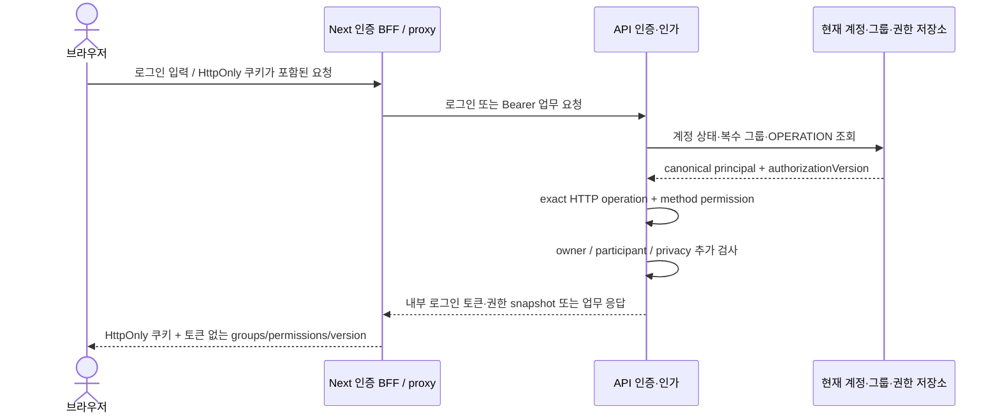
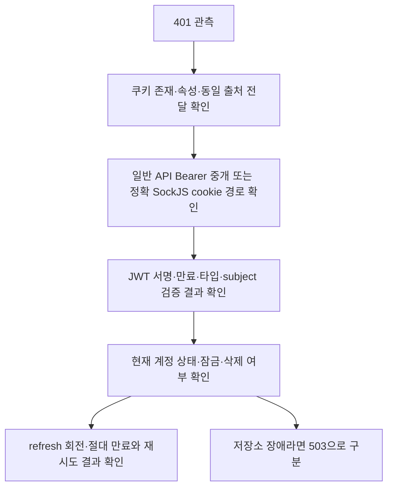

# Security Hardening & Authentication Playbook

인증·인가·세션 장애를 현재 실행 경로에서 진단하는 안내다. 상위 규범은 [백엔드 헌법](../../.agent/knowledge/backend-api-constitution/artifacts/constitution.md)과 [프론트엔드 헌법](../../.agent/knowledge/frontend-ux-constitution/artifacts/constitution.md)이다. 권한 데이터와 전환 결정은 [권한 단순화 설계](../02-architecture/authorization-simplification-design.md), 배포·복구는 [전환 런북](../04-operations/authorization-cutover-runbook.md)이 소유한다. 이 문서는 운영 OCI 적용 완료를 주장하지 않는다.

## 1. 프론트-백엔드 인증 동기화 아키텍처



### 1.1 쿠키 세션 & 헤더 바인딩 핵심 메커니즘

- 로그인·갱신 BFF는 `accessToken`을 HttpOnly·SameSite=Strict로 설정한다. 브라우저 응답에는 access/refresh 토큰을 노출하지 않는다. Secure의 환경별 판정은 [ADR-0010](../02-architecture/decisions/ADR-0010-frontend-session-cookie-secure-policy.md)이 소유한다.
- 일반 API는 동일 출처 proxy 또는 서버 코드가 쿠키를 Bearer 헤더로 중개한다. API에서 임의 쿠키를 인증으로 인정하는 전역 fallback은 없다. [proxy 원본](../../frontend/src/proxy.ts)과 [JWT 필터](../../foundation/src/main/java/nuri/foundation/security/jwt/JwtAuthenticationFilter.java)를 함께 확인한다.
- SockJS는 [WebSocketCookieAuthenticationFilter](../../api-server/src/main/java/nuri/config/websocket/WebSocketCookieAuthenticationFilter.java)의 정확한 HTTP transport 범위에서만 access 쿠키를 검증한다. 데이터 transport에는 허용 목록의 Origin이 필수다. 동일 출처 `/ws/info`·welcome GET은 Origin을 생략할 수 있어 별도 metadata 경계를 두지만 유효 자격증명은 계속 필요하다. 브라우저 JavaScript에 JWT를 넘겨 CONNECT 헤더를 만드는 방식은 사용하지 않는다.
- 허용 Origin, Cookie 속성, 프록시 경로를 실제 배포 설정과 대조한다. 진단에 토큰·쿠키 값을 출력하거나 공유하지 않는다.

### 1.2 Refresh Token을 활용한 Silent Refresh (재발급) 파이프라인

업무 API 401은 [클라이언트의 동시 갱신 조정](../../frontend/src/lib/api/client.ts)과 `/api/auth/reissue` BFF를 통해 한 번 재시도한다. 백엔드는 refresh 저장 상태·회전·절대 만료와 현재 계정 상태를 검증한다. 로그인·갱신·JWT 요청은 같은 현재 principal 계산 경로를 사용한다. 그룹이 없어도 활성 계정의 명시적 인증 전용 기능은 유지되며 `ROLE_USER`를 자동 부여하지 않는다.

403은 권한·자원 관계 거부다. 반복 갱신으로 해소하지 않는다. 인증 저장소 장애 503은 `Retry-After`를 확인하고 유효 쿠키를 강제 삭제하지 않는다. 로그아웃의 로컬 쿠키 삭제와 원격 refresh 폐기 성공 여부는 구분한다.

## 2. Next.js Proxy & Spring Security 이중 방어

화면 진입과 API 호출은 별도 경계다. `role` claim·표시용 `roleName`·`authorCode`는 권한 원본이 아니다.

### 2.1 Next.js Proxy 위상 설정 (`frontend/src/proxy.ts`)

Proxy는 JWT 서명·만료·subject·타입을 확인한다. 보호 화면의 진입은 [현재 서버 권한 조회](../../frontend/src/lib/auth/page-authorization.ts)와 생성된 페이지 permission 계약을 사용한다. 브라우저가 전달한 groups나 오래된 JWT role을 믿지 않는다. 화면 버튼·메뉴의 가시성은 사용자 안내이며 API 허용의 증거가 아니다. NAVIGATION 배정은 메뉴 가시성에만 쓰이고 OPERATION 부여와 구분된다.

### 2.2 Spring Boot Security Filter Chain 설정 (`api-server`)

[ApiSecurityConfig](../../api-server/src/main/java/nuri/api/config/ApiSecurityConfig.java)의 API 체인은 JWT로 현재 principal을 읽고 [OperationAuthorizationManager](../../business-core/src/main/java/nuri/business/security/authorization/OperationAuthorizationManager.java)가 exact HTTP method/path의 검토된 permission을 판정한다. 미등록 경로는 거부하며 HEAD는 GET 정책을 따른다. 경로 접두가 같다는 이유로 관리자 기능을 허용하지 않는다. 별도 포트의 Prometheus 수집 예외와 legacy 체인 선택은 이 설정의 실제 조건을 확인한다.

컨트롤러는 `@permissionPolicy.allowed(authentication, '정규클래스#메서드')`로 같은 operation binding을 확인한다. 서비스는 `assertPermission` 또는 `assertOwnerOrPermission`의 구체적인 기능 코드를 사용한다. 엄격 본인 행위는 `assertOwnerByEsntlId`를 유지한다. 개인정보 로그는 SYSTEM 그룹을 다른 그룹과 함께 가져도 제외한다. [정책 원장](../../config/governance/authorization-policies.json)과 [카탈로그](../../config/governance/permission-catalog.json)가 이 대응의 원본이다.

## 3. 🚨 긴급 보안 장애 트러블슈팅 가이드

### 3.1 [HTTP 401] Unauthorized 진단 플로우차트



브라우저 Network에서 Bearer가 보이지 않는다고 곧바로 실패로 판정하지 않는다. 브라우저는 쿠키를 보내고 서버 proxy가 헤더를 붙일 수 있다. 값 대신 존재 여부·상태 코드·상관관계 ID만 증거로 남긴다.

### 3.2 [HTTP 403] Forbidden 진단 가이드

1. 같은 요청의 method/path와 operation binding을 대조하고 요구 permission을 확인한다.
2. 현재 `tb_authrt_user_map`의 그룹 배정과 `tb_authrt_grnt_map`의 OPERATION을 확인한다. NAVIGATION이나 그룹 이름을 기능 권한으로 오인하지 않는다.
3. 현재 principal의 enabled·lock·permissions·authorizationVersion을 같은 요청 시점 기준으로 확인한다. ROLE 문자열을 추가하거나 fallback을 열어 해결하지 않는다.
4. 소유자 식별 축(loginId/esntlId), 참여자·커뮤니티 승인 관계, 개인 첨부 참조와 SYSTEM 배제 여부를 확인한다. 기능 permission이 있어도 추가 관계 가드는 거부할 수 있다.
5. WebSocket의 권한 버전이 달라지면 inbound/outbound 전송을 거부하고 연결을 종료한다. 재연결은 현재 계정·권한으로 다시 검증한다.

## 4. 데이터 암호화 및 마스킹 규범 (Data Protection)

OWASP Top 10의 '암호화 실패(Cryptographic Failures)'를 방어하기 위한 백엔드 데이터 보호 원칙이다.

### 4.1 패스워드 및 민감 정보 단방향 해싱
- 사용자의 비밀번호는 DB에 평문(Plain Text)으로 절대 저장될 수 없다.
- Spring Security의 `BCryptPasswordEncoder`를 의무 적용하여, 가입 및 비밀번호 변경 시 반드시 단방향 해싱(Hashing)된 값으로 `tb_user_info` 테이블에 적재한다.

### 4.2 개인 식별 정보(PII) 로그 마스킹
- 주민등록번호, 연락처, 이메일 등의 PII 데이터는 `api-server`의 전역 로깅 인터셉터나 예외 핸들러에서 로깅(Logger.error)될 때 반드시 정규식을 통해 마스킹(Masking, 예: `010-****-1234`) 처리되어야 한다.

### 4.3 요청 상관관계(Trace) 추적

- **traceId 소유권은 Micrometer/OTel 브리지 단독이다.** 애플리케이션 필터는 `traceId` MDC 키를 별도로 생성하거나 덮어쓰지 않는다.
- **로그 패턴에 `%X{traceId}` 를 추가하지 말 것.** Spring Boot 가 `logging.pattern.correlation`(= `%correlationId`)으로 이미 출력하고 있다. 중복 추가하면 위 키 충돌을 되살린다.
- **`X-Trace-Id` 응답 헤더는 유지**하되 값은 OTel 의 traceId 를 싣는다. **클라이언트가 보낸 `X-Trace-Id` 는 수신하지 않는다** — 무검증 반영은 순수한 로그 위조 벡터였다.
- PII 마스킹(§4.2)과의 결속은 `%correlationId` 를 공통 축으로 삼는다(마스킹 유틸은 `nuri.foundation.core.util.PiiMaskUtil`).

---

## 5. Spring Security API 권한 제어 유실 방지 하네스 (Auth Role Guardrail)

### 5.1 작동 메커니즘

- [SecurityAuthAnnotationLinterTest](../../api-server/src/test/java/nuri/api/harness/SecurityAuthAnnotationLinterTest.java)는 Spring이 등록한 전체 MVC method/path/handler와 원장·생성물·정확한 method guard를 비교한다. 읽기·쓰기·관리자 접두 모두 대상이다. 잘못된 permission, endpoint 누락, `permitAll()` 완화, 개인정보 배제 삭제와 서비스 helper 인자 변형은 실패한다.
- [SecurePathsDeclarationSyncLinterTest](../../api-server/src/test/java/nuri/api/harness/SecurePathsDeclarationSyncLinterTest.java)는 이전 명칭을 유지하지만 현재는 permission/operation 생성물과 실제 HTTP·SockJS 배선을 검사한다. 퇴역 DB URL 목록을 runtime 권한 근거로 사용하지 않는다.
- [생성기 계약](../../scripts/generate-permissions.test.mjs)은 Java·TypeScript·runtime JSON·신규 base 초기 OP 부여와 카탈로그의 일치를 검사한다. operational test glob을 통해 verify·pre-push·required CI에서 실행된다.
- 서비스 소스 검사는 필수 guard 문장의 존재·인자·식별 축을 증명한다. 모든 Java 제어흐름의 도달성, OCI 현재 데이터, 실제 배포 완료까지 증명하지 않는다. owner·participant·privacy 부정 테스트와 격리 PostgreSQL 통합 검증이 별도로 필요하다.
- PUBLIC/AUTHENTICATED/PERMISSION/DENY는 원장의 명시적 판정이다. 린터 예외 목록을 늘리거나 role hierarchy를 복원해 실패를 숨기지 않는다.

### 5.2 검증 수행 명령

```powershell
node scripts/generate-permissions.mjs --check
node --test scripts/generate-permissions.test.mjs
./gradlew :api-server:harnessTest --tests "*SecurityAuthAnnotationLinterTest*" --tests "*SecurePathsDeclarationSyncLinterTest*"
```

더 넓은 검증과 배포 증거는 [권한 설계](../02-architecture/authorization-simplification-design.md)와 [전환 런북](../04-operations/authorization-cutover-runbook.md)을 따른다. 로컬 green은 required CI 또는 OCI 적용 증거를 대신하지 않는다.

*인가 실행 경로 확인: 2026-09-10. 운영 적용 상태는 배포 증거에서 별도 확인.*
