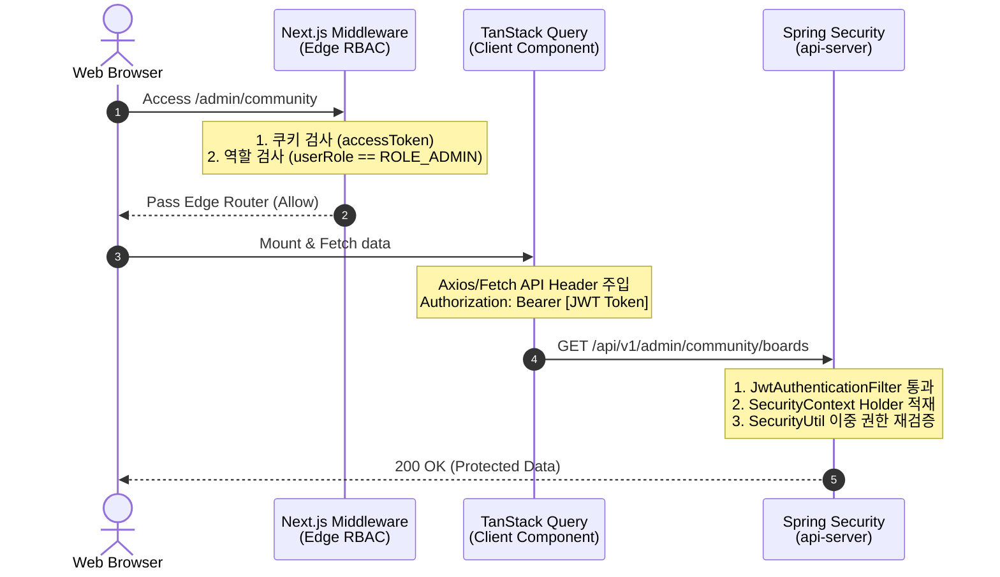

# Security Hardening & Authentication Playbook

본 플레이북은 **eGov Enterprise v5** 플랫폼의 인증(Authentication), 인가(Authorization), 세션 라이프사이클 및 어드민 위상 제어를 안전하게 수호하기 위한 실무 트러블슈팅 런북이다. 본 플레이북은 **OWASP Top 10** 표준을 엄격히 충족하고 제로 트러스트(Zero-Trust) 모델을 코드에 안착시키기 위해 작성되었으며, 에이전트와 개발자 모두에게 보안 진단의 핵심 나침반 역할을 한다.

---

## 1. 프론트-백엔드 인증 동기화 아키텍처

eGov Enterprise는 프론트엔드(Next.js App Router)와 백엔드(Spring Boot API Server) 간에 **쿠키 기반 보안 JWT 세션**을 활용하며, 다음과 같은 고도로 설계된 이중 인증 검증 체계를 운영한다.



### 1.1 쿠키 세션 & 헤더 바인딩 핵심 메커니즘
- **Access Token 관리**: JWT 토큰은 브라우저의 `HttpOnly`, `Secure`, `SameSite=Strict` 옵션이 켜진 쿠키 공간에 안전하게 저장되어 CSRF 및 XSS 해킹 위협을 원천 봉쇄한다.
- **클라이언트 전파**: 프론트엔드 `AuthContext`는 마운트 시점에 해당 쿠키 토큰을 획득하여 `TanStack Query` 및 HTTP `ApiService` 통신 레이어의 HTTP Header `Authorization: Bearer {token}` 주입용 상태로 관리한다.
- **CORS & Credentials 주의사항**: 로컬 개발(localhost:3000 -> localhost:8080) 및 실서버 이종 도메인 환경에서는 백엔드 CORS 설정 시 `allowedOrigins`에 와일드카드(`*`) 사용이 불가하며, 반드시 특정 Origin을 지정하고 `allowCredentials(true)`를 활성화해야 세션 쿠키가 정상 바인딩된다. SameSite는 개발 환경 로컬 테스트 편의를 위해 `Lax`로 유연화할 수 있으나 운영 배포 시에는 `Strict`를 강제한다.

### 1.2 Refresh Token을 활용한 Silent Refresh (재발급) 파이프라인
- Access Token 만료에 따른 잦은 로그아웃(401) 방지를 위해, `HttpOnly` 쿠키에 더 긴 수명을 가진 `refreshToken`을 병행 저장한다.
- 401 에러 발생 시 Axios Interceptor가 가로채어(Intercept) 백엔드 `/api/v1/auth/refresh` 엔드포인트로 백그라운드 갱신 요청을 시도(Silent Refresh)하며, 성공 시 원래 실패했던 API 요청을 재시도(Retry)한다.

---

## 2. Next.js Edge Middleware & Spring Security 이중 방어

보안 위상 강화를 위해 프론트엔드 에지 단(Edge Node Routing)과 백엔드 애플리케이션 코어 단(Spring Filter Chain)에서 각각 **역할 기반 접근 제어(RBAC)**를 이중으로 집행한다.

### 2.1 Next.js Middleware 위상 설정 (`frontend/src/middleware.ts`)
프론트엔드 웹 라우팅 진입 시점에서 사용자의 미인증 접근을 원천 차단하고 어드민 메뉴로의 부적절한 권한 진입을 즉각 라우팅시킵니다.

```typescript
import { NextResponse } from 'next/server';
import type { NextRequest } from 'next/request';

export function middleware(request: NextRequest) {
    const token = request.cookies.get('accessToken')?.value;
    const userRole = request.cookies.get('userRole')?.value;
    const { pathname } = request.nextUrl;

    // 1. 관리자(/admin/**) 경로 보안 강화
    if (pathname.startsWith('/admin')) {
        // 비인증 사용자 포워딩
        if (!token) {
            return NextResponse.redirect(new URL('/login', request.url));
        }
        // 권한 부족 사용자 차단 (RBAC)
        if (userRole !== 'ROLE_ADMIN') {
            return NextResponse.rewrite(new URL('/403', request.url));
        }
    }

    return NextResponse.next();
}

export const config = {
    matcher: ['/admin/:path*', '/work-hub/:path*'],
};
```

### 2.2 Spring Boot Security Filter Chain 설정 (`api-server`)
스프링 시큐리티는 프론트엔드 라우팅 우회 침투에 대비하여 API 엔드포인트 레벨에서 인가를 강제한다.

```java
@Bean
public SecurityFilterChain filterChain(HttpSecurity http) throws Exception {
    http
        .csrf(csrf -> csrf.disable()) // Stateless JWT 기반 설정
        .sessionManagement(session -> session.sessionCreationPolicy(SessionCreationPolicy.STATELESS))
        .authorizeHttpRequests(auth -> auth
            .requestMatchers("/api/v1/public/**", "/api/v1/auth/login").permitAll()
            .requestMatchers("/api/v1/admin/**").hasRole("ADMIN") // 어드민 API 인가 강제
            .anyRequest().authenticated()
        )
        .addFilterBefore(new JwtAuthenticationFilter(tokenProvider), UsernamePasswordAuthenticationFilter.class);
    return http.build();
}
```

---

## 3. 🚨 긴급 보안 장애 트러블슈팅 가이드

현업 개발 중 가장 빈번하게 마주치는 **401 Unauthorized** 및 **403 Forbidden** 에러에 대한 해결 알고리즘이다.

### 3.1 [HTTP 401] Unauthorized 진단 플로우차트

사용자의 인증 세션이 풀렸거나, 토큰이 정상적으로 전달되지 않는 장애 상황 발생 시 진단 단계:

```text
[HTTP 401 에러 발생]
   │
   ├──▶ 1단계: 브라우저 쿠키(DevTools ➔ Application ➔ Cookies)에 "accessToken"이 존재하는가?
   │            NO: 로그인 세션 만료. 로그인을 새로 처리하십시오.
   │            YES: 2단계로 진행.
   │
   ├──▶ 2단계: API 요청 헤더(Network ➔ Request Headers)에 "Authorization: Bearer eyJ..." 포맷이 정확한가?
   │            NO: ApiService 또는 Axios interceptor 설정 에러. frontend/src/services/api.ts를 검사하십시오.
   │            YES: 3단계로 진행.
   │
   └──▶ 3단계: 백엔드 서버 로그에 "ExpiredJwtException" 또는 "SignatureException"이 찍혀있는가?
                YES (Expired): JWT 토큰 만료 시간 경과. Refresh Token Silent Refresh 로직(§1.2)이 정상 작동하는지 확인하십시오.
                YES (Signature): JWT Secret Key 불일치. application.yml의 Secret은 반드시 `${JWT_SECRET}` 환경변수 바인딩이어야 한다. [백엔드 헌법 제11조]
```

### 3.2 [HTTP 403] Forbidden 진단 가이드

토큰은 올바르나 자원에 접근할 권한이 없는 상태에서의 조치 방법:

1. **`hasRole()` vs `hasAuthority()` 동작 차이 이해**:
   - `hasRole("ADMIN")`은 내부적으로 **`ROLE_` 접두사를 자동으로 붙여** `ROLE_ADMIN` 권한을 탐색한다.
   - 따라서 JWT Claims의 `authorities` 배열에 `ROLE_ADMIN`이 들어 있어야 한다.
   - 만약 JWT에 접두사 없이 `ADMIN`만 박혀 있다면 `hasAuthority("ADMIN")`을 사용하거나, JWT 토큰 발급 시 `ROLE_` 접두사를 포함하도록 수정해야 한다.
   - **프로젝트 표준**: SecurityConfig에서 `hasRole("ADMIN")` 사용 → JWT Claims에 `ROLE_ADMIN` 저장.
2. **SecurityUtil 디버깅**:
   - 비즈니스 레이어에서 `SecurityUtil.hasRole("ROLE_ADMIN")`이 `false`를 뱉는다면, `SecurityContextHolder` 내부에 저장된 `Authentication` 객체의 `Authorities` 배열에 해당 String 역할명이 정상 파싱되어 적재되어 있는지 디버깅 브레이크포인트를 걸고 분석한다.

---

## 4. 데이터 암호화 및 마스킹 규범 (Data Protection)

OWASP Top 10의 '암호화 실패(Cryptographic Failures)'를 방어하기 위한 백엔드 데이터 보호 원칙이다.

### 4.1 패스워드 및 민감 정보 단방향 해싱
- 사용자의 비밀번호는 DB에 평문(Plain Text)으로 절대 저장될 수 없다.
- Spring Security의 `BCryptPasswordEncoder`를 의무 적용하여, 가입 및 비밀번호 변경 시 반드시 단방향 해싱(Hashing)된 값으로 `tb_user` 테이블에 적재한다.

### 4.2 개인 식별 정보(PII) 로그 마스킹
- 주민등록번호, 연락처, 이메일 등의 PII 데이터는 `api-server`의 전역 로깅 인터셉터나 예외 핸들러에서 로깅(Logger.error)될 때 반드시 정규식을 통해 마스킹(Masking, 예: `010-****-1234`) 처리되어야 한다.

### 4.3 MDC(Mapped Diagnostic Context) 기반 Trace 추적
- 분산 환경에서의 정밀한 에러 추적을 위해, 백엔드 헌법 제13조에 따라 모든 들어오는 HTTP 요청에 대해 `UUID` 기반의 Trace ID를 생성하고 `MDC`에 적재해야 한다.
- 모든 로그 출력 패턴(Logback 등)에 `%X{traceId}`를 포함시켜, 에러 로그(`Logger.error`)와 PII 마스킹 로그가 동일한 요청 내역 안에서 추적 가능하도록 결속력을 보장한다.

---
*Last Updated: 2026-05-19 (Double-Shield Guardrails, Refresh Token, Data Protection Runbook Added)*
*Governed by: OWASP Hardening & Zero-Trust Security Playbook*
