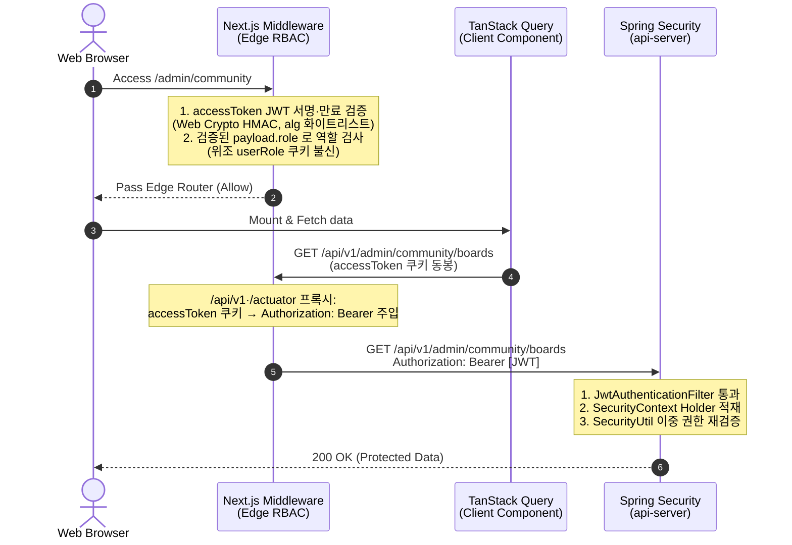

# Security Hardening & Authentication Playbook

본 플레이북은 **eGov Enterprise v5** 플랫폼의 인증(Authentication), 인가(Authorization), 세션 라이프사이클 및 어드민 위상 제어를 안전하게 수호하기 위한 실무 트러블슈팅 런북이다. 본 플레이북은 **OWASP Top 10** 표준을 엄격히 충족하고 제로 트러스트(Zero-Trust) 모델을 코드에 안착시키기 위해 작성되었으며, 에이전트와 개발자 모두에게 보안 진단의 핵심 나침반 역할을 한다.

---

## 1. 프론트-백엔드 인증 동기화 아키텍처

eGov Enterprise는 프론트엔드(Next.js App Router)와 백엔드(Spring Boot API Server) 간에 **쿠키 기반 보안 JWT 세션**을 활용하며, 다음과 같은 고도로 설계된 이중 인증 검증 체계를 운영한다.



### 1.1 쿠키 세션 & 헤더 바인딩 핵심 메커니즘
- **Access Token 관리**: 현재 클라이언트 구현상 액세스 JWT는 `localStorage`에 보관되며, 토큰 재발급 시 JS로 심는 비-`HttpOnly` `SameSite=Lax` 쿠키(`frontend/src/lib/api/client.ts` 38·133·134행)로도 전파된다. 따라서 `HttpOnly`·`Secure`·`SameSite=Strict` 쿠키 저장은 아직 달성되지 않은 **목표 상태(target hardening)**이며, 이 이행 전까지 액세스 토큰은 XSS로 탈취될 수 있어 '원천 봉쇄'로 간주하지 않는다. (진정한 `HttpOnly` 저장은 §1.2의 refresh token에만 적용된다.)
- **클라이언트 전파**: 프론트엔드 `AuthContext`는 마운트 시점에 해당 쿠키 토큰을 획득하여 `TanStack Query` 및 HTTP `ApiService` 통신 레이어의 HTTP Header `Authorization: Bearer {token}` 주입용 상태로 관리한다.
- **CORS & Credentials 주의사항**: 로컬 개발(localhost:3000 -> localhost:8080) 및 실서버 이종 도메인 환경에서는 백엔드 CORS 설정 시 `allowedOrigins`에 와일드카드(`*`) 사용이 불가하며, 반드시 특정 Origin을 지정하고 `allowCredentials(true)`를 활성화해야 세션 쿠키가 정상 바인딩된다. SameSite는 개발 환경 로컬 테스트 편의를 위해 `Lax`로 유연화할 수 있으나 운영 배포 시에는 `Strict`를 강제한다.

### 1.2 Refresh Token을 활용한 Silent Refresh (재발급) 파이프라인
- Access Token 만료에 따른 잦은 로그아웃(401) 방지를 위해, `HttpOnly` 쿠키에 더 긴 수명을 가진 `refreshToken`을 병행 저장한다.
- 401 에러 발생 시 Axios Interceptor가 가로채어(Intercept) 백엔드 `/api/v1/auth/refresh` 엔드포인트로 백그라운드 갱신 요청을 시도(Silent Refresh)하며, 성공 시 원래 실패했던 API 요청을 재시도(Retry)한다.

---

## 2. Next.js Edge Middleware & Spring Security 이중 방어

보안 위상 강화를 위해 프론트엔드 에지 단(Edge Node Routing)과 백엔드 애플리케이션 코어 단(Spring Filter Chain)에서 각각 **역할 기반 접근 제어(RBAC)**를 이중으로 집행한다.

### 2.1 Next.js Middleware 위상 설정 (`frontend/src/middleware.ts`)
프론트엔드 웹 라우팅 진입 시점에서 사용자의 미인증 접근을 원천 차단하고 어드민 메뉴로의 부적절한 권한 진입을 즉각 라우팅시킵니다.

```typescript
import { NextResponse } from 'next/server';
import type { NextRequest } from 'next/server';

// prod 에서 JWT_SECRET 미설정이면 모듈 로드 시 즉시 throw(fail-fast) — 공개 dev 기본값으로 조용히 검증하는 최악 상태 방지
const DEV_JWT_SECRET = '...(dev 전용 base64 시크릿)...';
if (process.env.NODE_ENV === 'production' && !process.env.JWT_SECRET) {
    throw new Error('[Middleware] prod 환경에 JWT_SECRET 미설정 (fail-fast)');
}
const JWT_SECRET = process.env.JWT_SECRET || DEV_JWT_SECRET;
// header.alg 를 신뢰하지 않고 화이트리스트로만 매핑 (alg=none·비대칭 혼동 공격 차단)
const HMAC_HASH: Record<string, string> = { HS256: 'SHA-256', HS384: 'SHA-384', HS512: 'SHA-512' };

// base64url·utf8 → ArrayBuffer 변환 헬퍼 3종은 지면상 생략 (Edge 네이티브 Web Crypto만 사용, 외부 의존 없음)

/**
 * accessToken 의 HMAC 서명과 만료(exp)를 모두 검증하고 payload.role 을 반환한다.
 * 서명 위조·만료·구조 이상·알 수 없는 alg 는 전부 null(=미인증)로 처리한다.
 */
async function verifyAndExtractRole(token: string): Promise<string | null> {
    try {
        const [headerB64, payloadB64, sigB64] = token.split('.');
        if (!sigB64) return null;

        const header = JSON.parse(base64UrlDecodeToString(headerB64));
        const hash = HMAC_HASH[header.alg];
        if (!hash) return null; // alg=none·RS*(비대칭) 등 화이트리스트 밖은 거부

        const key = await crypto.subtle.importKey(
            'raw', utf8ToArrayBuffer(JWT_SECRET), { name: 'HMAC', hash: { name: hash } }, false, ['verify']
        );
        const valid = await crypto.subtle.verify(
            'HMAC', key, base64UrlToArrayBuffer(sigB64), utf8ToArrayBuffer(`${headerB64}.${payloadB64}`)
        );
        if (!valid) return null; // 서명 위조

        const payload = JSON.parse(base64UrlDecodeToString(payloadB64));
        if (payload.exp && Date.now() >= payload.exp * 1000) return null; // 만료
        return payload.role || null;
    } catch {
        return null;
    }
}

export async function middleware(request: NextRequest) {
    const { pathname } = request.nextUrl;

    // 1. 백엔드 API 프록시: accessToken 쿠키 → Authorization: Bearer 헤더 주입 (백엔드가 서명을 authoritative 재검증)
    if (pathname.startsWith('/api/v1') || pathname.startsWith('/actuator')) {
        const accessToken = request.cookies.get('accessToken')?.value;
        if (accessToken) {
            const requestHeaders = new Headers(request.headers);
            requestHeaders.set('Authorization', `Bearer ${accessToken}`);
            return NextResponse.next({ request: { headers: requestHeaders } });
        }
        return NextResponse.next();
    }

    // 2. 공개 경로 조기 우회 (로그인/Next API Route/정적)
    if (pathname.startsWith('/login') || pathname.startsWith('/api') || pathname.startsWith('/images') || pathname.startsWith('/_next') || pathname === '/favicon.ico') {
        return NextResponse.next();
    }

    // 3. accessToken JWT 서명·만료를 실제로 검증 → 위조 role=ADMIN 토큰의 관리자 UI 셸 열람 차단
    const accessToken = request.cookies.get('accessToken')?.value;
    const userRole = accessToken ? await verifyAndExtractRole(accessToken) : null;

    // 유효(서명·만료 통과) 토큰이 없으면 /login 으로 (redirect 쿼리 보존)
    // ⚠ 쿠키를 삭제하지 않는다 — 프리페치/RSC 1회 검증 실패가 유효 세션을 영구 로그아웃시키는 함정 방지
    if (!userRole) {
        const loginUrl = new URL('/login', request.url);
        loginUrl.searchParams.set('redirect', pathname);
        return NextResponse.redirect(loginUrl);
    }

    // 4. /admin 접근 통제 — 기본값 = ADMIN/SYSTEM 전용(deny-by-default).
    //    2026-07-20(401c43f4c)에 과거의 5-접두사(system/user/security/stats/workflow) allow-by-default
    //    화이트리스트를 뒤집었다. 일반 사용자에게는 명시 허용 경로만 열고, 그 안의 관리 콘솔은 다시 도려낸다.
    //    (실제 목록·헬퍼는 frontend/src/middleware.ts — 발췌라 상수 정의는 생략)
    const normalizedPath = pathname.toLowerCase(); // /Admin 대소문자 우회 차단
    if (matchesPrefix(normalizedPath, '/admin')) {
        const normalizedRole = userRole.toUpperCase();
        // 백엔드(ApiSecurityConfig)가 ROLE_ADMIN 과 동급 취급하는 ROLE_SYSTEM 도 함께 인정
        const isAdmin =
            normalizedRole === 'ADMIN' || normalizedRole === 'ROLE_ADMIN' ||
            normalizedRole === 'SYSTEM' || normalizedRole === 'ROLE_SYSTEM';

        if (!isAdmin) {
            // USER_ACCESSIBLE_ADMIN_PATHS: work-hub·collaboration·help·community·survey polls participate
            // ADMIN_ONLY_SUBPATHS: community/boards/master·maker·templates (허용 경로 안의 관리 콘솔 역예외)
            const isUserAccessible =
                USER_ACCESSIBLE_ADMIN_PATHS.some((p) => matchesPrefix(normalizedPath, p)) &&
                !ADMIN_ONLY_SUBPATHS.some((p) => matchesPrefix(normalizedPath, p));
            if (!isUserAccessible) {
                const fallbackUrl = new URL('/', request.url);
                fallbackUrl.searchParams.set('auth_error', 'unauthorized');
                return NextResponse.redirect(fallbackUrl);
            }
        }
    }

    return NextResponse.next();
}

// 전역 매처: 정적 자원을 제외한 앱 전체를 가드 (API 경로도 프록시 주입을 위해 포함)
export const config = {
    matcher: ['/((?!_next/static|_next/image|favicon.ico).*)'],
};
```

### 2.2 Spring Boot Security Filter Chain 설정 (`api-server`)
스프링 시큐리티는 프론트엔드 라우팅 우회 침투에 대비하여 API 엔드포인트 레벨에서 인가를 강제한다.

```java
@Bean
public SecurityFilterChain filterChain(HttpSecurity http) throws Exception {
    http
        .csrf(csrf -> csrf.disable()) // Stateless JWT 기반 설정
        .sessionManagement(session -> session.sessionCreationPolicy(SessionCreationPolicy.STATELESS))
        .authorizeHttpRequests(auth -> auth
            .requestMatchers("/api/v1/public/**", "/api/v1/auth/login").permitAll()
            .requestMatchers("/api/v1/admin/**").hasRole("ADMIN") // 어드민 API 인가 강제
            .anyRequest().authenticated()
        )
        .addFilterBefore(new JwtAuthenticationFilter(tokenProvider), UsernamePasswordAuthenticationFilter.class);
    return http.build();
}
```

---

## 3. 🚨 긴급 보안 장애 트러블슈팅 가이드

현업 개발 중 가장 빈번하게 마주치는 **401 Unauthorized** 및 **403 Forbidden** 에러에 대한 해결 알고리즘이다.

### 3.1 [HTTP 401] Unauthorized 진단 플로우차트

사용자의 인증 세션이 풀렸거나, 토큰이 정상적으로 전달되지 않는 장애 상황 발생 시 진단 단계:

```text
[HTTP 401 에러 발생]
   │
   ├──▶ 1단계: 브라우저 쿠키(DevTools ➔ Application ➔ Cookies)에 "accessToken"이 존재하는가?
   │            NO: 로그인 세션 만료. 로그인을 새로 처리하십시오.
   │            YES: 2단계로 진행.
   │
   ├──▶ 2단계: API 요청 헤더(Network ➔ Request Headers)에 "Authorization: Bearer eyJ..." 포맷이 정확한가?
   │            NO: ApiService 또는 Axios interceptor 설정 에러. frontend/src/lib/api/client.ts(Axios request/response 인터셉터 — Bearer 주입 및 401 Silent Refresh) 및 필요 시 frontend/src/services/core/ApiService.ts(client 위임 래퍼)를 검사하십시오.
   │            YES: 3단계로 진행.
   │
   └──▶ 3단계: 백엔드 서버 로그에 "ExpiredJwtException" 또는 "SignatureException"이 찍혀있는가?
                YES (Expired): JWT 토큰 만료 시간 경과. Refresh Token Silent Refresh 로직(§1.2)이 정상 작동하는지 확인하십시오.
                YES (Signature): JWT Secret Key 불일치. application.yml의 Secret은 반드시 `${JWT_SECRET}` 환경변수 바인딩이어야 한다. [백엔드 헌법 제11조]
```

### 3.2 [HTTP 403] Forbidden 진단 가이드

토큰은 올바르나 자원에 접근할 권한이 없는 상태에서의 조치 방법:

1. **`hasRole()` vs `hasAuthority()` 동작 차이 이해**:
   - `hasRole("ADMIN")`은 내부적으로 **`ROLE_` 접두사를 자동으로 붙여** `ROLE_ADMIN` 권한을 탐색한다.
   - 따라서 JWT Claims의 `authorities` 배열에 `ROLE_ADMIN`이 들어 있어야 한다.
   - 만약 JWT에 접두사 없이 `ADMIN`만 박혀 있다면 `hasAuthority("ADMIN")`을 사용하거나, JWT 토큰 발급 시 `ROLE_` 접두사를 포함하도록 수정해야 한다.
   - **프로젝트 표준**: SecurityConfig에서 `hasRole("ADMIN")` 사용 → JWT Claims에 `ROLE_ADMIN` 저장.
2. **SecurityUtil 디버깅**:
   - 비즈니스 레이어에서 `SecurityUtil.hasRole("ROLE_ADMIN")`이 `false`를 뱉는다면, `SecurityContextHolder` 내부에 저장된 `Authentication` 객체의 `Authorities` 배열에 해당 String 역할명이 정상 파싱되어 적재되어 있는지 디버깅 브레이크포인트를 걸고 분석한다.

---

## 4. 데이터 암호화 및 마스킹 규범 (Data Protection)

OWASP Top 10의 '암호화 실패(Cryptographic Failures)'를 방어하기 위한 백엔드 데이터 보호 원칙이다.

### 4.1 패스워드 및 민감 정보 단방향 해싱
- 사용자의 비밀번호는 DB에 평문(Plain Text)으로 절대 저장될 수 없다.
- Spring Security의 `BCryptPasswordEncoder`를 의무 적용하여, 가입 및 비밀번호 변경 시 반드시 단방향 해싱(Hashing)된 값으로 `tb_user_info` 테이블에 적재한다.

### 4.2 개인 식별 정보(PII) 로그 마스킹
- 주민등록번호, 연락처, 이메일 등의 PII 데이터는 `api-server`의 전역 로깅 인터셉터나 예외 핸들러에서 로깅(Logger.error)될 때 반드시 정규식을 통해 마스킹(Masking, 예: `010-****-1234`) 처리되어야 한다.

### 4.3 요청 상관관계(Trace) 추적 — **2026-08-02 재작성**

> ⚠ 이 절의 종전 내용(“애플리케이션이 UUID 를 만들어 `MDC` 의 `traceId` 에 적재하고, 로그 패턴에 `%X{traceId}` 를 포함시킬 것”)은 **W1-D1 이 제거한 결함을 그대로 지시하고 있었다.** 그 지시를 따르면 아래 결함이 되살아난다. 지시 자체를 폐기하고 현행 설계로 대체한다.

- **traceId 소유권은 Micrometer/OTel 브리지 단독이다.** 애플리케이션 필터는 `traceId` MDC 키를 조작하지 않는다. 종전에는 필터가 8자 UUID 를, Micrometer 가 32-hex 를 **같은 키**에 써서 응답 헤더 값과 로그 값이 서로 달랐다.
- **로그 패턴에 `%X{traceId}` 를 추가하지 말 것.** Spring Boot 가 `logging.pattern.correlation`(= `%correlationId`)으로 이미 출력하고 있다. 중복 추가하면 위 키 충돌을 되살린다.
- **`X-Trace-Id` 응답 헤더는 유지**하되 값은 OTel 의 traceId 를 싣는다. **클라이언트가 보낸 `X-Trace-Id` 는 수신하지 않는다** — 무검증 반영은 순수한 로그 위조 벡터였다.
- PII 마스킹(§4.2)과의 결속은 `%correlationId` 를 공통 축으로 삼는다(마스킹 유틸은 `nuri.foundation.core.util.PiiMaskUtil`).

---

## 5. Spring Security API 권한 제어 유실 방지 하네스 (Auth Role Guardrail)

엔드포인트 수준에서 명시적인 권한 검증 어노테이션이 누락되어 인가 우회가 일어나는 제로데이 취약점을 원천 방지하기 위해 **Auth Role Guardrail 하네스**를 구축하여 빌드 타임에 강제합니다.

### 5.1 작동 메커니즘
- **타겟 도메인 패키지**: `nuri.api.controller` 하위 패키지에 정의된 REST 컨트롤러.
- **오딧 검증(실제 집행 범위 — 2026-08-02 실측 정정)**: 종전 이 문서는 "모든 HTTP 매핑 메서드를 정적으로 전수 조사"라고 서술했으나 **사실이 아니었습니다**. 집행은 두 테스트로 나뉩니다.
  - **Test#1** (`auditSecurityAnnotationsOnRestControllers`): 읽기·쓰기를 모두 보지만 `.business`·`.foundation` 패키지를 통째로 skip 합니다 → 실측 **URL쌍 358개 중 25개(7.0%)**.
  - **Test#2** (`auditWriteEndpointAuthorizationOnNonAdminPaths`): 전 컨트롤러를 보지만 **쓰기(POST/PUT/DELETE/PATCH)만** 보며, `/api/v1/admin/` 접두는 URL 시큐리티에 위임해 skip 합니다.
  - **사각지대**: `.business`/`.foundation` 패키지의 **읽기** 엔드포인트 **49건** — Test#1 은 패키지로, Test#2 는 HTTP 메서드로 각각 제외하므로 **어느 쪽도 보지 않습니다**. 읽기 IDOR 은 이 게이트가 잡지 못하며, 커버리지 확장은 별건입니다.
  - 서술이 집행보다 넓으면 그 서술 자체가 거짓 안전감이 됩니다. 최신 범위는 항상 `SecurityAuthAnnotationLinterTest` 의 클래스 javadoc 을 SSOT 로 삼으십시오.
- **예외 처리 (White-list)**: 비인가 접근이 허용되어야 하는 공개 API(예: 회원가입, 아이디 중복 확인 등)는 `SecurityAuthAnnotationLinterTest`의 `PUBLIC_PATH_WHITELIST` 상수에 등록하여 통과시키거나, `@PreAuthorize("permitAll()")`를 명시적으로 선언하도록 강제합니다.
- **빌드 하드 스톱(Hard-Stop)**: 만약 권한 제어 어노테이션이 유실된 커스텀 API가 발견되면, JUnit 테스트 단계에서 즉시 빌드를 실패(`Hard-Stop`) 처리하고 위반 엔드포인트 명세를 상세 보고합니다.

### 5.2 검증 수행 명령
```powershell
./gradlew :api-server:test --tests "*SecurityAuthAnnotationLinterTest*"
```

---
*Last Updated: 2026-05-19 (Double-Shield Guardrails, Refresh Token, Data Protection Runbook & Auth Role Guardrail Linter Integrated)*
*Governed by: OWASP Hardening & Zero-Trust Security Playbook / Security Auth Linter Harness*
