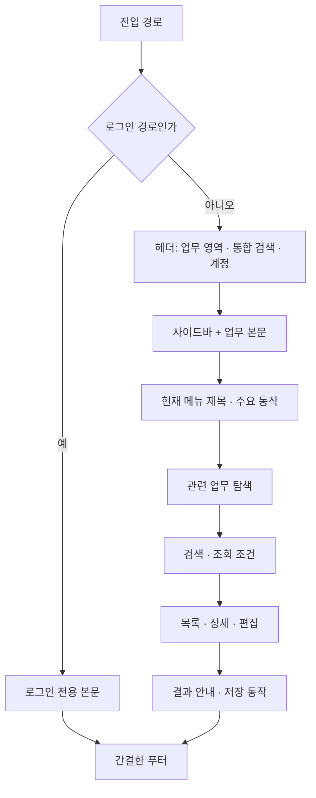
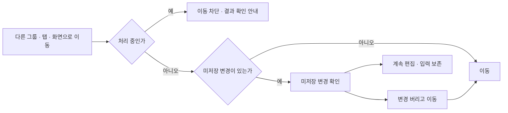
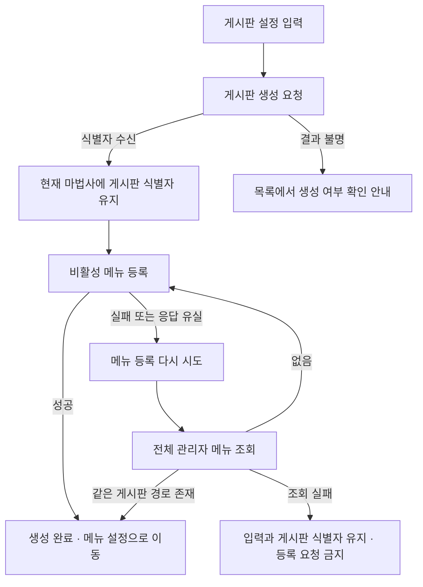

# UI/UX 작업 동선 개선과 적용 범위

검증 기준일: 2026-09-11. 60개 활성 메뉴 목적지와 공통 화면 소스를 조사한 뒤, 기존 API와 권한 의미를 보존하면서 탐색 누락·입력 손실·중복 생성 위험을 줄이는 변경을 적용했다. 이 문서는 현재 구현의 안내이며 헌법이나 인가 정책을 대체하지 않는다.

## 1. 화면의 기본 구성

- [ApplicationFrame](../../frontend/src/app/components/layout/ApplicationFrame.tsx)은 `/login`과 하위 로그인 경로에서 업무 헤더·사이드바를 마운트하지 않는다. 로그인은 페이지이므로 모달 역할·배경 inert·Tab 순환을 사용하지 않는다. 제출 중에는 입력 폼만 잠그고 진행 상태에 초점을 둔다.
- [globals.css](../../frontend/src/app/globals.css)의 `--app-header-height: 3.5rem`과 `--app-sidebar-width: 16rem`을 헤더·사이드바·본문이 공유한다. 밀도나 브랜드와 무관한 셸 치수이며 `compact` 전용 토큰과 구분한다.
- 데스크톱 사이드바의 시작 위치와 남은 높이는 헤더 높이에서 계산한다. 좁은 화면의 비모달 사이드바 열기/닫기·Escape·초점 복귀는 기존 계약을 유지한다.
- 공통 제목은 긴 한글도 줄바꿈한다. 푸터의 반복적인 제품 소개는 줄이고 기존 고객지원 경로를 유지한다.

## 2. 조사 항목별 반영

| 조사 항목 | 적용 내용 | 구현 또는 후속 경계 |
|---|---|---|
| UX01 로그인 분리 | 업무 내비게이션을 마운트하지 않는 전용 레이아웃, 페이지 초점 흐름 | ApplicationFrame·LoginClient |
| UX02 셸 치수 | 헤더 56px, 데스크톱 사이드바 256px, 동일 높이 변수로 본문 배치 | header·sidebar·globals.css |
| UX03 이름과 동작 | 업무/일정·사용자/부서/부재·통계·모니터링 제목을 현재 작업에 맞춤. 부재 화면에서 사용자 등록 제거 | WorkHubClient·UserOrgHubClient·IntelligenceHubClient·MonitoringHubClient |
| UX04 지식 탐색 | 20건 단위 페이지 이동, 조회순을 서버 전체 정렬로 요청, 검색·정렬 변경 시 첫 페이지 | KnowledgeHubClient·knowledgeService |
| UX05 편집 손실 | 그룹·사용자 선택, 권한 영역 전환, 메뉴·링크·라우터·브라우저 이동 보호 | UnsavedChangesContext·권한 편집기 |
| UX06 기안 모달 | 상신 중 StandardModal의 `closeDisabled` 연결 | ApprovalDraftDialog |
| UX07 권한 화면 | 탐색을 조회 조건에서 분리. 기본정보와 기능/메뉴를 별도 저장 단위로 명시. 영역 바로가기와 하단 저장 영역 | AuthorizationGroupEditor |
| UX08 상단 배치 | 지식·설문의 큰 소개/요약을 줄이고 이용 현황은 본문 뒤 접기 영역으로 이동. 통계의 세로 탐색을 상단으로 이동 | 각 허브와 HubHeader |
| UX09 홈 진입 | 서버가 제공하는 `bbsId`·`pstSn` 보존, 홈 업무·공지 제목을 상세로 연결. 전체 보기도 해당 게시판으로 연결 | dashboard-data·UnifiedDashboardClient |
| UX10 관리 홈 | 서비스에 연결되지 않은 InsightBanner의 상단 배치 제거, 사용자·권한·감사 경로 제공, 역할 수를 권한 그룹 수로 표시 | AdminDashboardClient |
| UX11 설문 개념 | 여론조사 목록과 만족도 등록 동작, 문항형 설문, 온라인 투표를 구분. 문항형 진행 순서 제공 | SurveyHubClient |
| UX12 생성기 메뉴명 | 기존 허용 부모를 OCI 현행 이름인 소통·지식/관리 센터 > 업무 지원으로 안내 | BoardMakerWizard; 허용 부모·ROOT 정책은 동일 |
| UX13 부분 성공 | 생성된 게시판 식별자를 유지하고 메뉴 단계만 재시도. 재시도 전 비활성 메뉴까지 조회 | BoardMakerWizard |
| UX14 결과 확인 | 설문 결과의 번호 입력을 이름 검색/페이지 선택으로 변경. 기존 기안의 생성 결과 선택·업무 등록의 상세 이동은 유지 | SurveyStatsClient·ApprovalHubClient·DeptJobCreateClient |
| UX15 탐색 | 헤더에 기존 통합 검색 경로를 연결, 통계 중복 세로 탐색 축소, 4개 대분류 유지 | Header·IntelligenceHubClient |
| UX16 푸터 | 중복 설명과 여백 축소 | 공개 정책 원문·공개 읽기 API는 별도 결정 사항 |
| UX17 편집 방식 | 권한은 선택/편집, 짧은 결재는 모달, 게시판 생성은 단계형, 메일·업무 등록은 전용 폼. 주요 장문 폼에 이동 보호 | 무조건 하나의 팝업/폼으로 통일하지 않음 |
| UX18 문서 | A5의 실제 소비자 설명을 현재 권한 그룹 편집기와 구분하고 이 문서를 문서 인덱스·Atlas에 연결 | 업무 화면 문법 카탈로그 |

전체 60개 메뉴는 조사 모집단이다. 모든 메뉴의 CRUD를 새로 구현하거나 모든 화면의 인증된 E2E를 다시 수행했다는 의미가 아니다.

## 3. 미저장 변경과 저장 중 이동

정본은 [UnsavedChangesContext](../../frontend/src/contexts/UnsavedChangesContext.tsx)다. 적용된 편집기는 권한 그룹 기본정보·기능/메뉴·사용자 배정, 게시판 생성기, 메일 작성, 만족도 조사 등록, 설문지/문항/항목, 설문 템플릿, 부서 업무 등록이다. 다른 폼은 이 훅을 등록해야 보호 대상이 된다.

그룹 기본정보와 권한은 같은 버전을 사용하는 별도 서버 쓰기다. 한쪽을 편집하는 동안 다른 쪽 입력을 잠그고, 먼저 저장하거나 취소하도록 안내한다. 이동 확인에서 여러 저장을 자동 실행하지 않는다. 서버 충돌이나 실패 시 입력을 보존하며 최신 정보 적용도 미저장 확인을 거친다. 기능권한과 메뉴표시의 독립성, 상하위 메뉴 선택 규칙, 복수 그룹 권한 합집합은 그대로다.

라우터 `push`/`replace`와 내부 링크는 전환 전에 확인한다. 브라우저 뒤로/앞으로는 현재 페이지로 먼저 복원한 뒤 확인하여 거부 시 편집 컴포넌트를 유지한다. Next가 관리하는 history 필드는 보존하고 별도의 위치 숫자만 추가한다. 폼 본문은 history·URL·localStorage에 저장하지 않는다. 새로고침·창 닫기·외부 문서 이동은 브라우저의 `beforeunload` 확인을 사용한다.

이 어댑터는 Next의 내부 `AppRouterContext`에 의존한다. Next 업그레이드 시 [이동 회귀 테스트](../../frontend/src/contexts/__tests__/UnsavedChangesContext.test.tsx)와 실제 브라우저의 Back/Forward·hash·내부 링크를 함께 재검증해야 한다. 훅 등록/해제와 레이아웃의 위치도 계약의 일부다.

## 4. 생성 실패를 안전하게 이어서 처리

게시판을 다시 만들지 않는 보장은 **게시판 식별자를 수신한 동일 마법사 세션의 메뉴 재시도**에 적용된다. 최초 게시판 생성 응답 자체가 유실되거나 페이지를 새로고침한 뒤까지 보장하는 서버 멱등성 키는 이번 변경에 포함하지 않는다. 사용자에게 목록 확인을 안내하며, 이미 저장된 게시판을 자동 삭제하거나 생성 전체를 롤백하지 않는다.

## 5. 설문과 결과 탐색

| 사용 목적 | 작업 순서 | 결과 |
|---|---|---|
| 만족도 조사 등록 | 여론조사 관리 → 만족도 조사 등록 | 기존 네 단계 만족도 항목으로 등록, 여론조사 목록/통계 |
| 문항을 직접 구성 | 템플릿 → 설문지·문항/선택 항목 구성 → 설문 참여 | `/survey/stats`에서 설문 제목으로 선택 |
| 한 항목을 고르는 투표 | 온라인 투표 관리/참여 | 기존 투표 결과 |

`/survey/stats`는 제목 검색과 서버 페이지 이동을 제공한다. 선택한 설문 식별자는 기존 `srvySn` URL로 전달하므로 북마크·직접 진입이 유지된다. 목록 조회가 실패해도 이미 선택한 결과의 조회는 독립적으로 수행한다. 여론조사 통계 탭이 문항형 설문 결과인 것처럼 안내하지 않는다.

설문 물리 테이블의 통합, 공통 발행/종료 수명주기, 응답자 모델 변경은 하지 않았다. 화면의 의미와 동선을 명확히 하는 범위로 적용했다.

## 6. 후속 설계가 필요한 경계

- 정책 원문과 공개 읽기 권한이 확정되어야 로그인 푸터에 약관/개인정보처리방침 전문을 연결할 수 있다. 관리용 정책 API를 공개 API로 간주하지 않는다.
- 메일 API는 발송 요청 수락을 반환한다. 발송 완료 또는 특정 이력 식별자를 임의로 만들지 않는다. 방금 발송한 이력 자동 선택은 응답 식별자 계약이 필요하다.
- 장문 자동 임시 저장과 즐겨찾기 동기화는 보관 범위·기간·계정 전환 시 폐기·서버 동기화 정책이 필요하다. 이번 이동 보호는 영구 초안 보관 기능이 아니다.
- 검색어의 새 URL 저장은 [ADR-0009](../02-architecture/decisions/ADR-0009-controlled-url-search-state.md)의 화면별 계약 대상이다. 모든 화면의 로컬 검색·페이지 상태를 주소창이나 브라우저 저장소로 일괄 옮기지 않는다.
- 생성기 부모와 ROOT 허용, 설문 테이블/수명주기 통합, 운영 메뉴·권한 변경은 별도 데이터/설계 작업이다.

## 7. 검증과 유지보수

핵심 회귀는 [권한 편집/선택](../../frontend/src/app/admin/security/authority/__tests__/SecurityHubClient.test.tsx), [게시판 부분 실패](../../frontend/src/app/admin/community/boards/maker/components/__tests__/BoardMakerWizard.validation.test.tsx), [지식 서버 페이지/정렬](../../frontend/src/app/admin/help/__tests__/KnowledgeHubClient.pagination.test.tsx), [설문 선택](../../frontend/src/app/survey/stats/SurveyStatsClient.selection.test.tsx), [기안 pending](../../frontend/src/app/approvals/__tests__/ApprovalDraftDialog.test.tsx), [공개 레이아웃](../../frontend/src/app/components/layout/__tests__/ApplicationFrame.test.tsx)으로 검증한다.

실제 Chromium의 합성 편집 화면에서는 공통 이동 어댑터와 실제 확인 모달을 사용해 Back/Forward 취소·승인, 내부 링크, replace, pending 차단, 같은 화면 hash 이동과 두 단계 Back을 포함한 9개 시나리오를 확인했다. 실제 권한/지식 컴포넌트에 합성 조회 데이터를 제공한 1366px·390px 화면에서도 가로 넘침 없음·제목 1개·헤더 56px·데스크톱 사이드바 256px와 그룹 이동 취소 시 입력 보존을 확인했다. 인증 없는 현재 로그인 화면은 1440×900·1024×768·390×844에서 확인했다. 합성 편집 검증은 OCI의 인증된 권한 수정이나 실제 메일 발송 E2E를 대신하지 않는다.

CI에서 기본 `comfortable` 밀도의 공통코드 320px 화면에 가로 넘침이 발견되어 분류 등록·그룹 등록·코드 검색 버튼 줄을 줄바꿈하도록 수정했다. 실제 컴포넌트의 합성 Chromium 검증에서도 기본 밀도의 기존 배치를 복원하면 334px로 넘치고 수정 배치는 320px에 들어오는 것을 확인했다. `compact` 밀도도 320px에서 확인했으며, CI의 기존 가로 넘침 허용치와 시각 비교 기준은 유지한다. 화면 제목과 탭 이름을 바꾼 E2E는 현재 과업명과 정확한 heading/tab 역할로 검증한다.

타입·lint·프로덕션 build, 프론트 테스트/커버리지, 폼/URL/API 소비 경계 census와 문서/Atlas 계약을 함께 확인한다. 폼 census에서 제거한 항목은 `/survey/stats`의 번호 입력 검색 폼 하나다. 검색 선택 UI로 바뀌어 네이티브 form이 실제로 사라졌으며 mutation 검증을 제외한 것이 아니다. API 경계의 위치 정보와 URL census는 현재 소스에서 재생성한다.

URL census 비교에서는 기존 검색 승인 대상의 내용 변경 없이 탐색 링크·셸 이동 어댑터가 추가되었다. 오버레이의 부류·승인자·검색 허용 5개 record/3개 key는 유지하고 현재 census 해시에 다시 결속했다. 어댑터의 동적 목적지는 계속 opaque 검토 대상이며 새 검색어 URL 허용으로 확대하지 않았다. lint 경고는 144→138, 상태 색상 하드코딩은 494→487로 감소해 각 상한도 낮췄다. `baseline-manifest.properties`의 레지스트리 해시 1개도 lint 상한 감소에 맞춰 갱신했다. 예외 목록은 늘리지 않았다. 색상 게이트는 임시 위반 1건을 넣었을 때 실패하는 것도 확인했다.

관련 안내: [업무 화면 문법](../02-architecture/work-screen-grammar-catalog.md) · [정보 구조](../01-product/information-architecture.md) · [Atlas](../../frontend/public/governance_harness_atlas.html).

## 8. 구현 감사 요약

| 기준 | 대조한 구현과 결과 |
|---|---|
| 과업·증거 우선 | 대상은 업무 사용자와 운영 담당자다. 목록 탐색 누락, 작성 내용 유실, 권한의 잘못된 저장 단위 인식, 게시판 중복 생성을 실패 비용으로 삼았다. 전체 메뉴 조사와 대표 화면의 동작 검증을 구분한다. |
| 서버/클라이언트 경계 | 서버 레이아웃과 데이터 조회를 유지하고 경로별 표시 및 이동 확인을 상호작용 경계에 둔다. 신규 상태 관리 라이브러리는 추가하지 않았다. |
| 입력·URL 보호 | 새 검색어 URL 허용이나 본문 영속 저장을 추가하지 않았다. history에는 이동 위치 숫자만 기록한다. 기존 조회 식별자와 승인된 검색 계약을 보존한다. |
| 인가·충돌 의미 | 기능권한/메뉴표시 독립성, 여러 그룹 합집합, 부모 선택 규칙, 완전한 카탈로그와 버전 확인을 유지한다. 서버 확인 전에 권한 저장 성공으로 표시하지 않는다. |
| 회복·재시도 | 저장 중 닫기/이동을 차단하고 실패 시 입력을 보존한다. 게시판 부분 성공은 완료된 생성 단계를 다시 실행하지 않으며 메뉴 확인 조회 실패도 숨기지 않는다. |
| 디자인·접근성 | 셸 치수와 색상에 시맨틱 토큰을 사용하고 로그인 모달 오용을 제거했다. 긴 제목 줄바꿈과 모바일 가로 넘침을 확인했다. 전체 보조기술 수동 감사 완료를 주장하지 않는다. |
| 검증 신호 | census를 실제 변경에 맞게 갱신하고 정적 상한을 낮췄다. 제외·skip을 추가하지 않았으며 변경된 색상 게이트의 의도적 위반 실패를 확인했다. |
