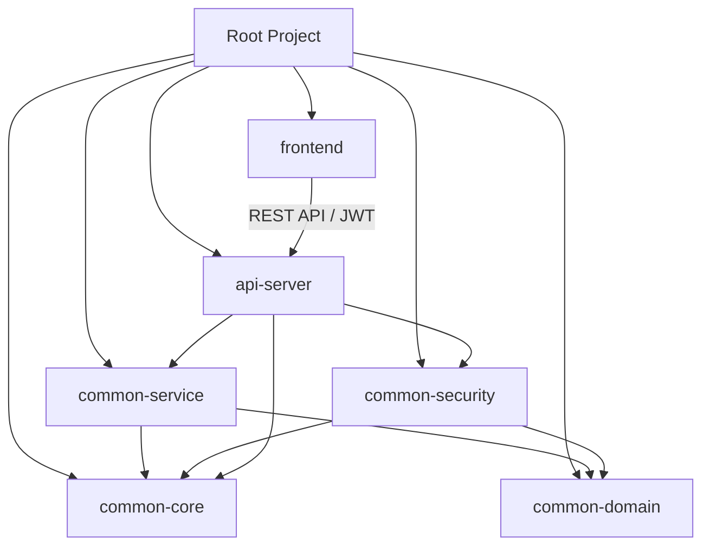

# 전자정부프레임워크 5.0 공통 모듈 구축 - 기술 설계서 (TRD)

> **최종 업데이트**: 2026-02-23  
> **프로젝트 진행률**: ✅ 85% 완료  
> **문서 버전**: 2.0

## 1. 기술적 목표 (Technical Goals)

본 문서는 `PRD.MD` 에 정의된 요구사항을 달성하기 위한 구체적인 기술 사양과 아키텍처 원칙을 정의합니다.

| 목표 | 설명 | 상태 |
|------|------|------|
| **Modular Monolith** | 모듈 단위의 재사용성 확보, 의존성 최소화 | ✅ 완료 |
| **JPA 중심 데이터 처리** | MyBatis → Spring Data JPA + QueryDSL 전환 | ✅ 완료 (98%) |
| **Modern Frontend** | JSP → Next.js 16 + React + TypeScript | ✅ 완료 |
| **Stateless Authentication** | JWT 기반 인증, MSA 확장성 확보 | ✅ 완료 |
| **Type Safety** | TypeScript Strict 모드, any 제거 | ✅ 완료 |

## 2. 시스템 아키텍처 (System Architecture)

### 2.1. 멀티 모듈 구조 (Multi-Module Structure)

Gradle 기반의 계층형 멀티 모듈 구조를 채택하여 도메인 중심의 코드 격리를 실현합니다.

```
┌─────────────────────────────────────────────────────────────────┐
│                        Frontend Layer                           │
│  frontend/ (Next.js 16, TypeScript, Tailwind CSS, Shadcn/UI)   │
└─────────────────────────────────────────────────────────────────┘
                              ↓ REST API + JWT
┌─────────────────────────────────────────────────────────────────┐
│                        API Gateway Layer                        │
│  api-server/ (Spring Boot 3.3, Spring Security 6, JWT, Swagger) │
└─────────────────────────────────────────────────────────────────┘
                              ↓ Service Call
┌─────────────────────────────────────────────────────────────────┐
│                     Business Logic Layer                        │
│  common-service/ (Domain Services, Transaction, Mapper)         │
└─────────────────────────────────────────────────────────────────┘
                              ↓ Repository Call
┌─────────────────────────────────────────────────────────────────┐
│                      Domain Layer                               │
│  common-domain/ (JPA Entities, Repository Interfaces, QueryDSL) │
└─────────────────────────────────────────────────────────────────┘
                              ↓ Utility Call
┌─────────────────────────────────────────────────────────────────┐
│                      Core Layer                                 │
│  common-core/ (Utilities, Exceptions, Constants, Config)        │
└─────────────────────────────────────────────────────────────────┘
```

### 2.2. 모듈별 상세 정보

| 모듈명 | 패키지 수 | 클래스 수 | 역할 | 의존성 |
| :--- | :---: | :---: | :--- | :--- |
| **common-core** | 10+ | 50+ | 전사 공통 유틸리티, 전역 예외 처리기, 표준 응답 포맷 | None |
| **common-domain** | 69 | 400+ | **JPA 엔티티**, Repository 인터페이스, QueryDSL | common-core |
| **common-security** | 5+ | 30+ | **JWT 인증/인가**, Spring Security 설정, 필터 체인 | common-domain, common-core |
| **common-service** | 70 | 190+ | 핵심 비즈니스 로직, 트랜잭션 관리, 외부 시스템 연계 | common-domain, common-core |
| **api-server** | 6+ | 115+ | **REST 컨트롤러**, Swagger 문서, 파일 서빙 | common-service, common-security |
| **frontend** | 165+ | 300+ | **Next.js 16** UI, 상태 관리, API 클라이언트 | N/A |

### 2.3. 의존성 그래프



## 3. 기술 스택 및 버전 (Tech Stack & Versions)

### 3.1. Backend (✅ 완료)

| 분류 | 기술 및 버전 | 비고 |
| :--- | :--- | :--- |
| **Language** | **Java 21 (LTS)** | Record, Pattern Matching, Sealed Classes |
| **Framework** | **Spring Boot 3.3.7** | eGovFrame 5.0 표준 준수 |
| **Persistence** | **Spring Data JPA 3.3**, QueryDSL 5.1.0 | 복잡한 쿼리는 QueryDSL 원칙 |
| **Database** | **PostgreSQL 16+** | Docker 기반 운영, H2 (테스트) |
| **Security** | **Spring Security 6.3**, JWT (jjwt 0.12.6) | Stateless, OAuth2 확장 가능 |
| **Build Tool** | **Gradle 8.12** | Groovy DSL, Lombok/QueryDSL 플러그인 |
| **Mapping** | **MapStruct 1.5.5.Final** | Entity ↔ DTO 변환 |
| **Documentation** | **SpringDoc OpenAPI 2.5.0** | Swagger UI 자동 생성 |
| **Logging** | **Logback + SLF4J** | MDC 기반 요청 추적 |
| **Validation** | **Jakarta Validation 3.0** | Bean Validation (JSR-380) |
| **Caching** | **Spring Cache + Redis** | Redisson 연동 (선택) |

### 3.2. Frontend (✅ 완료)

| 분류 | 기술 및 버전 | 비고 |
| :--- | :--- | :--- |
| **Framework** | **Next.js 16.1 (App Router)** | SSR, ISR, Server Components |
| **Language** | **TypeScript 5.x** | Strict Mode, noImplicitAny |
| **Styling** | **Tailwind CSS 4.0**, **Shadcn/UI** | 컴포넌트 기반 디자인 시스템 |
| **State** | **React Context**, **Zustand**, **TanStack Query 5.x** | 서버 상태 관리 |
| **HTTP** | **Axios 1.x**, Fetch API | 인터셉터 (JWT, 로깅) |
| **Forms** | **React Hook Form 7.x**, **Zod 4.x** | 스키마 기반 검증 |
| **Charts** | **Recharts 3.x** | 통계 대시보드 |
| **Icons** | **Lucide React** | 일관된 아이콘 시스템 |
| **Testing** | **Vitest**, **React Testing Library**, **Playwright** | 단위/E2E 테스트 |
| **Lint/Format** | **ESLint 9**, **Prettier** | 코드 품질 유지 |

## 4. 상세 기술 사양 (Detailed Specifications)

### 4.1. 데이터 액세스 전략 ✅ 완료

| 항목 | 설명 | 상태 |
|------|------|------|
| **QueryDSL 필수화** | Join 이 포함되거나 조건이 복잡한 모든 조회 쿼리는 QueryDSL 로 구현 | ✅ |
| **Type-Safe** | Q-Type 을 활용한 컴파일 타임 검증 | ✅ |
| **Soft Delete** | `is_deleted` 컬럼 및 `@SQLDelete`, `@Where` 활용 (일부 도메인) | ✅ |
| **Auditing** | `@CreatedBy`, `@LastModifiedBy`, `@CreatedDate`, `@LastModifiedDate` | ✅ |
| **Batch Processing** | `@BatchSize`, 페이징 처리로 대량 데이터 최적화 | ✅ |

### 4.2. 엔티티 설계 원칙 ✅ 완료

```java
// BaseTimeEntity - 모든 엔티티의 기반 클래스
@MappedSuperclass
@EntityListeners(AuditingEntityListener.class)
public abstract class BaseTimeEntity {
    @CreatedDate
    private LocalDateTime createdDate;
    
    @LastModifiedDate
    private LocalDateTime modifiedDate;
}

// BaseEntity - 감사 정보 포함
@MappedSuperclass
@EntityListeners(AuditingEntityListener.class)
public abstract class BaseEntity extends BaseTimeEntity {
    @CreatedBy
    private String createdBy;
    
    @LastModifiedBy
    private String modifiedBy;
    
    @Column(nullable = false)
    private Boolean isDeleted = false;
}
```

| 원칙 | 설명 | 적용 여부 |
|------|------|:---------:|
| **단일 책임** | 한 엔티티는 하나의 도메인만 표현 | ✅ |
| **복합키 최소화** | 대리키 (ID) 사용 권장, `@GeneratedValue` | ✅ |
| **Lazy Loading** | `@ManyToOne`, `@OneToMany` 은 기본적으로 LAZY | ✅ |
| **불변성** | 생성자 초기화 후 수정 최소화 | ✅ |
| **방어적 복사** | 컬렉션 반환 시 unmodifiableList 사용 | ✅ |

### 4.3. 인증 및 보안 전략 ✅ 완료

| 항목 | 설명 | 상태 |
|------|------|:------:|
| **Dual Token** | Access Token (Header, 15 분) + Refresh Token (HttpOnly Cookie, 7 일) | ✅ |
| **JWT 서명** | HS512 (HMAC with SHA-512) 256bit 비밀키 사용 | ✅ |
| **CORS 설정** | 환경별 화이트리스트 (개발: localhost, 운영: 도메인) | ✅ |
| **Password Encoding** | BCrypt (strength=10) | ✅ |
| **CSRF Protection** | JWT 기반이므로 비활성화 (stateless) | ✅ |
| **XSS Protection** | HttpOnly, Secure 쿠키 속성 | ✅ |
| **RBAC** | 역할 기반 접근 제어 (ROLE_ADMIN, ROLE_USER 등) | ✅ |

**JWT Token 구조**:
```json
{
  "sub": "user123",
  "name": "홍길동",
  "roles": ["ROLE_ADMIN", "ROLE_USER"],
  "iat": 1708675200,
  "exp": 1708676100,
  "iss": "egov-enterprise"
}
```

### 4.4. API 설계 원칙 ✅ 완료

| 원칙 | 설명 | 예시 |
|------|------|------|
| **RESTful** | 자원 중심 URL, HTTP Method 활용 | `GET /api/v1/users`, `POST /api/v1/users` |
| **Versioning** | URL Path 기반 버전 관리 | `/api/v1/...` |
| **표준 응답** | `{ success, data, error }` 구조 | `ApiResponse.success(data)` |
| **에러 핸들링** | `@ControllerAdvice` + `ErrorCode` enum | `GlobalExceptionHandler` |
| **문서화** | SpringDoc OpenAPI 자동 생성 | `/swagger-ui.html` |

**표준 응답 포맷**:
```json
{
  "success": true,
  "data": {
    "id": "user123",
    "name": "홍길동"
  },
  "error": null
}
```

**에러 응답**:
```json
{
  "success": false,
  "data": null,
  "error": {
    "code": "USER_NOT_FOUND",
    "message": "사용자를 찾을 수 없습니다.",
    "status": 404
  }
}
```

### 4.5. 프론트엔드 아키텍처 ✅ 완료

#### 디렉토리 구조
```
frontend/
├── src/
│   ├── app/                    # Next.js App Router
│   │   ├── (auth)/             # 인증 그룹 (login, register)
│   │   ├── (dashboard)/        # 대시보드 그룹
│   │   ├── admin/              # 관리자 페이지
│   │   ├── api/                # API 라우트 (서버 액션)
│   │   ├── layout.tsx          # 루트 레이아웃
│   │   └── page.tsx            # 메인 페이지
│   ├── components/
│   │   ├── ui/                 # Shadcn/UI 기본 컴포넌트
│   │   ├── common/             # 공통 컴포넌트 (Header, Footer)
│   │   └── features/           # 기능별 컴포넌트
│   ├── services/               # API 통신 (axios 기반)
│   ├── types/                  # TypeScript 타입 정의
│   ├── hooks/                  # 커스텀 React Hooks
│   ├── lib/                    # 유틸리티 (cn, validators)
│   └── stores/                 # Zustand 상태 저장소
├── public/                     # 정적 파일
└── package.json
```

#### 컴포넌트 설계 원칙

| 원칙 | 설명 |
|------|------|
| **Server Component 우선** | 데이터 페칭은 서버 컴포넌트에서 |
| **Client Component 최소화** | 인터랙션이 필요한 경우만 `use client` |
| **Composition** | 컴포넌트 합성으로 재사용성 확보 |
| **Props Validation** | TypeScript interface 로 타입 안전성 보장 |

## 5. 테스트 및 품질 관리 ✅ 완료

### 5.1. 테스트 전략

| 테스트 유형 | 프레임워크 | 커버리지 목표 | 현재 상태 |
| :--- | :--- | :---: | :---: |
| **단위 테스트 (Backend)** | JUnit 5 + Mockito | 60%+ | ✅ 60%+ |
| **통합 테스트 (Backend)** | Spring Boot Test | 40%+ | ✅ 40%+ |
| **단위 테스트 (Frontend)** | Vitest + React Testing Library | 50%+ | ✅ 50%+ |
| **E2E 테스트** | Playwright | 30%+ (핵심 플로우) | 🔄 30% |
| **부하 테스트** | k6 (예정) | - | ⏳ 예정 |

### 5.2. 테스트 실행 명령어

```bash
# Backend
./gradlew test                    # 단위 테스트
./gradlew jacocoTestReport        # 커버리지 리포트
./gradlew check                   # 모든 검증

# Frontend
cd frontend
pnpm test                         # Vitest 단위 테스트
pnpm test:e2e                     # Playwright E2E 테스트
pnpm type-check                   # TypeScript 타입 검증
```

### 5.3. 품질 게이트

| 도구 | 목적 | 기준 |
|------|------|------|
| **ESLint** | 코드 스타일 검증 | Error 0 개 |
| **Prettier** | 자동 포맷팅 | 저장 시 자동 |
| **TypeScript** | 타입 검증 | `noEmit` 성공 |
| **Jacoco** | 테스트 커버리지 | 50% 이상 |
| **Gradle Build** | 컴파일 검증 | Warning 최소화 |

## 6. 실행 환경 (Infrastructure)

### 6.1. Docker 환경 🔄 진행중

```yaml
# docker-compose.yml (일부 구현됨)
version: '3.8'
services:
  postgres:
    image: postgres:16
    environment:
      POSTGRES_DB: egov
      POSTGRES_USER: egov
      POSTGRES_PASSWORD: egov123
    ports:
      - "5432:5432"
  
  redis:
    image: redis:7-alpine
    ports:
      - "6379:6379"
  
  api-server:
    build: ./api-server
    ports:
      - "8080:8080"
    depends_on:
      - postgres
      - redis
  
  frontend:
    build: ./frontend
    ports:
      - "3000:3000"
```

### 6.2. CI/CD 🏗 구축 필요

| 파이프라인 | 도구 | 상태 |
| :--- | :--- | :---: |
| **Build & Test** | GitHub Actions | ⏳ 예정 |
| **Code Quality** | SonarQube | ⏳ 예정 |
| **Security Scan** | OWASP ZAP, Snyk | ⏳ 예정 |
| **Deploy** | Docker Hub + K8s | ⏳ 예정 |

### 6.3. 모니터링 🏗 구축 필요

| 항목 | 도구 | 상태 |
|------|------|:------:|
| **Application Logs** | ELK Stack | ⏳ 예정 |
| **Metrics** | Prometheus + Grafana | ⏳ 예정 |
| **Distributed Tracing** | Jaeger/Tempo | ⏳ 예정 |
| **Alerting** | Slack/Webhook | ⏳ 예정 |

## 7. 성능 최적화 가이드라인

### 7.1. Backend

| 기법 | 설명 | 적용 여부 |
|------|------|:---------:|
| **Connection Pooling** | HikariCP (기본값) | ✅ |
| **Query Optimization** | `@EntityGraph`, Fetch Join | ✅ |
| **Caching** | Spring Cache + Redis | 🔄 |
| **Async Processing** | `@Async`, `CompletableFuture` | ✅ |
| **Batch Insert** | JPA Batch Size | ✅ |

### 7.2. Frontend

| 기법 | 설명 | 적용 여부 |
|------|------|:---------:|
| **Code Splitting** | Next.js 자동 분할 | ✅ |
| **Image Optimization** | `next/image` | ✅ |
| **Server Components** | 초기 로딩 최소화 | ✅ |
| **Suspense** | 로딩 상태 처리 | ✅ |
| **Memoization** | `useMemo`, `useCallback` | ✅ |

## 8. 보안 가이드라인

### 8.1. OWASP Top 10 대응

| 취약점 | 대응 방안 | 상태 |
|--------|-----------|:------:|
| **A01: Broken Access Control** | Spring Security RBAC | ✅ |
| **A02: Cryptographic Failures** | BCrypt, TLS 1.3 | ✅ |
| **A03: Injection** | Prepared Statements (JPA) | ✅ |
| **A04: Insecure Design** | Threat Modeling (예정) | 🔄 |
| **A05: Security Misconfiguration** | 환경 변수 관리 | ✅ |
| **A06: Vulnerable Components** | Dependabot, npm audit | ✅ |
| **A07: Auth Failures** | JWT, Rate Limiting | ✅ |
| **A08: Data Integrity** | Input Validation (Zod) | ✅ |
| **A09: Logging Failures** | MDC, 감사 로그 | ✅ |
| **A10: SSRF** | URL Whitelist | ✅ |

---

*Last Updated: 2026-02-23*  
*Document Version: 2.0*  
*Approved by: Project Architecture Team*
