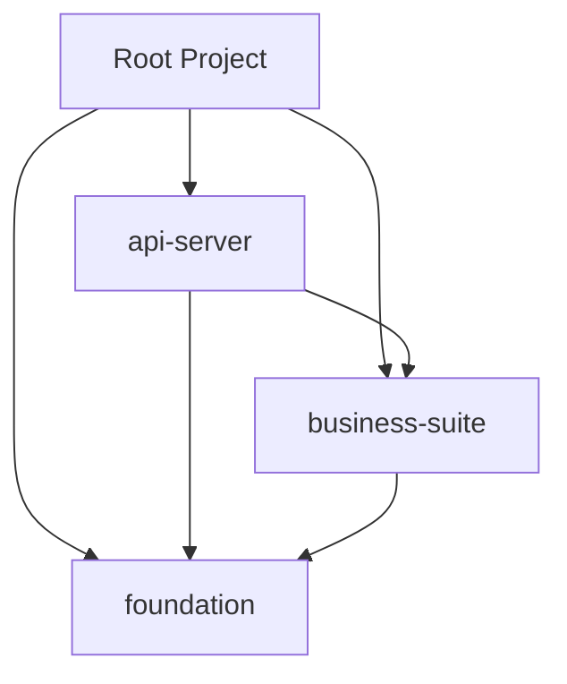

# 전�정부프레�워� 5.0 공통 > **최종 업��트**: 2026-03-26  
> **프로�트 진행률**: ✅ 100% 완료 (2-Tier 구조 최�화 � 통합 완료)  
> **문서 버전**: 3.5

## 1. 기술� 목표 (Technical Goals)

본 문서는 `PRD.MD` � 정�� 요구사항� 달성하기 위한 구체�� 기술 사양과 아키�처 �칙� 정�합니다.

| 목표 | 설명 | �태 |
|------|------|------|
| **2-Tier Modular Monolith** | Foundation 과 Business-Suite 2 계층 구조로 �집� 향� | ✅ 완료 |
| **JPA 중심 ��터 처리** | MyBatis → Spring Data JPA + QueryDSL 전환 | ✅ 완료 (100%) |
| **Modern Frontend** | JSP → Next.js 15 + React + TypeScript | ✅ 완료 |
| **Stateless Authentication** | JWT 기반 ��, MSA 확�성 확보 | ✅ 완료 |
| **Type Safety** | TypeScript Strict 모드, any 제거 | ✅ 완료 |

## 2. 시스템 아키�처 (System Architecture)

### 2.1. 2-Tier 모듈 구조 (2-Tier Module Structure)

시스템� 복��를 낮추고 유지보수성� 높�기 위해 기반 기술과 비즈니스 로�� � 개� � 모듈로 통합한 아키�처를 채�합니다.

```
┌─────────────────────────────────────────────────────────────────�
│                        Frontend Layer                           │
│  frontend/ (Next.js 15, TypeScript, Tailwind CSS, Shadcn/UI)    │
└─────────────────────────────────────────────────────────────────┘
                                ↓ REST API + JWT
┌─────────────────────────────────────────────────────────────────�
│                    Presentation Layer (Entry)                   │
│  api-server/ (Spring Boot 진��, War 패키징, 통합 설정)        │
└─────────────────────────────────────────────────────────────────┘
                                ↓ Module Reference
┌─────────────────────────────────────────────────────────────────�
│                      Business Suite Layer                       │
│  business-suite/ (Workspace, Operation, Knowledge 기능 통합)     │
└─────────────────────────────────────────────────────────────────┘
                                ↓ Module Reference
┌─────────────────────────────────────────────────────────────────�
│                      Foundation Layer (Infra)                   │
│  foundation/ (Security, IAM, Common, System Admin 통합)        │
└─────────────────────────────────────────────────────────────────┘
```

### 2.2. 모듈별 �세 정보

| 모듈명 | 역할 � 책� | 주요 구성 요소 |
| :--- | :--- | :--- |
| **api-server** | 전역 진�� � 통합 배� | Web Config, Global Exception, Interceptor, War Packaging |
| **business-suite** | 핵심 비즈니스 로� � 컨�츠 서비스 | 협업(Workspace), 운�지�(Operation), 컨�츠(Board, Wiki, Popup) |
| **foundation** | 시스템 기반 � �프� 서비스 | 시�리티(IAM, JWT, RBAC), 시스템관리(Code, Menu, Log), 공통유틸 |
€â”€â”€â”€â”€â”€â”€â”€â”€â”€â”€â”€â”€â”€â”€â”€â”€â”€â”€â”€â”€â”€â”€â”€â”€â”€â”€â”€â”€â”€â”€â”€â”€â”€â”˜
                               ↓ Infrastructure Reference
┌─────────────────────────────────────────────────────────────────�
│                      Foundation Layer                           │
│  common-security/ (JWT ��, RBAC 제어 설정)                   │
│  common-core/ (공통 Utility, Exception, Global Config)         │
└─────────────────────────────────────────────────────────────────┘
```

### 2.2. 모듈별 �세 정보

| 모듈명 | 패키지 유형 | 역할 � 책� | 주요 �존성 |
| :--- | :--- | :--- | :--- |
| **api-server** | Entry | API 진��, 전역 Error 핸들�, 통합 배� | common-*, module-* |
| **common-core** | Foundation | 공통 유틸, 예외 처리, 전역 설정 (Swagger, Redis 등) | None |
| **common-security** | Foundation | JWT 기반 �� 로�, Security Filter Chain 구성 | common-core |
| **module-core-iam** | Functional | 사용� 계정, 권한(Auth), 그룹(Group) 관리 | common-security |
| **module-system-admin** | Functional | 통합 관리 센터 (권한, 코드, 메뉴, 콘�츠/서비스 관리 통합) | module-core-iam |
| **module-workspace** | Functional | 사용� 업무 지� (�정, 쪽지, 게시� 콘�츠 소비) | module-core-iam |
| **module-operation** | Functional | 사용� 운� 접� (설문 참여, 서비스 요청 등�) | module-core-iam |
| **module-knowledge** | Functional | 위키(Wiki), 문서 아카�브 관리 | module-core-iam |

### 2.3. �존성 그�프 (Mermaid)



## 3. 기술 스� � 버전 (Tech Stack & Versions)

### 3.1. Backend (✅ 완료)

| 분류 | 기술 � 버전 | 비고 |
| :--- | :--- | :--- |
| **Language** | **Java 21 (LTS)** | Record, Pattern Matching, Sealed Classes |
| **Framework** | **Spring Boot 3.4.1** | eGovFrame 5.0 표준 준수 |
| **Persistence** | **Spring Data JPA 3.3**, QueryDSL 5.1.0 | 복�한 쿼리는 QueryDSL �칙 |
| **Database** | **PostgreSQL 16+** | Docker 기반 운�, H2 (테스트) |
| **Security** | **Spring Security 6.3**, JWT (jjwt 0.12.6) | Stateless, OAuth2 확� 가능 |
| **Build Tool** | **Gradle 9.4.1** | Groovy DSL, Lombok/QueryDSL 플러그� |
| **Mapping** | **MapStruct 1.5.5.Final** | Entity ↔ DTO 변환 |
| **Documentation** | **SpringDoc OpenAPI 2.5.0** | Swagger UI �� �성 |
| **Logging** | **Logback + SLF4J** | MDC 기반 요청 추� |
| **Validation** | **Jakarta Validation 3.0** | Bean Validation (JSR-380) |
| **Caching** | **Spring Cache + Redis** | Redisson 연� (선�) |

### 3.2. Frontend (✅ 완료)

| 분류 | 기술 � 버전 | 비고 |
| :--- | :--- | :--- |
| **Framework** | **Next.js 15.1 (App Router)** | SSR, ISR, Server Components |
| **Language** | **TypeScript 5.x** | Strict Mode, noImplicitAny |
| **Styling** | **Tailwind CSS 4.0**, **Shadcn/UI** | 컴�넌트 기반 디�� 시스템 |
| **State** | **React Context**, **Zustand**, **TanStack Query 5.x** | 서버 �태 관리 |
| **HTTP** | **Axios 1.x**, Fetch API | �터셉터 (JWT, 로깅) |
| **Forms** | **React Hook Form 7.x**, **Zod 4.x** | 스키마 기반 검� |
| **Charts** | **Recharts 3.x** | 통계 대시보드 |
| **Icons** | **Lucide React** | �관� 아�콘 시스템 |
| **Testing** | **Vitest**, **React Testing Library**, **Playwright** | 단위/E2E 테스트 |
| **Lint/Format** | **ESLint 9**, **Prettier** | 코드 품질 유지 |

## 4. �세 기술 사양 (Detailed Specifications)

### 4.1. ��터 액세스 전� ✅ 완료

| 항목 | 설명 | �태 |
|------|------|------|
| **QueryDSL 필수화** | Join � �함�거나 조건� 복�한 모든 조회 쿼리는 QueryDSL 로 구현 | ✅ |
| **Type-Safe** | Q-Type � 활용한 컴파� 타� 검� | ✅ |
| **Soft Delete** | `is_deleted` 컬럼 � `@SQLDelete`, `@Where` 활용 (�부 �메�) | ✅ |
| **Auditing** | `@CreatedBy`, `@LastModifiedBy`, `@CreatedDate`, `@LastModifiedDate` | ✅ |
| **Batch Processing** | `@BatchSize`, ��징 처리로 대량 ��터 최�화 | ✅ |

### 4.2. 엔티티 설계 �칙 ✅ 완료

```java
// BaseTimeEntity - 모든 엔티티� 기반 ��스
@MappedSuperclass
@EntityListeners(AuditingEntityListener.class)
public abstract class BaseTimeEntity {
    @CreatedDate
    private LocalDateTime createdDate;
    
    @LastModifiedDate
    private LocalDateTime modifiedDate;
}

// BaseEntity - �사 정보 �함
@MappedSuperclass
@EntityListeners(AuditingEntityListener.class)
public abstract class BaseEntity extends BaseTimeEntity {
    @CreatedBy
    private String createdBy;
    
    @LastModifiedBy
    private String modifiedBy;
    
    @Column(nullable = false)
    private Boolean isDeleted = false;
}
```

| �칙 | 설명 | �용 여부 |
|------|------|:---------:|
| **단� 책�** | 한 엔티티는 하나� �메�만 표현 | ✅ |
| **복합키 최소화** | 대리키 (ID) 사용 권�, `@GeneratedValue` | ✅ |
| **Lazy Loading** | `@ManyToOne`, `@OneToMany` � 기본�으로 LAZY | ✅ |
| **불변성** | �성� 초기화 후 수정 최소화 | ✅ |
| **방어� 복사** | 컬렉션 반환 시 unmodifiableList 사용 | ✅ |

### 4.3. �� � 보안 전� ✅ 완료

| 항목 | 설명 | �태 |
|------|------|:------:|
| **Dual Token** | Access Token (Header, 15 분) + Refresh Token (HttpOnly Cookie, 7 �) | ✅ |
| **JWT 서명** | HS512 (HMAC with SHA-512) 256bit 비밀키 사용 | ✅ |
| **CORS 설정** | 환경별 화�트리스트 (개발: localhost, 운�: �메�) | ✅ |
| **Password Encoding** | BCrypt (strength=10) | ✅ |
| **CSRF Protection** | JWT 기반�므로 비활성화 (stateless) | ✅ |
| **XSS Protection** | HttpOnly, Secure 쿠키 �성 | ✅ |
| **RBAC** | 역할 기반 접근 제어 (ROLE_ADMIN, ROLE_USER 등) | ✅ |

**JWT Token 구조**:
```json
{
  "sub": "user123",
  "name": "�길�",
  "roles": ["ROLE_ADMIN", "ROLE_USER"],
  "iat": 1708675200,
  "exp": 1708676100,
  "iss": "egov-enterprise"
}
```

### 4.4. API 설계 �칙 ✅ 완료

| �칙 | 설명 | 예시 |
|------|------|------|
| **RESTful** | �� 중심 URL, HTTP Method 활용 | `GET /api/v1/users`, `POST /api/v1/users` |
| **Versioning** | URL Path 기반 버전 관리 | `/api/v1/...` |
| **표준 �답** | `{ success, data, error }` 구조 | `ApiResponse.success(data)` |
| **�러 핸들�** | `@ControllerAdvice` + `ErrorCode` enum | `GlobalExceptionHandler` |
| **문서화** | SpringDoc OpenAPI �� �성 | `/swagger-ui.html` |

**표준 �답 �맷**:
```json
{
  "success": true,
  "data": {
    "id": "user123",
    "name": "�길�"
  },
  "error": null
}
```

**�러 �답**:
```json
{
  "success": false,
  "data": null,
  "error": {
    "code": "USER_NOT_FOUND",
    "message": "사용�를 찾� 수 없습니다.",
    "status": 404
  }
}
```

### 4.5. 프론트엔드 아키�처 ✅ 완료

#### 디렉토리 구조
```
frontend/
├── src/
│   ├── app/                    # Next.js App Router
│   │   ├── (auth)/             # �� 그룹 (login, register)
│   │   ├── (dashboard)/        # 대시보드 그룹
│   │   ├── admin/              # 관리� ��지
│   │   ├── api/                # API �우트 (서버 액션)
│   │   ├── layout.tsx          # 루트 레�아웃
│   │   └── page.tsx            # 메� ��지
│   ├── components/
│   │   ├── ui/                 # Shadcn/UI 기본 컴�넌트
│   │   ├── common/             # 공통 컴�넌트 (Header, Footer)
│   │   └── features/           # 기능별 컴�넌트
│   ├── services/               # API 통신 (axios 기반)
│   ├── types/                  # TypeScript 타� 정�
│   ├── hooks/                  # 커스텀 React Hooks
│   ├── lib/                    # 유틸리티 (cn, validators)
│   └── stores/                 # Zustand �태 저�소
├── public/                     # 정� 파�
└── package.json
```

#### 컴�넌트 설계 �칙

| �칙 | 설명 |
|------|------|
| **Server Component 우선** | ��터 �칭� 서버 컴�넌트�서 |
| **Client Component 최소화** | �터�션� 필요한 경우만 `use client` |
| **Composition** | 컴�넌트 합성으로 �사용성 확보 |
| **Props Validation** | TypeScript interface 로 타� 안전성 보� |

## 5. 테스트 � 품질 관리 ✅ 완료

### 5.1. 테스트 전�

| 테스트 유형 | 프레�워� | 커버리지 목표 | 현� �태 |
| :--- | :--- | :---: | :---: |
| **단위 테스트 (Backend)** | JUnit 5 + Mockito | 60%+ | ✅ 60%+ |
| **통합 테스트 (Backend)** | Spring Boot Test | 40%+ | ✅ 40%+ |
| **단위 테스트 (Frontend)** | Vitest + React Testing Library | 50%+ | ✅ 50%+ |
| **E2E 테스트** | Playwright | 30%+ (핵심 플로우) | 🔄 30% |
| **부하 테스트** | k6 (예정) | - | � 예정 |

### 5.2. 테스트 실행 명령어

```bash
# Backend
./gradlew test                    # 단위 테스트
./gradlew jacocoTestReport        # 커버리지 리�트
./gradlew check                   # 모든 검�

# Frontend
cd frontend
pnpm test                         # Vitest 단위 테스트
pnpm test:e2e                     # Playwright E2E 테스트
pnpm type-check                   # TypeScript 타� 검�
```

### 5.3. 품질 게�트

| �구 | 목� | 기준 |
|------|------|------|
| **ESLint** | 코드 스타� 검� | Error 0 개 |
| **Prettier** | �� �맷팅 | 저� 시 �� |
| **TypeScript** | 타� 검� | `noEmit` 성공 |
| **Jacoco** | 테스트 커버리지 | 50% �� |
| **Gradle Build** | 컴파� 검� | Warning 최소화 |

## 6. 실행 환경 (Infrastructure)

### 6.1. Docker 환경 🔄 진행중

```yaml
# docker-compose.yml (�부 구현�)
version: '3.8'
services:
  postgres:
    image: postgres:16
    environment:
      POSTGRES_DB: egov
      POSTGRES_USER: egov
      POSTGRES_PASSWORD: egov123
    ports:
      - "5432:5432"
  
  redis:
    image: redis:7-alpine
    ports:
      - "6379:6379"
  
  api-server:
    build: ./api-server
    ports:
      - "8080:8080"
    depends_on:
      - postgres
      - redis
  
  frontend:
    build: ./frontend
    ports:
      - "3000:3000"
```

### 6.2. CI/CD � 구축 필요

| 파�프�� | �구 | �태 |
| :--- | :--- | :---: |
| **Build & Test** | GitHub Actions | � 예정 |
| **Code Quality** | SonarQube | � 예정 |
| **Security Scan** | OWASP ZAP, Snyk | � 예정 |
| **Deploy** | Docker Hub + K8s | � 예정 |

### 6.3. 모니터� � 구축 필요

| 항목 | �구 | �태 |
|------|------|:------:|
| **Application Logs** | ELK Stack | � 예정 |
| **Metrics** | Prometheus + Grafana | � 예정 |
| **Distributed Tracing** | Jaeger/Tempo | � 예정 |
| **Alerting** | Slack/Webhook | � 예정 |

## 7. 성능 최�화 가�드��

### 7.1. Backend

| 기법 | 설명 | �용 여부 |
|------|------|:---------:|
| **Connection Pooling** | HikariCP (기본값) | ✅ |
| **Query Optimization** | `@EntityGraph`, Fetch Join | ✅ |
| **Caching** | Spring Cache + Redis | 🔄 |
| **Async Processing** | `@Async`, `CompletableFuture` | ✅ |
| **Batch Insert** | JPA Batch Size | ✅ |

### 7.2. Frontend

| 기법 | 설명 | �용 여부 |
|------|------|:---------:|
| **Code Splitting** | Next.js �� 분할 | ✅ |
| **Image Optimization** | `next/image` | ✅ |
| **Server Components** | 초기 로딩 최소화 | ✅ |
| **Suspense** | 로딩 �태 처리 | ✅ |
| **Memoization** | `useMemo`, `useCallback` | ✅ |

## 8. 보안 가�드��

### 8.1. OWASP Top 10 대�

| 취약� | 대� 방안 | �태 |
|--------|-----------|:------:|
| **A01: Broken Access Control** | Spring Security RBAC | ✅ |
| **A02: Cryptographic Failures** | BCrypt, TLS 1.3 | ✅ |
| **A03: Injection** | Prepared Statements (JPA) | ✅ |
| **A04: Insecure Design** | Threat Modeling (예정) | 🔄 |
| **A05: Security Misconfiguration** | 환경 변수 관리 | ✅ |
| **A06: Vulnerable Components** | Dependabot, npm audit | ✅ |
| **A07: Auth Failures** | JWT, Rate Limiting | ✅ |
| **A08: Data Integrity** | Input Validation (Zod) | ✅ |
| **A09: Logging Failures** | MDC, �사 로그 | ✅ |
| **A10: SSRF** | URL Whitelist | ✅ |

---

*Last Updated: 2026-03-12*
