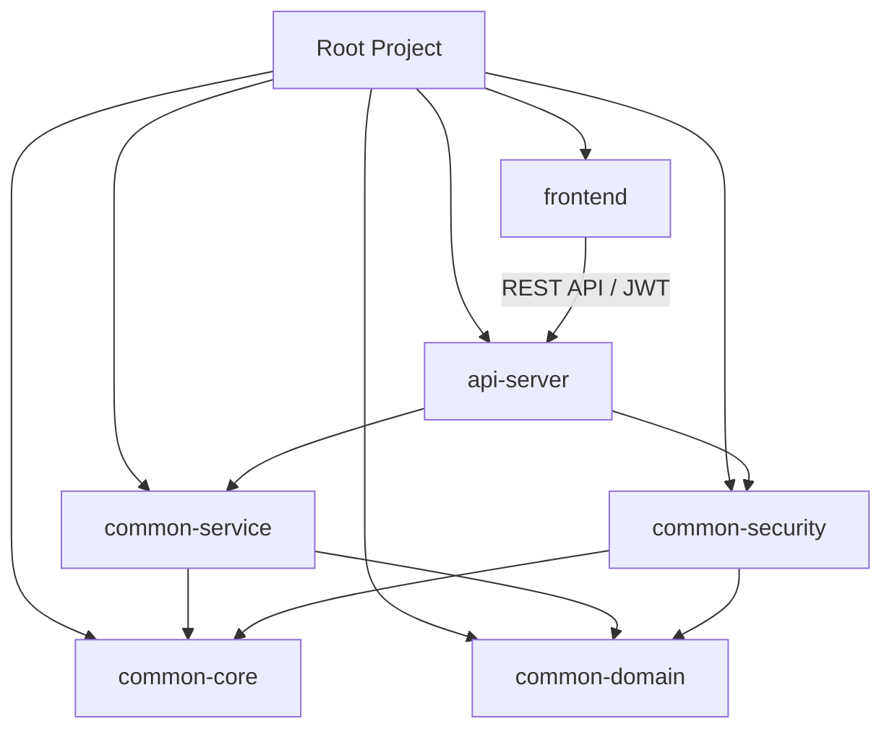

# 전자정부프레임워크 5.0 공통 모듈 구축 - 기술 설계서 (TRD)

## 1. 기술적 목표 (Technical Goals)
본 문서는 `PRD.MD`에 정의된 요구사항을 달성하기 위한 구체적인 기술 사양과 아키텍처 원칙을 정의합니다.
*   **Monolithic to Modular Monolith**: 단일 구조의 한계를 극복하고 모듈 단위의 재사용성 확보.
*   **JPA 중심 데이터 처리**: MyBatis 중심에서 Spring Data JPA 및 QueryDSL로 전환하여 생산성 및 유지보수성 향상.
*   **Modern Frontend**: JSP 기반 UI에서 Next.js 14 및 React 기반의 모던 프론트엔드로 현대화.
*   **Stateful to Stateless**: JWT 기반 인증을 통해 MSA 확장성 및 클라이언트 독립성 확보.

## 2. 시스템 아키텍처 (System Architecture)

### 2.1. 멀티 모듈 구조 (Multi-Module Structure)
Gradle 기반의 계층형 멀티 모듈 구조를 채택하여 도메인 중심의 코드 격리를 실현합니다.

| 모듈명 | 역할 및 주요 구성요소 | 의존성 |
| :--- | :--- | :--- |
| **common-core** | 전사 공통 유틸리티, 전역 예외 처리기, 표준 응답 포맷 | None |
| **common-domain** | **JPA 엔티티**, Repository 인터페이스, QueryDSL 지원 클래스 | common-core |
| **common-security** | **JWT 인증/인가**, Spring Security 설정, 필터 체인 | common-domain |
| **common-service** | 핵심 비즈니스 로직, 트랜잭션 관리, 외부 시스템 연계 | common-domain, common-core |
| **api-server** | **REST 컨트롤러**, 스웨거(Swagger) 문서, 이미지/파일 서빙 | common-service, common-security |
| **frontend** | **Next.js 14 (App Router)** 기반 UI, 상태 관리, API 클라이언트 | N/A (Server-to-Server) |

## 3. 기술 스택 및 버전 (Tech Stack & Versions)

### 3.1. Backend
| 분류 | 기술 및 버전 | 비고 |
| :--- | :--- | :--- |
| **Language** | **Java 21 (LTS)** | Record, Pattern Matching 등 활용 |
| **Framework** | **Spring Boot 3.3.7** | eGovFrame 5.0 표준 준수 |
| **Persistence** | **Spring Data JPA**, QueryDSL 5.0 | 복잡한 쿼리는 QueryDSL 원칙 |
| **Database** | PostgreSQL 16+ | Docker 기반 운영 |
| **Security** | Spring Security 6.3, JWT (jjwt) | Stateless, OAuth2 확장 가능 구조 |
| **Build Tool** | Gradle 8.12 | Kotlin DSL / Groovy DSL 혼용 가능 |

### 3.2. Frontend
| 분류 | 기술 및 버전 | 비고 |
| :--- | :--- | :--- |
| **Framework** | **Next.js 16.1 (App Router)** | SSR, ISR, Server Components 활용 |
| **Language** | TypeScript 5.x | Strict Type Checking 적용 |
| **Styling** | **Tailwind CSS 4.0**, **Shadcn UI** | 컴포넌트 기반 디자인 시스템 |
| **State** | React Context / Zustand | 경량 상태 관리 프레임워크 |
| **Fetch** | Axios / Fetch API | FetchWithRetry 및 로깅 적용 |

## 4. 상세 기술 사양 (Detailed Specifications)

### 4.1. 데이터 액세스 전략
*   **QueryDSL 필수화**: Join이 포함되거나 조건이 복잡한 모든 조회 쿼리는 QueryDSL로 구현하여 Type-Safe 보장.
*   **Soft Delete**: `is_deleted` 컬럼 및 `@SQLDelete`, `@Where` 어노테이션을 활용한 논리 삭제 권장.

### 4.2. 인증 및 보안 전략
*   **Dual Token 전략**: Access Token (Header, 짧은 만료) + Refresh Token (HttpOnly Cookie, 긴 만료).
*   **CORS 설정**: 개발 및 운영 환경별 화이트리스트 기반 통제.

### 4.3. 테스트 및 품질 관리
*   **JUnit 5 / AssertJ**: 백엔드 비즈니스 로직 검증.
*   **Vitest**: 프론트엔드 단위 테스트.
*   **Playwright**: 핵심 사용자 시나리오 E2E 테스트.

## 5. 실행 환경 (Infrastructure)
*   **Containerization**: Docker 및 Docker Compose를 통한 개발/운영 환경 단일화.
*   **CI/CD**: GitHub Actions를 활용한 자동 빌드, 테스트, 보안 스캔 수행.
